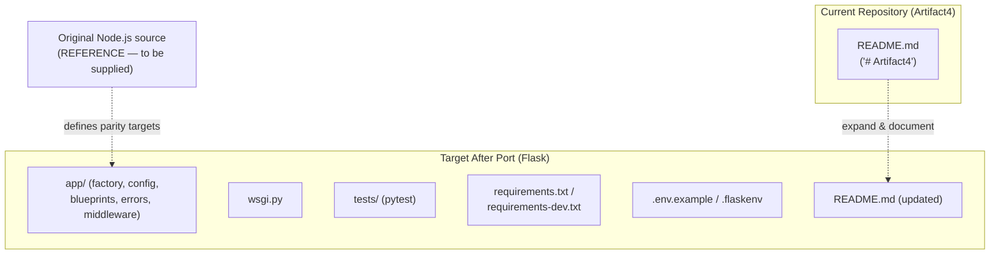
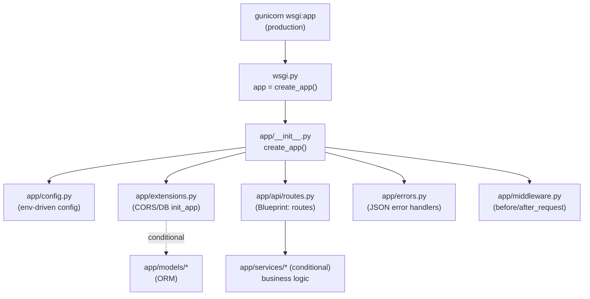

# Technical Specification

# 0. Agent Action Plan

## 0.1 Intent Clarification

This Agent Action Plan interprets the user's request and translates it into a precise, file-level plan of action for the Blitzy Platform. One finding governs the entire plan and must be stated first: **the repository does not contain the Node.js server that the request asks to rewrite.** The only tracked artifact is `README.md`, whose complete content is the single line `# Artifact4` [README.md:L1]. The broader specification independently confirms this, recording that "Artifact4 is not a replacement, rewrite, migration, or upgrade of any pre-existing system documented within the repository" [Technical Specification §1.2.1.2] and that the complete tracked file inventory is `README.md` alone [Technical Specification §1.2.2.2].

Accordingly, this section (a) captures the user's intent with technical precision, (b) flags the absent source as the single most important clarification item, and (c) defines a complete, executable baseline — an idiomatic Python 3 Flask server scaffold — that the current repository state fully supports and onto which the specific ported behaviors map one-to-one once the original Node.js source is supplied.

### 0.1.1 Core Feature Objective

Based on the prompt, the Blitzy platform understands that the new feature requirement is to **re-implement an existing Node.js HTTP server as a Python 3 application built on the Flask framework, reproducing all functionality of the original project (full behavioral parity).**

The objective decomposes into the following clarified requirements:

- **Target language — Python 3.** The reimplementation must be authored in Python 3. The recommended target runtime is Python 3.12.x (provided by the local toolchain and supported by Flask, which requires Python 3.9 or newer).
- **Target framework — Flask.** The web layer must be built on Flask specifically (not FastAPI, Django, or another framework).
- **Functional parity ("preserving all functionalities").** Every externally observable behavior of the original server must be reproduced: each route (HTTP method + path), request and response JSON shape, HTTP status code, response headers, authentication/session behavior, input validation, error-response format, logging, and side effects.
- **Runnable, behavior-equivalent deliverable.** The result must be a runnable Flask server that a client cannot distinguish from the original Node.js server at the API boundary.

Implicit requirements surfaced from this objective:

- **Behavioral source-of-truth inventory.** A route-by-route, middleware-by-middleware inventory of the original Node.js source is required to define parity targets. This artifact does not exist in the repository.
- **Node.js → Python package equivalence.** Each runtime dependency of the original (e.g., `express`, `jsonwebtoken`, `bcrypt`, `mongoose`/`sequelize`, `axios`, `dotenv`, `cors`, `joi`) must be mapped to a Python equivalent.
- **REST contract preservation.** Paths, verbs, status codes, and payloads must remain byte-compatible so existing clients continue to function (backward compatibility).
- **Middleware-ordering semantics.** Express middleware chains must be reproduced through Flask `before_request`/`after_request` hooks, decorators, or WSGI middleware in equivalent order.
- **Configuration & environment parity.** Environment variables and configuration loaded by the original (typically via `dotenv`) must be reproduced via `python-dotenv` and a configuration module.
- **Parity test suite.** Tests asserting equivalence to the original behavior are required where original behavior is known.

Feature dependencies and prerequisites:

- **Primary prerequisite (currently unmet): availability of the original Node.js source.** Functional parity is defined relative to the original implementation. Because that implementation is absent from the repository [README.md:L1] [Technical Specification §1.2.2.2], the exact set of routes, models, and behaviors cannot be enumerated or verified. **This is the top clarification/blocking item of this plan.** In its absence, the directly implementable deliverable is the complete Flask scaffold described in §0.5, with ported endpoints/models/services materializing one-to-one once the source is provided.

### 0.1.2 Special Instructions and Constraints

- **Explicit technology constraints (CRITICAL).** Target language is **Python 3**; target web framework is **Flask**; the migration must **preserve all functionalities** of the original — i.e., a backward-compatible, functional-parity port rather than a redesign.
- **Architectural convention.** In the absence of repository-specific conventions (none exist — no source, manifests, or config are present [Technical Specification §1.2.2.3]), the implementation will follow idiomatic Flask conventions: the **application-factory pattern** (`create_app()`) with **Blueprints** for route grouping, a dedicated configuration module, centralized error handlers, and a WSGI entrypoint.
- **Preservation over improvement.** "Preserving all functionalities" is interpreted strictly: the API surface and behavior are reproduced exactly, not "improved," re-shaped, or extended.
- **Web search requirements.** Research needed for implementation was limited to confirming current, valid dependency versions (no placeholder versions). This was completed: Flask 3.1.3 is the current stable release on PyPI (released Feb 19, 2026) and Flask supports Python 3.9+. Version details are carried into §0.3.

User Example (preserved exactly as provided):

> User Example: "Can you rewrite this node.js server in python 3 using flask, preserving all functionalities of the original project?"

### 0.1.3 Technical Interpretation

These feature requirements translate to the following technical implementation strategy. Each requirement is mapped to a concrete technical action of the form "To [achieve goal], we will [create/modify/extend] [specific component]."

| Requirement | Technical Action |
|---|---|
| Re-implement the HTTP server in Python 3 + Flask | To host the application, we will **create** a Flask app via an application factory `create_app()` in `app/__init__.py` and a WSGI entrypoint `wsgi.py`. |
| Preserve every route (method + path + response) | To reproduce each Express route, we will **create** Flask views inside a Blueprint in `app/api/routes.py`, returning identical status codes and JSON shapes. |
| Preserve middleware behavior and ordering | To reproduce Express middleware, we will **create** `app/middleware.py` using `before_request`/`after_request` hooks and decorators wired in the factory in equivalent order. |
| Preserve error responses | To reproduce Express error middleware, we will **create** centralized `@errorhandler` functions in `app/errors.py` returning matching JSON error bodies and status codes. |
| Preserve configuration & environment variables | To reproduce `dotenv`-based config, we will **create** `app/config.py` (env-driven config classes) plus `.env.example` and `.flaskenv`, loaded via `python-dotenv`. |
| Preserve dependencies | To reproduce `package.json` dependencies, we will **create** `requirements.txt`/`requirements-dev.txt` with Python equivalents at pinned versions. |
| Preserve quality / prove parity | To verify equivalence, we will **create** a `pytest` suite under `tests/` mirroring the original's observable behavior. |
| Document the new server | To make the server usable, we will **extend** `README.md` [README.md:L1] with setup, run, configuration, and endpoint documentation. |

A minimal example of the application-factory shape the plan establishes:

```python
# app/__init__.py

def create_app(config=None):
    app = Flask(__name__)
    register_extensions(app); register_blueprints(app); register_errors(app)
    return app
```

Because the original source is absent, this strategy is realized as a complete Flask skeleton (see §0.5); the specific ported endpoints, models, and services are filled in one-to-one against the original once it is supplied.

## 0.2 Repository Scope Discovery

This sub-section records the exhaustive discovery of files and integration points relevant to the port, the research conducted, and the complete set of files to be created.

### 0.2.1 Comprehensive File Analysis

A full traversal of the repository was performed using folder enumeration and semantic search. The repository is **empty of implementation artifacts**. The complete tracked inventory is a single file:

| Path | Type | Content | Disposition |
|---|---|---|---|
| `README.md` | Markdown | One line: `# Artifact4` [README.md:L1] | UPDATE — document the new Flask server |

No source folders, package manifests, configuration files, or tests exist; technology selection is open and undecided [Technical Specification §1.2.2.3]. Semantic searches for a Node.js server entry point, for a `package.json` dependency manifest, and for source folders containing controllers/models/routes all returned **zero results**, and no `.blitzyignore` files exist.

**Integration point discovery.** Because no application code is present, there are **no existing integration points** to attach the feature to. Each category was checked and found empty:

- **API endpoints** that connect to the feature — none exist (no routes/handlers present) [Technical Specification §1.3.2.1].
- **Database models / migrations** affected — none exist (no persistence layer) [Technical Specification §1.2.2.3].
- **Service classes** requiring updates — none exist.
- **Controllers / handlers** to modify — none exist.
- **Middleware / interceptors** impacted — none exist.

All wiring is therefore greenfield and is created fresh inside the new `app/` package. The current versus target structure is summarized below:



### 0.2.2 Web Search Research Conducted

Research was scoped to obtaining valid, non-placeholder dependency versions and confirming runtime compatibility for the migration target:

- **Current Flask release & Python compatibility** — confirmed Flask 3.1.3 is the current stable release on PyPI (released Feb 19, 2026) and that Flask supports Python 3.9 and newer; the recommended target runtime is Python 3.12.x. Used to pin versions in §0.3.
- **Core Flask ecosystem versions** — confirmed installable versions for `Werkzeug` (3.1.8, ships with Flask), `python-dotenv` (1.2.2), `gunicorn` (26.0.0), `flask-cors` (6.0.2), `pytest` (9.0.3), `requests` (2.34.2), and `Flask-SQLAlchemy` (3.1.1).
- **Node.js → Flask migration patterns** — the idiomatic Flask approach for porting an Express server: application-factory + Blueprints for routing, `before_request`/`after_request` for middleware, centralized `errorhandler`s for Express error middleware, and `gunicorn` as the production WSGI server (replacing `node server.js`/`pm2`).

Note: because the original Node.js source is absent, feature-specific research (e.g., the best Python library for a specific original capability) is deferred until the source reveals which capabilities exist.

### 0.2.3 New File Requirements

The following files will be created. **Baseline** files are required for any faithful Flask port and are implementable now; **conditional** files are created only if the original source exercises the corresponding capability.

New source files (baseline):

- `app/__init__.py` — application factory `create_app()`; registers extensions, blueprints, error handlers, and request hooks.
- `app/config.py` — environment-driven configuration classes (Base / Development / Production / Testing).
- `app/extensions.py` — extension singletons (e.g., CORS, DB) initialized via `init_app`.
- `app/api/__init__.py` — API Blueprint package initializer.
- `app/api/routes.py` — Blueprint views: a health endpoint plus one view per ported route (placeholders until source is supplied).
- `app/errors.py` — centralized JSON error handlers (Express error-middleware parity).
- `app/middleware.py` — `before_request`/`after_request` hooks (request logging, headers) — Express middleware parity.
- `wsgi.py` — WSGI entrypoint exposing `app = create_app()` for `gunicorn`.

New source files (conditional on the original's capabilities):

- `app/models/*.py` — ORM/data models (if the original uses a database).
- `app/services/*.py` — business-logic modules (if the original separates services).
- `app/schemas/*.py` — request/response validation & serialization (if the original validates input, e.g., `joi`/`zod`).
- `app/auth.py` — authentication/authorization (if the original uses JWT/sessions).
- `migrations/*` — database migrations (if the original manages schema).
- `app/templates/*`, `app/static/*` — Jinja2 templates / static assets (only if the original renders HTML/serves static files).

New test files:

- `tests/__init__.py`, `tests/conftest.py` — pytest fixtures (`app`, `client`).
- `tests/test_health.py` — health endpoint coverage.
- `tests/test_api.py` — endpoint parity tests mirroring original behavior.

New configuration / project files:

- `requirements.txt` — pinned runtime dependencies.
- `requirements-dev.txt` — pinned dev/test dependencies.
- `.env.example` — environment variable template.
- `.flaskenv` — `FLASK_APP=wsgi.py` and environment flags for the Flask CLI.
- `.gitignore` — Python ignores (`.venv`, `__pycache__`, `.env`).
- `Procfile` — `gunicorn` start command (production run parity).
- `pyproject.toml` (optional) — `pytest`/lint tooling configuration.

## 0.3 Dependency Inventory

All dependency changes are **additions**. The repository currently declares **zero** dependencies — no `package.json`, `requirements.txt`, or any other manifest exists [Technical Specification §1.2.2.3] [Technical Specification §3.3.1] — so there are no removals and no version upgrades; the entire dependency set is net-new for the Python/Flask target. Because no existing source files exist, there are also **no internal-import migrations or external-reference rewrites** to perform on existing code.

### 0.3.1 Public Package Additions

All versions below are concrete and were verified against the package index (and Flask corroborated on PyPI); no `latest`/placeholder versions are used. Versions reflect verification as of 2026-05-29 and should be pinned in `requirements.txt` at implementation time.

Baseline runtime dependencies (`requirements.txt`):

| Package | Registry | Version | Purpose |
|---|---|---|---|
| `Flask` | PyPI | 3.1.3 | Core WSGI web framework (replaces Express). |
| `python-dotenv` | PyPI | 1.2.2 | Load environment variables from `.env` (replaces Node `dotenv`). |
| `gunicorn` | PyPI | 26.0.0 | Production WSGI server (replaces `node server.js` / `pm2`). |
| `Werkzeug` | PyPI | 3.1.8 | WSGI utilities; installed transitively with Flask (pin only if required). |

Development / test dependencies (`requirements-dev.txt`):

| Package | Registry | Version | Purpose |
|---|---|---|---|
| `pytest` | PyPI | 9.0.3 | Test runner for parity tests (replaces `jest`/`mocha`). |

Conditional dependencies — added **only if** the original Node.js source uses the corresponding capability:

| Package | Registry | Version | Added when the original uses… |
|---|---|---|---|
| `flask-cors` | PyPI | 6.0.2 | CORS handling (Node `cors`). |
| `requests` | PyPI | 2.34.2 | Outbound HTTP calls (Node `axios`/`node-fetch`). |
| `Flask-SQLAlchemy` | PyPI | 3.1.1 | A SQL database/ORM (Node `sequelize`/`typeorm`). |
| `pymongo` | PyPI | verify at impl. time | MongoDB (Node `mongoose`). |
| `PyJWT` | PyPI | verify at impl. time | JWT auth (Node `jsonwebtoken`). |
| `passlib[bcrypt]` / `bcrypt` | PyPI | verify at impl. time | Password hashing (Node `bcrypt`). |
| `marshmallow` / `pydantic` | PyPI | verify at impl. time | Validation & serialization (Node `joi`/`zod`). |
| `Flask-Migrate` | PyPI | verify at impl. time | Schema migrations (Node `sequelize-cli`/`knex`). |
| `Flask-Limiter` | PyPI | verify at impl. time | Rate limiting (Node `express-rate-limit`). |

Conditional packages whose exact version is marked "verify at impl. time" must have a valid pinned version confirmed against PyPI once the original source establishes that the capability is required.

### 0.3.2 Node.js → Python Package Equivalence

This mapping guides the translation of the original `package.json` to `requirements.txt`. It is applied to whichever dependencies the original actually declares (to be confirmed against the supplied source).

| Node.js package | Python equivalent | Notes |
|---|---|---|
| `express` | `Flask` | Routing, request/response handling. |
| `dotenv` | `python-dotenv` | Environment configuration loading. |
| `cors` | `flask-cors` | Cross-origin resource sharing. |
| `jsonwebtoken` | `PyJWT` | JWT encode/decode. |
| `bcrypt` | `bcrypt` / `passlib` | Password hashing. |
| `mongoose` | `pymongo` (or MongoEngine) | MongoDB access/ODM. |
| `sequelize` / `typeorm` | `SQLAlchemy` / `Flask-SQLAlchemy` | SQL ORM. |
| `axios` / `node-fetch` | `requests` | Outbound HTTP client. |
| `joi` / `zod` | `marshmallow` / `pydantic` | Schema validation/serialization. |
| `winston` / `morgan` | `logging` (stdlib) + request hooks | Application & request logging. |
| `jest` / `mocha` | `pytest` | Test framework. |
| `nodemon` | `flask run --debug` | Hot-reload during development. |
| `pm2` | `gunicorn` (+ process manager) | Production process serving. |

## 0.4 Integration Analysis

Because the repository contains no application code, integration with "existing code" reduces to a single documentation touchpoint; every other connection is internal to the newly created `app/` package and is wired fresh in the application factory.

### 0.4.1 Existing Code Touchpoints

- **Direct modifications required:**
  - `README.md` [README.md:L1] — expand the single `# Artifact4` heading into project documentation (overview, prerequisites, install, run, configuration, endpoint list). This is the **only** modification to a pre-existing file.
- **Dependency injection / service wiring:**
  - No existing DI container or wiring module exists to modify. All registration happens inside the **new** `app/__init__.py` factory — extensions are bound via `init_app(app)` (`app/extensions.py`), Blueprints are registered (`app/api/`), error handlers are attached (`app/errors.py`), and request hooks are installed (`app/middleware.py`).
- **Database / schema updates:**
  - No database, schema, ORM definitions, or `migrations/` directory exist today [Technical Specification §1.2.2.3]. If the original Node.js server uses a database, new model modules (`app/models/`) and migrations (`migrations/`) are created fresh as conditional scope; otherwise this category is empty.

The internal integration achieved by the factory is summarized below:



**Summary:** the integration surface against existing code is intentionally minimal — one `README.md` update — because the project is greenfield. The substantive "integration" is the assembly of the new Flask components by the factory, which is described as new-file creation in §0.5 rather than modification of existing code.

## 0.5 Technical Implementation

This sub-section defines the concrete, file-by-file plan. Every file listed below is to be created or modified. Execution modes are: **CREATE** (new file), **UPDATE** (modify existing file), **REFERENCE** (read-only input — not modified), and **DELETE** (none required).

### 0.5.1 File-by-File Execution Plan

**Group 0 — Reference (read-only behavioral source):**

| File | Mode | Purpose |
|---|---|---|
| Original Node.js project source | REFERENCE | Behavioral source-of-truth defining every parity target. **Not present in the repository** [Technical Specification §1.2.2.2]; must be supplied by the user. |

**Group 1 — Core application files (baseline, CREATE):**

| File | Mode | Purpose |
|---|---|---|
| `app/__init__.py` | CREATE | Application factory `create_app()`; assembles config, extensions, blueprints, errors, hooks. |
| `app/config.py` | CREATE | Env-driven configuration classes (Base/Dev/Prod/Test). |
| `app/extensions.py` | CREATE | Extension singletons initialized via `init_app`. |
| `app/api/__init__.py` | CREATE | API Blueprint package initializer. |
| `app/api/routes.py` | CREATE | Blueprint views: health endpoint + one view per ported route. |
| `app/errors.py` | CREATE | Centralized JSON error handlers (Express error-middleware parity). |
| `app/middleware.py` | CREATE | `before_request`/`after_request` hooks (logging, headers). |
| `wsgi.py` | CREATE | WSGI entrypoint: `app = create_app()`. |

**Group 2 — Supporting infrastructure (CREATE):**

| File | Mode | Purpose |
|---|---|---|
| `requirements.txt` | CREATE | Pinned runtime dependencies (§0.3.1). |
| `requirements-dev.txt` | CREATE | Pinned dev/test dependencies. |
| `.env.example` | CREATE | Environment variable template. |
| `.flaskenv` | CREATE | `FLASK_APP=wsgi.py` and CLI flags. |
| `.gitignore` | CREATE | Python ignores (`.venv`, `__pycache__`, `.env`). |
| `Procfile` | CREATE | `gunicorn wsgi:app` production start command. |
| `pyproject.toml` | CREATE (optional) | `pytest`/lint tooling config. |

**Group 2c — Conditional application files (CREATE only if the original exercises the capability):**

| File | Mode | Created when the original uses… |
|---|---|---|
| `app/models/*.py` | CREATE | a database/ORM. |
| `app/services/*.py` | CREATE | a service/business-logic layer. |
| `app/schemas/*.py` | CREATE | input validation/serialization. |
| `app/auth.py` | CREATE | JWT/session authentication. |
| `migrations/*` | CREATE | managed schema/migrations. |
| `app/templates/*`, `app/static/*` | CREATE | server-rendered HTML / static assets. |

**Group 3 — Tests and documentation:**

| File | Mode | Purpose |
|---|---|---|
| `tests/__init__.py` | CREATE | Test package marker. |
| `tests/conftest.py` | CREATE | pytest fixtures (`app`, `client`). |
| `tests/test_health.py` | CREATE | Health endpoint coverage. |
| `tests/test_api.py` | CREATE | Endpoint parity tests. |
| `README.md` | UPDATE | Document the Flask server (run, config, endpoints) [README.md:L1]. |

### 0.5.2 Implementation Approach per File

- **Establish the foundation.** Implement `app/__init__.py` as `create_app(config)` — instantiate `Flask`, load the selected config from `app/config.py`, initialize extensions from `app/extensions.py`, register the API Blueprint, attach error handlers, and install request hooks; return the configured app. `wsgi.py` exposes `app = create_app()` for `gunicorn`.
- **Reproduce routing.** In `app/api/routes.py`, define a Blueprint and one view per original route, preserving method, path, status code, and JSON shape. Always include a health endpoint:

```python
@bp.get("/health")
def health():
    return {"status": "ok"}, 200
```

- **Reproduce middleware & errors.** `app/middleware.py` mirrors Express `app.use()` order via `before_request`/`after_request` (request logging, correlation IDs, headers). `app/errors.py` registers `@app.errorhandler(...)` functions returning JSON error bodies and status codes matching the original.
- **Reproduce configuration.** `app/config.py` reads environment variables (e.g., `SECRET_KEY`, `DEBUG`, `PORT`, database URL) loaded via `python-dotenv`; `.env.example` enumerates every variable; `.flaskenv` sets `FLASK_APP`.
- **Translate dependencies.** Author `requirements.txt`/`requirements-dev.txt` from the original `package.json` using the equivalence mapping in §0.3.2 at pinned versions.
- **Conditional layers.** When the source reveals a database, validation, or auth, implement `app/models/`, `app/schemas/`, `app/auth.py`, and `migrations/` accordingly, wiring extensions in the factory.
- **Prove parity.** `tests/conftest.py` provides `app`/`client` fixtures; `tests/test_health.py` and `tests/test_api.py` assert response status, headers, and JSON equivalence to the original.
- **Document.** Expand `README.md` with prerequisites (Python 3.12), virtual-environment setup, `pip install -r requirements.txt`, `flask run` / `gunicorn wsgi:app`, environment variables, and an endpoint table.
- **Files that must be reconciled against the REFERENCE source:** `app/api/routes.py`, `app/errors.py`, `app/middleware.py`, `app/config.py`, and `requirements.txt` each depend on details only the original Node.js source can confirm. (No user-provided Figma URLs exist to reference.)

### 0.5.3 User Interface Design

**Not applicable.** The request targets a backend HTTP server port; no front-end application, component library, or design system is specified, and no Figma attachments were provided. The **Design System Alignment Protocol is therefore not applicable** and no "Design System Compliance" sub-section is produced.

Conditional exception: if inspection of the original Node.js source shows it renders server-side HTML (e.g., an EJS/Pug/Handlebars view layer) or serves static assets, those would be ported to Flask **Jinja2** templates under `app/templates/` and static files under `app/static/`, preserving the original markup and routes. This remains contingent on the supplied source.

## 0.6 Scope Boundaries

### 0.6.1 Exhaustively In Scope

All paths below are in scope for the port. Wildcards denote file groups created during implementation.

- **Flask application package:** `app/**/*.py` — including `app/__init__.py`, `app/config.py`, `app/extensions.py`, `app/errors.py`, `app/middleware.py`, and `app/api/**/*.py`.
- **WSGI entrypoint:** `wsgi.py`.
- **Conditional application layers** (created if the original exercises the capability): `app/models/**/*.py`, `app/services/**/*.py`, `app/schemas/**/*.py`, `app/auth.py`, `migrations/**`, `app/templates/**`, `app/static/**`.
- **Tests:** `tests/**/*.py` — `conftest.py`, `test_health.py`, `test_api.py`, and any added parity tests.
- **Dependency manifests:** `requirements.txt`, `requirements-dev.txt`.
- **Configuration & environment:** `.env.example`, `.flaskenv`.
- **Project metadata / run:** `.gitignore`, `Procfile`, optional `pyproject.toml`.
- **Documentation:** `README.md` (UPDATE) [README.md:L1].
- **Reference (read-only, in scope as an input):** the original Node.js project source, to be supplied by the user.

### 0.6.2 Explicitly Out of Scope

- **Any functionality not present in the original Node.js server.** No new features, endpoints, or behaviors are added.
- **Redesigning or "improving" the original API surface or behavior.** The contract is preserved exactly, not modified.
- **Performance optimizations** beyond reproducing the original's behavior.
- **Refactoring of unrelated code** — none exists in the repository in any case.
- **Deployment / infrastructure automation** (Dockerfile, Kubernetes, CI/CD pipelines) unless the original project included it; infrastructure is recorded as not applicable at baseline [Technical Specification §8.1].
- **Front-end / design-system work** — not applicable to this backend port; no UI library or Figma was provided.
- **Deleting the original Node.js sources** — moot because they are absent from the repository; any disposition of original sources is deferred to the user.

**Critical parity caveat (governs all of the above):** because the original Node.js source is **absent** from the repository [README.md:L1] [Technical Specification §1.2.2.2], the directly implementable scope is the **complete idiomatic Flask scaffold** (the baseline files in §0.5.1). The conditional files and the exact set of ported endpoints, models, services, and auth cannot be finalized or verified for one-to-one parity until the user supplies the Node.js source. Supplying that source is the top prerequisite for completing full functional parity.

## 0.7 Rules for Feature Addition

No standalone implementation rules were supplied for this project (the user-specified rules list is empty). The following requirements are therefore derived directly from the user's prompt and must govern the implementation:

- **Mandatory technology stack.** The reimplementation must use **Python 3** and the **Flask** framework specifically — not an alternative language or framework.
- **Functional parity / backward compatibility (primary rule).** All functionality of the original Node.js server must be preserved. Routes, HTTP methods, status codes, request/response JSON shapes, headers, authentication, validation, and error formats must remain compatible so existing clients are unaffected.
- **Preservation over enhancement.** Behavior is reproduced exactly; the port must not redesign, extend, or "improve" the original contract.
- **Follow idiomatic Flask conventions.** Since the repository defines no pre-existing conventions [Technical Specification §1.2.2.3], adopt standard Flask structure — application-factory pattern (`create_app()`), Blueprints for route grouping, a dedicated configuration module, centralized error handlers, and a WSGI entrypoint.
- **Faithful dependency translation.** Each original `package.json` dependency maps to a Python equivalent per §0.3.2, declared at **exact pinned versions** in `requirements.txt` (no `latest`/placeholder versions).
- **Configuration & secrets parity.** Reproduce the original's environment-variable surface via `python-dotenv` and document every variable in `.env.example`; never hard-code secrets.
- **Source-of-truth prerequisite.** Full parity depends on the original Node.js source, which is currently absent. The source must be supplied to enumerate and verify the exact behaviors to reproduce; until then, the implementable deliverable is the Flask scaffold defined in §0.5.

Security, performance, and scalability considerations are inherited from the original server's behavior (to be confirmed against the supplied source) rather than introduced anew, consistent with the parity mandate.

## 0.8 Attachments

- **File attachments:** None. No PDFs, images, documents, or other files were provided with this request.
- **Figma screens:** None. No Figma frames or URLs were provided; consequently there is no design-to-system mapping and the Design System Alignment Protocol is not applicable (see §0.5.3).

Note on the implicit reference: the request refers to "this node.js server," but no Node.js source was attached and none exists in the repository — the only tracked file is `README.md` containing `# Artifact4` [README.md:L1]. Supplying the original Node.js source (as an attachment or within the repository) is the key input required to complete full functional parity, as detailed in §0.1.1 and §0.6.2.

