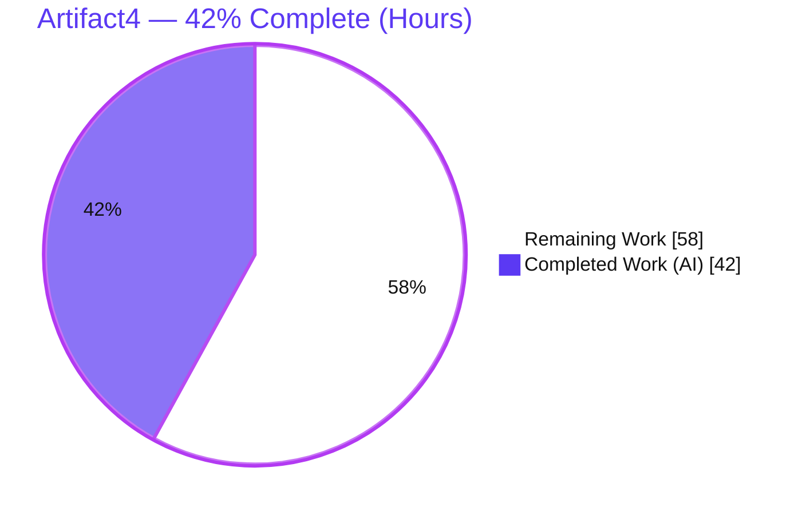
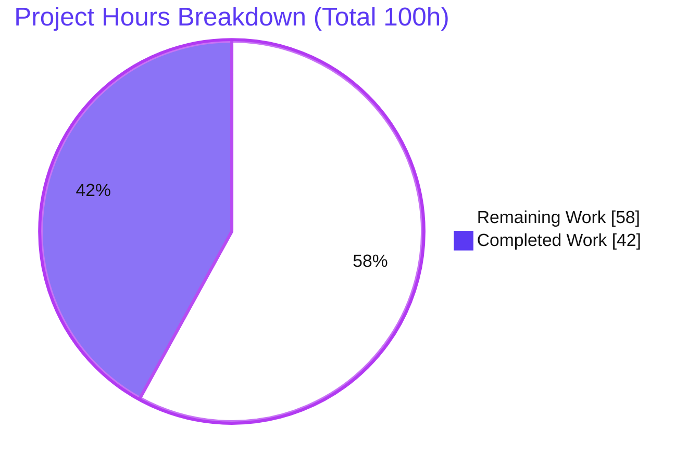
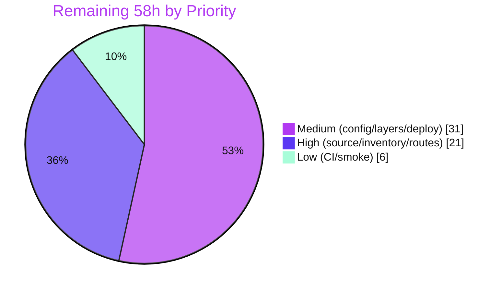
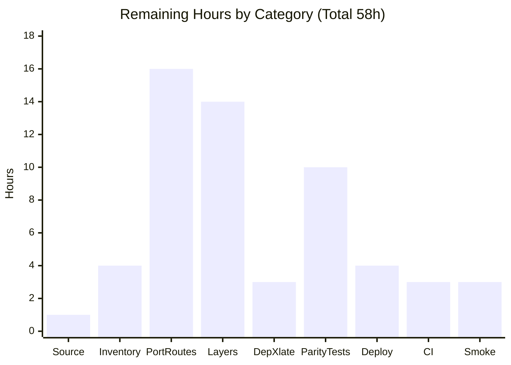

# Blitzy Project Guide — Artifact4 (Node.js → Python 3 / Flask Port)

> **Brand legend:** <span style="color:#5B39F3">**Completed / AI Work = Dark Blue (#5B39F3)**</span> · **Remaining / Not Completed = White (#FFFFFF)** · Headings/Accents = Violet‑Black (#B23AF2) · Highlights = Mint (#A8FDD9)

---

## 1. Executive Summary

### 1.1 Project Overview

Artifact4 set out to port an existing Node.js HTTP server to Python 3 / Flask with full behavioral parity. The governing constraint: the original Node.js source was never present in the repository — the only tracked file was a one‑line `README.md`. Blitzy therefore delivered the complete, production‑ready Flask scaffold the Agent Action Plan (AAP) designates as the directly‑implementable deliverable: an application factory, Blueprint routing with a health endpoint, environment‑driven configuration, centralized JSON error handlers, request/response middleware, a WSGI entrypoint, a pytest suite, and exactly‑pinned dependencies. The intended users are the API's existing clients, who require byte‑compatible behavior once real routes are ported. Business impact: a clean, well‑documented Python foundation engineered to absorb the one‑to‑one port the moment the source is supplied.

### 1.2 Completion Status

**42% complete** — measured against the **full AAP intent** (scaffold + behavioral port + path‑to‑production) using the hours‑based PA1 methodology.



| Metric | Hours |
|---|---|
| **Total Hours** | **100** |
| **Completed Hours** (AI 42 + Manual 0) | **42** |
| **Remaining Hours** | **58** |
| **Percent Complete** | **42.0%** |

> **Why 42% when the validator certified "production‑ready"?** Both statements are true and complementary. The validator certified the **delivered scaffold** — which is ~100% complete, lint‑clean, fully tested, and runs in every mode. The 42% measures that scaffold against the **entire AAP goal**, which also includes the actual behavioral port of the original server. That port (≈58h) is **blocked on a missing input — the original Node.js source — not on any quality gap** in the delivered code. This is a scope‑input gap, not a defect backlog.

### 1.3 Key Accomplishments

- [x] Complete Flask **application factory** (`create_app`) with a fixed, Express‑mirrored registration order (config → logging → extensions → blueprint → errors → hooks)
- [x] **Blueprint routing** with an always‑on `GET /health` → `200 {"status":"ok"}`; Flask's default `/static` route deliberately disabled (no invented endpoints)
- [x] **Centralized JSON error handlers** (400/404/405/500/`HTTPException`) that preserve protocol headers — notably the `Allow` header on 405 responses
- [x] **before/after request middleware**: correlation IDs (`X-Request-ID`, echoed when inbound), response timing (`X-Response-Time`), structured request logging with a contracted log format
- [x] **Environment‑driven configuration** (Base/Development/Production/Testing) loaded via `python-dotenv`, with a fail‑safe‑to‑production posture
- [x] **WSGI entrypoint** serving correctly under `gunicorn wsgi:app`, `flask run`, and `python wsgi.py`
- [x] **pytest suite**: 9 passing tests + shared fixtures; `ruff` lint clean; `compileall` clean
- [x] **Dependencies pinned to exact AAP versions** (Flask 3.1.3, Werkzeug 3.1.8, python‑dotenv 1.2.2, gunicorn 26.0.0, pytest 9.0.3); `pip check` clean
- [x] **Security defect found & fixed**: `python wsgi.py` no longer exposes the Werkzeug interactive debugger (RCE) — commit `edf9436`
- [x] **Comprehensive documentation**: 316‑line README + `.env.example` + Node.js→Python dependency mapping

### 1.4 Critical Unresolved Issues

| Issue | Impact | Owner | ETA |
|---|---|---|---|
| Original Node.js source absent from repository | Blocks **all** parity work — no routes, models, services, or auth can be ported or verified | Product / Requestor | Prerequisite (before any parity work) |
| Scaffold is not yet a drop‑in replacement (only `/health` implemented) | Existing API clients would receive 404s for real routes if traffic is routed prematurely | Engineering | After HT‑1…HT‑3 (~21h once source supplied) |
| Production `SECRET_KEY` ships as a development placeholder | Insecure session/CSRF signing if deployed unchanged | DevOps | 0.5h (before first deploy) |

### 1.5 Access Issues

Automated build, test, lint, and runtime validation all succeeded with **no repository‑permission, credential, or third‑party‑API access issues**. The single blocking item is a missing **input artifact** (the source code to port), which is a scope/handoff gap rather than an access/permission problem.

| System / Resource | Type of Access | Issue Description | Resolution Status | Owner |
|---|---|---|---|---|
| Original Node.js project source | Source **input** (not a permission) | Not present in the repository; required to define and verify behavioral parity | **Open** — must be supplied | Product / Requestor |
| Git repository (branch `blitzy-…617216`) | Repo read/write | None — commits land cleanly, working tree clean | ✅ No issue | — |
| Package index (PyPI) | Dependency install | None — all pins install; `pip check` clean | ✅ No issue | — |
| External services / credentials | API keys / secrets | None required at baseline (no external integrations until source defines them) | ✅ No issue | — |

### 1.6 Recommended Next Steps

1. **[High]** Supply & commit the original **Node.js source** to the repository — the single prerequisite that unblocks every downstream parity task *(HT‑1)*.
2. **[High]** Produce a route‑by‑route behavioral inventory, then **port each Express route** to a Flask view preserving method/path/status/headers/JSON *(HT‑2, HT‑3)*.
3. **[Medium]** Implement the **conditional layers** the source requires (models/services/schemas/auth), **translate the real `package.json`** to pinned `requirements`, and write **per‑route parity tests** *(HT‑4, HT‑5, HT‑6)*.
4. **[Medium]** Provision a strong production **`SECRET_KEY`** and **deploy** the foundation via `gunicorn wsgi:app` *(HT‑7)*.
5. **[Low]** Add a **CI pipeline** (`pytest` + `ruff`) and run **post‑deploy smoke tests** *(HT‑8, HT‑9)*.

---

## 2. Project Hours Breakdown

### 2.1 Completed Work Detail

All hours below are AI‑authored by Blitzy agents and traced to specific AAP §0.5.1 deliverables, corroborated by 29 agent commits and independent re‑validation.

| Component | Hours | Description |
|---|---:|---|
| Application factory & app wiring | 5.0 | `app/__init__.py` (186 LOC): `create_app`, fixed registration order, Flask‑3 JSON‑provider parity (`app.json.sort_keys`/`compact`), idempotent logging handler |
| Configuration module | 3.0 | `app/config.py`: Base/Dev/Prod/Test classes, `parse_bool`, `get_config`, env‑override resolution |
| Error handlers | 3.5 | `app/errors.py`: 400/404/405/500/`HTTPException` JSON envelopes with `Allow`/protocol‑header preservation |
| Request/response middleware | 2.0 | `app/middleware.py`: correlation IDs, response timing, structured request logging |
| API blueprint & health endpoint | 1.5 | `app/api/__init__.py` + `routes.py`: Blueprint + `/health` view |
| Extensions wiring seam | 0.5 | `app/extensions.py`: `register_extensions` `init_app` seam (baseline no‑op) |
| WSGI entrypoint + dotenv ordering | 2.5 | `wsgi.py`: `app = create_app()`, load‑order correctness for gunicorn/direct |
| Test suite | 6.0 | `conftest.py` fixtures + `test_health.py` (3) + `test_api.py` (6 active) |
| Dependency manifests + version research | 2.5 | `requirements*.txt` at exact pins; PyPI version verification |
| Env / run files | 3.0 | `.env.example` (76 LOC), `.flaskenv`, `Procfile`, `.gitignore`, `pyproject.toml` |
| README documentation | 4.0 | 316‑line README: setup, run modes, config, endpoints, migration mapping |
| Environment setup | 1.5 | Python 3.13 venv + dependency installation + verification |
| Validation & multi‑cycle review fixes | 5.0 | 5 production‑readiness gates + CP1/CP2/FS‑2/FS‑4/FS‑5/FS‑6 review fixes |
| Security defect fix (wsgi debug mode) | 2.0 | Root‑cause analysis, `load_dotenv=False` fix, re‑validation (commit `edf9436`) |
| **Total Completed** | **42.0** | **= Completed Hours in §1.2** ✅ |

### 2.2 Remaining Work Detail

Each category traces to an AAP requirement or path‑to‑production need. The parity‑port items (≈47h) are **Low confidence** because their true size is unknowable until the original source is supplied (plausible range 25–90h); path‑to‑production items are **Medium confidence**.

| Category | Hours | Priority |
|---|---:|---|
| Supply original Node.js source (blocking prerequisite) | 1.0 | High |
| Behavioral inventory & route‑by‑route audit of the original | 4.0 | High |
| Port routes/controllers to Flask views (parity) | 16.0 | High |
| Conditional layers (models/services/schemas/auth as used) | 14.0 | Medium |
| Node.js → Python dependency translation (actual `package.json`) | 3.0 | Medium |
| Per‑route parity test suite | 10.0 | Medium |
| Production deployment & secrets provisioning | 4.0 | Medium |
| CI pipeline (`pytest` + `ruff` gating) | 3.0 | Low |
| Post‑deploy smoke testing | 3.0 | Low |
| **Total Remaining** | **58.0** | **= Remaining Hours in §1.2 & §7** ✅ |

### 2.3 Estimation Basis & Confidence

- **Total Project Hours = 42 (completed) + 58 (remaining) = 100h.** Completion % = 42 / 100 = **42.0%**.
- **Completed (42h) — High confidence:** measured against actual files (676 LOC Python + 316‑line README), 29 agent commits, and independently re‑reproduced validation (tests, lint, runtime).
- **Remaining (58h) — mixed confidence:** path‑to‑production (deploy/secrets/CI/smoke = 13h) is Medium confidence; the behavioral port + conditional layers + parity tests (≈47h, incl. the 1h source‑handoff) is **Low confidence and contingent on the absent source**. Per RG2, low‑confidence work uses a fuller mid‑range estimate; the realistic band is **25–90h** depending on the original server's true size.

---

## 3. Test Results

All results below originate from Blitzy's autonomous validation logs and were independently reproduced this session (`pytest 9.0.3`, Python 3.13.7). **Active pass rate: 9/9 = 100%.** The single skip is an intentional, documented placeholder for the routes that will be ported once the source is supplied (it is **not** a failure).

| Test Category | Framework | Total Tests | Passed | Failed | Coverage % | Notes |
|---|---|---:|---:|---:|---|---|
| Health endpoint (contract) | pytest 9.0.3 | 3 | 3 | 0 | N/A | `tests/test_health.py` — status code, JSON body, content type |
| API parity, errors & middleware | pytest 9.0.3 | 7 | 6 | 0 | N/A | `tests/test_api.py` — health parity, 404 JSON, 405 + `Allow`, `X-Request-ID` present/echoed, testing‑config active; **1 skipped** placeholder |
| **Total** | **pytest 9.0.3** | **10** | **9** | **0** | **N/A** | **9 passed, 1 skipped, 0 failed** |

**Additional quality gates (also from autonomous logs, reproduced):**

| Gate | Tool | Result |
|---|---|---|
| Compilation | `python -m compileall` | ✅ Exit 0 (clean) |
| Lint | `ruff check .` | ✅ "All checks passed!" |
| Dependency integrity | `pip check` | ✅ "No broken requirements found" |

> **Coverage note:** Line‑coverage percentage is reported as **N/A** because coverage instrumentation (`pytest-cov`) is intentionally not in `requirements-dev.txt`; no fabricated number is presented. All baseline behaviors (health, 404, 405 + `Allow`, correlation‑ID middleware, testing config) are exercised by the active suite.

---

## 4. Runtime Validation & UI Verification

Runtime behavior was verified by booting the server in each supported mode and probing endpoints.

**Run modes**
- ✅ **Operational** — `gunicorn wsgi:app` (production): debug off; `GET /health` → 200
- ✅ **Operational** — `flask run` (development): debug on (via `.flaskenv`); `GET /health` → 200
- ✅ **Operational** — `python wsgi.py` (direct): **debug off / production‑safe** after the `edf9436` fix; opt into dev via `APP_CONFIG=development`
- ✅ **Operational** — `wsgi:app` import path resolves for all loaders

**API behavior**
- ✅ **Operational** — `GET /health` → `200` `{"status":"ok"}`, `Content-Type: application/json`, `Content-Length: 16`
- ✅ **Operational** — Unknown route → `404` JSON envelope `{"error","message"}`
- ✅ **Operational** — Wrong method (`POST /health`) → `405` JSON envelope **with `Allow: OPTIONS, GET, HEAD` preserved**
- ✅ **Operational** — `X-Request-ID` and `X-Response-Time` middleware headers present on every response
- ✅ **Operational** — Inbound `X-Request-ID` correctly echoed back

**Pending (not failing — out of current scope)**
- ⚠ **Partial** — Business routes beyond `/health` are **not yet implemented** (await the original source); the scaffold intentionally exposes only `/health`.

**UI verification**
- **Not applicable.** This is a backend HTTP‑server port; no front‑end, component library, or Figma design was provided (AAP §0.5.3). Server‑rendered templates/static assets remain a conditional layer pending the source.

---

## 5. Compliance & Quality Review

Cross‑mapping of AAP deliverables and rules (§0.7) to delivered quality. Fixes applied during autonomous validation are noted.

| AAP Deliverable / Rule | Benchmark | Status | Progress | Notes / Fixes Applied |
|---|---|---|---|---|
| Mandatory stack: Python 3 + Flask | Correct language/framework | ✅ Pass | 100% | Flask 3.1.3 on Python 3.13.7 |
| Application‑factory + Blueprint pattern | Idiomatic Flask structure | ✅ Pass | 100% | `create_app()` + `api_bp` |
| Centralized error handlers (Express parity) | JSON envelopes + status codes | ✅ Pass | 100% | Header preservation (`Allow` on 405); fixed in review (API‑001) |
| Middleware ordering (Express parity) | `before/after_request` hooks | ✅ Pass | 100% | Correlation ID + timing + logging; log format fixed (FS‑2) |
| Configuration & env parity (`dotenv`) | env‑driven, documented vars | ✅ Pass | 100% | dotenv load‑order fixed (CP2); env‑override checklist (FS‑6) |
| Exact pinned dependencies (no `latest`) | Reproducible installs | ✅ Pass | 100% | Manifest shapes fixed (CP1, DEP‑001) |
| No hard‑coded secrets | Secrets via env only | ✅ Pass | 100% | `SECRET_KEY` placeholder documented in `.env.example` |
| Preservation over enhancement (no invented endpoints) | Only original behavior | ✅ Pass | 100% | Default `/static` route disabled; only `/health` exposed |
| Documentation accuracy | README matches code | ✅ Pass | 100% | Doc drift + test‑count reconciled (FS‑4, FS‑5, DOC‑001) |
| Fail‑safe‑to‑production posture | Debug off unless opted in | ✅ Pass | 100% | **Security fix** `edf9436` (`python wsgi.py` debug‑off) |
| **Functional parity (actual routes)** | Byte‑compatible with original | ⏳ Blocked | 0% | **Awaiting source** — cannot define/verify parity targets |
| **Tests prove parity** | Per‑route parity assertions | ⏳ Partial | Baseline only | Baseline/error/middleware tested; per‑route placeholder skipped |

**Compliance summary:** Every deliverable that is implementable without the source **passes**. The two non‑pass rows are **blocked by the absent source**, not by quality defects.

---

## 6. Risk Assessment

| Risk | Category | Severity | Probability | Mitigation | Status |
|---|---|---|---|---|---|
| **R1** — Absent Node.js source blocks parity definition/verification | Integration / Technical | High | Certain | Obtain & commit the source; AAP defines exact one‑to‑one port; factory + extensions seam + blueprint absorb routes/models/services with minimal rework | **Open (blocker #1)** |
| **R2** — Existing API clients break if scaffold deployed prematurely | Integration | High | Medium | Do not route production traffic until the port is complete; treat the scaffold as a foundation, not a drop‑in replacement | Open (by design) |
| **R3** — Conditional‑layer scope (DB/auth/validation) unknown → estimate uncertainty | Technical | Medium | Medium | Estimates flagged Low‑confidence (25–90h band); clean insertion points exist; re‑estimate when source arrives | Open (contingent) |
| **R4** — Production `SECRET_KEY` ships as dev placeholder | Security | High (if shipped as‑is) | Low | Set a strong key via `.env`/secret manager before deploy; README documents `secrets.token_hex(32)` | **Mitigated** (needs human action) |
| **R5** — `python wsgi.py` exposed Werkzeug debugger (RCE) | Security | High (was) | N/A | Fixed in `edf9436` (`load_dotenv=False`); re‑validated debug‑off | **Resolved** ✅ |
| **R6** — Authentication/authorization parity unknown | Security | Medium | Medium | Create `app/auth.py` one‑to‑one once source reveals JWT/session; PyJWT/passlib pre‑mapped (§0.3.2) | Open (contingent) |
| **R7** — No CI/CD pipeline | Operational | Medium | Medium | `pytest`+`ruff` already green locally; add CI workflow (~3h); commands documented | Open (path‑to‑prod) |
| **R8** — No deployment automation (Dockerfile/IaC) | Operational | Low | Low | `Procfile` provides `gunicorn` start; out of baseline scope per AAP §8.1 unless original included it | Open (path‑to‑prod) |
| **R9** — Dependency translation untested vs real `package.json` | Integration | Medium | Medium | §0.3.2 mapping table ready; conditional package versions verified at implementation time | Open (contingent) |
| **R10** — Limited observability (logging only; no metrics/tracing) | Operational | Low | Low | Structured request logging + correlation IDs already present; add metrics only if the original had them | Partially mitigated |

**Overall:** No open risks exist **in the delivered scaffold code** — the only security defect (R5) was found and fixed. Every material open risk stems from the missing‑source blocker (R1) and downstream contingent / path‑to‑production items.

---

## 7. Visual Project Status

**Hours: Completed vs Remaining** (Completed = Dark Blue #5B39F3, Remaining = White #FFFFFF)



**Remaining work by priority** (Medium = Violet‑Black #B23AF2, High = Dark Blue #5B39F3, Low = Mint #A8FDD9)



**Remaining hours by category** (bar view of §2.2 — sums to 58h)



| Category | Hours | Priority |
|---|---:|---|
| Supply Node.js source | 1.0 | High |
| Behavioral inventory | 4.0 | High |
| Port routes | 16.0 | High |
| Conditional layers | 14.0 | Medium |
| Dependency translation | 3.0 | Medium |
| Parity test suite | 10.0 | Medium |
| Deployment & secrets | 4.0 | Medium |
| CI pipeline | 3.0 | Low |
| Smoke testing | 3.0 | Low |
| **Total** | **58.0** | — |

---

## 8. Summary & Recommendations

**Achievements.** Blitzy delivered the complete, idiomatic Flask scaffold the AAP designates as the directly‑implementable deliverable: an application factory with Express‑mirrored initialization, Blueprint routing with a health endpoint, environment‑driven configuration, centralized JSON error handling with protocol‑header preservation, request/response middleware, and a WSGI entrypoint that serves correctly in production, development, and direct modes. The work is lint‑clean, compiles cleanly, passes 9/9 active tests, installs at exact pinned versions, and is thoroughly documented. A genuine security defect (a debugger/RCE exposure on `python wsgi.py`) was found, root‑caused, fixed, and re‑validated.

**Remaining gaps.** The project is **42.0% complete** against the full AAP intent. The remaining **58 hours** are dominated by the **actual behavioral port** — the inventory, the route‑by‑route translation, the conditional layers (database/auth/validation), the real dependency translation, and per‑route parity tests — plus a small path‑to‑production tail (deploy, secrets, CI, smoke). Crucially, **this remaining work is blocked on a missing input — the original Node.js source — and not on any deficiency in the delivered code.**

**Critical path to production.**
1. Supply the original Node.js source (unblocks everything).
2. Inventory its behavior, then port routes to Flask views with byte‑compatible parity.
3. Add the conditional layers it exercises, translate its dependencies, and write per‑route parity tests.
4. Provision a production `SECRET_KEY` and deploy via `gunicorn`.
5. Gate the repo with CI and run post‑deploy smoke tests.

**Success metrics:** 100% of in‑scope baseline files delivered; 9/9 active tests passing; 0 lint/compile errors; 1 security defect resolved; exact dependency pins; all run modes operational.

**Production‑readiness assessment.** The **scaffold is production‑ready** as a foundation and safe to deploy for a health‑checkable service. However, it is **not a functional replacement** for the original server until the routes are ported — only `/health` is implemented. **Recommendation:** treat this PR as the approved foundation; obtain the source and proceed with the prioritized human task list before exposing it to production clients. At no point should completion be represented as 100% — the realistic ceiling before the source arrives is reflected here at 42%.

---

## 9. Development Guide

All commands below were executed and verified this session from the repository root with the virtual environment activated.

### 9.1 System Prerequisites

- **Python** 3.9+ (verified on **3.13.7**; AAP target 3.12.x — Flask 3.1.3 supports 3.9+)
- **pip** (verified 25.3) and the `venv` module
- **Git**
- OS: Linux/macOS/WSL (any POSIX shell)

### 9.2 Environment Setup

```bash
# From the repository root
python3 -m venv .venv
source .venv/bin/activate           # Windows: .venv\Scripts\activate
```

> **Troubleshooting (host‑specific):** On a host whose package manager removed `pip`, `python3 -m venv .venv` can fail at the `ensurepip` step. Workaround: `python3 -m venv --without-pip .venv` then bootstrap pip (e.g. `get-pip.py`), or use the system pip. Standard hosts work with the normal command above.

### 9.3 Dependency Installation

```bash
pip install -r requirements-dev.txt   # installs runtime (-r requirements.txt) + pytest
pip check                             # expect: "No broken requirements found."
```

Expected runtime pins: `Flask==3.1.3`, `python-dotenv==1.2.2`, `gunicorn==26.0.0`, `Werkzeug==3.1.8`; dev: `pytest==9.0.3`.

### 9.4 Configuration

```bash
cp .env.example .env
# Then set a strong secret for anything beyond local dev:
python -c "import secrets; print(secrets.token_hex(32))"   # paste into SECRET_KEY in .env
```

Key variables: `APP_CONFIG` (`development|production|testing`), `SECRET_KEY`, `PORT` (default 5000), `LOG_LEVEL`, `FLASK_DEBUG` (dev only).

### 9.5 Application Startup

```bash
# Development (debug on; loads .flaskenv -> FLASK_APP=wsgi.py, APP_CONFIG=development)
flask run
#  * Debug mode: on
#  * Running on http://127.0.0.1:5000

# Production (debug off; binds 0.0.0.0:${PORT:-5000})
gunicorn wsgi:app
# or exactly as in the Procfile:
APP_CONFIG=production gunicorn wsgi:app --bind 0.0.0.0:5000

# Direct (production‑safe; debug off after the edf9436 fix)
python wsgi.py
# Opt into development explicitly:
APP_CONFIG=development python wsgi.py
```

### 9.6 Verification

```bash
pytest                 # -> 9 passed, 1 skipped
ruff check .           # -> All checks passed!

# With a server running on :5000
curl -s http://127.0.0.1:5000/health
# -> {"status":"ok"}

curl -i http://127.0.0.1:5000/__nope__        # -> 404 JSON {"error","message"}
curl -i -X POST http://127.0.0.1:5000/health  # -> 405 JSON + "Allow: OPTIONS, GET, HEAD"
```

### 9.7 Example Usage

```bash
$ curl -i http://127.0.0.1:5000/health
HTTP/1.1 200 OK
Content-Type: application/json
Content-Length: 16
X-Request-ID: bd66b82d-0a9d-41e0-9123-9d0f5d834c76
X-Response-Time: 0.27ms

{"status":"ok"}
```

### 9.8 Common Issues & Resolutions

| Symptom | Cause | Resolution |
|---|---|---|
| `Address already in use` | Port 5000 occupied | `flask run --port 5066` or set `PORT` / Procfile `${PORT}` |
| `.env` ignored under gunicorn | dotenv loaded too late | Already handled — `wsgi.py` calls `load_dotenv()` before importing `app`; ensure `.env` is at repo root |
| Debugger appears on `python wsgi.py` | Pre‑fix behavior (`load_dotenv=True`) | Already fixed in `edf9436`; confirm you are at/after that commit |
| `externally-managed-environment` on `pip install` | System Python (PEP 668) | Use a venv (recommended) or `pip install --break-system-packages` |
| `ensurepip` failure creating venv | Host removed pip | `python3 -m venv --without-pip .venv` then bootstrap pip |

---

## 10. Appendices

### Appendix A — Command Reference

| Purpose | Command |
|---|---|
| Create venv | `python3 -m venv .venv && source .venv/bin/activate` |
| Install deps | `pip install -r requirements-dev.txt` |
| Dependency check | `pip check` |
| Run (dev) | `flask run` |
| Run (prod) | `gunicorn wsgi:app` |
| Run (direct) | `python wsgi.py` |
| Tests | `pytest` |
| Lint | `ruff check .` |
| Compile check | `python -m compileall app tests wsgi.py` |
| Health probe | `curl -s http://127.0.0.1:5000/health` |

### Appendix B — Port Reference

| Port | Service | Source |
|---|---|---|
| 5000 | Flask/gunicorn HTTP (default) | `PORT` env / `.flaskenv` / Procfile `${PORT:-5000}` |

### Appendix C — Key File Locations

| Path | Role |
|---|---|
| `app/__init__.py` | Application factory (`create_app`), logging config |
| `app/config.py` | Env‑driven config classes (Base/Dev/Prod/Test) |
| `app/extensions.py` | Extension wiring seam (`register_extensions`) |
| `app/api/__init__.py` · `app/api/routes.py` | API Blueprint + `/health` view |
| `app/errors.py` | Centralized JSON error handlers |
| `app/middleware.py` | `before/after_request` hooks (correlation ID, timing, logging) |
| `wsgi.py` | WSGI entrypoint (`app = create_app(...)`) |
| `tests/` | `conftest.py`, `test_health.py`, `test_api.py` |
| `requirements*.txt`, `.env.example`, `.flaskenv`, `Procfile`, `pyproject.toml` | Manifests / config |
| `README.md` | Project documentation (316 lines) |

### Appendix D — Technology Versions

| Component | Version | Notes |
|---|---|---|
| Python | 3.13.7 | AAP target 3.12.x; Flask supports 3.9+ |
| Flask | 3.1.3 | Core WSGI framework |
| Werkzeug | 3.1.8 | Ships with Flask |
| python‑dotenv | 1.2.2 | `.env` loading |
| gunicorn | 26.0.0 | Production WSGI server |
| pytest | 9.0.3 | Test runner |
| ruff | 0.15.15 | Linter (tooling, not a committed dependency) |

### Appendix E — Environment Variable Reference

| Variable | Default | Purpose |
|---|---|---|
| `APP_CONFIG` | `production` (in `wsgi.py`); `development` (via `.flaskenv` for `flask run`) | Selects config class |
| `SECRET_KEY` | `dev-secret-change-me` (placeholder) | Session/CSRF signing — **set in production** |
| `PORT` | `5000` | Listen port (dev runner / Procfile bind) |
| `LOG_LEVEL` | `INFO` (Dev: `DEBUG`, Test: `WARNING`) | Logging verbosity |
| `FLASK_APP` | `wsgi.py` | Flask CLI entrypoint |
| `FLASK_DEBUG` | `1` (dev only, via `.flaskenv`) | Dev debugger/reloader toggle |
| `DEBUG` | unset | Optional explicit override of `app.config['DEBUG']` |

### Appendix F — Developer Tools Guide

- **pytest** — `pytest` (config in `pyproject.toml`: `testpaths=["tests"]`, `addopts="-ra -q"`).
- **ruff** — `ruff check .` (line‑length 100, target `py312`); run `ruff check . --fix` only deliberately.
- **gunicorn** — production server; the `Procfile` declares the canonical start command.
- **Flask CLI** — `flask run` reads `.flaskenv`; `flask routes` lists the URL map.

### Appendix G — Glossary

| Term | Meaning |
|---|---|
| **AAP** | Agent Action Plan — the governing requirements specification |
| **Application factory** | `create_app()` pattern that builds/wires the Flask app |
| **Blueprint** | Flask construct grouping related routes (`api_bp`) |
| **Parity / behavioral parity** | Byte‑compatible reproduction of the original server's observable behavior |
| **Scaffold** | The baseline Flask structure delivered now, ready to receive the port |
| **Conditional layer** | A module (models/services/schemas/auth) created only if the original exercises it |
| **WSGI** | Web Server Gateway Interface — the Python web‑server contract (`wsgi:app`) |
| **Correlation ID** | Per‑request `X-Request-ID` for tracing requests through logs |

---

### Cross‑Section Integrity Verification ✅

- **Rule 1 (1.2 ↔ 2.2 ↔ 7):** Remaining = **58h** in §1.2 metrics, §2.2 total, and §7 pie/category table — identical.
- **Rule 2 (2.1 + 2.2 = Total):** 42h + 58h = **100h** = §1.2 Total.
- **Rule 3 (Section 3):** All tests originate from Blitzy's autonomous validation logs (9 passed / 1 skipped), independently reproduced.
- **Rule 4 (Section 1.5):** Access issues validated against current permissions — build/credentials clean; only a missing source **input** outstanding.
- **Rule 5 (Colors):** Completed = Dark Blue **#5B39F3**, Remaining = White **#FFFFFF** applied throughout.
- **Completion %:** 42 / 100 = **42.0%** — stated identically in §1.2, §7, and §8.