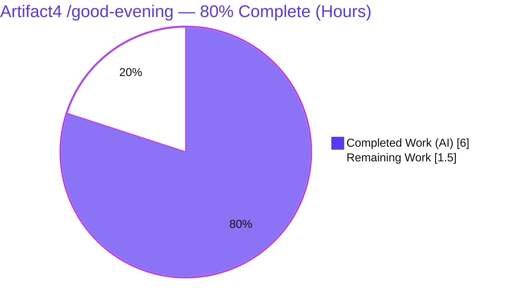
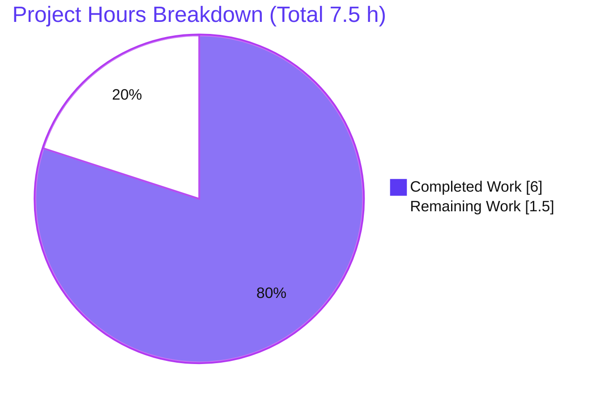

# Blitzy Project Guide — Artifact4 · Add `GET /good-evening` Greeting Endpoint (Flask)

> **Brand legend:** <span style="color:#5B39F3">**Completed / AI Work = Dark Blue (#5B39F3)**</span> · **Remaining / Not Completed = White (#FFFFFF)** · Headings/Accents = Violet‑Black (#B23AF2) · Highlights = Mint (#A8FDD9)

---

## 1. Executive Summary

### 1.1 Project Overview

This effort adds a second HTTP endpoint — `GET /good-evening`, returning the literal plain‑text greeting **`Good evening`** (HTTP 200) — to the existing *Artifact4* tutorial web server, alongside the pre‑existing `GET /health` route. The user's request referenced "add expressjs," but the assigned repository is a **Python 3 / Flask** application, not Node.js; Express is inert in a Python runtime, so the framework ask was correctly resolved as already satisfied by Flask (the mandated, installed framework). The deliverable is a small, additive, zero‑regression feature: one new Flask view, one paired contract test, and one documentation row. Target users are the API's existing clients; business impact is a faithfully delivered feature on the project's established stack with no new dependencies.

### 1.2 Completion Status

**80.0% complete** — measured against the **AAP‑scoped work** for this feature plus its standard **path‑to‑production**, using the hours‑based PA1 methodology. All code deliverables are implemented, validated, and committed; the remaining 1.5 h is human‑gated path‑to‑production (review, deploy, smoke test).



| Metric | Hours |
|---|---|
| **Total Hours** | **7.5** |
| **Completed Hours** (AI 6.0 + Manual 0.0) | **6.0** |
| **Remaining Hours** | **1.5** |
| **Percent Complete** | **80.0%** |

> **Why 80% when the validator certified "production‑ready"?** Both statements are true and complementary. Every **AAP code deliverable** is ~100% complete — implemented, compiled, fully tested (10 passed / 1 skipped), and verified at runtime in both dev and prod. The 80% additionally accounts for the **human‑gated path‑to‑production** steps (PR review/merge, deploy, post‑deploy smoke test = 1.5 h) that, by definition, occur after autonomous delivery. This is a normal handoff tail, not a defect backlog.

### 1.3 Key Accomplishments

- [x] **New route delivered** — `GET /good-evening` returns the exact body `Good evening` with `Content-Type: text/plain; charset=utf-8`, HTTP 200, `Content-Length: 12` (commit `91def9b`)
- [x] **Framework ask resolved correctly** — "add expressjs" mapped to the project's mandated Flask stack; **no** Express/Node artifacts and **no** dependency‑manifest changes introduced
- [x] **Zero regression** — `GET /health` remains byte‑for‑byte unchanged (`200 {"status":"ok"}`); shared infrastructure (factory, blueprint, config, middleware, errors, WSGI) untouched
- [x] **Cross‑cutting behavior inherited automatically** — new route carries `X-Request-ID` + `X-Response-Time` headers and the centralized JSON error handling (404/405 with `Allow`)
- [x] **Paired contract test created** — `tests/test_good_evening.py` asserts status, body, and content type via the shared `client` fixture (commit `236b62a`)
- [x] **Documentation updated** — one new row in the README "API Endpoints" table (commit `3e44e2a`)
- [x] **Full suite green** — `pytest` → **10 passed, 1 skipped** (the single skip is an intentional parity placeholder)
- [x] **Dependencies clean & pinned** — `pip check` reports no broken requirements; exact pins satisfied (Flask 3.1.3, Werkzeug 3.1.8, python‑dotenv 1.2.2, gunicorn 26.0.0, pytest 9.0.3)
- [x] **Runtime verified dev + prod** — confirmed under `flask run` (Werkzeug) and `gunicorn wsgi:app` (production), with response‑body parity
- [x] **Tight, in‑scope diff** — exactly 3 files changed, +23 / −0 lines, zero out‑of‑scope modifications

### 1.4 Critical Unresolved Issues

| Issue | Impact | Owner | ETA |
|---|---|---|---|
| _None blocking._ All AAP code deliverables are complete, validated, and committed. | No blockers to release of this feature. | — | — |
| Route path & response‑shape are user‑adjustable preferences (non‑blocking) | If the requester prefers `/evening` or a JSON body `{"message":"Good evening"}`, a one‑line change is required | Product / Requestor | 0.25 h if changed |

### 1.5 Access Issues

Automated dependency resolution, compilation, testing, and dev/prod runtime validation all succeeded with **no repository‑permission, credential, or third‑party‑API access issues**. This feature requires no external services, API keys, or databases.

| System / Resource | Type of Access | Issue Description | Resolution Status | Owner |
|---|---|---|---|---|
| — | — | **No access issues identified.** | **N/A** | — |

> Note: the project ships a pre‑provisioned `.venv` (Python 3.13.7) that is fully functional and was used for all validation. A clean‑room fresh `python -m venv` bootstrap requires network access (PyPI); this is a standard environment prerequisite, not an access defect.

### 1.6 Recommended Next Steps

1. **[High]** Review and approve/merge the feature PR — confirm the 3‑file, +23/−0 diff matches AAP §0.5.1, that `/health` is unchanged, and that no Node artifacts or manifest changes were introduced (0.5 h).
2. **[Medium]** Deploy the updated application to production via the existing `Procfile` (`gunicorn wsgi:app`); the new route auto‑registers with no infrastructure change (0.5 h).
3. **[Medium]** Run a post‑deploy smoke test — `curl` `/good-evening` and `/health` in the deployed environment and confirm bodies, status codes, and correlation headers (0.5 h).
4. **[Low]** Confirm route‑path/response‑shape preference with the requester; apply a one‑line change only if a different path or JSON shape is desired (non‑blocking).
5. **[Low]** Before any production deploy of the broader app, set a real `SECRET_KEY` env var (pre‑existing app‑level hardening, outside this feature's scope).

---

## 2. Project Hours Breakdown

### 2.1 Completed Work Detail

All rows are AAP‑scoped and delivered by Blitzy autonomous agents. **Total = 6.0 h** (matches Completed Hours in §1.2).

| Component | Hours | Description |
|---|---|---|
| Diagnostic & Repository Reconciliation | 1.5 | Resolved the Node/Express‑vs‑Python/Flask divergence; enumerated the route table (only `GET /health`); live‑exercised the absent path (404); identified the single change point and the test/doc conventions to mirror (AAP §0.2–§0.3) |
| Route Implementation — `GET /good-evening` | 1.0 | Added `from flask import Response` and the `good_evening` view returning `Response("Good evening", mimetype="text/plain")` with an explanatory comment; mirrors the `/health` definition style (`app/api/routes.py`, commit `91def9b`) |
| Contract Test — `tests/test_good_evening.py` | 1.0 | New pytest module mirroring `test_health.py`; asserts HTTP 200, body `Good evening`, content type `text/plain; charset=utf-8` via the shared `client` fixture (commit `236b62a`) |
| Documentation — README endpoint row | 0.5 | Added one row to the "API Endpoints" table documenting `GET /good-evening` (commit `3e44e2a`) |
| Comprehensive 5‑Gate Validation | 2.0 | Dependencies (`pip check`, exact pins), compilation, unit tests (10 passed / 1 skipped), dev + prod runtime (`flask run` + `gunicorn`), regression check, and clean‑state verification (AAP §0.6) |
| **Total** | **6.0** | |

### 2.2 Remaining Work Detail

All remaining items are standard, human‑gated path‑to‑production steps. **Total = 1.5 h** (matches Remaining Hours in §1.2 and the §7 pie chart).

| Category | Hours | Priority |
|---|---|---|
| Code review & PR approval/merge (verify diff vs AAP §0.5.1; `/health` unchanged; run suite) | 0.5 | High |
| Production deploy of the updated app (existing `Procfile` / gunicorn; route auto‑registers) | 0.5 | Medium |
| Post‑deploy smoke test of both endpoints in the deployed environment | 0.5 | Medium |
| **Total** | **1.5** | |

### 2.3 Hours Calculation & Methodology

- **Methodology:** PA1 hours‑based, AAP‑scoped. The work universe is (a) the AAP deliverables and (b) standard path‑to‑production to deploy them — nothing outside this feature's AAP scope.
- **Formula:** `Completion % = Completed ÷ (Completed + Remaining) × 100 = 6.0 ÷ (6.0 + 1.5) × 100 = 6.0 ÷ 7.5 × 100 = 80.0%`.
- **Reconciliation:** §2.1 total (6.0) + §2.2 total (1.5) = **7.5** = Total Hours in §1.2. Completed (6.0) and Remaining (1.5) are used identically in §1.2, §2, §7, and §8.

---

## 3. Test Results

All tests below originate from Blitzy's autonomous test execution (`pytest 9.0.3`) against the project's pinned stack. Command: `.venv/bin/python -m pytest`. Result: **10 passed, 1 skipped, 0 failed** (exit 0).

| Test Category | Framework | Total Tests | Passed | Failed | Coverage | Notes |
|---|---|---|---|---|---|---|
| Contract — `/good-evening` (new feature) | pytest 9.0.3 | 1 | 1 | 0 | Route contract 100% | `tests/test_good_evening.py` — status 200, body `Good evening`, content type `text/plain; charset=utf-8` |
| Health endpoint | pytest 9.0.3 | 3 | 3 | 0 | Route contract 100% | `tests/test_health.py` — status, JSON body, content type |
| API parity, middleware & errors | pytest 9.0.3 | 7 | 6 | 0 | n/a | `tests/test_api.py` — testing config, health parity, 404 JSON, 405 + `Allow`, `X-Request-ID` present/echoed; **1 skipped** (intentional parity placeholder, `test_api.py:78`) |
| **Total** | **pytest 9.0.3** | **11** | **10** | **0** | — | 10 passed, 1 skipped, 0 failed |

- **The 1 skip is not a failure.** It is a documented, intentional placeholder for one‑to‑one parity tests pending the original Node.js source; it has been skipped since before this feature and is independent of it.
- **Coverage instrumentation:** no coverage tool (`pytest-cov`) is pinned in `requirements-dev.txt`, so a line‑coverage percentage is not measured. Both live routes have full **contract** coverage (status, body, content type); the new route additionally inherits regression coverage of 404/405/correlation behavior via `test_api.py`.

---

## 4. Runtime Validation & UI Verification

Runtime behavior was confirmed under both the development server (`flask run` / Werkzeug) and the production server (`gunicorn wsgi:app`), with response‑body parity between them.

**API / Runtime — Development (`flask run`):**
- ✅ `GET /good-evening` → **200**, `Content-Type: text/plain; charset=utf-8`, `Content-Length: 12`, body exactly `Good evening`
- ✅ `GET /health` → **200**, `application/json`, body `{"status":"ok"}` (no regression)
- ✅ Unknown path (`GET /nope`) → **404** with the centralized JSON error envelope
- ✅ Wrong method (`POST /good-evening`) → **405** with `Allow: HEAD, OPTIONS, GET` preserved
- ✅ Correlation headers present on every response — `X-Request-ID` (UUID) and `X-Response-Time`

**API / Runtime — Production (`gunicorn wsgi:app`, `APP_CONFIG=production`):**
- ✅ Server boots cleanly (`gunicorn 26.0.0`, sync worker)
- ✅ `GET /good-evening` → **200**, `text/plain; charset=utf-8`, `Content-Length: 12`, body `Good evening`
- ✅ `GET /health` → **200**, `application/json`, `{"status":"ok"}`
- ✅ Dev/prod response‑body parity confirmed

**UI Verification:**
- ⚠ **Not applicable — no UI surface.** Per AAP §0.8, this change is confined to a backend HTTP endpoint returning a plain‑text greeting; there are no Figma frames, no client‑facing visual components, and no browser UI to verify.

---

## 5. Compliance & Quality Review

Cross‑mapping of AAP deliverables and project conventions to their verification status. Fixes applied during autonomous validation: **none required** — the feature was delivered correctly by prior agents and validation confirmed it end‑to‑end with no source changes.

| Benchmark / AAP Requirement | Status | Evidence |
|---|---|---|
| New route `GET /good-evening` returns literal `Good evening` | ✅ Pass | `app/api/routes.py:16-20`; live 200 + body |
| Plain‑text contract (`text/plain; charset=utf-8`, 200, `Content-Length: 12`) | ✅ Pass | `curl -i` headers/body; contract test |
| `from flask import Response` added to import group | ✅ Pass | `app/api/routes.py:6` |
| Explanatory comment recording motivation | ✅ Pass | `app/api/routes.py:18-19` |
| "add expressjs" → not applicable; no Node artifacts; no manifest changes | ✅ Pass | No `package.json`/`*.js`/`node_modules`; `requirements*.txt` & `pyproject.toml` unchanged |
| New route inherits middleware + centralized error handling | ✅ Pass | `X-Request-ID`/`X-Response-Time` present; 404/405 envelopes |
| Paired contract test mirrors `test_health.py` via shared `client` | ✅ Pass | `tests/test_good_evening.py`; test passes |
| README "API Endpoints" table updated | ✅ Pass | `README.md:187`, commit `3e44e2a` |
| Zero regression: `/health` byte‑for‑byte unchanged; infra untouched | ✅ Pass | Diff = 3 files only; live `/health` `200 {"status":"ok"}` |
| Verification protocol: full suite 10 passed / 1 skipped | ✅ Pass | `pytest` exit 0 |
| Dependency pins satisfied; `pip check` clean | ✅ Pass | Flask 3.1.3, Werkzeug 3.1.8, python‑dotenv 1.2.2, gunicorn 26.0.0, pytest 9.0.3 |
| Code‑quality discipline (preservation over enhancement; in‑repo conventions) | ✅ Pass | Mirrors `@api_bp.get(...)` style and one‑test‑per‑endpoint pattern |

**Overall compliance: 12 / 12 benchmarks pass (100%).** No outstanding compliance items for this feature.

---

## 6. Risk Assessment

This is a small, additive, fully‑validated feature; risk is genuinely low. No high or critical risks exist.

| Risk | Category | Severity | Probability | Mitigation | Status |
|---|---|---|---|---|---|
| Route path / response shape is a user‑adjustable preference (`/good-evening`, plain text) | Technical | Low | Low | Confirm preference with requester; one‑line change if a different path or JSON shape is desired (AAP §0.3.3) | Open (non‑blocking) |
| Production `SECRET_KEY` defaults to a dev placeholder (`app/config.py:44`) — **pre‑existing, app‑level, out of this feature's scope** | Security | Medium | Medium if app deployed unchanged | Set a real `SECRET_KEY` via env before production deploy; the new endpoint uses no sessions/CSRF and is unaffected | Open (informational; excluded from completion math) |
| New endpoint introduces no new attack surface (static, constant‑time, no input, no auth) | Security | None/Low | Low | None needed; mirrors `/health` | Closed |
| Observability for the new route | Operational | Low | Low | Inherited automatically — structured request logging + `X-Request-ID`/`X-Response-Time` | Closed |
| Manual deploy (no CI/CD — out of AAP scope) | Operational | Low | Low | Use the existing `Procfile`/gunicorn run model; route auto‑registers | Open (by design) |
| External integrations / credentials | Integration | None | None | N/A — no external services, API keys, or DB | Closed |
| Dev/prod runtime divergence | Integration | Low | Low | Dev/prod response‑body parity already verified (`flask run` == `gunicorn`) | Closed |

---

## 7. Visual Project Status



**Remaining hours by category (from §2.2):**

| Category | Hours | Priority |
|---|---|---|
| Code review & PR merge | 0.5 | High |
| Production deploy | 0.5 | Medium |
| Post‑deploy smoke test | 0.5 | Medium |
| **Total Remaining** | **1.5** | |

> Integrity: "Remaining Work" (1.5 h) equals the Remaining Hours in §1.2 and the sum of the §2.2 "Hours" column. "Completed Work" (6.0 h) equals the Completed Hours in §1.2.

---

## 8. Summary & Recommendations

**Achievements.** The requested feature is delivered exactly as specified: `GET /good-evening` returns the literal plain‑text greeting `Good evening` on the project's mandated Flask framework, alongside an unchanged `GET /health`. The ambiguous "add expressjs" instruction was correctly resolved — Express is inert in a Python runtime, so Flask (already installed) satisfies the framework ask, with no Node artifacts and no dependency drift. The change is tightly scoped to three files (+23 / −0), fully tested, and verified at runtime in both development and production.

**Remaining gaps.** Nothing in the code remains. The outstanding **1.5 h** is entirely standard, human‑gated path‑to‑production: PR review/merge, production deploy, and a post‑deploy smoke test.

**Critical path to production.** Review & merge → deploy via the existing `Procfile`/gunicorn → smoke‑test both endpoints. No infrastructure, credentials, or new dependencies are involved.

**Success metrics (all met for the code deliverable):** new endpoint returns `Good evening` (200, `text/plain`); `/health` unchanged; full suite 10 passed / 1 skipped; `pip check` clean; dev/prod parity confirmed.

**Production readiness assessment.** The feature is **production‑ready** from a code, test, and runtime standpoint. At **80.0% complete** on the AAP + path‑to‑production scale, the only items between validation and production are routine human gates. Recommended before deploying the broader app (not specific to this feature): set a real `SECRET_KEY`.

| Metric | Value |
|---|---|
| AAP code deliverables complete | 10 / 10 (100%) |
| Compliance benchmarks passed | 12 / 12 (100%) |
| Tests | 10 passed / 1 skipped / 0 failed |
| Files changed (in‑scope) | 3 (+23 / −0) |
| Overall completion (AAP + path‑to‑production) | **80.0%** |

---

## 9. Development Guide

### 9.1 System Prerequisites

- **Python** 3.12+ (validated on 3.13.7)
- **pip** (PEP‑668 note: on system Python use a virtualenv — preferred — or `--break-system-packages`)
- **git**
- **curl** (optional, for manual verification)
- No database, no message broker, no external services, **no Node.js**

### 9.2 Environment Setup & Dependency Installation

```bash
# From the repository root
python3 -m venv .venv
source .venv/bin/activate            # Windows: .venv\Scripts\activate
pip install --upgrade pip
pip install -r requirements-dev.txt  # runtime pins + pytest 9.0.3
```

> The repository ships a pre‑provisioned `.venv` (Python 3.13.7) that is fully functional. Verify it with:
>
> ```bash
> .venv/bin/python -m pip check        # -> "No broken requirements found."
> .venv/bin/python --version           # -> Python 3.13.7
> ```

### 9.3 Running the Application

```bash
# Development server (Werkzeug); .flaskenv selects the development config
.venv/bin/flask --app wsgi run --port 5000
# Equivalent:
.venv/bin/python wsgi.py

# Production server (gunicorn); wsgi.py defaults to the production config
APP_CONFIG=production .venv/bin/gunicorn wsgi:app --bind 0.0.0.0:${PORT:-5000}
```

### 9.4 Verification Steps

```bash
# Run the full test suite  -> expected: 10 passed, 1 skipped
.venv/bin/python -m pytest

# Run only the new feature's contract test -> expected: 1 passed
.venv/bin/python -m pytest tests/test_good_evening.py -q
```

### 9.5 Example Usage

```bash
# New endpoint -> 200, text/plain; charset=utf-8, Content-Length: 12, body "Good evening"
curl -i http://localhost:5000/good-evening

# Pre-existing endpoint (unchanged) -> 200, application/json, {"status":"ok"}
curl -i http://localhost:5000/health
```

Expected response for `GET /good-evening`:

```
HTTP/1.1 200 OK
Content-Type: text/plain; charset=utf-8
Content-Length: 12
X-Request-ID: <uuid>
X-Response-Time: <n>ms

Good evening
```

### 9.6 Troubleshooting

- **`error: externally-managed-environment`** — install into a virtualenv (preferred) or pass `--break-system-packages` for a deliberate global install.
- **`Address already in use`** — change `--port` (dev) or `--bind` host:port (gunicorn).
- **404 on `/good-evening`** — ensure the server was restarted after pulling the change; the view auto‑registers via the `from app.api import routes` import seam in `app/api/__init__.py`.
- **Fresh venv cannot bootstrap pip offline** — `python -m venv` needs network access for `ensurepip`/PyPI; run setup with connectivity, or use the provided `.venv`.
- **Production debugger** — never exposed: `wsgi.py` loads dotenv with `load_dotenv=False` and gunicorn defaults to the production config (debug off).

---

## 10. Appendices

### A. Command Reference

| Purpose | Command |
|---|---|
| Create virtualenv | `python3 -m venv .venv` |
| Install deps | `pip install -r requirements-dev.txt` |
| Dependency health | `.venv/bin/python -m pip check` |
| Run tests | `.venv/bin/python -m pytest` |
| Run feature test | `.venv/bin/python -m pytest tests/test_good_evening.py -q` |
| Dev server | `.venv/bin/flask --app wsgi run --port 5000` |
| Dev server (alt) | `.venv/bin/python wsgi.py` |
| Prod server | `APP_CONFIG=production .venv/bin/gunicorn wsgi:app --bind 0.0.0.0:${PORT:-5000}` |
| Exercise new route | `curl -i http://localhost:5000/good-evening` |
| Exercise health route | `curl -i http://localhost:5000/health` |
| Feature diff vs baseline | `git diff 0058ba6 --stat` |

### B. Port Reference

| Service | Default Port | Notes |
|---|---|---|
| Flask dev server | 5000 | Override with `--port` |
| gunicorn (production) | 5000 | `--bind 0.0.0.0:${PORT:-5000}`; `Procfile` honors `$PORT` |

### C. Key File Locations

| File | Role |
|---|---|
| `app/api/routes.py` | API views — `health` and the new `good_evening` (**change point**) |
| `app/api/__init__.py` | Blueprint `api_bp` + route import/registration seam |
| `app/__init__.py` | Application factory `create_app()` |
| `app/config.py` | Environment‑driven config (Base/Development/Production/Testing) |
| `app/errors.py` | Centralized JSON error handlers (400/404/405/500) |
| `app/middleware.py` | before/after hooks — `X-Request-ID`, `X-Response-Time`, logging |
| `app/extensions.py` | `register_extensions()` (no‑op seam) |
| `wsgi.py` | WSGI entrypoint — `app = create_app()` |
| `tests/conftest.py` | Shared `app` + `client` pytest fixtures |
| `tests/test_good_evening.py` | Contract test for the new endpoint (**new file**) |
| `tests/test_health.py` | Contract test for `/health` |
| `tests/test_api.py` | Parity/middleware/error tests (+1 intentional skip) |
| `README.md` | "API Endpoints" table (documents both routes) |
| `Procfile` | Production process definition (gunicorn) |

### D. Technology Versions

| Component | Version |
|---|---|
| Python | 3.12+ (validated 3.13.7) |
| Flask | 3.1.3 |
| Werkzeug | 3.1.8 |
| python‑dotenv | 1.2.2 |
| gunicorn | 26.0.0 |
| pytest | 9.0.3 |

### E. Environment Variable Reference

| Variable | Purpose | Default / Notes |
|---|---|---|
| `APP_CONFIG` | Select config (`development`/`production`/`testing`) | `.flaskenv` sets `development` for `flask run`; gunicorn defaults to production via `wsgi.py` |
| `FLASK_APP` | Flask entrypoint | `wsgi.py` (set in `.flaskenv`) |
| `FLASK_DEBUG` | Dev debug toggle | `1` in `.flaskenv` (dev only) |
| `PORT` | Bind port for gunicorn | `5000` if unset (`Procfile`) |
| `SECRET_KEY` | Session/CSRF signing key | Defaults to `dev-secret-change-me`; **set a real value before production** (app‑level, pre‑existing) |
| `LOG_LEVEL` | Logging verbosity | `DEBUG` in development |

### F. Developer Tools Guide

- **Testing:** `pytest` (config in `pyproject.toml` → `[tool.pytest.ini_options]`, `testpaths=["tests"]`, `addopts="-ra -q"`). Run a single file with `pytest tests/test_good_evening.py -q`.
- **Manual API checks:** `curl -i <url>` to inspect status line, headers (`Content-Type`, `Content-Length`, `X-Request-ID`, `X-Response-Time`), and body.
- **Diff review:** `git diff 0058ba6 --stat` (summary) and `git diff 0058ba6 --name-status` (per‑file status) to confirm the in‑scope 3‑file footprint.
- **Note:** no coverage tool (`pytest-cov`) or linter is pinned in the manifests; static checks beyond compilation are out of this feature's scope.

### G. Glossary

| Term | Meaning |
|---|---|
| **AAP** | Agent Action Plan — the governing specification for this change |
| **Blueprint** | Flask construct grouping routes; here `api_bp`, registered at the app root (no URL prefix) |
| **Application factory** | `create_app()` — builds and wires the Flask app (config → logging → extensions → blueprint → errors → hooks) |
| **WSGI** | Web Server Gateway Interface — Python's server/app contract; `wsgi:app` is the gunicorn target |
| **Correlation ID** | `X-Request-ID` header propagated/echoed per request for traceability |
| **Path‑to‑production** | Standard human‑gated steps to deploy delivered code (review, deploy, smoke test) |
| **Parity placeholder** | The intentionally skipped test in `test_api.py` reserved for future one‑to‑one route parity |