# Technical Specification

# 1. Introduction

## 1.1 EXECUTIVE SUMMARY

### 1.1.1 Project Overview

This Technical Specification documents a **Node.js tutorial project** designed to demonstrate the construction of a minimal HTTP server with a single greeting endpoint. The project delivers a focused, educational artifact: a Node.js application that exposes a `GET /hello` endpoint, which returns the plain-text response `"Hello world"` to any calling HTTP client.

The deliverable represents a deliberate technology pivot for the repository previously known as **Artifact4**. The existing repository state contains a Python 3 / Flask scaffold that was originally intended as a port of an unspecified Node.js HTTP server (per `README.md` lines 3–4). Because the original Node.js source was never supplied to the repository, the historical port effort has been superseded by the present request, which defines an entirely new greenfield tutorial scope.

| Attribute | Previous State (Artifact4) | New Project State |
|-----------|----------------------------|-------------------|
| Runtime | Python 3 / Flask | Node.js |
| Endpoint(s) | `GET /health` | `GET /hello` |
| Response Format | JSON (`{"status":"ok"}`) | Plain text (`"Hello world"`) |
| Project Intent | Enterprise port | Tutorial / educational |

### 1.1.2 Core Business Problem

The project addresses a **pedagogical problem rather than an enterprise business problem**. It exists to demonstrate, in the smallest possible footprint, how a Node.js runtime can:

1. Bind to a network port
2. Accept inbound HTTP requests
3. Route a specific request path (`/hello`) to a handler
4. Return a deterministic text response to the calling HTTP client

There are no production users, no transactional workflows, no persistence concerns, and no integration partners defined in the scope. The project is a self-contained educational artifact.

### 1.1.3 Key Stakeholders and Users

| Stakeholder | Role | Primary Interest |
|-------------|------|------------------|
| Tutorial Learners | Node.js developers in training | Understand minimum viable HTTP server construction |
| HTTP Clients | Any user agent (browser, `curl`, Postman) | Issue requests to `/hello` and receive `"Hello world"` |
| Project Author | Implementer | Deliver a working, reproducible reference example |

No production end-users, business sponsors, regulatory stakeholders, or operations teams are defined in the project scope.

### 1.1.4 Expected Business Impact and Value Proposition

The value of this project is educational and architectural reference, not commercial. Specifically:

- **Reference Implementation**: Provides a known-good baseline that learners can run, inspect, and extend.
- **Foundation for Extension**: Establishes a starting point from which routing, middleware, persistence, and other capabilities could be incrementally added.
- **Conceptual Clarity**: Strips the Node.js HTTP server concept to its minimum essential elements, removing distractions from the core learning objective.

No quantitative business KPIs (revenue, cost reduction, user adoption targets) are defined for this project, consistent with its tutorial nature.

---

## 1.2 SYSTEM OVERVIEW

### 1.2.1 Project Context

#### 1.2.1.1 Business Context and Positioning

The project is positioned as a **tutorial reference**, not a production system. It does not compete in any market, does not address any commercial requirement, and is not bound to any service-level objective. Its positioning is entirely within the educational domain: a canonical "starter" example for Node.js HTTP server development.

#### 1.2.1.2 Repository Transition Context

The repository currently contains a Python 3 / Flask scaffold known as **Artifact4**. The relevant artifacts of that prior scaffold include:

| Artifact | Purpose in Prior Scaffold |
|----------|---------------------------|
| `app/__init__.py` | Flask `create_app()` application factory |
| `app/config.py` | Environment-driven configuration classes |
| `app/api/routes.py` | `GET /health` endpoint returning `{"status":"ok"}` |
| `app/middleware.py` | Correlation IDs and response timing |
| `app/errors.py` | Centralized JSON error handlers |
| `wsgi.py` | WSGI production entrypoint |
| `requirements.txt` | Pinned Python dependencies (Flask 3.1.3, gunicorn 26.0.0) |
| `Procfile` | Production gunicorn start command |
| `tests/` | pytest regression suite |

This Flask scaffold is **not the subject of the new Technical Specification**. The new project supersedes Artifact4 with a Node.js implementation. The transition is documented in this specification as historical context only; preservation, porting, or refactoring of the existing Flask code is explicitly **out of scope** (see Section 1.3.2).

#### 1.2.1.3 Integration with Existing Enterprise Landscape

No enterprise systems, third-party APIs, identity providers, databases, message brokers, or downstream services integrate with this project. The system stands alone and is intended to be run locally by the tutorial learner.

### 1.2.2 High-Level Description

#### 1.2.2.1 Primary System Capabilities

The system provides exactly one capability:

| Capability | Specification |
|------------|---------------|
| HTTP Request Handling | Accept inbound HTTP requests on a configured port |
| Route Matching | Match `GET /hello` to a single handler function |
| Response Generation | Return `"Hello world"` as the response body |

#### 1.2.2.2 Major System Components

The architecture is intentionally minimal and consists of the following logical components:

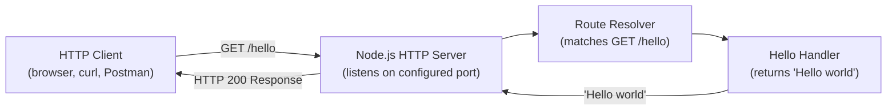

| Component | Responsibility |
|-----------|----------------|
| Node.js HTTP Server | Binds to a TCP port and accepts inbound HTTP connections |
| Route Resolver | Dispatches the `/hello` path to its designated handler |
| Hello Handler | Produces the `"Hello world"` response payload |

#### 1.2.2.3 Core Technical Approach

The project follows these technical principles:

- **Tutorial-Grade Simplicity**: One file or a very small number of files; one endpoint; one response.
- **Node.js Runtime**: Execution on the Node.js JavaScript runtime, suitable for any modern LTS version of Node.
- **Stateless Handling**: No session state, no persistence, no in-memory caches.
- **Deterministic Response**: The endpoint always returns the same response body for any valid request.

### 1.2.3 Success Criteria

#### 1.2.3.1 Measurable Objectives

| Objective | Acceptance Test |
|-----------|-----------------|
| Server starts successfully | The Node.js process binds to its configured port without errors |
| `/hello` endpoint exists | A `GET` request to `/hello` is matched and handled |
| Correct response body | The response body contains `"Hello world"` |
| HTTP client compatibility | The response is consumable by any standard HTTP client |

#### 1.2.3.2 Critical Success Factors

The project will be considered successful when **all** of the following hold simultaneously:

1. The Node.js server can be started using a documented, reproducible command.
2. An HTTP client issuing `GET /hello` receives `"Hello world"` in the response body.
3. The implementation is sufficiently clear to serve as a tutorial reference.

#### 1.2.3.3 Key Performance Indicators (KPIs)

No quantitative KPIs (latency targets, throughput targets, uptime SLAs, error budgets, or cost benchmarks) are defined for this tutorial project. Performance, scalability, and reliability characteristics will reflect the defaults of the chosen Node.js HTTP implementation and are not the subject of formal measurement in this specification.

---

## 1.3 SCOPE

### 1.3.1 In-Scope Elements

#### 1.3.1.1 Core Features and Functionalities

| Feature | In-Scope Specification |
|---------|------------------------|
| HTTP Endpoint | A single endpoint at path `/hello` |
| HTTP Method | `GET` (the canonical method for retrieval) |
| Response Body | The literal text `"Hello world"` |
| HTTP Status | A successful response status (HTTP 200) |

#### 1.3.1.2 Primary User Workflow

The complete user workflow for this system is the following three-step interaction:

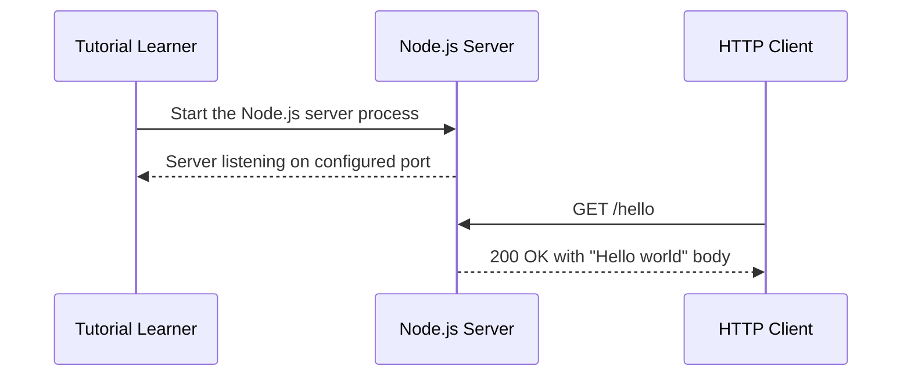

#### 1.3.1.3 Implementation Boundaries

| Boundary Dimension | In-Scope Definition |
|--------------------|--------------------|
| System Boundary | A single Node.js process exposing one HTTP endpoint |
| User Groups | Tutorial learners and ad-hoc HTTP clients |
| Geographic / Market Coverage | Local execution; no distribution or hosting requirement |
| Data Domains | None; the system holds no data |

#### 1.3.1.4 Essential Technical Requirements

The only essential technical requirements are:

1. The implementation must execute on the Node.js runtime.
2. The implementation must expose exactly one route at `/hello`.
3. The response to that route must contain the text `"Hello world"`.

### 1.3.2 Out-of-Scope Elements

The following capabilities and concerns are **explicitly excluded** from the project scope. They are documented here both to set clear expectations and to prevent unintended scope creep from features that exist in the prior Flask scaffold but are not required by the new tutorial request.

#### 1.3.2.1 Explicitly Excluded Capabilities

| Capability | Exclusion Rationale |
|------------|---------------------|
| Authentication / Authorization | Not requested; not required for a tutorial greeting endpoint |
| Database / Persistence | The endpoint returns a literal string; no data store is needed |
| Multiple Endpoints | Only `/hello` was requested |
| CORS Handling | Not requested; cross-origin behavior is unspecified |
| Input Validation Schemas | The endpoint accepts no input parameters |
| Production Deployment Automation | Tutorial scope; no deployment target was specified |
| CI/CD Pipelines | Not requested |
| Multi-Environment Configuration | No dev/staging/prod separation was requested |
| Logging Infrastructure | Beyond minimal defaults, no logging system is required |
| Health Check Endpoints | The prior `/health` endpoint is not in the new request |

#### 1.3.2.2 Features Present in Prior Scaffold but Out of Scope

The following features exist in the prior Flask scaffold (Artifact4) and are **not** to be ported, preserved, or replicated in the new tutorial:

| Existing Flask Feature | File Reference | Status in New Project |
|------------------------|----------------|----------------------|
| Application factory pattern | `app/__init__.py` | Not required |
| Environment-driven configuration | `app/config.py` | Not required |
| Request ID / correlation middleware | `app/middleware.py` | Not required |
| Centralized JSON error handlers | `app/errors.py` | Not required |
| WSGI production server (gunicorn) | `Procfile`, `wsgi.py` | Not applicable to Node.js |
| pytest regression suite | `tests/` | Not requested |
| `GET /health` endpoint | `app/api/routes.py` | Not requested |

#### 1.3.2.3 Future Phase Considerations

The following items are **not part of the current request** but could be considered in hypothetical future phases. They are listed here purely to acknowledge their absence, not to commit to their inclusion:

- Addition of further endpoints (e.g., `/goodbye`, `/echo`, parameterized routes)
- Introduction of a routing framework (e.g., Express, Fastify, Koa)
- Adoption of a testing framework (e.g., Jest, Mocha, node:test)
- Containerization (e.g., Dockerfile)
- Migration of the prior Flask scaffold features into Node.js
- Production hosting, observability, or operational tooling

#### 1.3.2.4 Unsupported Use Cases

| Unsupported Use Case | Reason |
|----------------------|--------|
| Issuing requests to any path other than `/hello` | Only `/hello` is defined |
| Submitting POST/PUT/DELETE to `/hello` | Only `GET` semantics are specified |
| Expecting JSON or structured response | Response is plain text `"Hello world"` |
| Relying on the system for any business workflow | The system has no business logic |

---

#### References

**Repository Files Examined**

- `README.md` — Source of the prior Artifact4 project description, including the Python 3 / Flask reimplementation narrative and the Node.js → Python migration mapping table used to frame the technology pivot.
- `requirements.txt` — Pinned Python dependencies (Flask 3.1.3, python-dotenv 1.2.2, gunicorn 26.0.0, Werkzeug 3.1.8) used to characterize the prior tech stack that is being superseded.
- `pyproject.toml` — Test and lint tooling configuration for the prior Flask scaffold; used as evidence of prior tooling now out of scope.
- `.env.example` — Environment variable template for the prior scaffold (FLASK_APP, APP_CONFIG, SECRET_KEY, PORT, LOG_LEVEL); used as evidence of prior configuration complexity not required by the new tutorial.
- `Procfile` — Prior `gunicorn wsgi:app` production command; cited as out-of-scope production deployment tooling.
- `wsgi.py` — Prior WSGI entrypoint; cited as superseded by the Node.js runtime.
- `app/__init__.py` — Prior Flask application factory; cited as a feature explicitly out of scope.
- `app/config.py` — Prior Base/Development/Production/Testing configuration classes; cited as out-of-scope environment-driven configuration.
- `app/api/routes.py` — Prior `GET /health` endpoint returning `{"status":"ok"}`; cited as the predecessor endpoint that is being replaced by `GET /hello`.
- `app/middleware.py` — Prior X-Request-ID correlation and response timing middleware; cited as a feature explicitly out of scope.
- `app/errors.py` — Prior centralized JSON error handlers (400/404/405/500); cited as out-of-scope error handling complexity.
- `tests/test_api.py` — Prior pytest regression suite covering health, errors, and middleware; cited as out-of-scope testing scope.

**Repository Folders Explored**

- `/` (repository root) — Used to enumerate all top-level files and folders contributing to the prior project state.
- `app/` — Prior Flask application package; surveyed to identify capabilities now out of scope.
- `app/api/` — Prior API blueprint package; surveyed to identify the predecessor endpoint.
- `tests/` — Prior pytest regression suite; surveyed to identify testing-related out-of-scope items.
- `blitzy/` — Documentation hub; surveyed for historical context.
- `blitzy/documentation/` — Source of `Project Guide.md` and `Agent Action Plan.md`, which document the historical Node.js → Flask port intent that this specification supersedes.

**Documentation Artifacts Referenced**

- `blitzy/documentation/Project Guide.md` — Authoritative status guide for the prior port effort; referenced as historical context for the project pivot.
- `blitzy/documentation/Agent Action Plan.md` — Section 0.1 of this file documents the original Node.js → Flask port intent and explicitly notes that the original Node.js source was never supplied to the repository; referenced to substantiate the rationale for the new greenfield Node.js tutorial scope.

# 2. Product Requirements

## 2.1 FEATURE CATALOG

The product scope contains exactly one in-scope feature. This catalog documents that feature with full metadata, descriptive context, and dependency analysis. No additional features are inferred or invented; per Section 1.3.1.4, the essential technical requirements are limited to a single Node.js process exposing exactly one route at `/hello` returning the text `"Hello world"`.

### 2.1.1 F-001: Hello World HTTP Endpoint

#### 2.1.1.1 Feature Metadata

| Attribute | Value |
|-----------|-------|
| Unique ID | F-001 |
| Feature Name | Hello World HTTP Endpoint |
| Feature Category | HTTP API Endpoint |
| Priority Level | Critical |
| Status | Proposed |

The Critical priority designation reflects that F-001 constitutes the entirety of the product; no other features exist within scope. The Proposed status reflects the greenfield nature of the Node.js implementation: per the Section 1.1.1 transition narrative, the new state replaces the prior Flask `GET /health` endpoint with a Node.js `GET /hello` endpoint, and no Node.js source code currently exists in the repository.

#### 2.1.1.2 Description

#### Overview

F-001 implements a single Node.js HTTP server that exposes a single route, `GET /hello`, which returns the literal plain-text response `"Hello world"` with HTTP status `200` to any standard HTTP client. The implementation follows the component flow documented in Section 1.2.2.2, in which the HTTP Client issues `GET /hello` to the Node.js HTTP Server, the Route Resolver dispatches the path to the Hello Handler, and the Handler produces the response payload that the Server returns to the Client.

#### Business Value

The business value of F-001 is exclusively **pedagogical and architectural**, not commercial. As stated in Section 1.1.2, the project addresses a pedagogical problem rather than an enterprise business problem; there are no production users, no transactional workflows, no persistence concerns, and no integration partners defined in scope. Section 1.1.4 further enumerates the value proposition: a reference implementation, a foundation for extension, and conceptual clarity that strips the Node.js HTTP server concept to its minimum essential elements.

#### User Benefits

The benefit profile is defined for two consumer roles identified in Section 1.1.3:

| Consumer Role | Benefit Delivered by F-001 |
|---------------|----------------------------|
| Tutorial Learners | A runnable, inspectable, minimum-viable Node.js HTTP server example |
| HTTP Clients (curl, browser, Postman) | A deterministic endpoint that reliably returns `"Hello world"` on every valid request |
| Project Author | A reproducible reference example demonstrating Node.js HTTP fundamentals |

#### Technical Context

F-001 is implemented as a single Node.js process following the Core Technical Approach defined in Section 1.2.2.3:

- **Tutorial-Grade Simplicity**: One file or a very small number of files; one endpoint; one response.
- **Node.js Runtime**: Execution on the Node.js JavaScript runtime, suitable for any modern LTS version of Node.
- **Stateless Handling**: No session state, no persistence, no in-memory caches.
- **Deterministic Response**: The endpoint always returns the same response body for any valid request.

The feature deliberately does not adopt any routing framework, testing framework, containerization, or production hosting concerns; per Section 1.3.2.3 these are explicitly acknowledged as out of scope.

#### 2.1.1.3 Dependencies

#### Prerequisite Features

None. F-001 is the only feature in the product scope. There are no inter-feature dependencies to satisfy.

#### System Dependencies

| Dependency | Specification |
|------------|---------------|
| Node.js Runtime | Any modern LTS version of Node.js (per Section 1.2.2.3) |
| TCP/IP Network Stack | Required to bind to a configured port and accept inbound HTTP connections |
| Local Execution Environment | The system is intended to be run locally by the tutorial learner (per Section 1.2.1.3) |

#### External Dependencies

None. As explicitly stated in Section 1.2.1.3, no enterprise systems, third-party APIs, identity providers, databases, message brokers, or downstream services integrate with this project. The system stands alone.

#### Integration Requirements

F-001 must remain compatible with standard HTTP clients. Per Section 1.2.3.1, the response must be consumable by any standard HTTP client (browser, curl, Postman). No bespoke client libraries, SDKs, or proprietary protocol extensions are required.

---

## 2.2 FUNCTIONAL REQUIREMENTS TABLE

F-001 decomposes into six discrete, testable functional requirements derived directly from the Measurable Objectives in Section 1.2.3.1 and the Essential Technical Requirements in Section 1.3.1.4. Each requirement is independently verifiable.

### 2.2.1 F-001 Functional Requirements Overview

| Requirement ID | Description | Priority | Complexity |
|----------------|-------------|----------|------------|
| F-001-RQ-001 | Server process binds to configured port without errors | Must-Have | Low |
| F-001-RQ-002 | `/hello` path is matched and routed to its handler | Must-Have | Low |
| F-001-RQ-003 | Response body contains the literal text `"Hello world"` | Must-Have | Low |
| F-001-RQ-004 | Response is consumable by any standard HTTP client | Must-Have | Low |
| F-001-RQ-005 | HTTP `200` status code is returned on successful request | Must-Have | Low |
| F-001-RQ-006 | Implementation executes on the Node.js runtime | Must-Have | Low |

### 2.2.2 Detailed Requirement Specifications

#### 2.2.2.1 F-001-RQ-001: Server Process Binding

| Field | Value |
|-------|-------|
| Requirement ID | F-001-RQ-001 |
| Description | The Node.js server process binds to the configured port and accepts inbound HTTP connections |
| Priority | Must-Have |
| Complexity | Low |

**Acceptance Criteria**: The Node.js process binds to its configured port without errors, as defined in the Measurable Objectives table of Section 1.2.3.1.

**Technical Specifications**:

| Specification | Value |
|---------------|-------|
| Input Parameters | None at the request level; port configuration internal to implementation |
| Output / Response | Process listens on the configured TCP port |
| Performance Criteria | Not defined — per Section 1.2.3.3, no quantitative KPIs apply |
| Data Requirements | None |

**Validation Rules**:

| Rule Category | Rule |
|---------------|------|
| Business Rules | Server must be startable via a documented, reproducible command (Section 1.2.3.2) |
| Data Validation | Not applicable — no data is processed |
| Security Requirements | None defined in scope — per Section 1.3.2.1, authentication and authorization are explicitly excluded |
| Compliance Requirements | None defined |

#### 2.2.2.2 F-001-RQ-002: Route Matching for `/hello`

| Field | Value |
|-------|-------|
| Requirement ID | F-001-RQ-002 |
| Description | A `GET` request to the `/hello` path is matched and dispatched to its designated handler |
| Priority | Must-Have |
| Complexity | Low |

**Acceptance Criteria**: A `GET` request to `/hello` is matched and handled, as stated in Section 1.2.3.1. Only `GET /hello` is supported; per Section 1.3.2.4, requests to any path other than `/hello` and any non-GET method on `/hello` constitute unsupported use cases.

**Technical Specifications**:

| Specification | Value |
|---------------|-------|
| Input Parameters | HTTP request with method `GET` and path `/hello`; no body, no query parameters |
| Output / Response | Dispatch to the Hello Handler component (per Section 1.2.2.2) |
| Performance Criteria | Not defined — per Section 1.2.3.3, no latency or throughput targets apply |
| Data Requirements | None |

**Validation Rules**:

| Rule Category | Rule |
|---------------|------|
| Business Rules | Only the `/hello` path is defined; only the `GET` method is supported |
| Data Validation | Not applicable — per Section 1.3.2.1, the endpoint accepts no input parameters and no input validation schemas are in scope |
| Security Requirements | None defined in scope |
| Compliance Requirements | None defined |

#### 2.2.2.3 F-001-RQ-003: Response Body

| Field | Value |
|-------|-------|
| Requirement ID | F-001-RQ-003 |
| Description | The response body contains the literal plain-text string `"Hello world"` |
| Priority | Must-Have |
| Complexity | Low |

**Acceptance Criteria**: The response body contains `"Hello world"`, as defined in both Section 1.2.3.1 (Measurable Objectives) and Section 1.3.1.1 (Core Features and Functionalities).

**Technical Specifications**:

| Specification | Value |
|---------------|-------|
| Input Parameters | None |
| Output / Response | Plain-text body `"Hello world"` |
| Performance Criteria | Not defined — per Section 1.2.3.3 |
| Data Requirements | None — the response payload is a hard-coded literal string |

**Validation Rules**:

| Rule Category | Rule |
|---------------|------|
| Business Rules | The response must be deterministic — the same body is returned for every valid request (per Section 1.2.2.3) |
| Data Validation | Response is a plain-text literal; per Section 1.3.2.4, expecting a JSON or otherwise structured response is an unsupported use case |
| Security Requirements | None defined in scope |
| Compliance Requirements | None defined |

#### 2.2.2.4 F-001-RQ-004: HTTP Client Compatibility

| Field | Value |
|-------|-------|
| Requirement ID | F-001-RQ-004 |
| Description | The response is consumable by any standard HTTP client |
| Priority | Must-Have |
| Complexity | Low |

**Acceptance Criteria**: The response is consumable by any standard HTTP client (browser, curl, Postman), as required by Section 1.2.3.1.

**Technical Specifications**:

| Specification | Value |
|---------------|-------|
| Input Parameters | Standard HTTP/1.1 request from any compliant user agent |
| Output / Response | A well-formed HTTP response with body and status that conforming clients can parse |
| Performance Criteria | Not defined — per Section 1.2.3.3 |
| Data Requirements | None |

**Validation Rules**:

| Rule Category | Rule |
|---------------|------|
| Business Rules | No proprietary protocol extensions; behavior must match HTTP semantics expected by general-purpose clients |
| Data Validation | Not applicable |
| Security Requirements | None defined in scope — per Section 1.3.2.1, CORS handling is explicitly excluded |
| Compliance Requirements | None defined |

#### 2.2.2.5 F-001-RQ-005: HTTP Status Code

| Field | Value |
|-------|-------|
| Requirement ID | F-001-RQ-005 |
| Description | A successful response returns HTTP status code `200` |
| Priority | Must-Have |
| Complexity | Low |

**Acceptance Criteria**: Per Section 1.3.1.1, a successful response status (HTTP 200) is returned for `GET /hello`. The Section 1.3.1.2 sequence diagram confirms the workflow returns `200 OK with "Hello world" body`.

**Technical Specifications**:

| Specification | Value |
|---------------|-------|
| Input Parameters | None at the response level |
| Output / Response | HTTP status line indicating `200` |
| Performance Criteria | Not defined — per Section 1.2.3.3 |
| Data Requirements | None |

**Validation Rules**:

| Rule Category | Rule |
|---------------|------|
| Business Rules | Status code must indicate success for valid `GET /hello` requests |
| Data Validation | Not applicable |
| Security Requirements | None defined in scope |
| Compliance Requirements | Conformance with HTTP semantics for success responses |

#### 2.2.2.6 F-001-RQ-006: Node.js Runtime Execution

| Field | Value |
|-------|-------|
| Requirement ID | F-001-RQ-006 |
| Description | The implementation executes on the Node.js JavaScript runtime |
| Priority | Must-Have |
| Complexity | Low |

**Acceptance Criteria**: Per Section 1.3.1.4 (Essential Technical Requirements), the implementation must execute on the Node.js runtime. Per Section 1.2.2.3, any modern LTS version of Node.js is acceptable.

**Technical Specifications**:

| Specification | Value |
|---------------|-------|
| Input Parameters | Not applicable at the runtime level |
| Output / Response | Process executable via the Node.js interpreter |
| Performance Criteria | Inherits the defaults of the chosen Node.js HTTP implementation, per Section 1.2.3.3 |
| Data Requirements | None |

**Validation Rules**:

| Rule Category | Rule |
|---------------|------|
| Business Rules | The runtime is Node.js exclusively; the prior Python 3 / Flask runtime (Artifact4) is superseded per Section 1.1.1 |
| Data Validation | Not applicable |
| Security Requirements | None defined in scope |
| Compliance Requirements | None defined |

---

## 2.3 FEATURE RELATIONSHIPS

Because the product scope contains exactly one feature, there are no inter-feature dependencies, no feature integration points internal to the product, and no shared product-level services to enumerate. The relationship surface that does exist is between F-001 and its external system dependencies and consumers.

### 2.3.1 Feature Dependency Map

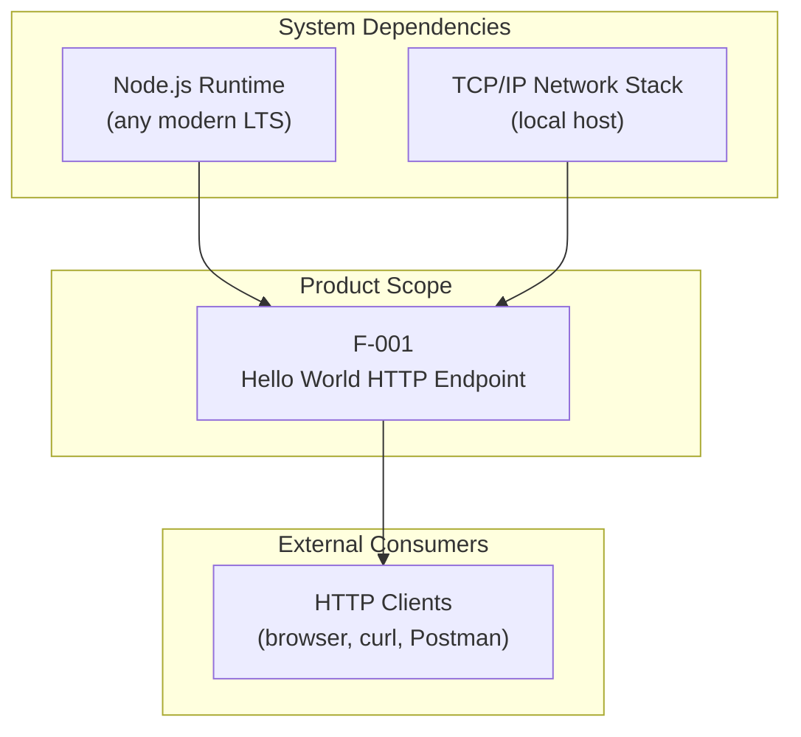

### 2.3.2 Integration Points

The only integration point exposed by F-001 is a single HTTP interface, as depicted in the component flow of Section 1.2.2.2. The Client-Server-Router-Handler chain is internal to F-001 and does not constitute integration with any external system.

| Integration Point | Direction | Protocol | Counterparty |
|-------------------|-----------|----------|--------------|
| `GET /hello` | Inbound to F-001 | HTTP/1.1 | Any standard HTTP client |
| HTTP 200 response with `"Hello world"` body | Outbound from F-001 | HTTP/1.1 | The requesting HTTP client |

### 2.3.3 Shared Components

F-001 is decomposed into three internal logical components per Section 1.2.2.2. Because no other features exist, these components are not "shared" across features — they are dedicated to F-001 in their entirety.

| Component | Responsibility |
|-----------|----------------|
| Node.js HTTP Server | Binds to a TCP port and accepts inbound HTTP connections |
| Route Resolver | Dispatches the `/hello` path to its designated handler |
| Hello Handler | Produces the `"Hello world"` response payload |

### 2.3.4 Common Services

None. Per Section 1.2.1.3, the system is fully self-contained. There are no common services such as authentication providers, configuration services, logging infrastructure, or persistence layers; per Section 1.3.2.1 each of those categories is explicitly excluded from scope.

---

## 2.4 IMPLEMENTATION CONSIDERATIONS

The following considerations apply to F-001. They are derived strictly from the technical constraints and exclusions documented in Sections 1.2 and 1.3; no implementation considerations are invented beyond what the specification supports.

### 2.4.1 Technical Constraints

Per Section 1.3.1.4, three essential technical requirements bound the implementation:

| Constraint | Source |
|------------|--------|
| Must execute on the Node.js runtime | Section 1.3.1.4 |
| Must expose exactly one route at `/hello` | Section 1.3.1.4 |
| Response must contain the text `"Hello world"` | Section 1.3.1.4 |

Additionally, the Core Technical Approach (Section 1.2.2.3) imposes the structural constraints of tutorial-grade simplicity, statelessness, and deterministic response behavior.

### 2.4.2 Performance Requirements

No quantitative performance requirements apply. Section 1.2.3.3 explicitly states that no latency targets, throughput targets, uptime SLAs, error budgets, or cost benchmarks are defined for this tutorial project. Performance characteristics will reflect the defaults of the chosen Node.js HTTP implementation. This documentation does not introduce any performance numbers, since none are sanctioned by the specification.

### 2.4.3 Scalability Considerations

No scalability requirements apply. F-001 is a single-process tutorial. Per Section 1.3.1.3, the system boundary is a single Node.js process exposing one HTTP endpoint, with local execution as the only deployment target. Horizontal scaling, clustering, load balancing, and process management are out of scope.

### 2.4.4 Security Implications

The security posture of F-001 is intentionally minimal because the threat surface is minimal:

| Security Concern | Status in F-001 |
|------------------|-----------------|
| Authentication / Authorization | Explicitly excluded (Section 1.3.2.1) |
| Input Validation | Not applicable — the endpoint accepts no input parameters (Section 1.3.2.1) |
| CORS Handling | Explicitly excluded (Section 1.3.2.1) |
| Data Persistence Risks | None — no data store is used (Section 1.3.2.1) |
| Transport Security (TLS) | Not defined in scope; the system is intended for local execution (Section 1.2.1.3) |

### 2.4.5 Maintenance Requirements

Maintenance considerations align with the educational purpose described in Section 1.1.4. F-001 must remain a reference implementation — a known-good baseline that learners can run, inspect, and extend. Maintainability is therefore expressed as clarity and conceptual minimalism rather than as a set of operational maintenance tasks. There is no logging infrastructure, no health check endpoint, no CI/CD pipeline, no multi-environment configuration, and no production deployment automation, since each is explicitly excluded from scope by Section 1.3.2.1.

---

## 2.5 TRACEABILITY MATRIX

The matrix below traces each functional requirement to the specification source that authorizes it and to the acceptance test that verifies it. This satisfies the requirement-traceability obligation set out in the section prompt and aligns each requirement with the success criteria of Section 1.2.3.

### 2.5.1 Requirements-to-Specification Traceability

| Requirement ID | Specification Source | Acceptance Test Source |
|----------------|----------------------|------------------------|
| F-001-RQ-001 | Section 1.2.3.1 | Section 1.2.3.1 — server binds to port without errors |
| F-001-RQ-002 | Section 1.2.3.1, 1.3.1.1 | Section 1.2.3.1 — `GET /hello` matched and handled |
| F-001-RQ-003 | Section 1.2.3.1, 1.3.1.1 | Section 1.2.3.1 — response body contains `"Hello world"` |
| F-001-RQ-004 | Section 1.2.3.1 | Section 1.2.3.1 — response consumable by standard HTTP clients |
| F-001-RQ-005 | Section 1.3.1.1, 1.3.1.2 | Section 1.3.1.2 sequence diagram — `200 OK with "Hello world" body` |
| F-001-RQ-006 | Section 1.3.1.4, 1.2.2.3 | Implementation invocable via documented Node.js command (Section 1.2.3.2) |

### 2.5.2 Requirements-to-Success-Criteria Traceability

The three Critical Success Factors from Section 1.2.3.2 must hold simultaneously; the table below identifies which functional requirements support each.

| Critical Success Factor (Section 1.2.3.2) | Supporting Requirements |
|-------------------------------------------|--------------------------|
| Server can be started via a documented, reproducible command | F-001-RQ-001, F-001-RQ-006 |
| HTTP client issuing `GET /hello` receives `"Hello world"` | F-001-RQ-002, F-001-RQ-003, F-001-RQ-004, F-001-RQ-005 |
| Implementation is sufficiently clear to serve as a tutorial reference | F-001-RQ-006 (combined with Section 1.2.2.3 simplicity principles) |

### 2.5.3 Related Process Flows and Diagrams

The following diagrams in Section 1 visually substantiate F-001's behavior and are the canonical references for its end-to-end flow:

| Diagram | Location | Purpose |
|---------|----------|---------|
| Component flow (Client → Server → Router → Handler) | Section 1.2.2.2 | Shows the internal component decomposition of F-001 |
| Primary user workflow sequence diagram | Section 1.3.1.2 | Shows the three-step interaction (start server, send `GET /hello`, receive `200 OK`) |

---

## 2.6 ASSUMPTIONS AND CONSTRAINTS

### 2.6.1 Assumptions

| ID | Assumption | Source |
|----|------------|--------|
| A-001 | The execution environment provides any modern LTS version of Node.js | Section 1.2.2.3 |
| A-002 | The tutorial learner executes the system locally, not via any hosted platform | Section 1.2.1.3, 1.3.1.3 |
| A-003 | HTTP clients used to exercise the endpoint conform to standard HTTP semantics | Section 1.2.3.1 |
| A-004 | The prior Python 3 / Flask scaffold (Artifact4) is superseded and not to be ported | Section 1.1.1, 1.2.1.2, 1.3.2.2 |

### 2.6.2 Constraints

| ID | Constraint | Source |
|----|------------|--------|
| C-001 | Exactly one route, `/hello`, is permitted; additional endpoints are out of scope | Section 1.3.1.4, 1.3.2.1 |
| C-002 | Only the `GET` method is supported on `/hello`; POST/PUT/DELETE are unsupported | Section 1.3.2.4 |
| C-003 | Response is plain text `"Hello world"`; structured (e.g., JSON) responses are unsupported | Section 1.3.2.4 |
| C-004 | No authentication, authorization, CORS, persistence, input validation, logging infrastructure, CI/CD, or production deployment automation is in scope | Section 1.3.2.1 |
| C-005 | Features of the prior Flask scaffold (application factory, env-driven config, middleware, error handlers, WSGI server, pytest suite, `/health` endpoint) must not be ported or replicated | Section 1.3.2.2 |
| C-006 | Future-phase items (additional routes, routing frameworks, test frameworks, containerization, observability) are explicitly excluded from F-001 | Section 1.3.2.3 |

### 2.6.3 Requirement Versioning

| Version | Date | Change Summary |
|---------|------|----------------|
| 1.0 | Initial Release | Initial publication of Section 2; six functional requirements (F-001-RQ-001 through F-001-RQ-006) authored against in-scope specifications in Sections 1.1, 1.2, and 1.3 |

---

## 2.7 References

### 2.7.1 Technical Specification Sections Referenced

- **Section 1.1 EXECUTIVE SUMMARY** — Source of Project Overview (1.1.1), Core Business Problem (1.1.2), Stakeholders and Users table (1.1.3), and Value Proposition (1.1.4) that frame F-001's identity, priority, and consumer roles.
- **Section 1.2 SYSTEM OVERVIEW** — Source of System Capabilities (1.2.2.1), Major System Components diagram and table (1.2.2.2), Core Technical Approach (1.2.2.3), Measurable Objectives (1.2.3.1), Critical Success Factors (1.2.3.2), and the explicit no-KPI declaration (1.2.3.3) that govern F-001's implementation considerations.
- **Section 1.3 SCOPE** — Source of Core Features and Functionalities (1.3.1.1), Primary User Workflow sequence diagram (1.3.1.2), Implementation Boundaries (1.3.1.3), Essential Technical Requirements (1.3.1.4), Explicitly Excluded Capabilities (1.3.2.1), Prior-Scaffold Features Out of Scope (1.3.2.2), Future Phase Considerations (1.3.2.3), and Unsupported Use Cases (1.3.2.4) that define F-001's boundaries and exclusions.

### 2.7.2 Repository Files Referenced (Historical Context)

- `README.md` — Documents the prior Artifact4 Flask scaffold, the historical Node.js → Python migration mapping, and confirms the prior state being superseded by the new Node.js tutorial.
- `app/api/routes.py` — Documents the prior `GET /health` endpoint pattern returning `{"status":"ok"}`; cited as the predecessor that is replaced by F-001's `GET /hello`.
- `app/api/__init__.py` — Documents the prior Blueprint registration pattern; cited as a boundary not carried forward.
- `.env.example` — Documents the prior Flask environment-driven configuration; cited as evidence of complexity not required by F-001.
- `Procfile` — Documents the prior production gunicorn command; cited as out-of-scope production deployment tooling not applicable to F-001.

### 2.7.3 Repository Folders Referenced (Historical Context)

- `/` (repository root) — Surveyed to confirm absence of Node.js artifacts (no `package.json`, no `.js` source files), substantiating F-001's greenfield Proposed status.
- `app/` — Surveyed to identify prior Flask capabilities now out of scope.
- `app/api/` — Surveyed to identify the predecessor `/health` endpoint.
- `tests/` — Surveyed to identify the prior pytest regression suite, which is out of scope.
- `blitzy/documentation/` — Surveyed for historical context on the prior port effort.

# 3. Technology Stack

## 3.1 Technology Stack Philosophy

The technology stack for this project is governed by a single dominant principle: **tutorial-grade minimalism**. Per the Core Technical Approach defined in Section 1.2.2.3, the system is composed of "one file or a very small number of files; one endpoint; one response." Every technology selection — and, more importantly, every technology *exclusion* — derives directly from this principle and from the explicit scope boundaries declared in Section 1.3.

This section is therefore organized as a deliberate, evidence-based catalog of:

1. The minimum set of technologies that **are** required to satisfy the in-scope requirements (F-001-RQ-001 through F-001-RQ-006).
2. The exhaustive set of technologies that **are not** in scope, with citation to the specific constraint or exclusion that eliminates each.

### 3.1.1 Guiding Principles

The following principles, derived from Sections 1.2.2.3 and 2.1.1.2, govern every technology decision in this stack:

| Principle | Specification Source | Implication for Technology Stack |
|-----------|----------------------|----------------------------------|
| Tutorial-Grade Simplicity | Section 1.2.2.3 | Minimum number of files; no build steps; no compilation |
| Node.js Runtime | Section 1.2.2.3, A-001 | JavaScript is the only language; no other runtimes |
| Stateless Handling | Section 1.2.2.3 | No databases, caches, sessions, or persistence layers |
| Deterministic Response | Section 1.2.2.3 | No templating engines; no dynamic content systems |
| Standard Library First | Section 1.3.2.3, C-006 | No third-party frameworks (Express, Fastify, Koa) |
| Local Execution Only | Section 1.2.1.3, A-002 | No cloud services, no containers, no orchestration |

### 3.1.2 Scope Boundary Acknowledgement

The default technology stack supplied to this project (AWS, Docker, Terraform, GitHub Actions, Python, Flask, Auth0, MongoDB, Langchain, React, TailwindCSS, React-Native, Swift, Kotlin, Objective-C, ElectronJS) is **not applicable** to this system. The user request — *"Can you create a Node.js tutorial project that features one endpoint '/hello' that returns 'Hello world' to the calling HTTP client?"* — combined with the explicit out-of-scope catalog in Section 1.3.2 eliminates every item in that default stack except the implicit selection of JavaScript on Node.js as the language and runtime.

The explicit applicability analysis is consolidated in Section 3.8 below.

---

## 3.2 Programming Languages

### 3.2.1 Primary Language: JavaScript on Node.js

JavaScript executing on the Node.js runtime is the **sole programming language** in scope for this project. This selection is mandated by:

- **F-001-RQ-006** (Section 2.2.2.6): The implementation executes on the Node.js JavaScript runtime.
- **Section 1.3.1.4** (Essential Technical Requirements): "The implementation must execute on the Node.js runtime."
- **Section 1.2.2.3** (Core Technical Approach): "Execution on the Node.js JavaScript runtime, suitable for any modern LTS version of Node."
- **User Request**: The tutorial is explicitly framed as a Node.js tutorial project.

| Attribute | Specification |
|-----------|---------------|
| Language | JavaScript (ECMAScript) |
| Runtime | Node.js |
| Module System | CommonJS or ECMAScript Modules (unspecified; implementer's choice consistent with tutorial readability) |
| Compilation Step | None — JavaScript is executed directly by the Node.js runtime |
| Transpilation Step | None — no TypeScript, Babel, or other transpilation in scope |

### 3.2.2 Version Requirements

| Component | Required Version | Source |
|-----------|------------------|--------|
| Node.js | Any modern LTS version | Section 1.2.2.3, Assumption A-001 (Section 2.6.1) |
| JavaScript | Any ECMAScript revision supported by the chosen LTS Node.js | Implicit from Node.js LTS support matrix |

The specification deliberately refrains from mandating a specific Node.js major version, minor version, or patch version. Assumption **A-001** (Section 2.6.1) states only that "the execution environment provides any modern LTS version of Node.js." This latitude is consistent with the tutorial-grade simplicity principle and ensures the example remains relevant across multiple Node.js LTS release cycles.

The development host on which this specification is being authored has been verified to provide Node.js v22.22.2 and npm 11.1.0; this represents one acceptable LTS environment but is not a normative version requirement.

### 3.2.3 Selection Justification

| Selection Criterion | How JavaScript on Node.js Satisfies It |
|---------------------|----------------------------------------|
| Matches the user request | The user explicitly requested a Node.js tutorial project |
| Standard library coverage | Node.js ships a built-in `http` module sufficient for the entire feature (see Section 3.3) |
| Zero installation overhead beyond the runtime | No package managers or third-party dependencies required (see Section 3.4) |
| Pedagogical clarity | JavaScript HTTP servers are a canonical "starter" example, supporting the project's pedagogical positioning (Section 1.2.1.1) |
| Cross-platform local execution | Node.js runs on the major operating systems used by tutorial learners (per Section 1.2.1.3, A-002) |

### 3.2.4 Excluded Languages and Runtimes

| Excluded Language/Runtime | Exclusion Source | Justification |
|---------------------------|------------------|---------------|
| Python 3 | Section 1.1.1 (Repository Transition Context); A-004 (Section 2.6.1) | The prior Python 3 / Flask scaffold (Artifact4) is superseded; per A-004 it "is superseded and not to be ported" |
| TypeScript | Section 1.3.2.3, C-006 | Adding a TypeScript compilation step is inconsistent with tutorial-grade simplicity; no such requirement appears in F-001 |
| Swift, Kotlin, Objective-C | Section 1.3.1.3 | No native mobile or desktop applications are in scope; only an HTTP endpoint |
| Languages requiring a separate compilation step (Go, Rust, Java, C#) | Section 1.2.2.3 | Tutorial-grade simplicity precludes introducing a build toolchain |

---

## 3.3 Frameworks & Libraries

### 3.3.1 Runtime: Node.js

| Attribute | Specification |
|-----------|---------------|
| Runtime Name | Node.js |
| Version Constraint | Any modern LTS version (per A-001) |
| Role in Stack | Provides the JavaScript execution engine, the event loop, the TCP/IP socket abstractions, and the built-in `http` module |
| Source | Official Node.js distribution (nodejs.org) installed on the learner's local environment |

### 3.3.2 HTTP Server Library: Node.js Built-in `http` Module

The implementation is expected to use the Node.js standard library `http` module to satisfy the in-scope requirements. No third-party HTTP framework is required, and per Section 1.3.2.3 and Constraint C-006, none is permitted within F-001.

| Built-in Capability | Requirement Satisfied |
|---------------------|----------------------|
| `http.createServer()` | F-001-RQ-002 — HTTP server creation and binding |
| Request URL inspection (`req.url`) | F-001-RQ-003 — Route matching for `/hello` |
| Method inspection (`req.method`) | F-001-RQ-001 / C-002 — Restriction to GET semantics |
| Response writing (`res.writeHead`, `res.end`) | F-001-RQ-004, F-001-RQ-005 — Status 200 and `"Hello world"` body |

The Node.js standard library `http` module is shipped with the Node.js runtime itself; it incurs no separate installation, no npm registry interaction, and no version pinning.

### 3.3.3 Excluded Frameworks

Per **Section 1.3.2.3** (Future Phase Considerations) and **Constraint C-006** (Section 2.6.2), the following frameworks are **explicitly excluded** from the current scope:

| Excluded Framework | Category | Exclusion Source |
|--------------------|----------|------------------|
| Express | Node.js routing framework | Section 1.3.2.3; C-006 |
| Fastify | Node.js routing framework | Section 1.3.2.3; C-006 |
| Koa | Node.js routing framework | Section 1.3.2.3; C-006 |
| Hapi, Restify, NestJS | Node.js routing frameworks | Implied by the general routing-framework exclusion in Section 1.3.2.3 |
| Jest, Mocha, node:test | Testing frameworks | Section 1.3.2.3; C-006 |
| Flask (Python) | Web framework | A-004 (Section 2.6.1); C-005 |

Section 2.1.1.2 (Technical Context) makes the exclusion authoritative: "The feature deliberately does not adopt any routing framework, testing framework, containerization, or production hosting concerns; per Section 1.3.2.3 these are explicitly acknowledged as out of scope."

### 3.3.4 Compatibility Requirements

The HTTP server constructed from the `http` module must produce responses consumable by any standard HTTP client, as mandated by Section 1.2.3.1 and the F-001 Integration Requirements (Section 2.1.1.3). This compatibility is achieved by default with the built-in module because it emits HTTP/1.1-conformant responses; no additional compatibility layer is required.

| Compatibility Target | Mechanism |
|----------------------|-----------|
| Standard browsers | HTTP/1.1 over TCP; default headers from `http` module |
| `curl` command-line client | HTTP/1.1 over TCP |
| Postman / Insomnia GUI clients | HTTP/1.1 over TCP |

---

## 3.4 Open Source Dependencies

### 3.4.1 Dependency Inventory

**There are zero open-source third-party dependencies in scope for this project.**

This is not an oversight: it is an architectural decision enforced by Section 2.1.1.3 (External Dependencies), which states unambiguously: *"None. As explicitly stated in Section 1.2.1.3, no enterprise systems, third-party APIs, identity providers, databases, message brokers, or downstream services integrate with this project. The system stands alone."*

| Dependency Category | Count | Notes |
|---------------------|-------|-------|
| Runtime dependencies (`dependencies`) | 0 | No production dependencies |
| Development dependencies (`devDependencies`) | 0 | No test/lint/build tooling in scope |
| Peer dependencies | 0 | Not applicable |
| Optional dependencies | 0 | Not applicable |
| Total npm packages required | **0** | |

### 3.4.2 Package Registry and Lockfile Status

Because the dependency count is zero, no package management artifacts are required:

| Artifact | Status | Rationale |
|----------|--------|-----------|
| `package.json` | Not required | No declared dependencies; no scripts mandated by F-001 |
| `package-lock.json` | Not required | No installed dependencies to lock |
| `node_modules/` directory | Not required | Nothing to install |
| `npm install` step | Not required | No registry interaction needed |
| npm registry account | Not required | No package publication in scope |
| Yarn / pnpm / Bun | Not applicable | Alternative package managers serve no purpose without dependencies |

Repository verification (per the section research report) confirms that no `package.json` file exists in the repository, no `.js` source files exist, and the prior repository (which contained the Python/Flask scaffold) never contained `package.json` either. This zero-dependency posture is therefore both the *intended* and the *current* state.

### 3.4.3 Rationale for Zero-Dependency Posture

| Rationale | Source |
|-----------|--------|
| Tutorial-grade simplicity precludes introducing a dependency graph | Section 1.2.2.3 |
| No external systems integrate with the project | Section 1.2.1.3 |
| Routing frameworks (the most common dependency category for Node.js HTTP work) are explicitly excluded | Section 1.3.2.3; C-006 |
| Testing frameworks are explicitly excluded | Section 1.3.2.3; C-006 |
| No persistence drivers required (no databases) | Section 1.3.2.1; C-004 |
| No auth libraries required (no authentication) | Section 1.3.2.1; C-004 |
| No logging libraries required (no logging infrastructure) | Section 1.3.2.1; C-004 |
| No serialization libraries required (response is plain text, not JSON) | C-003 (Section 2.6.2) |

A future-phase decision to introduce Express, Jest, or any other npm package would necessarily expand scope beyond F-001 and would require a corresponding revision to the specification (per the C-006 exclusion).

---

## 3.5 Third-Party Services

### 3.5.1 External Services Inventory

**There are zero external third-party services integrated with this system.**

The system, per Section 1.2.1.3, "stands alone and is intended to be run locally by the tutorial learner." No service integration exists; no API keys, secrets, service accounts, or credentials are required.

### 3.5.2 Excluded Service Categories

The following service categories are explicitly excluded by the specification:

| Service Category | Status | Exclusion Source |
|------------------|--------|------------------|
| External APIs | Excluded | Section 1.2.1.3 — no integration partners |
| Identity Providers / SSO (Auth0, Okta, AWS Cognito) | Excluded | Section 1.3.2.1 — "Authentication / Authorization: Not requested" |
| Authorization-as-a-Service | Excluded | Section 1.3.2.1; C-004 |
| Monitoring / APM (Datadog, New Relic, Sentry) | Excluded | Section 1.3.2.1 — "Logging Infrastructure: Beyond minimal defaults, no logging system is required" |
| Log aggregation (Splunk, ELK, Loki) | Excluded | Section 1.3.2.1; C-004 |
| Email / SMS / Notification services | Excluded | Not requested; no workflow requires them |
| Payment processing | Excluded | Section 1.1.2 — no transactional workflows |
| Message brokers (Kafka, RabbitMQ, SQS) | Excluded | Section 1.2.1.3 — no message brokers integrate |
| CORS / API gateway providers | Excluded | Section 1.3.2.1 — "CORS Handling: Not requested" |
| Feature flag services (LaunchDarkly, Split) | Excluded | No deployment target; no environment separation |
| Analytics services | Excluded | Not requested; no users to analyze |

### 3.5.3 Cloud Services Applicability

| Cloud Service Category | Applicable? | Justification |
|------------------------|-------------|---------------|
| AWS (default stack item) | **No** | Local execution only per Section 1.2.1.3 and A-002 |
| GCP / Azure / Other public cloud | **No** | Local execution only |
| Lambda / Cloud Functions | **No** | Persistent process binding to a TCP port (not serverless) |
| Managed Kubernetes (EKS, GKE, AKS) | **No** | Containerization is excluded by C-006 |
| Cloud DNS / CDN / Edge | **No** | No deployment target specified |

The default technology stack's **AWS** designation is therefore not used by this project.

---

## 3.6 Databases & Storage

### 3.6.1 Data Persistence Strategy

**No data persistence layer exists in this system.** The strategy is explicit and intentional:

| Persistence Concern | Status | Source |
|---------------------|--------|--------|
| Primary database | None | Section 1.3.2.1 — "Database / Persistence: The endpoint returns a literal string; no data store is needed" |
| Secondary / replica database | None | Implied by absence of primary database |
| Object/document store | None | Section 1.3.1.3 — "Data Domains: None; the system holds no data" |
| File system persistence | None | Stateless handling per Section 1.2.2.3 |
| In-memory state across requests | None | "Stateless Handling: No session state, no persistence, no in-memory caches" (Section 1.2.2.3) |

Section 2.1.1.2 (Business Value) reinforces this: the system has "no persistence concerns." Section 2.4.4 (Security) further notes "Data Persistence Risks: None — no data store is used."

### 3.6.2 Caching Strategy

| Cache Type | Status |
|------------|--------|
| Application-level cache (LRU, in-process) | Not applicable — the system is stateless and the response is a constant literal |
| Distributed cache (Redis, Memcached) | Not applicable — no shared state to cache |
| HTTP-level cache headers | Not specified in any in-scope requirement (F-001-RQ-001 through F-001-RQ-006) |
| CDN-level caching | Not applicable — no CDN; local execution only |

### 3.6.3 Storage Services

| Storage Service Category | Applicable? | Justification |
|--------------------------|-------------|---------------|
| Object storage (S3, GCS, Azure Blob) | No | No artifacts to store |
| Block storage | No | No persistence required |
| Backup services | No | Nothing to back up |
| Archive storage | No | No data lifecycle |

### 3.6.4 Excluded Default-Stack Storage Components

The default technology stack's **MongoDB** designation is **not used** in this project. No alternative database (PostgreSQL, MySQL, SQLite, DynamoDB, etc.) replaces it; the system holds no data, by design.

---

## 3.7 Development & Deployment

### 3.7.1 Development Tools

The development tool inventory is intentionally minimal:

| Tool | Required? | Purpose |
|------|-----------|---------|
| Node.js runtime executable (`node`) | **Yes** | Executes the JavaScript HTTP server file |
| A text editor or IDE | **Yes** (any) | Authoring the JavaScript source file; no specific editor mandated |
| `curl` or equivalent HTTP client | Recommended | Exercising the `/hello` endpoint during development |
| Operating system shell | **Yes** | Starting the Node.js process |
| npm CLI | Optional | Only relevant if future-phase dependencies are introduced (out of scope per C-006) |
| Linter (ESLint) | Not required | Out of scope; not mandated by F-001 |
| Formatter (Prettier) | Not required | Out of scope; not mandated by F-001 |
| Debugger (Node Inspector, IDE debugger) | Optional | Not mandated; available via the runtime if desired |
| Testing framework | **Excluded** | C-006 excludes test frameworks (Jest/Mocha/node:test) from F-001 |

### 3.7.2 Build System

**No build system is required or in scope.** This is a direct consequence of three design choices:

| Reason | Source |
|--------|--------|
| Plain JavaScript runs natively on Node.js without compilation | Section 1.2.2.3 |
| No TypeScript transpilation is in scope | Section 3.2.4 of this document; Section 1.3.2.3 |
| No bundling (webpack/Rollup/esbuild/Vite) is required for a server-side endpoint | Section 1.2.2.3 — "One file or a very small number of files" |
| No asset pipeline (frontend assets, CSS, images) | No frontend exists in scope (Section 1.3.1.3) |

The "build" step for this project is, effectively, *saving the source file* — no compilation, packaging, or artifact generation occurs.

### 3.7.3 Containerization

Containerization is **explicitly excluded** by the specification:

| Containerization Concern | Status | Source |
|--------------------------|--------|--------|
| `Dockerfile` authoring | Excluded | Section 1.3.2.3 — "Containerization (e.g., Dockerfile)" |
| `docker-compose.yml` | Excluded | C-006 (Section 2.6.2) |
| Container registry usage (Docker Hub, ECR, GCR) | Excluded | No container artifacts to publish |
| Kubernetes manifests / Helm charts | Excluded | No orchestration target |
| Podman / containerd direct usage | Excluded | Same rationale as Docker |

The default technology stack's **Docker** designation is therefore **not used** in this project. The Section 1.3.2.3 wording is explicit: containerization is acknowledged as a future-phase consideration only.

### 3.7.4 CI/CD

Continuous integration and continuous deployment are **explicitly excluded**:

| CI/CD Concern | Status | Source |
|---------------|--------|--------|
| Build pipelines | Excluded | Section 1.3.2.1 — "CI/CD Pipelines: Not requested" |
| Automated test execution | Excluded | C-004; no tests are in scope |
| Artifact publication | Excluded | No artifacts to publish |
| Deployment automation | Excluded | Section 1.3.2.1 — "Production Deployment Automation: Tutorial scope; no deployment target was specified" |

The default technology stack's **GitHub Actions** designation is therefore **not used** in this project. Repository verification confirms no CI YAML files (`.github/workflows/*.yml`) exist. Per Section 2.4.5, the project deliberately has "no CI/CD pipeline."

### 3.7.5 Infrastructure as Code

| IaC Tool | Applicable? | Justification |
|----------|-------------|---------------|
| Terraform (default stack item) | **No** | No deployment target; local execution only (Section 1.3.1.3) |
| CloudFormation / AWS CDK | **No** | No AWS resources are provisioned |
| Pulumi | **No** | No cloud resources to manage |
| Ansible / Chef / Puppet | **No** | No host configuration management in scope |

The default technology stack's **Terraform** designation is therefore **not used** in this project.

### 3.7.6 Production Deployment

No production deployment is in scope:

| Production Concern | Status | Source |
|--------------------|--------|--------|
| Production hosting provider | Not selected | Section 1.3.2.1; A-002 |
| Process supervisor (systemd, PM2) | Not in scope | Local execution only |
| Reverse proxy (nginx, HAProxy) | Not in scope | No production fronting required |
| TLS / HTTPS termination | Not in scope | Section 2.4.4 — "Transport Security (TLS): Not in scope; local execution" |
| Load balancing | Not in scope | Single local process |
| Auto-scaling | Not in scope | Single local process |
| Procfile / gunicorn-equivalent | Not in scope | The prior Flask Procfile is superseded per A-004 and C-005 |

---

## 3.8 Default Technology Stack Applicability Analysis

The following table provides the consolidated applicability decision for every item in the default technology stack supplied to this project, with the explicit specification citation that drives each decision.

### 3.8.1 Core Infrastructure (Default Stack)

| Default Item | Applicable? | Specification Source for Decision |
|--------------|-------------|-----------------------------------|
| AWS (Cloud Platform) | No | Section 1.2.1.3, A-002 — Local execution only |
| Docker (Containerization) | No | Section 1.3.2.3, C-006 — Explicitly excluded |
| Terraform (IaC) | No | Section 1.3.1.3 — No deployment target |
| GitHub Actions (CI/CD) | No | Section 1.3.2.1, C-004 — CI/CD not requested |

### 3.8.2 Backend (Default Stack)

| Default Item | Applicable? | Specification Source for Decision |
|--------------|-------------|-----------------------------------|
| Python (Primary Language) | No | A-004; Section 1.1.1 — Superseded by Node.js |
| Flask (Framework) | No | A-004; C-005 — Prior scaffold superseded |
| Auth0 (Authentication) | No | Section 1.3.2.1; C-004 — Authentication excluded |
| MongoDB (Database) | No | Section 1.3.2.1; C-004 — Persistence excluded |
| Langchain (AI Framework) | No | F-001 contains no AI/LLM requirements |

### 3.8.3 Frontend (Default Stack)

| Default Item | Applicable? | Specification Source for Decision |
|--------------|-------------|-----------------------------------|
| React with TypeScript | No | Section 1.3.1.3 — No frontend in scope; backend HTTP endpoint only |
| TailwindCSS | No | No frontend to style |
| React-Native with TypeScript | No | No mobile application in scope |

### 3.8.4 Native Applications (Default Stack)

| Default Item | Applicable? | Specification Source for Decision |
|--------------|-------------|-----------------------------------|
| Swift (iOS) | No | No native applications in scope |
| Kotlin (Android) | No | No native applications in scope |
| Objective-C (MacOS) | No | No native applications in scope |
| ElectronJS (Desktop) | No | No desktop application in scope |

### 3.8.5 Net Result

Of the sixteen items in the default technology stack, **zero** are applicable to this project. The technology stack consists exclusively of:

| In-Scope Technology | Role |
|---------------------|------|
| JavaScript (ECMAScript) | Programming language |
| Node.js (any modern LTS) | Runtime |
| Node.js built-in `http` module | HTTP server library (standard library, not third-party) |
| TCP/IP network stack (host-provided) | Transport layer |
| Local execution environment (host-provided) | Hosting environment |

---

## 3.9 Technology Stack Architecture

### 3.9.1 Layered Stack Diagram

The minimal technology stack and its relationship to external clients is depicted below. Note the absence of intermediate tiers commonly present in production systems (load balancer, application server, ORM, database, cache, message broker, identity provider).

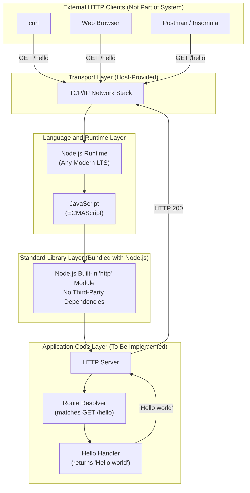

### 3.9.2 Excluded Layers Visualization

For clarity, the following diagram contrasts the in-scope stack against the layers conventionally present in a production system — all of which are **excluded** from this project.

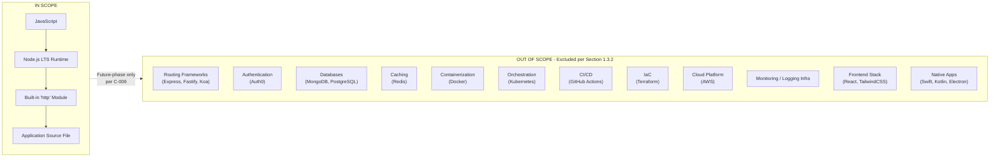

### 3.9.3 Stack Dependency Summary

| Layer | Dependency Provider | Installation Step |
|-------|---------------------|-------------------|
| Application code | Tutorial learner authors source file | Save file to disk |
| Standard library `http` module | Node.js distribution | Bundled — no separate install |
| Node.js runtime | nodejs.org or OS package manager | One-time install per host |
| TCP/IP stack | Operating system | Provided by host OS |
| Hardware | Local development machine | Provided by learner |

The entire installation sequence required to run the system is: **install Node.js**. There is no second step.

---

## 3.10 Security Implications of Technology Choices

Per Section 2.4.4 and the constraint set in Section 2.6.2, the security posture of this technology stack is shaped by deliberate omissions rather than by added security controls. The following table consolidates the security implications:

| Security Concern | Status | Rationale |
|------------------|--------|-----------|
| Authentication / Authorization | Not implemented | Section 1.3.2.1 — Excluded; C-004 |
| Input Validation | Not applicable | C-003 — Endpoint accepts no inputs |
| CORS Handling | Not implemented | Section 1.3.2.1 — Excluded |
| Data Persistence Risks | None | No data store exists (Section 3.6) |
| Transport Security (TLS) | Not in scope | Section 2.4.4 — Local execution only |
| Supply-Chain Risk (third-party packages) | **Zero** | No npm dependencies (Section 3.4.1) — no supply-chain surface |
| Runtime Vulnerability Surface | Limited to Node.js LTS itself | Standard library only; no transitive risk |
| Secrets Management | Not applicable | No secrets, API keys, or credentials required |

The **zero-dependency posture is itself a security benefit**: by relying exclusively on the Node.js standard library, the system has no transitive dependency tree, no risk of compromised npm packages, no `npm audit` advisories to monitor, and no lockfile divergence concerns. This is consistent with the tutorial-grade simplicity principle and is appropriate for the system's local, non-production positioning.

Tutorial learners should be advised that this minimal security profile is acceptable **only** because the system is intentionally non-production and locally executed (A-002). Any future-phase extension into a deployed environment would necessarily require revisiting every row of the table above.

---

## 3.11 References

### 3.11.1 Technical Specification Sections Consulted

- **Section 1.1 EXECUTIVE SUMMARY** — Established the project pivot from Flask to Node.js and the supersession of the prior scaffold; basis for excluding the entire Python/Flask portion of the default stack.
- **Section 1.2 SYSTEM OVERVIEW** — Sourced the Core Technical Approach (Section 1.2.2.3) that mandates tutorial-grade simplicity, Node.js LTS runtime, stateless handling, and deterministic response; sourced Section 1.2.1.3 confirming the system stands alone with no external integrations.
- **Section 1.3 SCOPE** — Sourced the in-scope features (Section 1.3.1) and, critically, the exhaustive out-of-scope catalog (Section 1.3.2.1, 1.3.2.2, 1.3.2.3) that eliminates every default-stack item not used by this system.
- **Section 2.1 FEATURE CATALOG** — Sourced the F-001 system dependencies (Node.js runtime, TCP/IP stack, local environment), external dependencies (none), and integration requirements.
- **Section 2.2 FUNCTIONAL REQUIREMENTS TABLE** — Sourced F-001-RQ-006 mandating Node.js as the execution runtime.
- **Section 2.3 FEATURE RELATIONSHIPS** — Confirmed there are no common services or shared components requiring additional libraries.
- **Section 2.4 IMPLEMENTATION CONSIDERATIONS** — Sourced Section 2.4.4 security implications and Section 2.4.5 maintenance/operational exclusions (no logging infrastructure, no health checks, no CI/CD, no multi-environment configuration, no production deployment automation).
- **Section 2.6 ASSUMPTIONS AND CONSTRAINTS** — Sourced Assumptions A-001 through A-004 and Constraints C-001 through C-006, each of which was cited inline in the applicability rationale tables above.
- **Section 2.7 References** — Confirmed the repository file/folder evidence used to verify the absence of `package.json`, `Dockerfile`, and CI workflow files.

### 3.11.2 Repository Artifacts Examined

- `/` (repository root) — Surveyed at depth 0 to confirm absence of `package.json`, `.js` source files, `Dockerfile`, and `.github/workflows/*.yml`; this absence corroborates the greenfield Node.js posture and the zero-dependency status documented in Sections 3.4 and 3.7.
- `README.md` — Inspected for the prior Artifact4 narrative and the Node.js → Python migration mapping table; used to identify which legacy Python concepts are explicitly being superseded.
- `requirements.txt` — Prior pinned Python dependencies (Flask 3.1.3, python-dotenv 1.2.2, gunicorn 26.0.0, Werkzeug 3.1.8); cited only to confirm that these are out-of-scope superseded artifacts (A-004, C-005).
- `requirements-dev.txt` — Prior Python dev dependencies (pytest 9.0.3); confirmed as out of scope.
- `pyproject.toml` — Prior pytest/ruff tooling configuration; out of scope.
- `Procfile` — Prior `gunicorn wsgi:app` production command; cited as superseded production tooling not replicated in the Node.js stack.
- `wsgi.py` — Prior WSGI entrypoint; superseded by direct Node.js execution.
- `app/`, `app/api/`, `tests/` — Prior Flask application package, API blueprint, and pytest suite; all confirmed out of scope per Section 1.3.2.2.
- `.env.example`, `.flaskenv`, `.gitignore` — Prior environment and ignore files; not replicated in the Node.js scope.
- `blitzy/documentation/` — Historical documentation hub (Project Guide.md, Agent Action Plan.md) documenting the prior port effort; used as background context only.

### 3.11.3 Host Environment Verification

- `node --version` → v22.22.2 — Confirms a Node.js LTS runtime is available on the development host, satisfying Assumption A-001. Not normative; any modern LTS is acceptable per Section 1.2.2.3.
- `npm --version` → 11.1.0 — Available on host but not required for this project because no npm dependencies exist (Section 3.4.2).

# 4. Process Flowchart

## 4.1 INTRODUCTION TO SYSTEM PROCESS FLOWS

This section documents every process flow that exists within the boundaries of the Node.js tutorial project. The scope of in-scope flows is intentionally narrow because the system implements a single functional capability — Feature F-001, a `GET /hello` endpoint returning the literal plain-text string `"Hello world"` with HTTP status `200` (per Sections 1.3.1.1, 2.1, and 2.2). All flowcharts in this section are derived directly from the six functional requirements F-001-RQ-001 through F-001-RQ-006 (Section 2.2.2) and the constraints C-001 through C-006 (Section 2.6.2). No flow is introduced that is not anchored in those documented requirements.

### 4.1.1 Workflow Scope Statement

The system, by design and by explicit specification, contains exactly the following process flows:

1. A one-time **installation and startup flow** that brings the Node.js server process from "not running" to "listening on a configured TCP port" (anchored in F-001-RQ-001 and F-001-RQ-006).
2. A synchronous, deterministic **request/response flow** for `GET /hello` that produces an HTTP 200 response with body `"Hello world"` (anchored in F-001-RQ-002 through F-001-RQ-005).
3. A **server process lifecycle state machine** describing the inherent states of a Node.js HTTP server created via `http.createServer()` and `server.listen()`.
4. A **default (non-contracted) handling path** for inputs that do not match `GET /hello`, which defers to the unmodified behavior of the Node.js built-in `http` module (Section 3.3.2).

No additional flows are documented because no additional flows are mandated, permitted, or implied by the specification.

### 4.1.2 Process Flow Inventory

| Flow ID | Flow Name | Type | Anchoring Requirement(s) |
|---------|-----------|------|--------------------------|
| PF-1 | Installation and Startup | One-time bootstrap | F-001-RQ-001, F-001-RQ-006 |
| PF-2 | `GET /hello` Request/Response | Synchronous per-request | F-001-RQ-002, F-001-RQ-003, F-001-RQ-004, F-001-RQ-005 |
| PF-3 | Server Process Lifecycle | State machine | F-001-RQ-001, F-001-RQ-006 |
| PF-4 | Non-Contracted Default Handling | Default behavior | None — explicitly outside contract per C-001 and C-002 |

### 4.1.3 Workflow Categories Explicitly Not Applicable

The section prompt enumerates several conventional workflow categories. The table below documents which categories are inapplicable to this system and the authoritative reason for each exclusion. These entries are not omissions; they are deliberate design properties of a tutorial-grade Node.js HTTP endpoint.

| Workflow Category | Applicability | Authoritative Source |
|-------------------|---------------|----------------------|
| Batch processing sequences | Not applicable — only synchronous request handling exists | Section 1.2.2.1 ("HTTP Request Handling" is the only capability) |
| Event processing flows | Not applicable — no message brokers, queues, or event sources are integrated | Section 1.2.1.3, Section 3.5 |
| Multi-system integration sequences | Not applicable — the only counterparty is the inbound HTTP client | Section 1.2.1.3, Section 3.5 |
| Transactional data flows | Not applicable — no data store of any kind is in scope | Section 3.6.1, Section 1.2.2.3 |
| Authorization checkpoints | Not applicable — no authentication or authorization is in scope | Constraint C-004 (Section 2.6.2); Section 1.3.2.1 |
| Regulatory compliance checks | Not applicable — every requirement specification in Section 2.2.2 records "None defined" for compliance | Sections 2.2.2.1–2.2.2.6 |
| Caching invalidation flows | Not applicable — no application or HTTP-level cache is specified | Section 3.6.2 (implicit by zero-storage posture) |
| Retry / fallback / recovery procedures | Not applicable — no such mechanisms are contracted | Section 1.3.2.1 (Logging excluded); Section 2.4 (no resilience requirements) |

---

## 4.2 CORE SYSTEM WORKFLOWS

### 4.2.1 High-Level System Workflow (PF-1 and PF-2 Combined)

The complete end-to-end user journey involves three actors interacting strictly sequentially: the **Tutorial Learner** who installs and starts the server, the **Node.js Server Process** which hosts the HTTP endpoint, and one or more **HTTP Clients** (curl, browsers, Postman) which exercise the endpoint once it is listening. The actors, their roles, and the canonical three-step interaction are defined in Sections 1.1.3 and 1.3.1.2; the diagram below extends Section 1.3.1.2's sequence by adding explicit decision logic, the system boundary of the Node.js process, and process-level steps that constitute the implementation of F-001.

#### 4.2.1.1 Swim-Lane End-to-End Workflow Diagram

The following swim-lane flowchart uses subgraphs to represent each actor's lane. Edges that cross subgraph boundaries represent the touchpoints between actors.

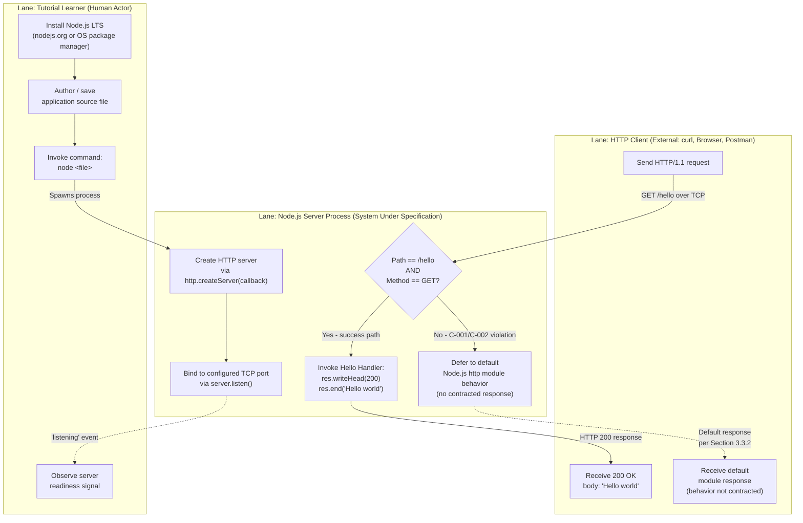

#### 4.2.1.2 Cross-Lane Touchpoints

| Touchpoint | From | To | Mechanism | Contract |
|------------|------|----|-----------|---------| 
| Process spawn | Tutorial Learner | Node.js Server Process | OS shell exec of `node <file>` | Documented, reproducible command (Section 1.2.3.2) |
| Readiness signal | Node.js Server Process | Tutorial Learner | Process stdout / `'listening'` event | Server bound to configured port (F-001-RQ-001) |
| Request | HTTP Client | Node.js Server Process | HTTP/1.1 over TCP | Method `GET`, path `/hello` (F-001-RQ-002) |
| Response (success) | Node.js Server Process | HTTP Client | HTTP/1.1 over TCP | Status `200`, body `"Hello world"` (F-001-RQ-003, F-001-RQ-005) |
| Response (non-contracted) | Node.js Server Process | HTTP Client | HTTP/1.1 over TCP | Defaults of the `http` module; not contracted (Section 1.3.2.4) |

### 4.2.2 Detailed Process Flow for F-001: `GET /hello`

This is the canonical core business process of the system. It is executed once per inbound HTTP request after the server has reached the `Listening` state (see Section 4.5.1).

#### 4.2.2.1 End-to-End Request/Response Description

When an HTTP/1.1 client issues a request, the Node.js runtime's `http` module invokes the registered request callback with `req` (incoming message) and `res` (server response) objects. The application code first inspects `req.method` and `req.url` (per F-001-RQ-002) to determine whether the request matches the single supported route `GET /hello`. If both conditions hold, the Hello Handler component (Section 1.2.2.2) writes status code `200` (F-001-RQ-005) and ends the response with the literal body `"Hello world"` (F-001-RQ-003). The response is then transmitted to the client over the open TCP connection, where any standards-conforming HTTP/1.1 user agent (F-001-RQ-004) can consume it. The handler is deterministic, stateless, performs no I/O, and produces an identical response for every valid request (Section 1.2.2.3).

#### 4.2.2.2 Detailed Process Flowchart

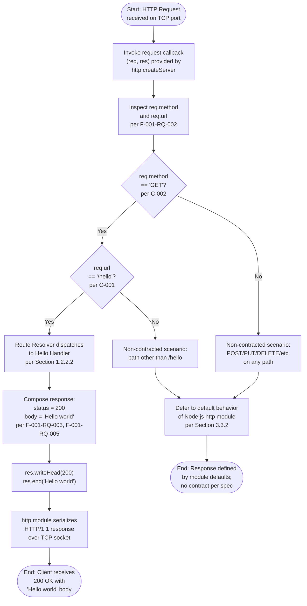

#### 4.2.2.3 Decision Points and Their Authoritative Outcomes

| Decision Point | YES Branch | NO Branch | Authoritative Source |
|----------------|------------|-----------|----------------------|
| `req.method == 'GET'`? | Continue to path check | Non-contracted (see Section 4.6); no 405 response is contracted | Constraint C-002 (Section 2.6.2); Section 1.3.2.4 |
| `req.url == '/hello'`? | Dispatch to Hello Handler | Non-contracted (see Section 4.6); no 404 response is contracted | Constraint C-001 (Section 2.6.2); Section 1.3.2.4 |

A critical and intentional property of this flow is that **no specific status code, response body, or header set is contracted for the NO branches of either decision**. Sections 1.3.2.1 and 1.3.2.4 explicitly mark non-matching paths and non-GET methods as "Unsupported Use Cases" without prescribing a response shape. The implementation will therefore exhibit whatever default the Node.js built-in `http` module produces. This is consistent with the zero-dependency, tutorial-grade simplicity principle (Section 3.1) and is reaffirmed by C-004 (no input validation in scope).

#### 4.2.2.4 System Boundaries and Touchpoints in This Flow

| Boundary | Description |
|----------|-------------|
| Process boundary | Single Node.js OS process; no child processes, no clustering | 
| Trust boundary | The TCP listening socket of the Node.js process; everything inbound is treated identically (no auth per C-004) |
| Module boundary | The Node.js built-in `http` module (Section 3.3.2); no third-party library boundary exists per zero-dependency posture (Section 3.4) |
| User touchpoint | Single HTTP request/response interaction on the TCP socket |

### 4.2.3 Installation and Startup Flow (PF-1)

The installation and startup flow is the one-time bootstrap that produces a server in the `Listening` state. Per Section 3.9.3, the dependency installation sequence required to run the system is exactly one step: install Node.js. There is no second installation step because the `http` module is bundled with the Node.js distribution and no third-party packages are required (Section 3.4).

#### 4.2.3.1 Installation Sequence Decomposition

| Step | Activity | Provider | Anchoring Reference |
|------|----------|----------|---------------------|
| 1 | Install any modern Node.js LTS version | nodejs.org or OS package manager | Section 3.9.3, A-001 |
| 2 | Author and save the application source file | Tutorial Learner | Section 3.9.3 |
| 3 | Execute `node <file>` from the OS shell | Operating System | Section 1.2.3.2 |
| 4 | `http.createServer()` instantiates the server object | Node.js `http` module | F-001-RQ-002, Section 3.3.2 |
| 5 | `server.listen()` binds to the configured TCP port | Node.js `http` module | F-001-RQ-001 |
| 6 | Server emits readiness; ready to accept requests | Node.js runtime | Section 1.2.3.1 acceptance criterion |

#### 4.2.3.2 Installation and Startup Flowchart

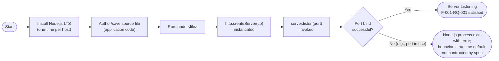

#### 4.2.3.3 Startup-Phase Validation

| Validation | Rule | Source |
|------------|------|--------|
| Runtime check | Implementation must execute on the Node.js runtime; the prior Flask runtime is superseded | F-001-RQ-006; A-004; C-005 |
| Bind check | Process must bind to the configured port without errors | F-001-RQ-001; Section 1.2.3.1 |
| Reproducibility | The server must be startable via a documented, reproducible command | Section 1.2.3.2 |
| Dependency check | No third-party packages are required; the `http` module is bundled with Node.js | Section 3.4, Section 3.9.3 |

---

## 4.3 INTEGRATION WORKFLOWS

### 4.3.1 Integration Surface Definition

The system has exactly one integration interface: inbound HTTP/1.1 requests on the listening TCP port. No outbound integrations, no service-to-service calls, no database connections, no message broker subscriptions, and no third-party API invocations exist. This is established authoritatively in Section 1.2.1.3 ("No enterprise systems, third-party APIs, identity providers, databases, message brokers, or downstream services integrate with this project"), Section 2.3.2 (single HTTP integration point), and Section 3.5 (zero third-party services).

| Integration Attribute | Value |
|-----------------------|-------|
| Direction | Inbound only |
| Protocol | HTTP/1.1 over TCP |
| Counterparty | Any standard HTTP client (curl, browser, Postman) per F-001-RQ-004 |
| Authentication | None per C-004 |
| Transport security | None — local execution only per assumption A-002 |
| Synchronicity | Synchronous request/response |
| Idempotency | Inherent — the response is deterministic and stateless (Section 1.2.2.3) |

### 4.3.2 Request/Response Integration Sequence Diagram

The following sequence diagram expands the canonical three-step interaction defined in Section 1.3.1.2 by enumerating the internal components (Section 1.2.2.2: HTTP Server, Route Resolver, Hello Handler) that participate in each request.

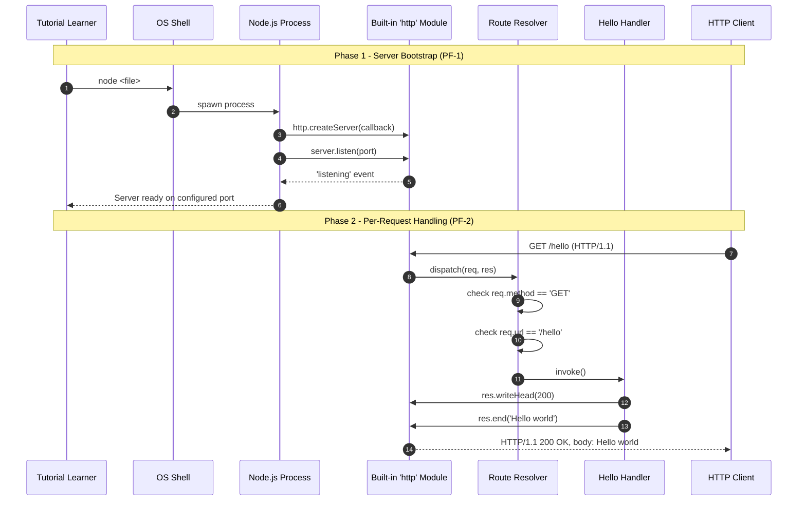

### 4.3.3 Non-Applicable Integration Patterns

| Integration Pattern | Status | Authoritative Source |
|---------------------|--------|----------------------|
| External API consumption | Not present | Section 1.2.1.3 |
| Service mesh / sidecar | Not present | Sections 1.3.2.1, 3.7 |
| Message queue producer/consumer | Not present | Section 1.2.1.3, 3.5 |
| Event-driven publish/subscribe | Not present | Section 1.2.1.3 |
| Database connection pool | Not present | Section 3.6.1 |
| Identity provider federation | Not present | Section 1.3.2.1, C-004 |
| Webhook outbound delivery | Not present | Section 1.2.1.3 |
| Scheduled / cron-like batch | Not present | Section 1.2.2.1 (HTTP request handling is the only capability) |

---

## 4.4 VALIDATION RULES AND DECISION POINTS

### 4.4.1 Per-Step Business Rules (Synthesized from Section 2.2.2)

| Workflow Step | Business Rule Applied | Source Requirement |
|---------------|-----------------------|--------------------|
| Server bind | Server must be startable via a documented, reproducible command | F-001-RQ-001 |
| Route matching | Only `/hello` is defined; only `GET` is supported | F-001-RQ-002, C-001, C-002 |
| Response composition | Response body must be deterministic — same body for every valid request | F-001-RQ-003, Section 1.2.2.3 |
| Wire format | No proprietary protocol extensions; HTTP semantics expected by general clients | F-001-RQ-004 |
| Status code | Status `200` must be returned for valid `GET /hello` | F-001-RQ-005 |
| Runtime | The runtime is Node.js exclusively; the prior Flask runtime is superseded | F-001-RQ-006, A-004, C-005 |

### 4.4.2 Data Validation Requirements

Per the "Data Validation" row of every requirement subsection (2.2.2.1 through 2.2.2.6), data validation is either explicitly "Not applicable — no data is processed" or "Not applicable — the endpoint accepts no input parameters." Constraint C-004 reaffirms that input validation schemas are explicitly out of scope. The flowcharts in Sections 4.2.1 and 4.2.2 therefore contain no data-validation decision diamonds because none are mandated.

### 4.4.3 Authorization Checkpoints

The "Security Requirements" row of every requirement subsection (2.2.2.1 through 2.2.2.6) records "None defined in scope." Constraint C-004 explicitly excludes authentication and authorization, and Section 1.3.2.1 reiterates the exclusion. No authorization checkpoint appears in any flowchart in Section 4.

### 4.4.4 Regulatory Compliance Checks

The "Compliance Requirements" row of every requirement subsection (2.2.2.1 through 2.2.2.6) records "None defined." The only compliance-style rule that does appear is "Conformance with HTTP semantics for success responses" under F-001-RQ-005, which is satisfied implicitly by use of the Node.js built-in `http` module (Section 3.3.2). No regulatory framework (e.g., HIPAA, PCI-DSS, GDPR) applies to this local-execution tutorial endpoint.

### 4.4.5 Consolidated Decision Point Catalog

The entire system contains the following decision diamonds across all flows:

| Decision ID | Location | Decision | YES Outcome | NO Outcome |
|-------------|----------|----------|-------------|------------|
| D-1 | Startup (PF-1) | Port bind successful? | Enter Listening state | Process exits (runtime default) |
| D-2 | Request flow (PF-2) | Method == GET? | Evaluate path | Non-contracted (defer to module default) |
| D-3 | Request flow (PF-2) | Path == /hello? | Invoke Hello Handler | Non-contracted (defer to module default) |

That is the complete catalog. No additional decision logic is specified or required.

---

## 4.5 STATE MANAGEMENT

### 4.5.1 Server Process Lifecycle State Machine (PF-3)

The Hello Handler itself is stateless (Section 1.2.2.3 explicitly: "No session state, no persistence, no in-memory caches"). The only state machine that exists in the system is the inherent lifecycle of the Node.js server process — a property of any Node.js HTTP server created via `http.createServer()` and `server.listen()` (Section 3.3.2), not a contract artifact of F-001.

#### 4.5.1.1 State Definitions

| State | Entry Condition | Exit Condition |
|-------|-----------------|----------------|
| NotRunning | Initial state before `node <file>` is invoked | OS spawns Node.js process |
| Starting | Node.js process spawned; `http.createServer()` constructed | `server.listen()` invoked |
| Listening | `'listening'` event emitted; port successfully bound (satisfies F-001-RQ-001) | Inbound request OR shutdown signal |
| HandlingRequest | Request callback invoked with `(req, res)` | `res.end()` invoked OR connection closed |
| Stopped | Process termination via SIGINT/SIGTERM or `process.exit()` | Terminal state |
| BindFailed | `server.listen()` rejected (e.g., port in use) | Terminal state (runtime-default; not contracted by spec) |

#### 4.5.1.2 State Transition Diagram

```mermaid
stateDiagram-v2
    [*] --> NotRunning
    NotRunning --> Starting: node &lt;file&gt; invoked
    Starting --> Listening: server.listen() succeeds<br/>(F-001-RQ-001)
    Starting --> BindFailed: port bind error<br/>(runtime default;<br/>not contracted)
    Listening --> HandlingRequest: HTTP request received
    HandlingRequest --> Listening: res.end() completes<br/>(per request, stateless)
    Listening --> Stopped: SIGINT / SIGTERM /<br/>process.exit()
    BindFailed --> [*]
    Stopped --> [*]
```

The transition `HandlingRequest --> Listening` occurs once per request because the system is stateless: no information is carried forward from one request to the next, and the Hello Handler is purely a function of the request to which it responds (Section 1.2.2.3).

### 4.5.2 Data Persistence Points

There are no data persistence points in this system. Per Section 3.6.1, no primary database, secondary/replica database, object/document store, file system persistence, or cross-request in-memory state is in scope. The response body `"Hello world"` is a hard-coded literal (F-001-RQ-003 Data Requirements row: "the response payload is a hard-coded literal string"). No flowchart in Section 4 contains a persistence step because none is mandated.

### 4.5.3 Caching Requirements

There are no caching requirements. Per Section 3.6.2 (no application-level cache, no distributed cache) and per the absence of any HTTP-level caching directive in F-001-RQ-003 through F-001-RQ-005, the system does not implement, expose, or depend on caches. No cache-invalidation flow appears in this section because none is needed.

### 4.5.4 Transaction Boundaries

Transaction boundaries are not applicable. Per Section 1.1.2 there are "no transactional workflows... defined in scope," and per Section 3.6.1 no transactional resource (database, message broker, queue) is integrated. The Hello Handler executes a single in-memory composition of a literal string followed by a single write to the response stream; no compensating action, two-phase commit, or saga pattern is relevant.

---

## 4.6 ERROR HANDLING

### 4.6.1 Error Handling Philosophy

The specification adopts a tutorial-grade simplicity principle (Section 3.1) and an explicit zero-error-contract posture for non-success paths. Per Section 1.3.2.4, requests to any path other than `/hello` and requests with any method other than `GET` constitute "Unsupported Use Cases" — they are documented as not supported, but no specific error response (e.g., 404, 405, error body shape) is contracted by the specification. The implementation therefore inherits whatever default the Node.js built-in `http` module produces for such inputs.

The following error-handling categories listed in the section prompt are **explicitly not contracted** by the specification:

| Category | Status | Authoritative Source |
|----------|--------|----------------------|
| Retry mechanisms | Not in scope | C-004 (Section 2.6.2); Section 1.3.2.1 |
| Fallback processes | Not in scope | Section 1.3.2.1 (no logging infrastructure beyond defaults); tutorial-grade simplicity (Section 3.1) |
| Error notification flows | Not in scope | Section 1.3.2.1 |
| Recovery procedures | Not in scope | Section 1.3.2.1 |
| Specific error status codes for non-matching paths | Not contracted | Section 1.3.2.4; C-001 |
| Specific error status codes for non-GET methods | Not contracted | Section 1.3.2.4; C-002 |
| Error response body schema | Not contracted | Section 1.3.2.4; C-003 |

This is not an oversight; it is a deliberate property of the tutorial scope. The Section 4.6.2 flowchart documents this posture explicitly.

### 4.6.2 Default (Non-Contracted) Error Handling Flowchart

The diagram below depicts the complete error-handling topology of the system. Note that every non-success branch terminates in a "non-contracted" sink that represents the unmodified default of the Node.js `http` module. This is the system's only error-handling behavior, and it is intentional.


### 4.6.3 Startup Error Handling

The only startup-time failure mode that can occur is a port bind failure (e.g., the configured TCP port is already occupied). The acceptance criterion of F-001-RQ-001 is satisfied only when the process "binds to its configured port without errors" (Section 1.2.3.1). If the bind fails, the Node.js process exits with whatever error the runtime emits for that condition; the specification contracts no recovery procedure, no retry, and no alternate-port fallback. This is consistent with the tutorial-grade scope and is depicted as the `BindFailed` terminal transition in the state diagram of Section 4.5.1.2.

---

## 4.7 TIMING AND SLA CONSIDERATIONS

No quantitative timing constraints, latency targets, throughput targets, uptime SLAs, error budgets, or cost benchmarks are defined for this project. The following statements are reproduced from the authoritative sections of the specification to underline the absence:

| Source | Authoritative Statement |
|--------|-------------------------|
| Section 1.2.3.3 | "No quantitative KPIs (latency targets, throughput targets, uptime SLAs, error budgets, or cost benchmarks) are defined for this tutorial project." |
| Section 2.4.2 (referenced via Section 2.2.2) | "No quantitative performance requirements apply... Performance characteristics will reflect the defaults of the chosen Node.js HTTP implementation." |
| Sections 2.2.2.1–2.2.2.6 | Every requirement's "Performance Criteria" row reads "Not defined — per Section 1.2.3.3" |

Consequently, none of the flowcharts in Section 4 are annotated with timing constraints, retry windows, timeout thresholds, or SLA boundaries. Implementations will exhibit whatever timing characteristics the Node.js runtime and built-in `http` module produce on the host machine; these characteristics are not the subject of formal measurement in this specification.

---

## 4.8 WORKFLOW-TO-REQUIREMENT TRACEABILITY

The following matrix maps each documented flow element to the functional requirement(s) it satisfies. This complements the broader traceability matrix in Section 2.5 by focusing specifically on process flow artifacts.

| Flow Artifact (Section) | F-001-RQ-001 | F-001-RQ-002 | F-001-RQ-003 | F-001-RQ-004 | F-001-RQ-005 | F-001-RQ-006 |
|-------------------------|:-:|:-:|:-:|:-:|:-:|:-:|
| Swim-lane workflow (4.2.1.1) | ✓ | ✓ | ✓ | ✓ | ✓ | ✓ |
| Detailed F-001 flowchart (4.2.2.2) | — | ✓ | ✓ | ✓ | ✓ | — |
| Installation/startup flowchart (4.2.3.2) | ✓ | — | — | — | — | ✓ |
| Request/response sequence (4.3.2) | ✓ | ✓ | ✓ | ✓ | ✓ | ✓ |
| State transition diagram (4.5.1.2) | ✓ | — | — | — | — | ✓ |
| Error handling flowchart (4.6.2) | — | ✓ | ✓ | — | ✓ | — |

Legend: ✓ = flow artifact directly evidences satisfaction of the requirement; — = not the primary anchor of this artifact (may still be tangentially relevant).

### 4.8.1 Constraint Coverage

| Constraint (Section 2.6.2) | Where Enforced in Flowcharts |
|----------------------------|------------------------------|
| C-001 (only `/hello` path) | Decision D-3 in Section 4.2.2.2 |
| C-002 (only `GET` method) | Decision D-2 in Section 4.2.2.2 |
| C-003 (plain-text body, no JSON) | "Compose response" step in Section 4.2.2.2; F-001-RQ-003 |
| C-004 (no auth/persistence/CORS/validation/logging/CI-CD) | Documented as exclusions in Sections 4.1.3, 4.4.2, 4.4.3, 4.6.1 |
| C-005 (no Flask scaffold porting) | Installation/startup flow (4.2.3) uses Node.js exclusively |
| C-006 (no future-phase items) | Inventory in Section 4.1.2 contains no framework, container, test, or observability flows |

---

## 4.9 REFERENCES TO PRE-EXISTING DIAGRAMS

The Technical Specification already contains the following diagrams in earlier sections; readers are referred to them as the canonical visual sources, and the diagrams in Section 4 are designed to complement rather than duplicate them:

| Existing Diagram | Section | Subject |
|------------------|---------|---------|
| Component decomposition flowchart (Client → Server → Router → Handler) | 1.2.2.2 | Logical component architecture and request flow |
| Primary user workflow sequence diagram (3 steps) | 1.3.1.2 | Canonical Tutorial Learner → Server → Client sequence |
| Feature dependency map (F-001 → Node.js runtime → `http` module) | 2.3.1 | Runtime dependency view |
| Layered stack diagram (External clients → TCP → Runtime → Stdlib → App) | 3.9.1 | Complete technology stack |
| In-scope vs. out-of-scope layers comparison | 3.9.2 | Boundary visualization |

The diagrams introduced in this section (Sections 4.2.1.1, 4.2.2.2, 4.2.3.2, 4.3.2, 4.5.1.2, and 4.6.2) add explicit decision logic, state semantics, and error-path topology that the earlier diagrams intentionally abstract away.

---

## 4.10 REFERENCES

### 4.10.1 Repository Files Examined

- `README.md` — Source of the prior Artifact4 project description; referenced to establish the Node.js → Flask supersession context (A-004, C-005) that determines which actors and runtimes appear in the flowcharts.
- `app/api/routes.py` — Prior `GET /health` Flask endpoint; cited as the predecessor pattern that is explicitly **not** depicted in any flowchart, since C-005 forbids porting it.
- `app/__init__.py` — Prior Flask application factory; cited only to confirm that the new flowcharts use a single Node.js process boundary rather than an app-factory pattern.
- `app/middleware.py` — Prior X-Request-ID correlation middleware; cited to confirm that the request/response flowchart in Section 4.2.2.2 contains no middleware steps (C-004 excludes logging infrastructure).
- `app/errors.py` — Prior centralized JSON error handlers; cited to confirm that the error-handling flowchart in Section 4.6.2 deliberately contracts no error response shape (C-004; Section 1.3.2.4).
- `wsgi.py` — Prior WSGI entrypoint; cited as superseded by direct Node.js process execution in the installation/startup flow (Section 4.2.3).
- `Procfile` — Prior `gunicorn wsgi:app` production command; cited as out-of-scope and therefore absent from the startup flowchart.
- `requirements.txt` — Pinned Python dependencies; cited as evidence that the new Node.js project uses zero third-party dependencies (Section 3.4), which is why no dependency-installation step appears in Section 4.2.3.2 between "Install Node.js" and "node <file>".

### 4.10.2 Repository Folders Explored

- `/` (repository root) — Surveyed to confirm absence of `package.json`, any `.js` files, `Dockerfile`, or CI workflows; substantiates the greenfield posture reflected in the simple three-step installation flowchart of Section 4.2.3.2.
- `app/` — Prior Flask application package; surveyed to identify the legacy patterns excluded from all flowcharts in this section.
- `app/api/` — Prior API blueprint; surveyed to confirm that the new flowcharts depict only the `/hello` route (C-001).
- `tests/` — Prior pytest regression suite; surveyed to confirm that no test execution flow is depicted in Section 4 (C-006 excludes test frameworks).
- `blitzy/documentation/` — Historical documentation hub; surveyed for project pivot context that informs the actor model in Section 4.2.1.1.

### 4.10.3 Technical Specification Sections Cross-Referenced

- **Section 1.1 EXECUTIVE SUMMARY** — Established the project pivot from Flask to Node.js, anchoring the actor model and the supersession statements throughout Section 4.
- **Section 1.2 SYSTEM OVERVIEW** — Source of the canonical component decomposition (1.2.2.2), the stateless and deterministic properties (1.2.2.3), and the explicit no-KPI declaration (1.2.3.3) reproduced in Section 4.7.
- **Section 1.3 SCOPE** — Source of the in-scope features (1.3.1.1), the primary user workflow sequence diagram (1.3.1.2), the essential technical requirements (1.3.1.4), and the comprehensive out-of-scope catalog (1.3.2) underpinning Sections 4.1.3 and 4.6.
- **Section 2.1 FEATURE CATALOG** — Established F-001 as the sole in-scope feature, scoping the entire flowchart inventory in Section 4.1.2.
- **Section 2.2 FUNCTIONAL REQUIREMENTS TABLE** — Source of the six requirements F-001-RQ-001 through F-001-RQ-006, every validation rule reproduced in Section 4.4, and the decision points in Section 4.2.2.3.
- **Section 2.3 FEATURE RELATIONSHIPS** — Established the single HTTP integration point depicted in Sections 4.3.1 and 4.3.2.
- **Section 2.4 IMPLEMENTATION CONSIDERATIONS** — Source of the no-performance-requirements statement reproduced in Section 4.7 and the security implications informing Sections 4.4.3 and 4.6.
- **Section 2.5 TRACEABILITY MATRIX** — Provided the traceability framework extended by Section 4.8.
- **Section 2.6 ASSUMPTIONS AND CONSTRAINTS** — Source of constraints C-001 through C-006 enforced throughout the flowcharts and explicitly mapped in Section 4.8.1.
- **Section 3.3 Frameworks & Libraries** — Established the use of the Node.js built-in `http` module (no third-party routing framework), informing the absence of middleware in Section 4.2.2.2.
- **Section 3.4 Open Source Dependencies** — Established the zero-dependency posture justifying the single installation step in Section 4.2.3.2.
- **Section 3.6 Databases & Storage** — Established the absence of persistence and caching, justifying Sections 4.5.2 and 4.5.3.
- **Section 3.9 Technology Stack Architecture** — Source of the layered stack (3.9.1), in-scope/out-of-scope visualization (3.9.2), and the authoritative installation sequence (3.9.3) feeding Section 4.2.3.1.

# 5. System Architecture

## 5.1 HIGH-LEVEL ARCHITECTURE

### 5.1.1 System Overview

#### 5.1.1.1 Architectural Style and Rationale

The system is architected as a **monolithic single-process HTTP server** running on the Node.js JavaScript runtime. The architectural style is dictated entirely by the user's pedagogical request and is governed by what the technology stack philosophy formalizes as "tutorial-grade minimalism," where the system is composed of "one file or a very small number of files; one endpoint; one response". Every architectural decision derives from this principle and from the explicit scope boundaries declared in the specification.

The runtime model is the standard Node.js request-callback pattern: a single OS process owns one listening TCP socket, the event loop drives request acceptance, and a single user-supplied callback function is invoked per incoming HTTP request. The architecture deliberately rejects the additional tiers commonly present in production systems. The layered stack diagram in Section 3.9.1 makes this explicit, noting the absence of intermediate tiers commonly present in production systems (load balancer, application server, ORM, database, cache, message broker, identity provider).

Rationale for selecting this style:

- **Match to scope.** The functional surface is exactly one endpoint returning a constant string; introducing layers (controllers, services, repositories, gateways) would create complexity unrelated to any requirement.
- **Zero-dependency posture.** There are zero open-source third-party dependencies in scope for this project, which is itself a stated security and supply-chain benefit.
- **Pedagogical clarity.** The architecture demonstrates Node.js HTTP fundamentals in their canonical form, supporting the project's positioning as a reference example.

#### 5.1.1.2 Architectural Principles

The architecture is governed by six guiding principles synthesized from Sections 1.2.2.3 and 2.1.1.2:

| Principle | Architectural Implication |
|-----------|---------------------------|
| Tutorial-Grade Simplicity | Minimum number of files; no build steps; no compilation |
| Node.js Runtime | JavaScript is the only language; no other runtimes participate |
| Stateless Handling | No databases, caches, sessions, or persistence layers |
| Deterministic Response | No templating engines or dynamic content systems |
| Standard Library First | No third-party frameworks (Express, Fastify, Koa) |
| Local Execution Only | No cloud services, no containers, no orchestration |

These principles are not aspirational; they are enforced as constraints. Constraints C-001 through C-006 codify these architectural boundaries: exactly one route `/hello` is permitted (C-001); only the `GET` method is supported (C-002); the response is plain text `"Hello world"` (C-003); no authentication, authorization, CORS, persistence, input validation, logging infrastructure, CI/CD, or production deployment automation is in scope (C-004); features of the prior Flask scaffold must not be ported or replicated (C-005); and future-phase items (additional routes, routing frameworks, test frameworks, containerization, observability) are explicitly excluded (C-006).

#### 5.1.1.3 System Boundaries and Major Interfaces

The system boundary is the **single Node.js OS process** hosting the HTTP server. Everything outside that process — including the operating system's TCP/IP stack, all HTTP clients (curl, browsers, Postman), and the tutorial learner's shell — is external to the system.

The major interfaces are:

- **One inbound interface**: HTTP/1.1 over TCP on a configured port (the listening socket).
- **No outbound interfaces**: the system has exactly one integration interface: inbound HTTP/1.1 requests on the listening TCP port. No outbound integrations, no service-to-service calls, no database connections, no message broker subscriptions, and no third-party API invocations exist.
- **Process-control interface**: SIGINT/SIGTERM signals delivered by the operating system to terminate the process.

### 5.1.2 Core Components

#### 5.1.2.1 Component Decomposition Table

The system decomposes into exactly three internal logical components. Because no other features exist, these components are not "shared" across features — they are dedicated to F-001 in their entirety.

| Component Name | Primary Responsibility | Key Dependencies |
|----------------|------------------------|------------------|
| Node.js HTTP Server | Binds to a TCP port and accepts inbound HTTP connections | Node.js runtime; built-in `http` module; OS TCP/IP stack |
| Route Resolver | Dispatches the `/hello` path to its designated handler | Node.js HTTP Server (provides `req`/`res` objects) |
| Hello Handler | Produces the `"Hello world"` response payload | Route Resolver (invokes it on match); built-in `http` module response API |

Each component's integration points and critical considerations are summarized below:

| Component Name | Integration Points | Critical Considerations |
|----------------|--------------------|--------------------------|
| Node.js HTTP Server | Inbound: TCP listening socket. Outbound: invocation of Route Resolver callback. | Port-bind success is the sole startup acceptance criterion (F-001-RQ-001) |
| Route Resolver | Inbound: `(req, res)` from HTTP Server. Outbound: invocation of Hello Handler on match. | Two decisions only: `req.method === 'GET'` and `req.url === '/hello'`; no contracted response for non-matches |
| Hello Handler | Inbound: invocation from Route Resolver. Outbound: writes to `res` stream. | Deterministic and stateless; performs no I/O; hard-coded literal string |

#### 5.1.2.2 Component Interaction Diagram

The canonical interaction sequence between components, reproduced from Section 1.2.2.2:


### 5.1.3 Data Flow Description

#### 5.1.3.1 Primary Data Flow

The primary data flow is a **synchronous, request-scoped, in-memory chain** with no persistent intermediate state. When an HTTP/1.1 client issues a request, the Node.js runtime's `http` module invokes the registered request callback with `req` (incoming message) and `res` (server response) objects. The application code first inspects `req.method` and `req.url` (per F-001-RQ-002) to determine whether the request matches the single supported route `GET /hello`. If both conditions hold, the Hello Handler component (Section 1.2.2.2) writes status code `200` (F-001-RQ-005) and ends the response with the literal body `"Hello world"` (F-001-RQ-003). The response is then transmitted to the client over the open TCP connection.

Concretely, the data flow consists of:

1. An inbound TCP byte stream parsed by the `http` module into an `IncomingMessage` (`req`).
2. Two synchronous decisions on `req.method` and `req.url`.
3. On match, a single in-memory composition of the response status (`200`) and body literal (`"Hello world"`).
4. A single write of that response onto the outbound TCP byte stream via `res.writeHead()` and `res.end()`.
5. Connection close (or keep-alive, per HTTP/1.1 defaults of the `http` module).

#### 5.1.3.2 Integration Patterns and Protocols

The integration pattern is **synchronous request/response only**. Key attributes:

| Integration Attribute | Value |
|-----------------------|-------|
| Direction | Inbound only |
| Protocol | HTTP/1.1 over TCP |
| Synchronicity | Synchronous request/response |
| Idempotency | Inherent — the response is deterministic and stateless |
| Authentication | None |
| Transport security | None — local execution only |

Asynchronous patterns are explicitly inapplicable. External API consumption, service mesh / sidecar, message queue producer/consumer, event-driven publish/subscribe, database connection pool, identity provider federation, webhook outbound delivery, and scheduled / cron-like batch are all not present.

#### 5.1.3.3 Data Transformation Points

There are no meaningful data transformation points in the application code. The only transformations are those performed by the Node.js `http` module itself: parsing inbound bytes into an `IncomingMessage` and serializing the outbound `ServerResponse` into HTTP/1.1 wire bytes. The application contributes no transformation logic — the response body `"Hello world"` is a hard-coded literal, not derived from input data, configuration, or any computation.

Notably, the response is plain text `"Hello world"`; structured (e.g., JSON) responses are unsupported, so no serialization library, schema transformation, or content negotiation occurs.

#### 5.1.3.4 Data Stores and Caches

The system contains **no data stores and no caches**.

| Persistence Concern | Status |
|---------------------|--------|
| Primary database | None |
| Secondary / replica database | None |
| Object/document store | None |
| File system persistence | None |
| In-memory state across requests | None |
| Application-level cache | None |
| Distributed cache (Redis, Memcached) | None |
| HTTP-level cache headers | Not specified in any requirement |
| CDN-level caching | Not applicable — local execution only |

There are no data persistence points in this system. Per Section 3.6.1, no primary database, secondary/replica database, object/document store, file system persistence, or cross-request in-memory state is in scope.

### 5.1.4 External Integration Points

The system exposes exactly one integration interface to external systems. The only integration point exposed by F-001 is a single HTTP interface, as depicted in the component flow of Section 1.2.2.2. The Client-Server-Router-Handler chain is internal to F-001 and does not constitute integration with any external system.

| System Name | Integration Type | Data Exchange Pattern | Protocol/Format |
|-------------|------------------|------------------------|-----------------|
| Any standard HTTP client (curl, browser, Postman) | Inbound HTTP | Synchronous request/response | HTTP/1.1; plain-text body |
| Node.js runtime (host process) | Runtime hosting | Process lifecycle | OS process spawn; SIGINT/SIGTERM signals |
| Host TCP/IP stack | Transport | Inbound TCP connection | TCP socket bound to configured port |

**SLA Requirements**: No quantitative timing constraints, latency targets, throughput targets, uptime SLAs, error budgets, or cost benchmarks are defined for this project. Implementations will exhibit whatever timing characteristics the Node.js runtime and built-in `http` module produce on the host machine; these characteristics are not the subject of formal measurement in this specification. No SLA table is provided because no SLAs apply.

---

## 5.2 COMPONENT DETAILS

### 5.2.1 Node.js HTTP Server Component

#### 5.2.1.1 Purpose and Responsibilities

The Node.js HTTP Server binds to a TCP port and accepts inbound HTTP connections. It is the boundary component between the operating system's TCP/IP stack and the application's request-handling logic. Its responsibilities are limited to:

- Constructing the server object via `http.createServer(callback)`.
- Invoking `server.listen(port)` to bind the TCP socket.
- Emitting the `'listening'` event when binding succeeds.
- Receiving inbound HTTP/1.1 requests and invoking the registered request callback once per request.
- Serializing outbound responses written via the `res` object onto the TCP socket.

#### 5.2.1.2 Technologies and Frameworks

| Attribute | Specification |
|-----------|---------------|
| Language | JavaScript (ECMAScript) |
| Runtime | Node.js (any modern LTS version) |
| HTTP Library | Node.js built-in `http` module |
| Third-Party Frameworks | None — Express, Fastify, Koa explicitly excluded |
| Build Toolchain | None — no compilation, no transpilation |

The Node.js standard library `http` module is shipped with the Node.js runtime itself; it incurs no separate installation, no npm registry interaction, and no version pinning.

#### 5.2.1.3 Key Interfaces and APIs

| Interface | Provided By | Used For |
|-----------|-------------|----------|
| `http.createServer(callback)` | Node.js `http` module | Server construction |
| `server.listen(port)` | Node.js `http` module | TCP socket binding |
| `'listening'` event | Node.js `http` module | Readiness signal |
| Request callback `(req, res)` | Application code | Per-request entry point |

#### 5.2.1.4 Persistence and Scaling Considerations

**Persistence**: None. The component holds no state across requests.

**Scaling**: No scalability requirements apply. F-001 is a single-process tutorial. Per Section 1.3.1.3, the system boundary is a single Node.js process exposing one HTTP endpoint, with local execution as the only deployment target. Horizontal scaling, clustering, load balancing, and process management are out of scope.

### 5.2.2 Route Resolver Component

#### 5.2.2.1 Purpose and Responsibilities

The Route Resolver dispatches the `/hello` path to its designated handler. It is implemented as inline conditional logic within the request callback — there is no routing framework, no route table, and no middleware chain. Its sole responsibility is to evaluate two binary decisions and route execution accordingly.

#### 5.2.2.2 Implementation Approach

The Route Resolver is realized through direct inspection of the `req` object:

| Inspected Property | Purpose |
|--------------------|---------|
| `req.method` | Verify the request uses the `GET` method (per C-002) |
| `req.url` | Verify the request targets the `/hello` path (per C-001) |

No route-pattern matching, parameter extraction, query-string parsing, or content negotiation is performed. The "Data Validation" row of every requirement subsection (2.2.2.1 through 2.2.2.6), data validation is either explicitly "Not applicable — no data is processed" or "Not applicable — the endpoint accepts no input parameters." Constraint C-004 reaffirms that input validation schemas are explicitly out of scope.

#### 5.2.2.3 Decision Logic

The Route Resolver contains exactly two decisions:

| Decision ID | Condition | YES Outcome | NO Outcome |
|-------------|-----------|-------------|------------|
| D-2 | `req.method === 'GET'`? | Evaluate path (D-3) | Defer to `http` module default (non-contracted) |
| D-3 | `req.url === '/hello'`? | Invoke Hello Handler | Defer to `http` module default (non-contracted) |

That is the complete catalog. No additional decision logic is specified or required.

### 5.2.3 Hello Handler Component

#### 5.2.3.1 Purpose and Responsibilities

The Hello Handler produces the `"Hello world"` response payload. It is the only component in the system that writes to the response stream. Its responsibilities are:

- Setting HTTP status code `200` via `res.writeHead(200)` (satisfying F-001-RQ-005).
- Writing the literal body `"Hello world"` via `res.end('Hello world')` (satisfying F-001-RQ-003).

#### 5.2.3.2 Behavior Specification

The handler exhibits the following invariants:

- **Deterministic**: The response is identical for every invocation.
- **Stateless**: No information is carried between invocations.
- **No I/O**: No file system, network, or database access occurs.
- **No input dependence**: The output is independent of `req` content beyond the routing match already performed.

The handler is deterministic, stateless, performs no I/O, and produces an identical response for every valid request.

#### 5.2.3.3 Persistence and Scaling Considerations

**Persistence**: None. The response body is a hard-coded literal embedded in the source code.

**Scaling**: Not applicable. The handler is purely a function of constants; under load, it neither benefits from nor requires any scaling strategy beyond what the underlying Node.js process provides by default.

### 5.2.4 Detailed Component Interaction Sequence

The following sequence diagram, reproduced from Section 4.3.2, captures the per-request interaction between the three internal components and external actors across both bootstrap and per-request phases:


### 5.2.5 State Transition Diagram

The only state machine in the system is the inherent lifecycle of the Node.js server process. The Hello Handler itself is stateless (Section 1.2.2.3 explicitly: "No session state, no persistence, no in-memory caches"). The only state machine that exists in the system is the inherent lifecycle of the Node.js server process — a property of any Node.js HTTP server created via `http.createServer()` and `server.listen()` (Section 3.3.2), not a contract artifact of F-001.

```mermaid
stateDiagram-v2
    [*] --> NotRunning
    NotRunning --> Starting: node <file> invoked
    Starting --> Listening: server.listen() succeeds<br/>(F-001-RQ-001)
    Starting --> BindFailed: port bind error<br/>(runtime default;<br/>not contracted)
    Listening --> HandlingRequest: HTTP request received
    HandlingRequest --> Listening: res.end() completes<br/>(per request, stateless)
    Listening --> Stopped: SIGINT / SIGTERM /<br/>process.exit()
    BindFailed --> [*]
    Stopped --> [*]
```

State definitions:

| State | Entry Condition | Exit Condition |
|-------|-----------------|----------------|
| NotRunning | Initial state before `node <file>` is invoked | OS spawns Node.js process |
| Starting | Process spawned; `http.createServer()` constructed | `server.listen()` invoked |
| Listening | `'listening'` event emitted; port bound (F-001-RQ-001) | Inbound request OR shutdown signal |
| HandlingRequest | Request callback invoked with `(req, res)` | `res.end()` invoked OR connection closed |
| Stopped | Process termination via SIGINT/SIGTERM or `process.exit()` | Terminal state |
| BindFailed | `server.listen()` rejected (e.g., port in use) | Terminal state (runtime-default) |

The transition `HandlingRequest --> Listening` occurs once per request because the system is stateless: no information is carried forward from one request to the next, and the Hello Handler is purely a function of the request to which it responds.

### 5.2.6 Detailed Request/Response Flow Diagram

The full request-handling flow, including both contracted success and non-contracted default paths, is shown below (reproduced from Section 4.2.2.2):


---

## 5.3 TECHNICAL DECISIONS

### 5.3.1 Architecture Style Decisions

#### 5.3.1.1 Decision Summary

The major architecture-style decisions are summarized below. Each is grounded in a specific specification source.

| Decision Area | Choice | Rationale |
|---------------|--------|-----------|
| Process topology | Single Node.js process | Tutorial scope; no scalability requirements |
| Runtime | Node.js (any modern LTS) | User explicitly requested a Node.js tutorial |
| Language | JavaScript (ECMAScript) | Native to Node.js; no transpilation overhead |
| HTTP library | Built-in `http` module | Sufficient for scope; zero dependencies |
| Routing framework | None | Tutorial-grade simplicity; C-006 |
| Module system | CommonJS or ES Modules (implementer's choice) | Both are first-class in modern Node.js |
| Build system | None | Plain JavaScript runs natively under Node.js |
| Deployment topology | Local execution only | A-002; no production target |

#### 5.3.1.2 Architectural Trade-offs

The deliberate trade-offs accepted by this architecture are:

- **Trading routing-framework ergonomics for zero dependencies.** A framework would simplify route declarations but would introduce a dependency tree, version management, and security-update obligations. The trade is appropriate for a tutorial.
- **Trading structured error responses for `http` module defaults.** A framework or hand-written middleware could produce JSON 404/405 bodies, but the specification chooses the zero-contract posture for non-success paths.
- **Trading horizontal scalability for process simplicity.** A single-process design cannot scale across CPU cores without clustering, but clustering is explicitly out of scope.

#### 5.3.1.3 Architecture Style Decision Tree

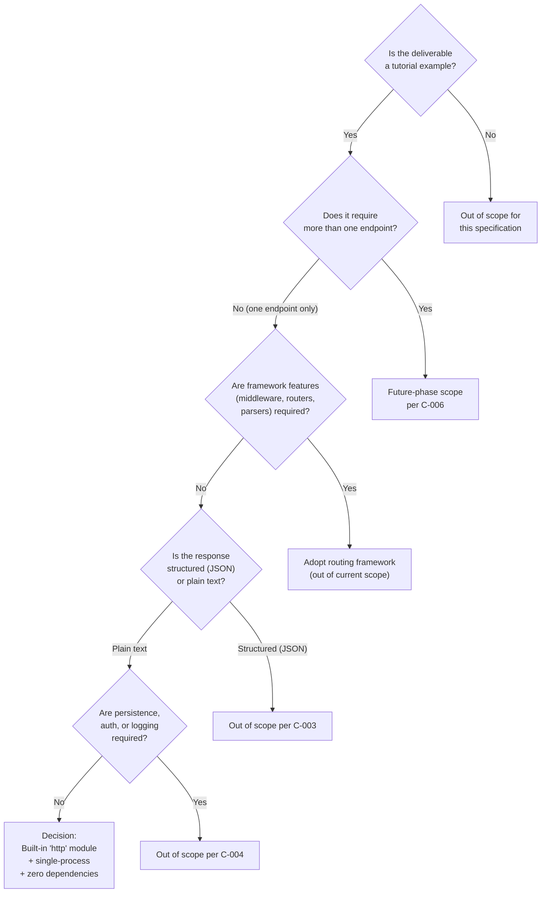

### 5.3.2 Communication Pattern Choices

The communication pattern is **synchronous HTTP request/response**. This choice is mandated by the user's request for an HTTP endpoint and is the only pattern compatible with the project's scope.

| Pattern | Status | Rationale |
|---------|--------|-----------|
| Synchronous HTTP request/response | **Selected** | Matches user request directly |
| Asynchronous messaging (queues) | Excluded | No message broker integration; no background work |
| Event-driven publish/subscribe | Excluded | No event source; no subscribers |
| Webhooks (outbound) | Excluded | No outbound integrations |
| Server-sent events / WebSockets | Excluded | Stateless deterministic response does not require streaming |
| gRPC / Thrift / GraphQL | Excluded | C-003 mandates plain-text HTTP response |

Idempotency is inherent: the response is deterministic and stateless, so any number of identical requests produce identical results without side effects.

### 5.3.3 Data Storage Solution Rationale

The decision is to use **no data storage solution of any kind**. This is not a deferred decision — it is an architectural commitment grounded in the absence of any data domain.

| Storage Option Considered | Decision | Reason |
|--------------------------|----------|--------|
| Relational database (PostgreSQL, MySQL) | Not selected | No relational data |
| Document database (MongoDB) | Not selected | No documents to store |
| Key-value store (Redis) | Not selected | No state to cache or share |
| File system persistence | Not selected | No data lifecycle |
| Object storage (S3, GCS) | Not selected | No artifacts to store |
| In-memory cross-request state | Not selected | Stateless handling principle (Section 1.2.2.3) |

The default technology stack's MongoDB designation is not used in this project. No alternative database (PostgreSQL, MySQL, SQLite, DynamoDB, etc.) replaces it; the system holds no data, by design.

### 5.3.4 Caching Strategy Justification

The decision is to implement **no caching layer**. Justification:

- **No shared state.** Without state to share across requests or processes, distributed caches (Redis, Memcached) have nothing to cache.
- **Response is already a constant.** An in-process cache of `"Hello world"` is indistinguishable from the source-code literal itself; introducing a cache would add complexity without any latency benefit.
- **No HTTP-level cache directives required.** The specification's functional requirements (F-001-RQ-001 through F-001-RQ-006) prescribe no `Cache-Control`, `ETag`, or `Last-Modified` semantics.
- **No CDN tier.** Local execution precludes a CDN; CDN-level caching is therefore inapplicable.

### 5.3.5 Security Mechanism Selection

The decision is to implement **no application-layer security mechanisms**. The security posture is shaped by deliberate omissions appropriate for a local tutorial.

| Security Mechanism | Decision | Rationale |
|--------------------|----------|-----------|
| Authentication | Not implemented | C-004; tutorial scope |
| Authorization | Not implemented | C-004; no protected resources |
| Input validation | Not applicable | Endpoint accepts no input parameters |
| CORS handling | Not implemented | C-004 |
| Transport security (TLS) | Not in scope | Local execution only (A-002) |
| Secrets management | Not applicable | No secrets, API keys, or credentials |
| Rate limiting | Not implemented | No production deployment; out of scope |
| Supply-chain controls | Inherent | Zero npm dependencies eliminates supply-chain surface |

The zero-dependency posture is itself a security benefit: by relying exclusively on the Node.js standard library, the system has no transitive dependency tree, no risk of compromised npm packages, no `npm audit` advisories to monitor, and no lockfile divergence concerns. This is consistent with the tutorial-grade simplicity principle and is appropriate for the system's local, non-production positioning.

Tutorial learners should be advised that this minimal security profile is acceptable only because the system is intentionally non-production and locally executed (A-002). Any future-phase extension into a deployed environment would necessarily require revisiting every row of the table above.

### 5.3.6 Architecture Decision Records (ADRs)

The following compact ADRs document the key architectural decisions and their supersession context.

#### 5.3.6.1 ADR-001: Pivot from Flask to Node.js

| Field | Value |
|-------|-------|
| Status | Accepted |
| Context | The repository contained a prior Python 3 / Flask scaffold (Artifact4) including `app/__init__.py`, `app/config.py`, `app/api/routes.py` (`GET /health`), `wsgi.py`, `Procfile`, and a pytest suite. The user requested a Node.js tutorial instead. |
| Decision | Treat the new project as a greenfield Node.js implementation. The prior Flask scaffold is superseded and is not to be ported. |
| Consequences | Per A-004 and C-005, the Flask scaffold's features (application factory, env-driven config, correlation middleware, JSON error handlers, WSGI entrypoint, pytest suite, `/health` endpoint) are explicitly out of scope. |

#### 5.3.6.2 ADR-002: Use Built-in `http` Module; No Routing Framework

| Field | Value |
|-------|-------|
| Status | Accepted |
| Context | Common Node.js HTTP servers use a routing framework (Express, Fastify, Koa). The user requested a tutorial example with one endpoint. |
| Decision | Use the Node.js built-in `http` module exclusively; do not adopt any routing framework. |
| Consequences | Zero npm dependencies; route matching is performed by inline conditionals on `req.method` and `req.url`. Future-phase addition of a framework would require revising C-006. |

#### 5.3.6.3 ADR-003: Zero Third-Party Dependencies

| Field | Value |
|-------|-------|
| Status | Accepted |
| Context | The default technology stack (and most production Node.js projects) include third-party packages for routing, testing, logging, validation, etc. |
| Decision | Declare zero `dependencies` and zero `devDependencies`. `package.json`, `package-lock.json`, `node_modules/` directory, `npm install` step, npm registry account, and Yarn / pnpm / Bun are all not required. |
| Consequences | No supply-chain risk; no version-pinning obligation; no `npm install` step required to run the example. |

#### 5.3.6.4 ADR-004: No Build System or Transpilation

| Field | Value |
|-------|-------|
| Status | Accepted |
| Context | Many Node.js projects use TypeScript, Babel, or bundlers (webpack, esbuild) that introduce a build step. |
| Decision | Use plain JavaScript executed directly by the Node.js runtime; no compilation or transpilation step is in scope. |
| Consequences | Faster iteration for tutorial learners; no toolchain to install or configure; source file is run as-is via `node <file>`. |

#### 5.3.6.5 ADR-005: Local Execution Only; No Deployment Target

| Field | Value |
|-------|-------|
| Status | Accepted |
| Context | Production HTTP services typically require containerization, orchestration, CI/CD, and cloud hosting. |
| Decision | Restrict the system's deployment surface to local execution on the tutorial learner's machine. |
| Consequences | No Dockerfile, no `.github/workflows/`, no Terraform, no AWS resources; the entire installation sequence is "install Node.js." |

---

## 5.4 CROSS-CUTTING CONCERNS

### 5.4.1 Monitoring and Observability Approach

**No monitoring or observability infrastructure is in scope.** This is an explicit architectural decision driven by the tutorial-grade scope:

| Observability Capability | Status |
|--------------------------|--------|
| Application Performance Monitoring (Datadog, New Relic, Sentry) | Not implemented |
| Distributed tracing (OpenTelemetry, Jaeger, Zipkin) | Not implemented |
| Metrics emission (Prometheus, StatsD) | Not implemented |
| Health check endpoint | Not implemented — prior `/health` endpoint is out of scope |
| Log aggregation (Splunk, ELK, Loki) | Not implemented |
| Real-user monitoring | Not applicable — no users beyond the tutorial learner |

The prior Flask scaffold's `GET /health` endpoint is not in the new request, and beyond minimal defaults, no logging system is required. The Node.js process emits whatever it emits to `stdout` / `stderr` by default; nothing beyond that is contracted.

### 5.4.2 Logging and Tracing Strategy

**No logging or tracing strategy is in scope.** The architectural decision is that beyond minimal defaults, no logging system is required. Specifically:

- No structured logging library (Winston, Pino, Bunyan).
- No correlation IDs or request ID middleware (the prior Flask `X-Request-ID` middleware is explicitly out of scope per C-005).
- No log aggregation or shipping infrastructure.
- No tracing context propagation (B3, W3C Trace Context, or otherwise).

Whatever the Node.js runtime and `http` module emit by default constitutes the entirety of the observability surface. This is consistent with the tutorial-grade simplicity principle.

### 5.4.3 Error Handling Patterns

#### 5.4.3.1 Error Handling Philosophy

The error-handling architecture adopts a **zero-error-contract posture for non-success paths**. The specification adopts a tutorial-grade simplicity principle (Section 3.1) and an explicit zero-error-contract posture for non-success paths. Per Section 1.3.2.4, requests to any path other than `/hello` and requests with any method other than `GET` constitute "Unsupported Use Cases" — they are documented as not supported, but no specific error response (e.g., 404, 405, error body shape) is contracted by the specification. The implementation therefore inherits whatever default the Node.js built-in `http` module produces for such inputs.

The following error-handling categories are explicitly not contracted:

| Category | Status |
|----------|--------|
| Retry mechanisms | Not in scope (C-004) |
| Fallback processes | Not in scope |
| Error notification flows | Not in scope |
| Recovery procedures | Not in scope |
| Specific error status codes for non-matching paths | Not contracted (defer to `http` module defaults) |
| Specific error status codes for non-GET methods | Not contracted (defer to `http` module defaults) |
| Error response body schema | Not contracted (C-003) |

This is not an oversight; it is a deliberate property of the tutorial scope.

#### 5.4.3.2 Startup Error Handling

The only startup-time failure mode that can occur is a port bind failure (e.g., the configured TCP port is already occupied). The acceptance criterion of F-001-RQ-001 is satisfied only when the process "binds to its configured port without errors" (Section 1.2.3.1). If the bind fails, the Node.js process exits with whatever error the runtime emits for that condition; the specification contracts no recovery procedure, no retry, and no alternate-port fallback.

#### 5.4.3.3 Error Handling Flow Diagram

The diagram below depicts the complete error-handling topology of the system. Every non-success branch terminates in a "non-contracted" sink representing the unmodified default of the Node.js `http` module.

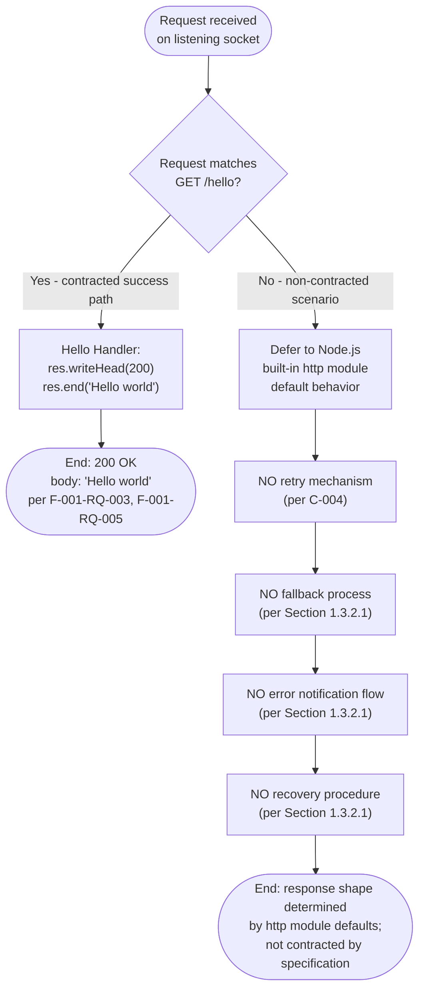

### 5.4.4 Authentication and Authorization Framework

**No authentication or authorization framework is in scope.** The "Security Requirements" row of every requirement subsection (2.2.2.1 through 2.2.2.6) records "None defined in scope." Constraint C-004 explicitly excludes authentication and authorization, and Section 1.3.2.1 reiterates the exclusion. No authorization checkpoint appears in any flowchart in Section 4.

| Identity / Access Concern | Status |
|---------------------------|--------|
| Identity provider (Auth0, Okta, AWS Cognito) | Not integrated |
| OAuth 2.0 / OIDC flows | Not implemented |
| JWT issuance or validation | Not implemented |
| Session management | Not implemented (stateless) |
| Role-based access control | Not applicable |
| API key validation | Not implemented |

Every inbound request on the listening socket is treated identically. The trust boundary is the TCP listening socket itself; the system makes no further trust distinctions.

### 5.4.5 Performance Requirements and SLAs

**No quantitative performance requirements or SLAs are defined.** No quantitative timing constraints, latency targets, throughput targets, uptime SLAs, error budgets, or cost benchmarks are defined for this project.

| Performance Dimension | Requirement |
|-----------------------|-------------|
| Request latency (p50/p95/p99) | Not defined |
| Throughput (requests per second) | Not defined |
| Concurrent connections | Not defined |
| Uptime SLA | Not defined |
| Error budget | Not defined |
| Cost benchmark | Not applicable (local execution) |

Performance characteristics will reflect the defaults of the chosen Node.js HTTP implementation. This documentation does not introduce any performance numbers, since none are sanctioned by the specification.

### 5.4.6 Disaster Recovery Procedures

**Disaster recovery is not applicable** to this system. The architecture decision (ADR-005) restricts deployment to local execution on the tutorial learner's machine. There is therefore:

- No production environment to recover.
- No data to restore (no persistence layer exists).
- No service-level continuity obligation (no SLA defined).
- No backup or replication topology to maintain.

In the event of process failure, recovery consists of re-invoking `node <file>` from the shell. No documented runbook, alerting integration, or failover automation is in scope.

### 5.4.7 Scalability Considerations

**No scalability requirements apply.** No scalability requirements apply. F-001 is a single-process tutorial. Per Section 1.3.1.3, the system boundary is a single Node.js process exposing one HTTP endpoint, with local execution as the only deployment target. Horizontal scaling, clustering, load balancing, and process management are out of scope.

The architecture's scalability profile is therefore explicitly bounded:

| Scaling Dimension | Approach |
|-------------------|----------|
| Vertical scaling | Bounded by single-process Node.js event loop on local hardware |
| Horizontal scaling | Not in scope (no clustering, no load balancer) |
| Auto-scaling | Not applicable (no orchestration) |
| Multi-region deployment | Not applicable (local execution only) |

---

## 5.5 References

### 5.5.1 Technical Specification Sections Cross-Referenced

- **1.2 SYSTEM OVERVIEW** — Provided the canonical component decomposition (HTTP Server / Route Resolver / Hello Handler), the system capabilities table, and the explicit "no KPI" declaration used in Sections 5.1.1, 5.1.2, and 5.4.5.
- **1.3 SCOPE** — Source of in-scope (one route, one method, one body) and out-of-scope catalogs informing Sections 5.1.1.2, 5.3, and 5.4.
- **2.1 FEATURE CATALOG** — F-001 feature definition and technical context used in Sections 5.1.2 and 5.2.
- **2.3 FEATURE RELATIONSHIPS** — Single integration point and three internal components referenced in Sections 5.1.2 and 5.1.4.
- **2.4 IMPLEMENTATION CONSIDERATIONS** — Technical constraints, performance/scalability/security implications referenced in Sections 5.2.1.4, 5.3.5, 5.4.5, and 5.4.7.
- **2.6 ASSUMPTIONS AND CONSTRAINTS** — Source of A-001 through A-004 and C-001 through C-006 referenced throughout Section 5.
- **3.1 Technology Stack Philosophy** — Six guiding principles enumerated in Section 5.1.1.2.
- **3.2 Programming Languages** — JavaScript / Node.js language and runtime decision used in Sections 5.2.1.2 and 5.3.1.
- **3.3 Frameworks & Libraries** — Built-in `http` module decision and framework exclusion list referenced in Sections 5.2.1 and 5.3.1.
- **3.4 Open Source Dependencies** — Zero-dependency posture used in Sections 5.3.5 and 5.3.6.3.
- **3.6 Databases & Storage** — Confirmation of no persistence layer referenced in Sections 5.1.3.4 and 5.3.3.
- **3.9 Technology Stack Architecture** — Layered stack visualization context for Section 5.1.1.1.
- **3.10 Security Implications of Technology Choices** — Security posture content used in Section 5.3.5.
- **4.1 INTRODUCTION TO SYSTEM PROCESS FLOWS** — Process flow inventory (PF-1 through PF-4) referenced in Section 5.2.5.
- **4.2 CORE SYSTEM WORKFLOWS** — Detailed request/response flow diagram reproduced in Section 5.2.6.
- **4.3 INTEGRATION WORKFLOWS** — Sequence diagram reproduced in Section 5.2.4 and integration surface in Section 5.1.3.2.
- **4.4 VALIDATION RULES AND DECISION POINTS** — Decision point catalog (D-1, D-2, D-3) referenced in Section 5.2.2.3.
- **4.5 STATE MANAGEMENT** — State transition diagram reproduced in Section 5.2.5.
- **4.6 ERROR HANDLING** — Zero-contract error posture and error-handling flowchart reproduced in Section 5.4.3.
- **4.7 TIMING AND SLA CONSIDERATIONS** — Confirmation of no SLAs referenced in Sections 5.1.4 and 5.4.5.

### 5.5.2 Repository Artifacts Examined

- `README.md` — Provided historical context confirming the prior Artifact4 Flask scaffold and the supersession of the original (never-supplied) Node.js source.
- `app/` (folder) — Surveyed to confirm the prior Flask application package is out of scope per C-005.
- `app/api/` (folder) — Surveyed to confirm the prior Flask blueprint (`GET /health`) is out of scope per C-005.
- `tests/` (folder) — Surveyed to confirm the prior pytest regression suite is out of scope per C-006.
- `blitzy/documentation/` (folder) — Surveyed for historical project-pivot context only.
- Repository root (folder) — Verified the absence of `.js` files, `package.json`, `Dockerfile`, and `.github/workflows/`, confirming this is a greenfield Node.js implementation.

### 5.5.3 Pre-Existing Diagrams Referenced or Reproduced

| Source Section | Diagram | Used In Section 5 |
|----------------|---------|-------------------|
| 1.2.2.2 | Component decomposition flowchart | 5.1.2.2 (reproduced) |
| 4.2.2.2 | Detailed F-001 request/response flowchart | 5.2.6 (reproduced) |
| 4.3.2 | Bootstrap + per-request sequence diagram | 5.2.4 (reproduced) |
| 4.5.1.2 | Server lifecycle state transition diagram | 5.2.5 (reproduced) |
| 4.6.2 | Default (non-contracted) error handling flowchart | 5.4.3.3 (reproduced) |

# 6. SYSTEM COMPONENTS DESIGN

## 6.1 Core Services Architecture

### 6.1.1 Applicability Assessment

**Core Services Architecture is not applicable for this system.**

The system specified by this document is a **monolithic single-process Node.js HTTP server** delivering a single endpoint (`GET /hello`) that returns the literal string `"Hello world"`. There are no distinct services to delineate, no inter-service network calls to mediate, no service mesh to operate, no service registry to maintain, and no distributed runtime topology to scale, balance, or recover. Every architectural primitive that the "Core Services Architecture" topic addresses — service boundaries, inter-service communication, service discovery, load balancing, circuit breakers, retry/fallback orchestration, horizontal scaling, auto-scaling, capacity planning, disaster recovery, failover, and service degradation policies — falls outside the explicitly declared system scope.

This non-applicability is not an omission; it is a deliberate, documented architectural posture established by five Architecture Decision Records (ADR-001 through ADR-005) detailed in Section 5.3 and reinforced by six constraints (C-001 through C-006) catalogued in Section 2.6.2. The remainder of this section catalogs each "Core Services Architecture" topic, demonstrates its non-applicability against the specification, and provides alternative in-process views of how the three internal logical components interact within a single Node.js process.

#### 6.1.1.1 Definitive Statement of Architectural Style

Per Section 5.1.1.1, the system is architected as a **monolithic single-process HTTP server** running on the Node.js JavaScript runtime, governed by what Section 3.1 formalizes as "tutorial-grade minimalism," where the system is composed of "one file or a very small number of files; one endpoint; one response." The runtime model is the standard Node.js request-callback pattern: a single OS process owns one listening TCP socket, the event loop drives request acceptance, and a single user-supplied callback function is invoked per incoming HTTP request.

Per Section 5.1.1.3, the system boundary is the **single Node.js OS process** hosting the HTTP server. Everything outside that process — including the operating system's TCP/IP stack, all HTTP clients (curl, browsers, Postman), and the tutorial learner's shell — is external to the system. The major interfaces are exactly one inbound HTTP/1.1 interface (the listening TCP socket), no outbound interfaces, and a process-control interface limited to SIGINT/SIGTERM signals.

#### 6.1.1.2 Governing Architectural Constraints

The following constraints from Section 2.6.2 codify the architectural boundary that renders Core Services Architecture inapplicable:

| Constraint ID | Constraint Substance | Impact on Service Architecture |
|---------------|----------------------|--------------------------------|
| C-001 | Exactly one route `/hello`; additional endpoints out of scope | Eliminates need for service decomposition |
| C-002 | Only `GET` method supported | Eliminates protocol diversity / method-based routing |
| C-003 | Plain text `"Hello world"` response only; no JSON | Eliminates content negotiation, serialization |
| C-004 | No authentication, authorization, CORS, persistence, input validation, logging infrastructure, CI/CD, or production deployment | Eliminates virtually all service-level concerns |
| C-005 | Prior Flask scaffold features (app factory, blueprints, middleware, error handlers, `/health`, WSGI server, pytest) must NOT be ported | Confirms greenfield minimal scope |
| C-006 | Future-phase items (additional routes, frameworks, test frameworks, containerization, observability) explicitly excluded | Forbids service-orchestration tooling |

#### 6.1.1.3 Architecture Decision Records Establishing Non-Applicability

The following ADRs (from Section 5.3.6) collectively forbid the technical apparatus that a Core Services Architecture would require:

| ADR | Decision | Effect on Core Services Architecture |
|-----|----------|--------------------------------------|
| ADR-001 | Pivot from Flask to Node.js | Prior multi-layer Flask scaffold (factory, blueprints, middleware) explicitly NOT ported |
| ADR-002 | Use Built-in `http` Module; No Routing Framework | Zero npm dependencies; route matching via inline conditionals |
| ADR-003 | Zero Third-Party Dependencies | No supply-chain risk; no version-pinning obligation; no service-mesh libraries |
| ADR-004 | No Build System or Transpilation | No bundling, no Docker layering, no orchestration manifests |
| ADR-005 | Local Execution Only; No Deployment Target | "No Dockerfile, no `.github/workflows/`, no Terraform, no AWS resources; the entire installation sequence is 'install Node.js.'" |

#### 6.1.1.4 System Topology Diagram

The complete runtime topology comprises one Node.js OS process owning one TCP listening socket. There are no peer processes, no sidecars, no orchestrators, no load balancers, no proxies, no message brokers, no databases, and no external integrations.

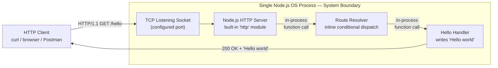

---

### 6.1.2 Service Components Analysis

#### 6.1.2.1 Service Boundaries and Responsibilities

There are no service boundaries because there are no services. Per Section 5.1.2.1, the system decomposes into exactly three **internal logical components** — Node.js HTTP Server, Route Resolver, and Hello Handler — that operate **within the same OS process**. They communicate by in-process JavaScript function invocation (the standard Node.js request-callback pattern), not by network protocol, not by IPC, and not across any process boundary.

| Topic | Status | Evidence |
|-------|--------|----------|
| Service boundaries | Not applicable | Only in-process logical components exist (Section 5.1.2.1) |
| Service responsibilities | N/A as services; defined as components | Component decomposition table (Section 5.1.2.1) |
| Service ownership | Not applicable | Single artifact owned by tutorial author (Section 5.1.1.1) |
| Service versioning | Not applicable | No versioned service surface; one literal endpoint |

The three logical components and their responsibilities (reproduced from Section 5.1.2.1 for completeness) are:

| Logical Component | Primary Responsibility | Key Dependencies |
|-------------------|------------------------|------------------|
| Node.js HTTP Server | Binds to a TCP port; accepts inbound HTTP connections | Node.js runtime; built-in `http` module; OS TCP/IP stack |
| Route Resolver | Dispatches the `/hello` path to its designated handler | Node.js HTTP Server (`req`/`res` objects) |
| Hello Handler | Produces the `"Hello world"` response payload | Route Resolver invocation; `http` module response API |

Critically, these are **components, not services**. They share an address space, share the event loop, share the call stack on every request, and exchange data via direct function arguments rather than via any networked protocol.

#### 6.1.2.2 Inter-Service Communication Patterns

There are no inter-service communication patterns because there are no inter-service interactions. The only communication crossing the system boundary is inbound HTTP/1.1, terminated at the listening socket.

| Communication Pattern | Status |
|-----------------------|--------|
| Synchronous HTTP request/response (inbound) | Selected (the sole pattern) |
| Asynchronous messaging (queues) | Excluded |
| Event-driven publish/subscribe | Excluded |
| Webhooks (outbound) | Excluded |
| Server-Sent Events / WebSockets | Excluded |
| gRPC / Thrift / GraphQL | Excluded |
| Service-to-service RPC | Not applicable (no peer services) |

Per Section 5.1.1.3, the system has exactly one integration interface: inbound HTTP/1.1 requests on the listening TCP port. "No outbound integrations, no service-to-service calls, no database connections, no message broker subscriptions, and no third-party API invocations exist."

#### 6.1.2.3 Service Discovery, Load Balancing, and Circuit Breakers

None of these mechanisms apply, because all three presuppose the existence of multiple service instances or peer services to discover, balance across, or isolate from cascading failure.

| Mechanism | Status | Authoritative Source |
|-----------|--------|----------------------|
| Service discovery (Consul, etcd, DNS-SRV, Eureka) | Not applicable — single process; nothing to discover | Section 5.1.1.3 |
| Service registry | Not applicable | Section 5.1.1.3 |
| Load balancing (L4/L7, sticky sessions, round-robin) | Not applicable — single instance; "Horizontal scaling, clustering, load balancing... are out of scope" | Section 5.4.7 |
| Reverse proxy (nginx, HAProxy, Envoy) | Not in scope | ADR-005, Section 3.9.2 |
| Circuit breaker (Hystrix, resilience4j, opossum) | Not applicable — no downstream service calls to protect | Section 5.1.3.2 |
| Bulkhead isolation | Not applicable — single in-process component chain | Section 5.1.2.1 |

The Hello Handler makes zero outbound calls, so there is nothing for a circuit breaker to wrap. The Route Resolver makes one in-process function call to the Hello Handler; an in-process call is not a candidate for circuit-breaking because the failure modes that circuit breakers address (network timeout, downstream saturation, cascading degradation) cannot occur within a single synchronous call stack.

#### 6.1.2.4 Retry and Fallback Mechanisms

Per Section 5.4.3.1, the error-handling architecture adopts a **zero-error-contract posture for non-success paths**. The specification explicitly classifies the following as not in scope:

| Mechanism | Status | Source |
|-----------|--------|--------|
| Retry mechanisms | Not in scope | Section 5.4.3.1 (C-004) |
| Fallback processes | Not in scope | Section 5.4.3.1 |
| Error notification flows | Not in scope | Section 5.4.3.1 |
| Recovery procedures | Not in scope | Section 5.4.3.1 |
| Exponential backoff / jitter | Not applicable — no retry to back off from | Section 5.4.3.1 |
| Idempotency keys | Not applicable — handler is inherently idempotent and stateless | Section 5.1.3.2 |
| Dead-letter queues | Not applicable — no asynchronous messaging | Section 5.3.2 |

Per the requirement record, requests to any path other than `/hello` and any method other than `GET` constitute "Unsupported Use Cases"; no specific error response (status code, body shape) is contracted. The implementation inherits whatever default the Node.js built-in `http` module produces.

#### 6.1.2.5 In-Process Component Interaction (Substitute View)

In place of a service interaction diagram (which would presuppose multiple services), the diagram below presents the in-process interaction sequence between the three logical components — reproduced from the canonical sequence in Section 5.2.4 — to clarify what would, in a microservices system, be the inter-service flow. Here, every arrow is an in-process function invocation, not a network call.

```mermaid
sequenceDiagram
    autonumber
    participant Client as HTTP Client
    participant Kernel as OS TCP/IP Stack
    participant Server as Node.js HTTP Server<br/>(in-process)
    participant Router as Route Resolver<br/>(in-process)
    participant Handler as Hello Handler<br/>(in-process)

    Note over Server,Handler: All participants except Client and Kernel<br/>execute within the same Node.js process

    Client->>Kernel: TCP SYN to configured port
    Kernel->>Server: accept() — connection established
    Client->>Server: HTTP/1.1 GET /hello
    Server->>Router: invoke request callback (req, res)
    Router->>Router: evaluate req.method === 'GET' && req.url === '/hello'
    Router->>Handler: in-process function call
    Handler->>Server: res.writeHead(200); res.end('Hello world')
    Server->>Client: HTTP/1.1 200 OK + body
```

---

### 6.1.3 Scalability Design Analysis

#### 6.1.3.1 Applicability Statement

Per Section 5.4.7 (verbatim): *"No scalability requirements apply. F-001 is a single-process tutorial. Per Section 1.3.1.3, the system boundary is a single Node.js process exposing one HTTP endpoint, with local execution as the only deployment target. Horizontal scaling, clustering, load balancing, and process management are out of scope."*

Per Section 5.4.5 (verbatim): *"No quantitative performance requirements or SLAs are defined."* No latency target, throughput target, concurrency target, uptime SLA, error budget, or cost benchmark exists. This documentation therefore introduces no performance numbers, as none are sanctioned by the specification.

#### 6.1.3.2 Horizontal and Vertical Scaling Approach

| Scaling Dimension | Status / Approach | Source |
|-------------------|-------------------|--------|
| Vertical scaling | Bounded by single-process Node.js event loop on local hardware; no explicit tuning | Section 5.4.7 |
| Horizontal scaling | Not in scope — no clustering, no load balancer | Section 5.4.7 |
| Multi-process (Node.js `cluster` module) | Not in scope | ADR-002, Section 5.3.1.2 |
| Multi-region deployment | Not applicable — local execution only | Section 5.4.7 (ADR-005) |

The architectural trade-off was explicitly acknowledged in Section 5.3.1.2: *"Trading horizontal scalability for process simplicity. A single-process design cannot scale across CPU cores without clustering, but clustering is explicitly out of scope."*

#### 6.1.3.3 Auto-Scaling Triggers and Rules

| Auto-Scaling Concern | Status |
|----------------------|--------|
| Auto-scaling triggers (CPU, memory, request rate) | Not applicable — no orchestration platform |
| Scaling rules (min/max replicas, cooldown) | Not applicable |
| Predictive scaling | Not applicable |
| Schedule-based scaling | Not applicable |
| Custom metrics scaling | Not applicable |

Per Section 5.4.7, "Auto-scaling — Not applicable (no orchestration)." There is no Kubernetes HPA/VPA, no AWS Auto Scaling Group, no GCP Managed Instance Group, no Azure VMSS, no Docker Swarm replica directive, no serverless concurrency setting, and no analogous mechanism in the scope of this project.

#### 6.1.3.4 Resource Allocation Strategy

| Resource Allocation Concern | Status |
|-----------------------------|--------|
| CPU requests/limits | Not applicable — no container orchestration |
| Memory requests/limits | Not applicable |
| Connection pool sizing | Not applicable — no downstream connections |
| Thread pool tuning | Not applicable — Node.js single-threaded event loop, no custom worker pool |
| File descriptor budgeting | Inherits OS defaults; not contracted |

Resource allocation is governed exclusively by Node.js runtime defaults on the learner's local machine. The specification declares no allocation rules.

#### 6.1.3.5 Performance Optimization Techniques

| Performance Optimization Concern | Status |
|----------------------------------|--------|
| Caching layers (CDN, Redis, Memcached) | Not in scope (Section 5.1.3.4) |
| HTTP response caching headers | Not specified in any requirement (Section 5.1.3.4) |
| Database query optimization | Not applicable — no database (Section 5.1.3.4) |
| Connection keep-alive tuning | Inherits Node.js `http` module defaults |
| Compression (gzip, brotli) | Not in scope |
| Code-level micro-optimization | Not in scope; tutorial clarity prioritized over micro-performance |

The system's performance profile is whatever the Node.js runtime and built-in `http` module produce on the host. Per Section 5.4.5, "these characteristics are not the subject of formal measurement in this specification."

#### 6.1.3.6 Capacity Planning Guidelines

No capacity planning guidelines are defined. The system has no production capacity target, no throughput sizing model, no concurrency model, and no demand forecast. Per Section 5.4.5, no quantitative dimension (latency p50/p95/p99, throughput requests-per-second, concurrent connections, uptime, error budget, or cost) is defined for this project.

#### 6.1.3.7 Scalability Boundary Diagram

The diagram below contrasts what is **in scope** (a single Node.js process) with the scalability apparatus **explicitly out of scope** by constraint, ADR, or Section 5.4.7. Dashed lines indicate explicit exclusion.

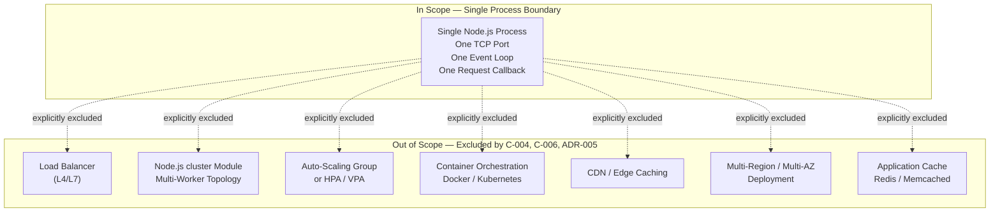

---

### 6.1.4 Resilience Patterns Analysis

#### 6.1.4.1 Applicability Statement

Per Section 5.4.6 (verbatim): *"Disaster recovery is not applicable to this system. The architecture decision (ADR-005) restricts deployment to local execution on the tutorial learner's machine. There is therefore: no production environment to recover; no data to restore (no persistence layer exists); no service-level continuity obligation (no SLA defined); no backup or replication topology to maintain."*

Per Section 5.4.6: *"In the event of process failure, recovery consists of re-invoking `node <file>` from the shell. No documented runbook, alerting integration, or failover automation is in scope."*

#### 6.1.4.2 Fault Tolerance Mechanisms

| Fault Tolerance Mechanism | Status | Source |
|---------------------------|--------|--------|
| Retry with exponential backoff | Not in scope | Section 5.4.3.1 (C-004) |
| Fallback responses | Not in scope | Section 5.4.3.1 |
| Circuit breaker | Not applicable — no protected downstream calls | Section 6.1.2.3 |
| Bulkhead isolation | Not applicable — single component chain | Section 5.1.2.1 |
| Timeout strategies (per call) | Not contracted; inherits `http` module defaults | Section 5.4.3.1 |
| Graceful degradation | Not contracted; no degraded mode defined | Section 5.4.3.1 |
| Idempotency for safe replay | Inherent — handler is stateless and deterministic | Section 5.1.3.2 |

The Hello Handler is, by construction, deterministic and stateless and performs no I/O beyond writing the response stream. This eliminates classes of fault to which fault-tolerance mechanisms would respond (downstream timeouts, partial failures, partial commits), but it does so by removing the upstream conditions, not by adding tolerance machinery.

#### 6.1.4.3 Disaster Recovery Procedures

| Disaster Recovery Concern | Status | Source |
|---------------------------|--------|--------|
| Production environment to recover | None — local execution only | Section 5.4.6 (ADR-005) |
| RTO (Recovery Time Objective) | Not defined — no SLA exists | Section 5.4.6 |
| RPO (Recovery Point Objective) | Not defined — no persisted state exists | Section 5.4.6 |
| Backup procedures | Not applicable — no data | Section 5.4.6 |
| Restore procedures | Not applicable — no data | Section 5.4.6 |
| Runbook / playbook | Not in scope | Section 5.4.6 |
| Alerting integration | Not in scope (no monitoring) | Section 5.4.1 |
| Recovery action on failure | Re-invoke `node <file>` from shell | Section 5.4.6 |

#### 6.1.4.4 Data Redundancy Approach

There is no data, and therefore no data redundancy.

| Data Redundancy Concern | Status |
|-------------------------|--------|
| Primary database | None (Section 5.1.3.4) |
| Secondary / replica database | None (Section 5.1.3.4) |
| Object/document store | None (Section 5.1.3.4) |
| File system persistence | None (Section 5.1.3.4) |
| In-memory state across requests | None (Section 5.1.3.4) |
| Replication topology | Not applicable |
| Backup retention policy | Not applicable |

The response body `"Hello world"` is a hard-coded literal in the application source, not data managed by a persistence layer.

#### 6.1.4.5 Failover Configurations

| Failover Concern | Status | Source |
|------------------|--------|--------|
| Active-passive failover | Not applicable — single instance | Section 5.4.7 |
| Active-active failover | Not applicable — single instance | Section 5.4.7 |
| Health-check based traffic shifting | Not applicable — no load balancer; no `/health` endpoint | Section 5.4.1 |
| DNS failover | Not applicable — local execution | Section 5.4.6 |
| Cross-AZ / cross-region failover | Not applicable — local execution | Section 5.4.6 |
| Process supervisor (systemd, PM2, supervisord) | Not in scope | ADR-005 |
| Container restart policy | Not applicable — no container | ADR-004, ADR-005 |

The prior Flask scaffold's `GET /health` endpoint is not in scope per C-005, so there is no probe surface that a hypothetical orchestrator could consume even if one were present.

#### 6.1.4.6 Service Degradation Policies

| Degradation Concern | Status |
|---------------------|--------|
| Defined degraded modes | None — no degraded mode defined |
| Feature toggles for graceful degradation | Not in scope (no feature flag system) |
| Read-only mode | Not applicable (no writes exist) |
| Shed-load thresholds | Not contracted |
| Maintenance mode | Not in scope |
| Brown-out vs black-out distinction | Not applicable |

The system has exactly two operational states: **running** (the contracted `200 OK` response is served for `GET /hello`) and **not running** (the process is absent and the TCP socket is closed). No intermediate degraded state is defined.

#### 6.1.4.7 Resilience Posture Diagram

The diagram below contrasts the implemented resilience posture (zero-error-contract, manual restart) with the resilience patterns that are not applicable to the system.

```mermaid
flowchart LR
    subgraph Implemented["Implemented Resilience Posture"]
        direction TB
        ZEC["Zero-Error-Contract<br/>Non-success paths defer<br/>to http module defaults"]
        Restart["Manual Recovery<br/>Re-invoke 'node file.js'<br/>from the shell"]
        Stateless["Inherent Idempotency<br/>Stateless deterministic handler"]
    end

    subgraph NotApplicable["Patterns Not Applicable to System Scope"]
        direction TB
        NoRetry["Retry / Backoff<br/>Not in scope (C-004)"]
        NoFallback["Fallback Process<br/>Not in scope"]
        NoCircuit["Circuit Breaker<br/>No downstream to protect"]
        NoBulkhead["Bulkhead Isolation<br/>Single component chain"]
        NoFailover["Failover Automation<br/>Single local process"]
        NoDR["Disaster Recovery<br/>No production env"]
        NoBackup["Backup / Replication<br/>No data exists"]
        NoDegrade["Degradation Modes<br/>No degraded state defined"]
    end
```

---

### 6.1.5 Architectural Trade-offs Accepted

The specification explicitly acknowledges and accepts the following trade-offs that confirm the non-applicability of Core Services Architecture (per Section 5.3.1.2):

| Trade-off | What Is Traded | What Is Gained |
|-----------|----------------|----------------|
| Horizontal scalability for process simplicity | Multi-core / multi-node scaling | A single-file tutorial readable end-to-end in one screen |
| Routing-framework ergonomics for zero dependencies | Express/Fastify/Koa convenience | Zero npm dependencies; no supply-chain risk |
| Structured error responses for `http` module defaults | Bespoke 404/405 bodies, content negotiation | Zero error-handling code; deferred to runtime defaults |
| Production deployability for tutorial focus | Containerization, orchestration, observability | `install Node.js` is the entire installation procedure |
| Service decomposition for in-process clarity | Independent deployability, polyglot freedom | A single linear request callback that fits the pedagogy |

These trade-offs are not deficits; they are the architectural style. Re-introducing any of the items in the "What Is Traded" column would, by the specification's own constraints (C-004, C-005, C-006) and ADRs (ADR-001 through ADR-005), constitute a violation of scope.

---

### 6.1.6 Summary

A "Core Services Architecture" section presupposes a system composed of multiple services that must be bounded, discovered, balanced, called, retried, scaled, and recovered. This system has exactly one process exposing exactly one endpoint returning exactly one literal string. None of those presuppositions are met. Accordingly:

- There are **no service components** to delineate — only three in-process logical components communicating via direct function calls (Section 6.1.2).
- There is **no scalability design** — single-process execution on local hardware is the bounded scaling profile, and no quantitative performance target exists to scale toward (Section 6.1.3).
- There are **no resilience patterns** to implement beyond inherent statelessness — recovery is manual re-invocation of `node <file>`, and no SLA, RTO, RPO, backup, replication, or failover obligation exists (Section 6.1.4).

For the architectural views that would, in a microservices system, be addressed under this heading, the reader is directed to:

- **Component interaction (in-process)**: Sections 5.1.2.2 and 6.1.2.5
- **Per-request sequence flow**: Section 5.2.4
- **Single-process lifecycle states**: Section 5.2.5
- **Zero-error-contract flow**: Section 5.4.3.3
- **Layered stack — in-scope vs out-of-scope tiers**: Sections 3.9.1 and 3.9.2

---

### 6.1.7 References

#### Technical Specification Sections Consulted

- **Section 1.2 SYSTEM OVERVIEW** — System positioning as Node.js tutorial; high-level component interaction; explicit absence of KPIs/SLAs
- **Section 1.3 SCOPE** — Catalog of in-scope (`/hello` endpoint) and out-of-scope items (no auth, no DB, no scaling, no production deployment); prior Flask scaffold superseded
- **Section 2.4 IMPLEMENTATION CONSIDERATIONS** — Confirms no scalability or performance requirements apply; explicit security exclusions
- **Section 2.6 ASSUMPTIONS AND CONSTRAINTS** — Constraints C-001 through C-006 codifying architectural boundaries
- **Section 3.1 Technology Stack Philosophy** — "Tutorial-grade minimalism" principle
- **Section 3.9 Technology Stack Architecture** — Layered stack diagram showing absence of intermediate tiers; in-scope vs out-of-scope visualization
- **Section 4.3 INTEGRATION WORKFLOWS** — Confirms one inbound HTTP interface; explicitly enumerates non-applicable integration patterns
- **Section 5.1 HIGH-LEVEL ARCHITECTURE** — Definitive "monolithic single-process HTTP server" statement; three in-process logical components
- **Section 5.2 COMPONENT DETAILS** — Per-component confirmation that scaling/persistence are not applicable; reusable sequence and state diagrams
- **Section 5.3 TECHNICAL DECISIONS** — Architecture Decision Records ADR-001 through ADR-005 codifying non-applicability; explicit architectural trade-offs in Section 5.3.1.2
- **Section 5.4 CROSS-CUTTING CONCERNS** — Definitive "not applicable" statements for monitoring (5.4.1), logging (5.4.2), error retry/fallback (5.4.3), authentication (5.4.4), performance/SLAs (5.4.5), disaster recovery (5.4.6), and scalability (5.4.7)

#### Repository Artifacts Examined

- `/` (repository root) — Confirmed pre-existing Flask/Python scaffold (no `package.json`, no `.js` source files, no `node_modules`); files present include `wsgi.py`, `requirements.txt`, `Procfile`, `pyproject.toml`, `.env.example`, plus `app/`, `blitzy/`, `tests/` directories
- `app/` — Confirmed Flask-only structure (`__init__.py`, `config.py`, `errors.py`, `extensions.py`, `middleware.py`, `api/`) — used as evidence that the prior scaffold is being superseded by the new Node.js tutorial
- `README.md` — Confirmed current state describes the Flask Python scaffold being superseded by the Node.js tutorial described in this specification

## 6.2 Database Design

### 6.2.1 Applicability Determination

#### 6.2.1.1 Statement of Non-Applicability

**Database Design is not applicable to this system.**

The system specified by this Technical Specification — a tutorial-grade Node.js HTTP server exposing a single `GET /hello` endpoint that returns the literal string `"Hello world"` — has no database, no persistence layer, no object store, no file-system writes, no in-memory state across requests, and no cache of any kind. The absence of persistence is not an oversight, a deferred concern, or a future-phase consideration; it is a deliberate architectural constraint codified throughout the specification and enforced by the system's guiding principles.

Because the system holds no data, the entire body of disciplines that constitute database design — schema modeling, indexing, partitioning, replication, backup, migration, versioning, archival, caching, retention, query optimization, connection pooling, read/write splitting, and batch processing — has no concrete subject matter in this project. This section therefore documents the determination of non-applicability, surveys each prescribed concern to demonstrate the determination is complete, and references the architectural sources that establish the constraint.

#### 6.2.1.2 Architectural Justification

The determination rests on multiple, mutually reinforcing statements drawn from the specification:

| Architectural Source | Statement Establishing Non-Applicability |
|----------------------|------------------------------------------|
| Section 1.2.1.3 — Integration with Existing Enterprise Landscape | "No enterprise systems, third-party APIs, identity providers, databases, message brokers, or downstream services integrate with this project" |
| Section 1.2.2.3 — Core Technical Approach | "Stateless Handling: No session state, no persistence, no in-memory caches" |
| Section 1.3.1.3 — Implementation Boundaries | "Data Domains: None; the system holds no data" |
| Section 1.3.2.1 — Explicitly Excluded Capabilities | "Database / Persistence: The endpoint returns a literal string; no data store is needed" |
| Section 3.6.1 — Data Persistence Strategy | "No data persistence layer exists in this system. The strategy is explicit and intentional" |
| Section 3.6.4 — Excluded Default-Stack Storage | The default stack's MongoDB designation "is not used in this project. No alternative database (PostgreSQL, MySQL, SQLite, DynamoDB, etc.) replaces it; the system holds no data, by design" |
| Section 5.1.1.2 — Architectural Principles | "Stateless Handling: No databases, caches, sessions, or persistence layers" |
| Section 5.1.1.3 — System Boundaries and Major Interfaces | "no database connections, no message broker subscriptions, and no third-party API invocations exist" |
| Section 5.1.3.4 — Data Stores and Caches | "The system contains no data stores and no caches" |

The system's single feature (F-001: `GET /hello`) produces a deterministic response from a hard-coded literal embedded in source code. The Hello Handler component, per Section 5.2.3.2, performs "No I/O: No file system, network, or database access occurs." There is no data to model, no records to index, no entities to relate, and no transactions to manage. Consequently, every prescribed sub-topic of this section resolves to non-applicability.

---

### 6.2.2 Non-Applicability Analysis by Concern

This subsection surveys each topic prescribed by the Database Design section template and documents the specific architectural reason it does not apply to this system.

#### 6.2.2.1 Schema Design and Data Models

| Prescribed Topic | Non-Applicability Rationale |
|------------------|------------------------------|
| Entity Relationships | No entities exist. Section 1.3.1.3 declares "Data Domains: None." The Hello Handler operates on a single hard-coded string literal, which is neither an entity nor a record. |
| Data Models and Structures | No domain model exists. The only "data" in the system is the constant `"Hello world"`, which is part of the source code, not the data model. |
| Indexing Strategy | Indexes are physical artifacts that accelerate retrieval against a stored dataset. With no dataset, indexing is meaningless. |
| Partitioning Approach | Partitioning distributes records across storage units; with zero records, no partitioning scheme applies. |
| Replication Configuration | Per Section 3.6.1, no primary database exists, therefore no secondary or replica database exists either. The replication concern is undefined in the absence of a source database. |
| Backup Architecture | Section 3.6.3 states explicitly: "Backup services: No — Nothing to back up." There is no state to capture, no schema to preserve, no audit trail to retain. |

The absence of a schema implies the absence of constraints. There are no primary keys, foreign keys, uniqueness constraints, check constraints, or referential-integrity rules in this system because there is no table, document, or record-bearing structure of any kind.

#### 6.2.2.2 Data Management and Lifecycle

| Prescribed Topic | Non-Applicability Rationale |
|------------------|------------------------------|
| Migration Procedures | Migrations evolve a schema between versions. With no schema, no version-to-version transition exists. The project also has no migration tooling (no Knex migrations, no node-pg-migrate, no Sequelize CLI, no Mongoose schema versioning). |
| Versioning Strategy | Versioning concerns the evolution of stored data structures. No structures exist to version. |
| Archival Policies | Section 3.6.3 states: "Archive storage: No — No data lifecycle." Data archival presupposes a data lifecycle; this system has none. |
| Data Storage and Retrieval Mechanisms | The "retrieval" performed by `GET /hello` retrieves no data: it returns a compile-time constant. No storage I/O occurs. |
| Caching Policies | Section 3.6.2 marks every cache type Not Applicable: application-level cache "Not applicable — the system is stateless and the response is a constant literal"; distributed cache "Not applicable — no shared state to cache"; HTTP cache headers "Not specified in any in-scope requirement"; CDN caching "Not applicable — no CDN; local execution only." |

The system's deterministic response, declared in Section 1.2.2.3, makes caching strictly redundant. Even a hypothetical reverse-proxy or HTTP-level cache would offer no meaningful benefit because the operation it would cache is the return of a literal that imposes no measurable computational cost.

#### 6.2.2.3 Compliance Considerations

| Prescribed Topic | Non-Applicability Rationale |
|------------------|------------------------------|
| Data Retention Rules | Section 2.4.4 documents "Data Persistence Risks: None — no data store is used." With nothing stored, there is nothing to retain. No GDPR, CCPA, HIPAA, or PCI scope applies. |
| Backup and Fault Tolerance Policies | Section 3.6.3 confirms "Nothing to back up." Fault tolerance for storage layers (replication lag, failover policies, point-in-time recovery) does not apply because no storage layer exists. The system's stateless nature means restart is the recovery model. |
| Privacy Controls | No personally identifiable information (PII), no user records, no session data, no cookies, no telemetry, and no logs containing user data are produced or stored. The endpoint accepts no input parameters (per Section 1.3.2.1: "Input Validation Schemas: The endpoint accepts no input parameters"), so no user-supplied data ever enters the system. |
| Audit Mechanisms | Section 1.3.2.1 explicitly excludes logging infrastructure: "Beyond minimal defaults, no logging system is required." No audit trail, no change history, and no access-log retention is required because there is no privileged data to audit access against. |
| Access Controls | Section 1.3.2.1 excludes "Authentication / Authorization." The endpoint is intentionally open and unauthenticated. No database role model (e.g., `GRANT`/`REVOKE`, IAM database roles, row-level security) applies because no database exists. |

Because the system handles no personal data, no regulated data, and no commercial transactions, the system is outside the scope of every data-protection regulatory framework that targets stored data. This is consistent with the system's positioning per Section 1.2.1.1 as "a tutorial reference, not a production system."

#### 6.2.2.4 Performance Optimization

| Prescribed Topic | Non-Applicability Rationale |
|------------------|------------------------------|
| Query Optimization Patterns | No queries are issued by this system. The Route Resolver performs only two synchronous string comparisons (`req.method === 'GET'` and `req.url === '/hello'`), per Section 5.1.2.1. These are application-layer dispatch checks, not database queries. |
| Caching Strategy | Comprehensively addressed in 6.2.2.2. Every cache tier is marked Not Applicable in Section 3.6.2. |
| Connection Pooling | Database connection pooling (HikariCP, pg-pool, mongoose connection pool, etc.) requires a database to connect to. Per Section 5.1.1.3, the system has "no database connections" — pool sizing, eviction policy, leak detection, and timeout tuning are all undefined concerns. |
| Read/Write Splitting | Read/write splitting routes reads to replicas and writes to the primary. With neither a primary nor a replica (per Section 3.6.1), the splitting concern does not arise. |
| Batch Processing Approach | Section 5.1.3.2 declares the integration pattern as "synchronous request/response only." The system has no batch jobs, no scheduled tasks, no ETL pipelines, and no bulk loaders. Each request is handled independently and synchronously. |

Performance characteristics of this system, per Section 1.2.3.3, "will reflect the defaults of the chosen Node.js HTTP implementation and are not the subject of formal measurement in this specification." No quantitative performance targets exist that would necessitate database-layer optimization in any case.

---

### 6.2.3 Consolidated Non-Applicability Matrix

The following matrix consolidates every prescribed Database Design concern, its applicability status, and the authoritative architectural source establishing the determination.

| Database Design Concern | Applicability | Authoritative Source |
|-------------------------|---------------|----------------------|
| Entity Relationships / ERD | Not applicable | Section 1.3.1.3 — no data domains |
| Data Models and Structures | Not applicable | Section 3.6.1 — no persistence layer |
| Indexing Strategy | Not applicable | Section 3.6.1 — no primary database |
| Partitioning Approach | Not applicable | Section 3.6.1 — no records to partition |
| Replication Configuration | Not applicable | Section 3.6.1 — no primary/replica DB |
| Backup Architecture | Not applicable | Section 3.6.3 — "Nothing to back up" |
| Migration Procedures | Not applicable | Section 3.6.4 — no schema to migrate |
| Versioning Strategy | Not applicable | Section 3.6.1 — no data stores exist |
| Archival Policies | Not applicable | Section 3.6.3 — "No data lifecycle" |
| Storage and Retrieval Mechanisms | Not applicable | Section 5.1.3.4 — no data persistence points |
| Caching Policies | Not applicable | Section 3.6.2 — stateless, constant response |
| Data Retention Rules | Not applicable | Section 2.4.4 — no data store risks |
| Backup / Fault Tolerance Policies | Not applicable | Section 3.6.3 — nothing to back up |
| Privacy Controls | Not applicable | Section 2.4.4 — no PII processed or stored |
| Audit Mechanisms | Not applicable | Section 1.3.2.1 — no logging infrastructure |
| Access Controls | Not applicable | Section 1.3.2.1 — no auth/authz in scope |
| Query Optimization Patterns | Not applicable | Section 5.1.3.4 — no queries issued |
| Caching Strategy | Not applicable | Section 3.6.2 — every cache tier N/A |
| Connection Pooling | Not applicable | Section 5.1.1.3 — no database connections |
| Read/Write Splitting | Not applicable | Section 3.6.1 — no primary/replica topology |
| Batch Processing Approach | Not applicable | Section 5.1.3.2 — synchronous request/response only |

Every prescribed concern resolves to non-applicability. No subset of database design disciplines is partially in scope.

---

### 6.2.4 Required Diagrams — Inapplicability and Reference Architecture

#### 6.2.4.1 Reasons the Prescribed Diagrams Cannot Be Produced

The Database Design section template prescribes three diagrams: database schema diagrams (ERDs), data flow diagrams illustrating persistence, and replication architecture diagrams. None of these can be meaningfully produced for this system, for the reasons enumerated below.

| Required Diagram | Reason Not Produced |
|------------------|---------------------|
| Database Schema Diagram (ERD) | An ERD depicts entities, attributes, and relationships within a database schema. This system has zero entities, zero attributes, and zero schemas. Section 1.3.1.3 establishes "Data Domains: None; the system holds no data." An empty ERD would convey no architectural information. |
| Data Flow Diagram (Persistence) | A persistence data flow diagram traces data from sources, through transformations, into and out of stores. The system has no transformations (per Section 5.1.3.3: "The application contributes no transformation logic — the response body \"Hello world\" is a hard-coded literal") and no stores (per Section 5.1.3.4). The full data flow is already documented as the synchronous request/response chain in Sections 1.2.2.2 and 5.1.2.2. |
| Replication Architecture | Replication architectures depict primary/replica relationships, log-shipping topologies, or distributed-consensus quorums. The system has no primary database (Section 3.6.1), making the diagram subject undefined. |
| Indexes and Constraints Catalog | The template instruction to "Document all indexes and constraints" produces an empty catalog: there are zero indexes (no tables), zero primary keys, zero foreign keys, zero uniqueness constraints, zero check constraints, and zero referential-integrity constraints. |

#### 6.2.4.2 Reference Architecture Highlighting Absence of Persistence

While the prescribed diagrams cannot be produced as schemas or replication topologies, the architectural intent of "no persistence" can be visualized by depicting the canonical request flow alongside the persistence-layer components that are deliberately omitted. The diagram below adapts the component flow from Sections 1.2.2.2 and 5.1.2.2 and explicitly enumerates the absent persistence concerns so that the architectural decision is unambiguous.

```mermaid
flowchart LR
    Client["HTTP Client<br/>(browser, curl, Postman)"]
    Server["Node.js HTTP Server<br/>(built-in http module)"]
    Router["Route Resolver<br/>(matches GET /hello)"]
    Handler["Hello Handler<br/>(returns hard-coded literal)"]

    Client -->|"GET /hello"| Server
    Server --> Router
    Router --> Handler
    Handler -->|"'Hello world'"| Server
    Server -->|"HTTP 200 OK"| Client

    subgraph AbsentPersistence["Persistence Layer — INTENTIONALLY ABSENT (per Sections 3.6 and 5.1.3.4)"]
        NoPrimary["No Primary Database<br/>(no SQL/NoSQL store)"]
        NoReplica["No Replica Database<br/>(no read/write splitting)"]
        NoCache["No Cache Layer<br/>(no Redis, no in-process LRU)"]
        NoObject["No Object Store<br/>(no S3 / GCS / Azure Blob)"]
        NoFS["No File-System Persistence<br/>(no logs, no fixtures, no temp files)"]
        NoMemory["No Cross-Request Memory<br/>(no sessions, no globals)"]
        NoQueue["No Message Broker<br/>(no Kafka, no RabbitMQ)"]
    end
```

The request-handling chain (top row) is self-contained: the Hello Handler emits its response from a hard-coded literal without invoking any component in the lower cluster. The "Persistence Layer — INTENTIONALLY ABSENT" subgraph is intentionally disconnected from the request flow to communicate visually that no edge — no read, no write, no connection — crosses the boundary between application and persistence concerns in this system.

#### 6.2.4.3 Schema Constraints Catalog (Empty)

For traceability, the indexes and constraints catalog prescribed by the template is provided here as an empty register, confirming that the catalog has been considered and is exhaustively empty.

| Constraint Category | Count | Notes |
|---------------------|-------|-------|
| Primary Keys | 0 | No tables or documents |
| Foreign Keys | 0 | No referential relationships exist |
| Unique Constraints | 0 | No columns or fields exist |
| Check Constraints | 0 | No domain rules to enforce |
| Indexes (Clustered / Non-Clustered) | 0 | No retrieval paths to optimize |
| Partition Keys | 0 | No partitioning scheme |
| Triggers / Stored Procedures | 0 | No database engine present |

---

### 6.2.5 Forward-Looking Considerations

#### 6.2.5.1 Future Phase Acknowledgement

Section 1.3.2.3 enumerates items that are "not part of the current request but could be considered in hypothetical future phases":

- Addition of further endpoints (e.g., `/goodbye`, `/echo`, parameterized routes)
- Introduction of a routing framework (e.g., Express, Fastify, Koa)
- Adoption of a testing framework (e.g., Jest, Mocha, node:test)
- Containerization (e.g., Dockerfile)
- Migration of the prior Flask scaffold features into Node.js
- Production hosting, observability, or operational tooling

**A database is not among these forward-looking items.** The "Stateless Handling" principle declared in Sections 1.2.2.3, 3.1.1, and 5.1.1.2 is an enforced architectural constraint (codified as constraint C-004 in Section 5.1.1.2), not a deferred capability. No phased introduction of persistence is contemplated by this specification.

#### 6.2.5.2 Conditions That Would Trigger a Database Introduction

A subsequent project that genuinely required persistence (and which would therefore require a Database Design section with substantive content) would necessarily depart from the current scope in one or more of the following ways:

| Trigger Condition | Why It Would Require Persistence |
|-------------------|-----------------------------------|
| Endpoint that returns dynamic, user-specific data | Requires a record store keyed by user identity |
| Endpoint that accepts and stores input | Requires write-side persistence and durability |
| Multi-user state or sessions | Requires session store or distributed cache |
| Audit / compliance logging requirement | Requires durable log retention with integrity guarantees |
| Cross-instance shared state | Requires a distributed datastore or cache |
| Reporting / analytics surface | Requires an OLAP store or warehouse |

None of these conditions are present in the current specification. Should a future revision introduce any of them, the Database Design section would need to be rewritten with substantive schema modeling, indexing strategy, replication topology, backup architecture, and the full set of disciplines surveyed in Section 6.2.2.

#### 6.2.5.3 Repository State Confirming Non-Applicability

The current repository state (described in Section 1.2.1.2) contains a prior Flask scaffold that itself includes no persistence layer. The scaffold's `requirements.txt` lists Flask, python-dotenv, gunicorn, and Werkzeug — none of which are database drivers, ORMs, or persistence libraries. The `app/extensions.py` module is documented as a no-op placeholder for future Flask extensions; no SQLAlchemy, no Flask-Migrate, no PyMongo, and no other persistence binding is wired. The `.env.example` template defines only Flask configuration variables (`FLASK_APP`, `APP_CONFIG`, `SECRET_KEY`, `PORT`, `LOG_LEVEL`); it contains no `DATABASE_URL` or equivalent connection string in its baseline. The repository state thus mirrors the specification's intent: no persistence exists today, and none is to be introduced by the new Node.js tutorial implementation.

---

### 6.2.6 References

#### 6.2.6.1 Technical Specification Sections Cross-Referenced

- **Section 1.2 SYSTEM OVERVIEW** — Established stateless handling principle (1.2.2.3) and absence of enterprise integrations including databases (1.2.1.3); declared the tutorial-reference positioning that makes persistence unnecessary (1.2.1.1).
- **Section 1.3 SCOPE** — Documented "Data Domains: None; the system holds no data" (1.3.1.3) and the explicit exclusion of database/persistence (1.3.2.1); confirmed future-phase items do not include a database (1.3.2.3).
- **Section 2.1 FEATURE CATALOG** — Confirmed the single feature F-001 has "no persistence concerns" and zero external dependencies.
- **Section 2.4 IMPLEMENTATION CONSIDERATIONS** — Confirmed "Data Persistence Risks: None — no data store is used."
- **Section 3.1 Technology Stack Philosophy** — Declared "No databases, caches, sessions, or persistence layers" as a guiding principle.
- **Section 3.6 Databases & Storage** — Authoritative source for non-applicability; provided the comprehensive tables of persistence concerns, caching strategies, storage services, and excluded default-stack components.
- **Section 5.1 HIGH-LEVEL ARCHITECTURE** — Confirmed at the architectural level that the system "contains no data stores and no caches" (5.1.3.4) and that the system boundary excludes "database connections" (5.1.1.3).
- **Section 5.2 COMPONENT DETAILS** — Confirmed at the component level that the Hello Handler performs "No I/O: No file system, network, or database access occurs."
- **Section 6.1 Core Services Architecture** — Confirmed that the system is not a microservices architecture requiring database services per service.

#### 6.2.6.2 Repository Files Examined

- `requirements.txt` — Inventoried current Flask scaffold dependencies; confirmed zero database drivers, ORMs, or persistence libraries are present.
- `.env.example` — Inventoried environment-variable template; confirmed no `DATABASE_URL` or analogous persistence configuration is defined in the baseline.
- `app/extensions.py` — Confirmed described as a no-op placeholder for future extensions; no SQLAlchemy or other persistence binding is wired.

#### 6.2.6.3 Repository Folders Surveyed

- `/` (repository root) — Enumerated top-level artifacts; confirmed no database files, no migrations directory, no fixtures, no schema files exist.
- `app/` — Surveyed the current Flask application package; confirmed no `models/` subfolder, no database module, no ORM configuration, no migration tooling.

## 6.3 Integration Architecture

### 6.3.1 Applicability Determination

#### 6.3.1.1 Statement of Limited Applicability

**Integration Architecture is largely not applicable to this system.** The system specified by this Technical Specification — a tutorial-grade Node.js HTTP server exposing a single `GET /hello` endpoint that returns the literal string `"Hello world"` — possesses exactly **one inbound integration surface** (HTTP/1.1 over TCP on a single listening port) and **zero outbound integrations** of any kind. Specifically, the system performs no service-to-service calls, opens no database connections, subscribes to no message brokers, invokes no third-party APIs, federates with no identity providers, consumes no external configuration services, and emits no telemetry to any external collector.

The single inbound HTTP surface, being part of the system's only feature (F-001), is documented as the minimal subject of this section. Every other integration concern enumerated by the section prompt — authentication methods, authorization framework, rate limiting strategy, API versioning, OpenAPI/Swagger documentation, event processing, message queues, stream processing, batch processing, third-party integration patterns, legacy system bridges, API gateway configuration, and external service contracts — resolves to non-applicability against the authoritative sources cited below. This section therefore documents the minimal inbound surface where prescribed, surveys each non-applicable concern systematically, and references the architectural decisions that establish the constraint.

#### 6.3.1.2 Architectural Justification

The determination rests on multiple mutually reinforcing statements drawn from across the specification:

| Architectural Source | Statement Establishing the Integration Posture |
|----------------------|------------------------------------------------|
| Section 1.2.1.3 — Integration with Existing Enterprise Landscape | "No enterprise systems, third-party APIs, identity providers, databases, message brokers, or downstream services integrate with this project. The system stands alone and is intended to be run locally by the tutorial learner." |
| Section 3.5.1 — External Services Inventory | "There are zero external third-party services integrated with this system... No service integration exists; no API keys, secrets, service accounts, or credentials are required." |
| Section 4.3.1 — Integration Surface Definition | "The system has exactly one integration interface: inbound HTTP/1.1 requests on the listening TCP port. No outbound integrations, no service-to-service calls, no database connections, no message broker subscriptions, and no third-party API invocations exist." |
| Section 5.1.1.3 — System Boundaries and Major Interfaces | One inbound interface (HTTP/1.1 listening socket); no outbound interfaces; process-control limited to SIGINT/SIGTERM. |
| Section 5.1.3.2 — Integration Patterns and Protocols | "The integration pattern is synchronous request/response only." All asynchronous patterns explicitly inapplicable. |
| Section 5.3.2 — Communication Pattern Choices | Synchronous HTTP request/response is the **sole** selected pattern; queues, pub/sub, webhooks, SSE/WebSockets, and gRPC/GraphQL all marked Excluded. |

#### 6.3.1.3 Governing Constraints

The following constraints from Section 2.6.2 codify the architectural boundary that renders most integration concerns inapplicable:

| Constraint ID | Constraint Substance | Impact on Integration Architecture |
|---------------|----------------------|-------------------------------------|
| C-001 | Exactly one route `/hello`; additional endpoints out of scope | Eliminates API versioning, multi-route patterns |
| C-002 | Only `GET` method supported | Eliminates method-based routing surfaces |
| C-003 | Plain text `"Hello world"` response; no JSON | Eliminates content negotiation, serialization, structured error bodies |
| C-004 | No authentication, authorization, CORS, persistence, input validation, logging infrastructure, CI/CD, or production deployment | Eliminates virtually all integration-level concerns (auth, rate limiting, gateways) |
| C-005 | Prior Flask scaffold features must NOT be ported | No bridge to legacy `/health` endpoint or any prior integration |
| C-006 | Future-phase items (additional routes, frameworks, test frameworks, containerization, observability) explicitly excluded | Forbids API gateways, service mesh, monitoring integrations |

#### 6.3.1.4 Architecture Decision Records Establishing the Integration Posture

The following ADRs (from Section 5.3.6) collectively forbid the technical apparatus that a substantive Integration Architecture section would require:

| ADR | Decision | Effect on Integration Architecture |
|-----|----------|-------------------------------------|
| ADR-001 | Pivot from Flask to Node.js | Greenfield; prior Flask integration features (correlation middleware, error handlers, `/health` endpoint) explicitly NOT ported |
| ADR-002 | Use Built-in `http` Module; No Routing Framework | Inline route dispatch via conditionals on `req.method` and `req.url`; no router-level integration hooks |
| ADR-003 | Zero Third-Party Dependencies | No SDKs, no API clients, no integration libraries, no `node_modules/` |
| ADR-004 | No Build System or Transpilation | No code-generation step for API clients (no OpenAPI generator, no gRPC stubs) |
| ADR-005 | Local Execution Only; No Deployment Target | No cloud integrations, no API gateway in front of the process, no orchestrator |

---

### 6.3.2 The Single Inbound Integration Surface

This subsection documents the **only** integration surface that exists in the system — the inbound HTTP/1.1 endpoint that any standard HTTP client may invoke. Everything outside this subsection in Section 6.3 is a non-applicability analysis.

#### 6.3.2.1 Protocol Specification

The integration protocol is HTTP/1.1 over TCP, served by the Node.js built-in `http` module on a single listening port configured at startup. No alternate protocols (HTTP/2, HTTP/3, WebSocket upgrade, Server-Sent Events) are supported, exposed, or contracted.

| Protocol Attribute | Value |
|--------------------|-------|
| Application protocol | HTTP/1.1 |
| Transport | TCP |
| TLS / HTTPS | Not in scope (local execution only per assumption A-002) |
| Port | A single configured TCP port (port-bind success is the sole startup acceptance criterion per F-001-RQ-001) |
| Wire format | Default Node.js `http` module serialization |
| Connection model | Standard HTTP/1.1 (keep-alive defaults of the `http` module) |
| Direction | Inbound only |

#### 6.3.2.2 Endpoint Contract

The system exposes a single endpoint, whose complete contract is enumerated below. Because there is only one endpoint, the entirety of the system's "API specification" fits within a single table.

| Contract Element | Specification |
|------------------|---------------|
| HTTP Method | `GET` (only) |
| URL Path | `/hello` (exact match) |
| Request Headers | No required headers; no headers inspected by application code |
| Request Body | None (the endpoint accepts no input parameters per Section 1.3.2.1) |
| Response Status | HTTP 200 OK (per F-001-RQ-005) |
| Response Body | The literal text `"Hello world"` (per F-001-RQ-003) |
| Response Content-Type | Plain text (per C-003; no JSON, no structured payload) |
| Idempotency | Inherent — the response is deterministic and stateless |

#### 6.3.2.3 Counterparty Profile

The endpoint's counterparty is "any standard HTTP/1.1 client." No client is privileged, no client is registered, and no client identity is established or verified.

| Counterparty Attribute | Value |
|------------------------|-------|
| Permitted clients | Any standard HTTP client (curl, browser, Postman per F-001-RQ-004) |
| Client registration | None; no API key issuance, no client onboarding |
| Client identity | None; requests are anonymous and indistinguishable |
| Client SDK | None; clients use generic HTTP libraries of their choice |

#### 6.3.2.4 Node.js HTTP Module Interfaces

The integration surface is implemented entirely on top of the Node.js standard library `http` module — no third-party HTTP server, framework, or routing library participates. The interfaces consumed by the application from the standard library are:

| Interface | Provided By | Purpose |
|-----------|-------------|---------|
| `http.createServer(callback)` | Node.js `http` module | Server construction with per-request callback |
| `server.listen(port)` | Node.js `http` module | TCP socket binding to the configured port |
| `'listening'` event | Node.js `http` module | Readiness signal indicating successful port bind |
| `(req, res)` callback | Application code | Per-request entry point invoked by `http` module |
| `req.method` / `req.url` | Node.js `http` module | Route dispatch inspection by Route Resolver |
| `res.writeHead(status)` | Node.js `http` module | Status line and headers emission |
| `res.end(body)` | Node.js `http` module | Response body emission and connection finalization |

#### 6.3.2.5 Inbound Integration Flow — Sequence Diagram

The following sequence diagram (adapted from Section 4.3.2) documents the canonical integration flow from external HTTP client through the in-process component chain. The diagram covers both the server bootstrap phase (PF-1) and the per-request handling phase (PF-2).

```mermaid
sequenceDiagram
    autonumber
    participant Learner as Tutorial Learner
    participant Shell as OS Shell
    participant Node as Node.js Process
    participant Http as Built-in 'http' Module
    participant Router as Route Resolver
    participant Handler as Hello Handler
    participant Client as HTTP Client

    Note over Learner,Client: Phase 1 — Server Bootstrap (PF-1)
    Learner->>Shell: node <file>
    Shell->>Node: spawn process
    Node->>Http: http.createServer(callback)
    Node->>Http: server.listen(port)
    Http-->>Node: 'listening' event
    Node-->>Learner: Server ready on configured port

    Note over Learner,Client: Phase 2 — Per-Request Handling (PF-2)
    Client->>Http: HTTP/1.1 GET /hello
    Http->>Router: dispatch(req, res)
    Router->>Router: check req.method === 'GET'
    Router->>Router: check req.url === '/hello'
    Router->>Handler: invoke()
    Handler->>Http: res.writeHead(200)
    Handler->>Http: res.end('Hello world')
    Http-->>Client: HTTP/1.1 200 OK, body: Hello world
```

#### 6.3.2.6 API Architecture Diagram — System Boundary View

The diagram below depicts the API architecture from the perspective of the system boundary. All elements inside the dashed boundary execute within the same Node.js process; the only integration surface that crosses the boundary is the single inbound HTTP/1.1 socket. There is no API gateway, no reverse proxy, no load balancer, no authentication tier, and no service mesh interposed between the client and the application.

```mermaid
flowchart LR
    Curl["curl"]
    Browser["Web Browser"]
    Postman["Postman"]

    subgraph SystemBoundary["Single Node.js OS Process — System Boundary"]
        direction TB
        Socket["TCP Listening Socket<br/>(configured port)"]
        HTTPServer["Node.js HTTP Server<br/>built-in 'http' module"]
        Router["Route Resolver<br/>inline conditional dispatch"]
        Handler["Hello Handler<br/>writes 'Hello world'"]

        Socket --> HTTPServer
        HTTPServer -- "in-process<br/>function call" --> Router
        Router -- "in-process<br/>function call<br/>(only on match)" --> Handler
    end

    Curl -- "HTTP/1.1 GET /hello" --> Socket
    Browser -- "HTTP/1.1 GET /hello" --> Socket
    Postman -- "HTTP/1.1 GET /hello" --> Socket
    Handler -- "200 OK + 'Hello world'" --> Curl
    Handler -- "200 OK + 'Hello world'" --> Browser
    Handler -- "200 OK + 'Hello world'" --> Postman
```

---

### 6.3.3 API Design — Non-Applicable Concerns Analysis

This subsection surveys each API Design topic prescribed by the section template and documents the specific architectural reason it does not apply to this system.

#### 6.3.3.1 Authentication Methods

No authentication mechanism is implemented or contracted. Per C-004 and Section 5.3.5, authentication is explicitly marked "Not implemented" with the rationale "tutorial scope." The endpoint is intentionally open and anonymous; no API keys, no bearer tokens, no Basic/Digest credentials, no mTLS client certificates, no OAuth flows, no SAML assertions, no OIDC tokens, and no session cookies are issued, accepted, validated, or rejected by application code. The Hello Handler does not inspect the `Authorization` header (or any other header) before producing its response.

#### 6.3.3.2 Authorization Framework

No authorization framework is implemented or contracted. Per C-004 and Section 5.3.5, authorization is "Not implemented" with the rationale "no protected resources." The endpoint exposes no privileged operation, holds no data subject to access control, and recognizes no roles, scopes, permissions, policies, or attributes. Role-Based Access Control (RBAC), Attribute-Based Access Control (ABAC), Policy-Based Access Control (PBAC), and capability-based access control are all undefined concerns because there is no privileged subject to authorize.

#### 6.3.3.3 Rate Limiting Strategy

No rate limiting strategy is implemented or contracted. Per Section 5.3.5, rate limiting is "Not implemented" with the rationale "No production deployment; out of scope." No token-bucket, leaky-bucket, fixed-window, sliding-window, or concurrent-request limit is enforced by application code or by any external rate-limiting service (cloud-provider WAF, API gateway, or sidecar). The system inherits whatever throughput characteristics the Node.js runtime and `http` module produce on the host; per Section 5.4.5, "No quantitative performance requirements or SLAs are defined."

#### 6.3.3.4 Versioning Approach

No versioning approach is applicable. With exactly one route (`/hello`) defined under C-001 and a single literal response under C-003, no version-to-version evolution exists. URL-path versioning (`/v1/hello`), media-type versioning (`Accept: application/vnd.api.v1+text`), custom-header versioning (`X-API-Version: 1`), and query-parameter versioning (`?version=1`) are all unused because no version-2 contract is contemplated or supported. The endpoint is contracted as a stable singular surface for the duration of the tutorial.

#### 6.3.3.5 Documentation Standards

The endpoint's complete documentation is this Technical Specification itself; no machine-readable API description is published. No OpenAPI (Swagger) specification, no RAML document, no API Blueprint, no gRPC `.proto` file, no GraphQL schema, no AsyncAPI document, no JSON Schema, and no Postman Collection is generated or maintained for this system. No SDK in any language is published. No developer portal, no `/docs` endpoint, no Swagger UI, and no Redoc renderer is hosted by the process.

This is consistent with the tutorial scope: the endpoint is fully described by a single row of the in-scope features table in Section 1.3.1.1 and by the contract table in Section 6.3.2.2 above, which together exhaust the public surface of the system.

#### 6.3.3.6 Other API Design Concerns

| Additional API Design Concern | Applicability | Justification |
|-------------------------------|---------------|---------------|
| Input validation schemas | Not applicable | Endpoint accepts no input parameters (Section 1.3.2.1) |
| Content negotiation | Not applicable | Plain text only; no `Accept` header inspection (C-003) |
| CORS handling | Not implemented | C-004 — "CORS Handling: Not requested" (Section 1.3.2.1) |
| Transport security (TLS) | Not in scope | Local execution only per assumption A-002 |
| API analytics / metrics | Not applicable | No monitoring infrastructure (Section 5.4.1) |
| Pagination | Not applicable | Response is a constant literal; no list semantics |
| Filtering / sorting / projection | Not applicable | Response is a constant literal; no query semantics |
| Caching headers (ETag, Last-Modified) | Not specified | Not required by any in-scope requirement (Section 5.1.3.4) |

#### 6.3.3.7 Consolidated API Design Matrix

| API Design Concern | Applicability | Authoritative Source |
|--------------------|---------------|----------------------|
| Protocol specifications | Applicable (minimal) | Section 6.3.2.1 — HTTP/1.1 over TCP |
| Authentication methods | Not applicable | C-004; Section 5.3.5 |
| Authorization framework | Not applicable | C-004; Section 5.3.5 |
| Rate limiting strategy | Not applicable | Section 5.3.5; Section 5.4.5 |
| Versioning approach | Not applicable | C-001 — single route only |
| Documentation standards | Spec is the documentation | No OpenAPI/SDK per ADR-003 |
| Input validation schemas | Not applicable | Section 1.3.2.1 — no input accepted |
| CORS handling | Not implemented | C-004; Section 1.3.2.1 |
| Transport security (TLS/HTTPS) | Not in scope | A-002 — local execution only |
| Content negotiation | Not applicable | C-003 — plain text only |

---

### 6.3.4 Message Processing — Non-Applicable Concerns Analysis

Message processing as a discipline presupposes asynchronous message exchange between producers and consumers, mediated by a broker or stream. This system has **no asynchronous messaging of any kind**: the sole communication pattern is synchronous HTTP request/response per Section 5.3.2.

#### 6.3.4.1 Event Processing Patterns

No event processing patterns are implemented or contracted. The system has no event source, no event consumer, no event bus, and no event store. Per Section 5.3.2, event-driven publish/subscribe is explicitly "Excluded" with the rationale "No event source; no subscribers." Event Sourcing, Command Query Responsibility Segregation (CQRS), Saga choreography, and Saga orchestration are all undefined concerns because no event flow exists. The Node.js event loop itself is an in-process runtime mechanism, not an event-processing architecture in the integration sense.

#### 6.3.4.2 Message Queue Architecture

No message queue architecture exists. Per Section 1.2.1.3, "No message brokers... integrate with this project." Per Section 3.5.2, message brokers (Kafka, RabbitMQ, SQS) are explicitly "Excluded." Consequently:

| Message Queue Concern | Status |
|-----------------------|--------|
| Producer integration | None — system produces no messages |
| Consumer integration | None — system consumes no messages |
| Broker selection (Kafka / RabbitMQ / SQS / NATS) | Excluded per Section 3.5.2 |
| Topic / queue / exchange naming convention | Not applicable — no broker |
| Routing keys, dead-letter queues, retry queues | Not applicable — no broker |
| Message format (Avro, Protobuf, JSON-Schema) | Not applicable — no message exchange |

#### 6.3.4.3 Stream Processing Design

No stream processing design exists. Per Section 4.3.3, stream processing is "Not present." Per Section 3.5.2, no stream-processing services integrate. The system performs no event aggregation, no windowing, no joins across streams, no state stores, and no checkpointing. Apache Kafka Streams, ksqlDB, Apache Flink, Apache Spark Streaming, AWS Kinesis Data Analytics, and Google Dataflow are all out of scope.

#### 6.3.4.4 Batch Processing Flows

No batch processing flows exist. Per Section 5.1.3.2, the integration pattern is declared as "synchronous request/response only." Per Section 4.3.3, scheduled / cron-like batch is "Not present." Per Section 1.2.2.1, "HTTP request handling is the only capability" of the system. The architecture has no batch jobs, no ETL pipelines, no bulk loaders, no scheduled tasks, no cron-driven workflows, no map-reduce stages, and no offline processing of any kind. Each HTTP request is handled independently and synchronously.

#### 6.3.4.5 Error Handling Strategy

Per Section 4.6.1, the specification adopts a **zero-error-contract posture for non-success paths**. The error-handling strategy at the integration level consists entirely of explicit non-contracting: requests that do not match `GET /hello` defer to whatever default the Node.js built-in `http` module produces. The following message-processing error mechanisms are therefore inapplicable:

| Error Handling Mechanism | Status | Authoritative Source |
|--------------------------|--------|----------------------|
| Retry mechanisms (exponential backoff, jitter) | Not in scope | C-004; Section 4.6.1 |
| Fallback processes | Not in scope | Section 4.6.1; Section 1.3.2.1 |
| Error notification flows | Not in scope | Section 4.6.1; Section 1.3.2.1 |
| Recovery procedures | Not in scope | Section 4.6.1; Section 1.3.2.1 |
| Dead-letter queues | Not applicable | No asynchronous messaging (Section 5.3.2) |
| Poison-message handling | Not applicable | No message consumer |
| Compensating transactions / Saga rollback | Not applicable | No multi-step workflow |
| Idempotency keys | Not applicable | Handler is inherently idempotent and stateless |

The complete error-handling topology of the system is depicted in the flowchart of Section 4.6.2, where every non-success branch terminates in a "non-contracted" sink representing the unmodified default of the Node.js `http` module.

#### 6.3.4.6 Communication Pattern Matrix

| Communication Pattern | Status | Rationale |
|-----------------------|--------|-----------|
| Synchronous HTTP request/response (inbound) | **Selected** | The sole and only pattern (Section 5.3.2) |
| Asynchronous messaging (queues) | Excluded | No message broker integration; no background work |
| Event-driven publish/subscribe | Excluded | No event source; no subscribers |
| Webhooks (outbound) | Excluded | No outbound integrations |
| Server-Sent Events / WebSockets | Excluded | Stateless deterministic response does not require streaming |
| gRPC / Thrift / GraphQL | Excluded | C-003 mandates plain-text HTTP response |
| Service-to-service RPC | Not applicable | No peer services exist |

#### 6.3.4.7 Substitute Message Flow Diagram

In place of a message-flow diagram (which would presuppose asynchronous message exchange), the diagram below depicts the synchronous request/response flow that **replaces** message processing in this architecture. The diagram explicitly enumerates the message-processing components that are intentionally absent from the topology, to communicate visually that no asynchronous integration crosses the system boundary.

```mermaid
flowchart LR
    Client["HTTP Client"]

    subgraph InScope["In-Scope — Synchronous Request/Response Only"]
        direction TB
        Sync["Single Node.js Process<br/>Synchronous (req, res) callback<br/>Inline route dispatch<br/>Hard-coded response literal"]
    end

    subgraph Absent["Message Processing — INTENTIONALLY ABSENT"]
        direction TB
        NoBroker["No Message Broker<br/>(no Kafka, RabbitMQ, SQS, NATS)"]
        NoQueue["No Queue / Topic / Exchange"]
        NoStream["No Stream Processor<br/>(no Flink, Kafka Streams, Kinesis)"]
        NoBatch["No Batch Pipeline<br/>(no cron, no ETL, no scheduler)"]
        NoEvent["No Event Bus<br/>(no pub/sub, no EventBridge)"]
        NoDLQ["No Dead-Letter Queue<br/>(no async failure handling)"]
        NoWebhook["No Outbound Webhook<br/>(no callback to external systems)"]
    end

    Client -- "HTTP/1.1 GET /hello" --> Sync
    Sync -- "HTTP/1.1 200 OK<br/>'Hello world'" --> Client
```

The synchronous request/response chain (top row) is self-contained: no edge crosses the boundary between the in-scope synchronous flow and the lower "Message Processing — INTENTIONALLY ABSENT" cluster. This visual decoupling communicates the architectural decision unambiguously.

---

### 6.3.5 External Systems — Non-Applicable Concerns Analysis

External-systems integration as a discipline presupposes the existence of at least one external system to integrate with. This system has **zero external integrations**: per Section 3.5.1, "There are zero external third-party services integrated with this system."

#### 6.3.5.1 Third-Party Integration Patterns

No third-party integration patterns exist. The system does not consume any external API, does not register as a webhook recipient with any external service, and does not maintain any service-to-service contract. The following third-party service categories are exhaustively enumerated as excluded per Section 3.5.2:

| Service Category | Status | Exclusion Source |
|------------------|--------|------------------|
| External APIs | Excluded | Section 1.2.1.3 — no integration partners |
| Identity Providers / SSO (Auth0, Okta, AWS Cognito) | Excluded | Section 1.3.2.1; C-004 |
| Authorization-as-a-Service | Excluded | Section 1.3.2.1; C-004 |
| Monitoring / APM (Datadog, New Relic, Sentry) | Excluded | Section 1.3.2.1 |
| Log aggregation (Splunk, ELK, Loki) | Excluded | Section 1.3.2.1; C-004 |
| Email / SMS / Notification services | Excluded | No workflow requires them |
| Payment processing | Excluded | Section 1.1.2 — no transactional workflows |
| Message brokers (Kafka, RabbitMQ, SQS) | Excluded | Section 1.2.1.3 — no message brokers integrate |
| Feature flag services (LaunchDarkly, Split) | Excluded | No deployment target; no environment separation |
| Analytics services | Excluded | Not requested; no users to analyze |

Because no external service integrates, no API key, secret, service account, OAuth client credential, mTLS certificate, JWT signing key, encryption key, or any other credential is required, issued, stored, rotated, or revoked by this system. The supply-chain attack surface is consequently zero (Section 5.3.5: "Supply-chain controls — Inherent — Zero npm dependencies eliminates supply-chain surface").

#### 6.3.5.2 Legacy System Interfaces

No legacy-system bridge or adapter exists. The repository contains a prior Flask scaffold (per Section 1.2.1.2 and the repository inventory: `app/`, `wsgi.py`, `Procfile`, `requirements.txt`, `pyproject.toml`, `.env.example`, `tests/`) which is being **superseded**, not integrated with:

| Legacy Integration Concern | Status |
|----------------------------|--------|
| Bridge to prior Flask `GET /health` endpoint | Not in scope — endpoint not ported per C-005 |
| Strangler-fig migration pattern | Not applicable — Flask scaffold is removed, not strangled |
| Anti-corruption layer between Node.js and Flask | Not applicable — no concurrent Flask runtime |
| Shared data store between old and new | Not applicable — neither system has a data store |
| Common log aggregation across both | Not applicable — no logging infrastructure on either side (C-004) |
| Compatibility shim for Flask middleware | Not in scope per C-005 |

ADR-001 codifies this pivot: the project is treated as a "greenfield Node.js implementation" wherein "the prior Flask scaffold is superseded and is not to be ported." No bridge, no adapter, no facade, and no protocol translator between Flask and Node.js is in scope.

#### 6.3.5.3 API Gateway Configuration

No API gateway, reverse proxy, or edge layer is configured or deployed. Per ADR-005 and Section 6.1.2.3, all of the following are out of scope:

| API Gateway / Edge Concern | Status | Source |
|----------------------------|--------|--------|
| Cloud API gateway (AWS API Gateway, Apigee, Kong, Tyk) | Excluded | Section 3.5.2 |
| Reverse proxy (nginx, HAProxy, Envoy, Traefik) | Not in scope | ADR-005; Section 3.9.2 |
| Load balancer (L4 / L7) | Not in scope | Section 5.4.7 |
| TLS termination | Not in scope — local execution only (A-002) |
| WAF (Web Application Firewall) | Not in scope | Section 3.5.2 |
| Request routing / path rewriting | Not in scope — single direct binding |
| Header manipulation / enrichment | Not in scope — `http` module defaults only |
| Quota enforcement / API plans | Not in scope (rate limiting excluded per Section 5.3.5) |

Inbound HTTP/1.1 requests reach the Node.js process directly via the OS TCP/IP stack; the application's listening socket is the edge.

#### 6.3.5.4 External Service Contracts

No external service contracts exist. Per Section 2.1.1.3 (cited in the section context), no enterprise system, third-party API, identity provider, database, message broker, or downstream service has a contract with this project. Consequently:

| External Contract Concern | Status |
|---------------------------|--------|
| Service Level Agreements (SLAs) with external providers | None — no provider integrated |
| Data Processing Agreements (DPAs) | None — no data shared with third parties |
| Webhook receiver contracts | None — no external system delivers webhooks here |
| Webhook emitter contracts | None — system emits no webhooks |
| OpenAPI / AsyncAPI client contracts consumed | None — no external API consumed |
| Vendor SDK version compatibility commitments | None — no vendor SDK in dependency tree (ADR-003) |
| Mutual TLS trust relationships | None — no peer service |

#### 6.3.5.5 Cloud Service Applicability

Per Section 3.5.3, every cloud-service category is marked "No":

| Cloud Service Category | Applicable? | Justification |
|------------------------|-------------|---------------|
| AWS / GCP / Azure / other public cloud | **No** | Local execution only per Section 1.2.1.3 and A-002 |
| Lambda / Cloud Functions | **No** | Persistent process binding to a TCP port (not serverless) |
| Managed Kubernetes (EKS, GKE, AKS) | **No** | Containerization is excluded by C-006 |
| Cloud DNS / CDN / Edge | **No** | No deployment target specified |

The default technology stack's AWS designation is therefore not used by this project, and no cloud integration of any flavor (object storage, queue services, identity services, secret managers, certificate managers, parameter stores, observability services) crosses the system boundary.

---

### 6.3.6 Consolidated Integration Architecture Matrix

The following matrix consolidates every prescribed Integration Architecture concern, its applicability status, and the authoritative architectural source establishing the determination.

| Integration Concern | Applicability | Authoritative Source |
|---------------------|---------------|----------------------|
| Protocol specification (HTTP/1.1 inbound) | **Applicable** | Section 4.3.1; Section 6.3.2.1 |
| Endpoint contract (`GET /hello` → `"Hello world"`) | **Applicable** | F-001; Section 6.3.2.2 |
| Authentication methods | Not applicable | C-004; Section 5.3.5 |
| Authorization framework | Not applicable | C-004; Section 5.3.5 |
| Rate limiting strategy | Not applicable | Section 5.3.5; Section 5.4.5 |
| API versioning | Not applicable | C-001 — single route only |
| Documentation standards (OpenAPI/SDK) | Not applicable | ADR-003; tutorial scope |
| Event processing patterns | Not applicable | Section 5.3.2 — pub/sub excluded |
| Message queue architecture | Not applicable | Section 3.5.2 — brokers excluded |
| Stream processing design | Not applicable | Section 4.3.3 — not present |
| Batch processing flows | Not applicable | Section 5.1.3.2 — synchronous only |
| Error handling — retry/fallback/notification | Not in scope | C-004; Section 4.6.1 |
| Dead-letter queues | Not applicable | No async messaging |
| Third-party integration patterns | Not applicable | Section 3.5.1 — zero external services |
| Legacy system bridge (Flask `/health`) | Not applicable | C-005; ADR-001 — superseded not bridged |
| API gateway configuration | Not applicable | ADR-005; Section 3.5.2 |
| Reverse proxy / load balancer | Not applicable | Section 5.4.7; Section 3.9.2 |
| Cloud services (AWS/GCP/Azure) | Not applicable | Section 3.5.3 — local execution only |
| External service contracts (SLA/DPA) | Not applicable | Section 2.1.1.3 — no counterparties |
| Identity provider federation | Not applicable | Section 1.3.2.1; C-004 |
| Webhook (inbound or outbound) | Not applicable | Section 4.3.3 |
| Service mesh / sidecar | Not applicable | Sections 1.3.2.1, 3.7, 4.3.3 |

Only two rows of this matrix resolve to "Applicable": the inbound protocol specification and the endpoint contract, both fully documented in Section 6.3.2.

---

### 6.3.7 Required Diagrams — Applicability and Reference Visualizations

The section prompt prescribes three diagram categories: integration flow diagrams, API architecture diagrams, and message flow diagrams. Their applicability and the reference visualizations provided in this section are catalogued below.

#### 6.3.7.1 Integration Flow Diagrams — Provided

Integration flow diagrams for the single inbound HTTP surface are meaningful and have been provided:

- **Section 6.3.2.5** — End-to-end sequence diagram covering server bootstrap (PF-1) and per-request handling (PF-2) from external HTTP client through Node.js HTTP server, Route Resolver, and Hello Handler.
- **Section 4.3.2** — Authoritative integration sequence (cross-reference) on which the diagram in Section 6.3.2.5 is based.

#### 6.3.7.2 API Architecture Diagrams — Provided

An API architecture diagram is meaningful for the single inbound surface and has been provided:

- **Section 6.3.2.6** — System boundary view depicting external HTTP clients (curl, browser, Postman) on one side of the boundary and the in-process component chain (TCP socket → HTTP server → Route Resolver → Hello Handler) on the other, with no intervening API gateway, reverse proxy, load balancer, or authentication tier.

#### 6.3.7.3 Message Flow Diagrams — Inapplicable (Substitute View Provided)

Traditional message flow diagrams depict producers, consumers, brokers, topics, queues, exchanges, routing keys, and dead-letter destinations. None of these elements exist in this system. As enumerated in Section 6.3.4:

| Message Flow Element | Reason Not Diagrammed |
|----------------------|------------------------|
| Producer → Broker edge | No producer; system emits no messages |
| Broker → Consumer edge | No consumer; system consumes no messages |
| Topic / Queue / Exchange | No broker; no logical destination |
| Routing keys / bindings | No broker; no routing fabric |
| Dead-letter destination | No async failure path exists |
| Schema registry coupling | No serialized messages; no schemas |

In place of a message flow diagram, the substitute synchronous-flow diagram in **Section 6.3.4.7** depicts the request/response flow that replaces message processing, alongside the explicitly absent message-processing components.

---

### 6.3.8 External Dependencies Summary

This subsection enumerates every dependency that crosses the system boundary in any direction, in compliance with the section prompt's directive to "Document all external dependencies."

| Dependency | Direction | Type | Notes |
|------------|-----------|------|-------|
| Node.js runtime (any modern LTS) | Host platform | Runtime | Hosts the OS process; not an integration in the classical sense (process lifecycle only) |
| OS TCP/IP stack | Host platform | Transport | Provides the listening socket bound by `server.listen(port)` |
| OS process control (SIGINT/SIGTERM) | Process control | Signal | Operating system delivers termination signals; not an application-level integration |
| HTTP client (curl, browser, Postman, etc.) | Inbound | HTTP/1.1 over TCP | The single integration surface; any standard client per F-001-RQ-004 |
| Third-party APIs / services | — | — | **None** — Section 3.5.1 confirms zero |
| Databases / data stores | — | — | **None** — Sections 3.6.1, 5.1.3.4 |
| Message brokers / streams | — | — | **None** — Section 1.2.1.3, Section 3.5.2 |
| Identity providers / SSO | — | — | **None** — Section 1.3.2.1, C-004 |
| Monitoring / log aggregation | — | — | **None** — Section 1.3.2.1, C-004 |
| Cloud services (AWS/GCP/Azure) | — | — | **None** — Section 3.5.3 |
| npm dependencies | — | — | **None** — ADR-003 |

The three "Host platform" rows above are characteristics of the runtime environment, not integrations with autonomous external systems; per Section 5.1.4, they are listed for completeness but do not constitute integration partners in the architectural sense.

---

### 6.3.9 Forward-Looking Considerations

#### 6.3.9.1 Conditions That Would Trigger a Substantive Integration Architecture

A subsequent project that genuinely required integration (and which would therefore require an Integration Architecture section with substantive content) would necessarily depart from the current scope in one or more of the following ways:

| Trigger Condition | Integration Discipline It Would Introduce |
|-------------------|-------------------------------------------|
| Endpoint that authenticates callers | Identity provider integration, token validation, key management |
| Endpoint that calls an external API | Outbound HTTP client, retry/backoff, circuit breaker, secret management |
| Endpoint that emits or consumes async events | Message broker integration, schema registry, DLQ strategy |
| Multi-route API surface | API versioning, documentation publication (OpenAPI), SDK generation |
| Production deployment to a cloud provider | API gateway configuration, WAF, TLS termination, load balancer |
| Multi-region availability | DNS-based routing, traffic shifting, cross-region replication |
| Webhook reception or emission | Webhook signature verification, retry, idempotency keys |
| Coexistence with the prior Flask `/health` | Strangler-fig pattern, anti-corruption layer, shared observability |

None of these conditions are present in the current specification. The future-phase items enumerated in Section 1.3.2.3 (further endpoints, routing framework, testing framework, containerization, migration of prior Flask features, production hosting) acknowledge their absence but commit to none of them. Should a future revision introduce any trigger condition, this section would need to be rewritten with substantive protocol contracts, authentication design, rate limiting policy, versioning scheme, message-processing topology, and external-service contracts.

#### 6.3.9.2 Repository State Confirming Non-Applicability

The current repository state (per Section 1.2.1.2 and the inventory referenced therein) contains only the prior Flask scaffold artifacts (`app/`, `wsgi.py`, `Procfile`, `requirements.txt`, `pyproject.toml`, `.env.example`, `tests/`, `README.md`, `blitzy/`) and no Node.js source files. The prior scaffold contains no integration code — no API clients, no SDKs, no message-broker libraries, no identity-provider integrations, no API gateway configurations. The `requirements.txt` enumerates only Flask, python-dotenv, gunicorn, and Werkzeug, none of which are integration libraries. The `.env.example` template defines only Flask configuration variables (`FLASK_APP`, `APP_CONFIG`, `SECRET_KEY`, `PORT`, `LOG_LEVEL`) and contains no external-service connection strings, API keys, or webhook endpoints. The repository state thus mirrors the specification's intent: no integration exists today beyond the inbound HTTP listener, and none is to be introduced by the new Node.js tutorial implementation.

---

### 6.3.10 Summary

An "Integration Architecture" section presupposes a system that integrates with external systems via multiple protocols, authenticates and authorizes callers, throttles traffic, versions its API surface, publishes machine-readable documentation, exchanges asynchronous messages, bridges legacy systems, and operates behind an API gateway. This system has exactly one process exposing exactly one inbound HTTP endpoint returning exactly one literal string. Of the integration disciplines surveyed:

- **API Design** has exactly one applicable element (the inbound HTTP/1.1 protocol specification documented in Section 6.3.2.1); every other API Design concern (auth, rate limiting, versioning, OpenAPI documentation) resolves to non-applicability.
- **Message Processing** is entirely non-applicable; the sole communication pattern is synchronous HTTP request/response, with all asynchronous patterns explicitly excluded.
- **External Systems** integration is entirely non-applicable; zero external services are integrated, no legacy bridge exists (the prior Flask scaffold is superseded, not interfaced with), no API gateway is configured, and no external contracts are in force.

For the architectural views that would, in a richly integrated system, be addressed under this heading, the reader is directed to:

- **Inbound integration surface contract**: Section 6.3.2 (this section) and Section 4.3.1
- **Per-request integration sequence**: Sections 4.3.2 and 6.3.2.5
- **In-process component interaction (substitute view)**: Sections 5.1.2.2 and 6.1.2.5
- **Communication pattern decision**: Section 5.3.2
- **Zero-error-contract flow**: Section 4.6.2
- **Layered stack — in-scope vs out-of-scope tiers**: Sections 3.9.1 and 3.9.2

---

### 6.3.11 References

#### 6.3.11.1 Technical Specification Sections Cross-Referenced

- **Section 1.1 EXECUTIVE SUMMARY** — Established tutorial nature and Node.js pivot from prior Flask scaffold.
- **Section 1.2 SYSTEM OVERVIEW** — Authoritative statement of "no enterprise systems, third-party APIs, identity providers, databases, message brokers, or downstream services" integration (1.2.1.3); single endpoint capability (1.2.2.1); stateless deterministic response (1.2.2.3).
- **Section 1.3 SCOPE** — In-scope `/hello` GET endpoint (1.3.1.1); out-of-scope auth, CORS, persistence, multiple endpoints, logging (1.3.2.1); features in prior Flask scaffold explicitly not ported (1.3.2.2); unsupported use cases (1.3.2.4).
- **Section 2.1 FEATURE CATALOG** — F-001 metadata; confirmation that "no integration partners defined in scope" (2.1.1.3 referenced via section context).
- **Section 2.3 FEATURE RELATIONSHIPS** — Single integration point identification; no shared services.
- **Section 2.4 IMPLEMENTATION CONSIDERATIONS** — Security exclusions (auth/CORS/TLS); no data persistence risks.
- **Section 2.6 ASSUMPTIONS AND CONSTRAINTS** — Constraints C-001 through C-006 (2.6.2) codifying the architectural boundary; assumption A-002 (local execution only).
- **Section 3.1 Technology Stack Philosophy** — Tutorial-grade minimalism principle.
- **Section 3.3 Frameworks & Libraries** — Built-in `http` module only; Express/Fastify/Koa excluded.
- **Section 3.5 Third-Party Services** — Authoritative source for non-applicability of external services (3.5.1); excluded service categories matrix (3.5.2); cloud-service applicability matrix marking every category "No" (3.5.3).
- **Section 3.9 Technology Stack Architecture** — Layered stack with explicit excluded tiers (load balancer, API gateway, application server).
- **Section 3.10 Security Implications of Technology Choices** — Zero supply-chain risk from zero dependencies; no TLS.
- **Section 4.3 INTEGRATION WORKFLOWS** — Authoritative integration surface definition (4.3.1); canonical request/response sequence (4.3.2); non-applicable integration patterns matrix (4.3.3).
- **Section 4.6 ERROR HANDLING** — Zero-error-contract posture (4.6.1); default error-handling flowchart (4.6.2); startup error handling (4.6.3).
- **Section 5.1 HIGH-LEVEL ARCHITECTURE** — Monolithic single-process statement (5.1.1.1); architectural principles (5.1.1.2); system boundary definition with one inbound interface and no outbound interfaces (5.1.1.3); component decomposition and interaction (5.1.2); synchronous request/response data flow (5.1.3.2); external integration points table (5.1.4).
- **Section 5.2 COMPONENT DETAILS** — Component-level confirmation that the Hello Handler "performs no I/O."
- **Section 5.3 TECHNICAL DECISIONS** — Architecture decisions (5.3.1); communication pattern matrix (5.3.2); data-storage rationale confirming no storage (5.3.3); security mechanism selection confirming no auth/rate-limiting/TLS (5.3.5); ADR-001 through ADR-005 (5.3.6).
- **Section 5.4 CROSS-CUTTING CONCERNS** — No monitoring (5.4.1), no logging (5.4.2), no error retry/fallback (5.4.3), no authentication (5.4.4), no performance/SLAs (5.4.5), no disaster recovery (5.4.6), no scalability (5.4.7).
- **Section 6.1 Core Services Architecture** — Sibling non-applicability section establishing the template structure; confirmed monolithic single-process posture.
- **Section 6.2 Database Design** — Sibling non-applicability section establishing the template structure.

#### 6.3.11.2 Repository Files Examined

- `README.md` — Confirmed current state describes the Flask scaffold being superseded by the new Node.js tutorial; the existing `GET /health` endpoint is being replaced by `GET /hello`, with no integration bridge between them.
- `requirements.txt` — Inventoried prior Flask scaffold dependencies; confirmed zero integration libraries (no API clients, no SDKs, no message-broker bindings, no identity-provider libraries).
- `.env.example` — Inventoried environment-variable template; confirmed no external-service connection strings, API keys, OAuth client identifiers, or webhook URLs are defined.
- `Procfile` — Documented the prior `gunicorn wsgi:app` production command, cited as out-of-scope production deployment tooling per ADR-005.
- `wsgi.py` — Documented the prior WSGI entrypoint, cited as superseded by direct Node.js execution.

#### 6.3.11.3 Repository Folders Surveyed

- `/` (repository root) — Enumerated top-level artifacts; confirmed no Node.js source files yet exist (no `package.json`, no `.js` files, no `node_modules/`), no integration configuration files (no `swagger.yaml`, no `openapi.json`, no `.proto` files, no broker configuration).
- `app/` — Surveyed prior Flask application package; confirmed presence of `errors.py`, `middleware.py`, `extensions.py`, `api/` but absence of any integration libraries.
- `app/api/` — Surveyed prior API blueprint package; confirmed predecessor `GET /health` endpoint (being replaced by `GET /hello`) makes no outbound calls.
- `tests/` — Surveyed prior pytest regression suite; confirmed no integration tests against external services exist.
- `blitzy/documentation/` — Surveyed for historical context; confirmed prior project documentation references no external integrations.

## 6.4 Security Architecture

### 6.4.1 Applicability Determination

#### 6.4.1.1 Statement of Non-Applicability

**Detailed Security Architecture is not applicable for this system.**

The system specified by this Technical Specification — a tutorial-grade Node.js HTTP server exposing a single `GET /hello` endpoint that returns the literal string `"Hello world"` — implements **no application-layer security mechanisms** of any kind. There is no identity to manage, no session to protect, no token to issue or validate, no role to evaluate, no permission to enforce, no resource to authorize, no data to encrypt, no key to manage, no PII to mask, no transport channel to secure, and no compliance regime to satisfy. The entire body of disciplines that constitute a Security Architecture section — authentication framework, authorization system, data protection — has no concrete subject matter in this project.

This non-applicability is not an omission or a deferred concern; it is a deliberate, documented architectural posture codified by the security mechanism selection table in Section 5.3.5, by the authentication and authorization framework declaration in Section 5.4.4, by the security implications table in Section 3.10, by the security implications subsection of Section 2.4.4, and by constraint C-004 in Section 2.6.2 (which explicitly excludes authentication, authorization, CORS, persistence, input validation, logging infrastructure, CI/CD, and production deployment automation from scope).

This section therefore (a) declares the non-applicability with full architectural justification, (b) catalogs the standard security practices that are followed implicitly by virtue of the architectural style itself, (c) surveys every sub-topic prescribed by the Security Architecture template against the authoritative sources, (d) provides substitute visualizations in place of the conventionally prescribed diagrams (authentication flow, authorization flow, security zones), and (e) documents the trigger conditions that would necessitate a substantive Security Architecture in any future revision.

#### 6.4.1.2 Architectural Justification

The determination rests on multiple, mutually reinforcing statements drawn from across the specification:

| Architectural Source | Statement Establishing Non-Applicability |
|----------------------|------------------------------------------|
| Section 5.4.4 — Authentication and Authorization Framework | "No authentication or authorization framework is in scope." |
| Section 5.3.5 — Security Mechanism Selection | "The decision is to implement no application-layer security mechanisms." |
| Section 2.4.4 — Security Implications | "The security posture of F-001 is intentionally minimal because the threat surface is minimal." |
| Section 3.10 — Security Implications of Technology Choices | "The security posture of this technology stack is shaped by deliberate omissions rather than by added security controls." |
| Section 1.3.2.1 — Explicitly Excluded Capabilities | "Authentication / Authorization: Not requested; not required for a tutorial greeting endpoint." |
| Section 5.4.4 — Trust Boundary Statement | "Every inbound request on the listening socket is treated identically. The trust boundary is the TCP listening socket itself; the system makes no further trust distinctions." |

The system's single feature (F-001: `GET /hello`) accepts no input parameters, holds no data, retains no state, issues no credentials, and exposes no privileged operation. The Hello Handler component returns a hard-coded literal string from source code; there is no privileged subject to authenticate, no resource to authorize, and no payload to protect. Consequently, every prescribed sub-topic of this section resolves to non-applicability.

#### 6.4.1.3 Governing Constraints

The following constraints from Section 2.6.2 codify the architectural boundary that renders Security Architecture inapplicable:

| Constraint ID | Constraint Substance | Impact on Security Architecture |
|---------------|----------------------|--------------------------------|
| C-001 | Exactly one route `/hello`; additional endpoints out of scope | Eliminates path-based access control surface |
| C-002 | Only `GET` method supported on `/hello` | Eliminates method-based authorization |
| C-003 | Response is plain text `"Hello world"`; structured (JSON) responses unsupported | No sensitive data structures to protect |
| C-004 | No authentication, authorization, CORS, persistence, input validation, logging infrastructure, CI/CD, or production deployment automation | Eliminates the entire authentication framework, authorization system, and audit logging |
| C-005 | Features of the prior Flask scaffold (including SECRET_KEY, error handlers, correlation middleware) must not be ported or replicated | Pre-existing Flask security artifacts are superseded, not preserved |
| C-006 | Future-phase items (additional routes, frameworks, test frameworks, containerization, observability) explicitly excluded | Forbids security frameworks and libraries |

#### 6.4.1.4 Architecture Decision Records Establishing Non-Applicability

The following ADRs (from Section 5.3.6) collectively forbid the technical apparatus that a substantive Security Architecture section would require:

| ADR | Decision | Effect on Security Architecture |
|-----|----------|-----------------------------------|
| ADR-001 | Pivot from Flask to Node.js (greenfield) | Prior Flask security artifacts (`SECRET_KEY`, CSRF, session signing) not ported per C-005 |
| ADR-002 | Use Built-in `http` Module; No Routing Framework | No middleware chain in which to install security plugins |
| ADR-003 | Zero Third-Party Dependencies | Zero supply-chain attack surface — explicitly cited as a security benefit |
| ADR-004 | No Build System or Transpilation | No build-time security tooling (SAST, dependency scanning, lockfile linting) |
| ADR-005 | Local Execution Only; No Deployment Target | No TLS termination, WAF, cloud IAM, or production security stack |

---

### 6.4.2 Standard Security Practices Followed

Although no formal application-layer security architecture is implemented, the system inherits a number of standard security properties by virtue of its architectural style itself. These properties are not bolted-on controls; they are emergent consequences of the architectural decisions catalogued in Section 6.4.1.4 and represent the substitute security posture in lieu of a formal Security Architecture.

#### 6.4.2.1 Inherent Security Properties

The following table catalogs the standard security practices the system follows implicitly:

| Standard Practice | Mechanism in This System | Architectural Source |
|-------------------|--------------------------|----------------------|
| Supply-chain attack surface minimization | Zero npm dependencies; standard library only | ADR-003; Section 3.10 |
| Runtime vulnerability surface minimization | Limited to Node.js LTS itself; no transitive risk | Section 3.10 |
| Statelessness (no session compromise vector) | No sessions, no in-memory state across requests | Section 1.2.2.3; Section 5.1.1.2 |
| Determinism (no user data ever enters the system) | Handler returns hard-coded literal; no input read | Section 5.1.3.3 |
| Injection-vector elimination (SQLi, XSS, cmd injection) | Endpoint accepts no input parameters | Section 1.3.2.1 |
| Trust boundary minimization | TCP listening socket is the sole trust boundary | Section 5.4.4 |
| Public-internet exposure elimination | Local execution only; no hosted platform | Assumption A-002; ADR-005 |
| Process isolation | Standard OS process boundary | Section 5.1.1.3 |
| Upstream security patching | Modern LTS Node.js receives upstream security updates | Assumption A-001 |
| Secrets-management surface elimination | No secrets, API keys, or credentials required | Section 3.10 |

The most significant of these is the **zero-dependency posture**, which Section 3.10 explicitly identifies as a security benefit: by relying exclusively on the Node.js standard library, the system has no transitive dependency tree, no risk of compromised npm packages, no `npm audit` advisories to monitor, and no lockfile divergence concerns. This is consistent with the tutorial-grade simplicity principle and is appropriate for the system's local, non-production positioning.

#### 6.4.2.2 Trust Boundary Definition

Per Section 5.4.4, the trust boundary of the system is exhaustively defined as **the TCP listening socket itself**. Every inbound request on this socket is treated identically; the system makes no further trust distinctions. There is no concept of "internal" vs "external" traffic beyond this single boundary, no DMZ, no privileged network, no service mesh policy domain, and no zero-trust workload identity.

| Trust Boundary Concern | Treatment in This System |
|------------------------|--------------------------|
| Trust boundary location | TCP listening socket on configured port (Section 5.4.4) |
| Trust distinction model | None — every request treated identically |
| Network segmentation | Not applicable — single process on localhost (A-002) |
| Workload identity | Not applicable — no peer workloads |
| Privileged operations within boundary | None — handler returns a literal |

#### 6.4.2.3 Security Zone Diagram

In place of a conventional multi-zone security architecture diagram (which would presuppose multiple trust tiers, DMZs, and segmented networks), the diagram below depicts the system's complete security zone topology: an external untrusted zone occupied by anonymous HTTP clients, a single trust boundary at the TCP listening socket, and a single trusted zone consisting of the Node.js OS process. The diagram also enumerates the conventional defense-in-depth tiers that are intentionally absent from the architecture.

```mermaid
flowchart TB
    subgraph Untrusted["Untrusted Zone — External (no identity, no privileges)"]
        direction TB
        Curl["curl"]
        Browser["Web Browser"]
        Postman["Postman"]
    end

    TB1["TRUST BOUNDARY<br/>TCP Listening Socket<br/>(configured port)<br/>— the only trust boundary —"]

    subgraph Trusted["Trusted Zone — Single Node.js OS Process"]
        direction TB
        HTTPServer["Node.js HTTP Server<br/>built-in 'http' module"]
        Router["Route Resolver<br/>inline conditional dispatch"]
        Handler["Hello Handler<br/>returns literal 'Hello world'"]

        HTTPServer --> Router
        Router --> Handler
    end

    subgraph Absent["Defense-in-Depth Tiers — INTENTIONALLY ABSENT"]
        direction TB
        NoWAF["No WAF<br/>(no Web Application Firewall)"]
        NoGateway["No API Gateway<br/>(no Kong / Apigee / API GW)"]
        NoProxy["No Reverse Proxy<br/>(no nginx / HAProxy / Envoy)"]
        NoTLS["No TLS Termination<br/>(plain HTTP only — A-002)"]
        NoIdP["No Identity Provider<br/>(no Auth0 / Okta / Cognito)"]
        NoRBAC["No RBAC / ABAC Engine<br/>(no policy decision point)"]
        NoSecret["No Secret Manager<br/>(no Vault / KMS / Secrets Mgr)"]
        NoSIEM["No SIEM / Audit Sink<br/>(no Splunk / ELK / Sentinel)"]
    end

    Curl -- "HTTP/1.1 GET /hello<br/>(anonymous)" --> TB1
    Browser -- "HTTP/1.1 GET /hello<br/>(anonymous)" --> TB1
    Postman -- "HTTP/1.1 GET /hello<br/>(anonymous)" --> TB1
    TB1 --> HTTPServer
    Handler -- "200 OK + 'Hello world'" --> TB1
```

The Untrusted Zone contains anonymous HTTP clients with no established identity. The single trust boundary is the TCP listening socket; once a request crosses this boundary it enters the Trusted Zone, which is a single Node.js OS process containing all three logical components (Section 5.1.2.1). The "Defense-in-Depth Tiers — INTENTIONALLY ABSENT" subgraph is intentionally disconnected from the request flow to communicate visually that none of these tiers exist between the client and the application.

---

### 6.4.3 Authentication Framework — Non-Applicability Analysis

The section prompt prescribes five authentication concerns: identity management, multi-factor authentication, session management, token handling, and password policies. Per Section 5.4.4, **no authentication framework is in scope**. Each prescribed concern is surveyed below.

#### 6.4.3.1 Identity Management

No identity management capability is implemented or contracted. Per Section 5.4.4, the identity-provider integration row is "Not integrated" — explicitly excluding Auth0, Okta, AWS Cognito, and any equivalent identity provider. No user account exists, no user database is provisioned, no user lifecycle (registration, deactivation, password reset) is supported, and no directory service (LDAP, Active Directory, SCIM) integrates with the system. Every request to the endpoint is anonymous and indistinguishable from every other request.

#### 6.4.3.2 Multi-Factor Authentication

Multi-factor authentication (MFA) is not applicable because no authentication of any factor occurs in the first place. Per C-004 and Section 5.4.4, the system implements no authentication mechanism; consequently, single-factor authentication, two-factor authentication (2FA), TOTP-based authenticators (Google Authenticator, Authy), hardware tokens (YubiKey, FIDO2/WebAuthn), SMS one-time-passwords, push-notification approvals, and biometric factors are all undefined concerns. The endpoint accepts no credential of any kind.

#### 6.4.3.3 Session Management

No session management is implemented. Per Section 5.4.4, session management is explicitly "Not implemented (stateless)." Per Section 1.2.2.3, the core technical approach mandates "Stateless Handling: No session state, no persistence, no in-memory caches." The system therefore has no session store, no session cookie, no session timeout policy, no session-fixation defense, no concurrent-session limit, no session invalidation endpoint, and no idle-timeout enforcement. Each HTTP request is fully independent of every other, and no cross-request state is preserved.

#### 6.4.3.4 Token Handling

No token handling capability is implemented. Per Section 5.4.4, JWT issuance or validation is "Not implemented" and OAuth 2.0 / OIDC flows are "Not implemented." The system issues no bearer tokens, validates no incoming tokens, rotates no signing keys, manages no refresh-token lifecycle, and enforces no token scopes. Per Section 5.4.4, API key validation is also "Not implemented." The Hello Handler does not inspect the `Authorization` header (or any other header) before producing its response.

#### 6.4.3.5 Password Policies

No password policies are applicable because the system stores, accepts, validates, or transmits no passwords. There is no user credential surface, no password complexity requirement, no password-rotation cadence, no password-history rule, no account-lockout threshold, no breached-password check (e.g., HIBP), and no password-strength meter. The endpoint accepts no input parameters and recognizes no credential.

#### 6.4.3.6 Authentication Framework Posture Matrix

Reproduced and extended from the authoritative table in Section 5.4.4:

| Authentication Concern | Status | Authoritative Source |
|------------------------|--------|----------------------|
| Identity provider (Auth0, Okta, AWS Cognito) | Not integrated | Section 5.4.4 |
| OAuth 2.0 / OIDC flows | Not implemented | Section 5.4.4 |
| JWT issuance or validation | Not implemented | Section 5.4.4 |
| Session management | Not implemented (stateless) | Section 5.4.4; Section 1.2.2.3 |
| Multi-factor authentication | Not implemented | C-004 |
| API key validation | Not implemented | Section 5.4.4 |
| Password storage / policies | Not applicable | No credentials accepted |
| SAML / SSO federation | Not integrated | C-004 |
| mTLS / client certificates | Not in scope | A-002 — local execution only |
| Anonymous request treatment | All requests anonymous | Section 5.4.4 |

#### 6.4.3.7 Substitute Authentication Flow Diagram

A conventional authentication flow diagram would depict credential submission, identity provider interaction, token issuance, and session establishment. None of those elements exist. In place of such a diagram, the flowchart below depicts the **anonymous-treatment flow** that replaces authentication in this architecture, with explicit branches showing the absent authentication checkpoints.

```mermaid
flowchart TD
    ReqIn(["HTTP request arrives<br/>on TCP listening socket"])
    AuthCheck{{"Authentication<br/>checkpoint?"}}
    AnonymousNote["No credential inspection<br/>No Authorization header read<br/>No cookie consulted<br/>No token validated<br/>No identity established"]
    ProceedDirect["Proceed directly to<br/>Route Resolver<br/>(no auth filter intervenes)"]
    AbsentTier1["Absent: Identity Provider<br/>(no Auth0 / Okta / Cognito)"]
    AbsentTier2["Absent: Token Validator<br/>(no JWT / OAuth verifier)"]
    AbsentTier3["Absent: Session Store<br/>(no cookie session backend)"]
    AbsentTier4["Absent: MFA Challenge<br/>(no TOTP / WebAuthn step)"]
    Resolved(["Request reaches<br/>Route Resolver as<br/>fully anonymous"])

    ReqIn --> AuthCheck
    AuthCheck -- "NONE EXISTS<br/>(per Section 5.4.4)" --> AnonymousNote
    AnonymousNote --> ProceedDirect
    ProceedDirect --> Resolved

    AuthCheck -. "intentionally absent" .-> AbsentTier1
    AuthCheck -. "intentionally absent" .-> AbsentTier2
    AuthCheck -. "intentionally absent" .-> AbsentTier3
    AuthCheck -. "intentionally absent" .-> AbsentTier4
```

Every dashed edge represents an authentication tier that would, in a conventional architecture, be interposed between the inbound socket and the Route Resolver. None of those tiers exist; the request transits directly from the listening socket to the Route Resolver as an anonymous, unauthenticated request.

---

### 6.4.4 Authorization System — Non-Applicability Analysis

The section prompt prescribes five authorization concerns: role-based access control, permission management, resource authorization, policy enforcement points, and audit logging. Per Section 5.4.4, **no authorization framework is in scope**; per Section 5.4.2, **no logging or tracing strategy is in scope**. Each prescribed concern is surveyed below.

#### 6.4.4.1 Role-Based Access Control

No role-based access control (RBAC) is implemented. Per Section 5.4.4, RBAC is "Not applicable." The system defines no roles, no role hierarchies, no role assignments, no role-bound permissions, and no role-evaluation function. Attribute-Based Access Control (ABAC), Policy-Based Access Control (PBAC), capability-based access control, and discretionary access control (DAC) are likewise undefined concerns because there is no privileged subject and no protected resource to mediate access to.

#### 6.4.4.2 Permission Management

No permission management capability exists. Per Section 5.3.5, authorization is "Not implemented" with the rationale "no protected resources." The system maintains no permission catalog, no permission-grant table, no permission-revocation workflow, no permission-delegation chain, and no permission inheritance scheme. The endpoint exposes no operation that requires elevated permission; the response is a literal string available to any caller.

#### 6.4.4.3 Resource Authorization

No resource-level authorization is implemented. Per Section 5.3.5, authorization is "Not implemented" because there are "no protected resources." The single "resource" exposed by the system — the literal string `"Hello world"` — is not classified, not access-controlled, and not subject to row-level, document-level, field-level, or column-level security. No ownership model, no tenancy model, and no data classification scheme is defined.

#### 6.4.4.4 Policy Enforcement Points

No policy enforcement points (PEPs) exist in the request-handling pipeline. The complete request flow, depicted in Section 5.1.2.2 and the error-handling flow diagram in Section 5.4.3.3, contains exactly two synchronous decision points (`req.method === 'GET'` and `req.url === '/hello'`) — both of which are dispatch checks, not security checks. No policy decision point (PDP), no policy retrieval point (PRP), no policy information point (PIP), and no policy administration point (PAP) is interposed in the flow. There is no Open Policy Agent (OPA), no XACML engine, no Casbin enforcer, no Cedar evaluator, and no equivalent policy framework integrated with the system.

#### 6.4.4.5 Audit Logging

No audit logging is implemented. Per Section 5.4.2, the architectural decision is that "beyond minimal defaults, no logging system is required" — no structured logging library (Winston, Pino, Bunyan), no correlation IDs, no log aggregation, and no tracing context propagation is in scope. Per Section 1.3.2.1, logging infrastructure is explicitly out of scope. Consequently, no access log is retained, no security event is recorded, no failed-authentication event is captured (because no authentication occurs), no privilege-escalation event is recorded (because no privileges exist), no audit trail is persisted (because no persistence layer exists per Section 5.1.3.4), and no audit retention policy is enforced. Whatever the Node.js runtime and `http` module emit to `stdout` / `stderr` by default constitutes the entirety of the observability surface.

#### 6.4.4.6 Authorization System Posture Matrix

| Authorization Concern | Status | Authoritative Source |
|-----------------------|--------|----------------------|
| Role-Based Access Control (RBAC) | Not applicable | Section 5.4.4 |
| Attribute-Based Access Control (ABAC) | Not applicable | C-004 |
| Permission catalog / grant table | Not implemented | Section 5.3.5 |
| Resource authorization (ACLs, row/field security) | Not implemented | Section 5.3.5 |
| Policy decision point (PDP / OPA / Cedar) | Not present | Section 5.4.4 |
| Policy enforcement point (PEP) in request pipeline | None — no security checks in flow | Section 5.4.3.3 |
| Tenancy / ownership model | Not applicable | Section 1.3.1.3 — no data domains |
| Audit log of access decisions | Not implemented | Section 5.4.2; C-004 |
| Audit log retention policy | Not applicable | Section 5.4.2 |
| Security event sink (SIEM, audit warehouse) | Not integrated | Section 5.4.1 — no APM/aggregation |

#### 6.4.4.7 Substitute Authorization Flow Diagram

A conventional authorization flow diagram would depict a Policy Enforcement Point intercepting requests, a Policy Decision Point evaluating policies against subject attributes, a Policy Information Point providing context (roles, environment, resource metadata), and either a permit or deny outcome that is then logged for audit. None of those elements exist. In place of such a diagram, the flowchart below depicts the **zero-trust-distinction flow** that replaces authorization in this architecture.

```mermaid
flowchart TD
    AnonReq(["Anonymous request<br/>(reached Route Resolver<br/>from Section 6.4.3.7)"])
    AuthzCheck{{"Authorization<br/>checkpoint?"}}
    UniformNote["Every request treated identically<br/>(per Section 5.4.4)<br/>No role evaluated<br/>No permission checked<br/>No policy consulted<br/>No audit event emitted"]
    DispatchOnly["Proceed to dispatch decision:<br/>method === 'GET' AND<br/>url === '/hello'?"]
    AbsentPDP["Absent: Policy Decision Point<br/>(no OPA / Cedar / XACML)"]
    AbsentPEP["Absent: Policy Enforcement Point<br/>(no security filter / interceptor)"]
    AbsentRBAC["Absent: RBAC / ABAC Engine<br/>(no role/attribute store)"]
    AbsentAudit["Absent: Audit Sink<br/>(no SIEM / audit log)"]
    Outcome(["Outcome determined by<br/>dispatch match only,<br/>not by any security decision"])

    AnonReq --> AuthzCheck
    AuthzCheck -- "NONE EXISTS<br/>(per Section 5.4.4)" --> UniformNote
    UniformNote --> DispatchOnly
    DispatchOnly --> Outcome

    AuthzCheck -. "intentionally absent" .-> AbsentPDP
    AuthzCheck -. "intentionally absent" .-> AbsentPEP
    AuthzCheck -. "intentionally absent" .-> AbsentRBAC
    AuthzCheck -. "intentionally absent" .-> AbsentAudit
```

The diagram makes explicit that the only decision in the request flow — the `method` and `url` dispatch — is a routing decision, not an authorization decision. No role is evaluated, no permission is checked, no policy is consulted, and no audit event is emitted. The dashed edges enumerate the authorization-tier components that are intentionally absent.

---

### 6.4.5 Data Protection — Non-Applicability Analysis

The section prompt prescribes five data protection concerns: encryption standards, key management, data masking rules, secure communication, and compliance controls. Each is surveyed below.

#### 6.4.5.1 Encryption Standards

No encryption standards are applicable. The system processes no data at rest (no persistence layer per Section 5.1.3.4), no data in use (the response is a hard-coded literal, not derived from any sensitive computation), and no data in transit beyond the plain HTTP/1.1 wire bytes of the literal string `"Hello world"`. Symmetric encryption algorithms (AES-GCM, ChaCha20-Poly1305), asymmetric encryption (RSA, ECC), authenticated encryption modes, hash functions for integrity (SHA-256, SHA-3), and digital-signature schemes are all unused because no plaintext is sensitive, no ciphertext is produced, no integrity tag is computed, and no signature is generated.

#### 6.4.5.2 Key Management

No key management capability is required or implemented. Per Section 5.3.5, secrets management is "Not applicable" with the rationale "No secrets, API keys, or credentials." The system uses no encryption key, no signing key, no key-derivation function input, and no master key. There is no Hardware Security Module (HSM), no cloud Key Management Service (AWS KMS, GCP KMS, Azure Key Vault), no envelope-encryption scheme, no key-rotation policy, no key-versioning strategy, and no key-escrow mechanism. The `.env.example` artifact in the prior Flask scaffold contains a `SECRET_KEY=change-me-in-your-local-env` placeholder used for Flask session signing and CSRF; this artifact is superseded per A-004 and C-005, and the new Node.js tutorial requires no equivalent secret.

#### 6.4.5.3 Data Masking Rules

No data masking rules apply because the system stores no data and processes no field that would warrant masking. Per Section 1.3.1.3, "Data Domains: None; the system holds no data," and per Section 2.4.4, "Data Persistence Risks: None — no data store is used." There is no PII to redact, no PCI primary-account-number to tokenize, no PHI to de-identify, no field-level encryption to apply, no dynamic data masking layer, and no static data masking pipeline. The only "data" emitted by the system is the literal string `"Hello world"`, which contains no sensitive content by definition.

#### 6.4.5.4 Secure Communication

Secure communication (TLS/HTTPS) is not in scope. Per Section 2.4.4, transport security is "Not defined in scope; the system is intended for local execution"; per Section 5.3.5, transport security (TLS) is "Not in scope" with the rationale "Local execution only (A-002)"; and per Section 3.10, transport security is again confirmed as "Not in scope." Consequently the system has no TLS certificate, no certificate-authority chain, no cipher-suite policy, no minimum TLS version (e.g., TLS 1.2/1.3) requirement, no HTTP Strict Transport Security (HSTS) policy, no Certificate Transparency monitoring, no OCSP stapling, and no mutual TLS configuration. Per assumption A-002, the tutorial learner executes the system locally rather than via any hosted platform, so the conventional rationale for HTTPS (protecting traffic from on-path attackers across an untrusted network) does not arise.

#### 6.4.5.5 Compliance Controls

No compliance controls apply because the system is outside the scope of every data-protection regulatory framework that targets stored data, personal data, regulated financial data, or healthcare data. Per Section 2.4.4, "Data Persistence Risks: None — no data store is used"; per Section 6.2.2.3, "the system is outside the scope of every data-protection regulatory framework that targets stored data." The system processes no personally identifiable information (PII), no protected health information (PHI), no payment-card information (PCI), no European Union personal data within the meaning of GDPR Article 4(1), and no consumer personal information within the meaning of CCPA. The detailed compliance posture is documented in Section 6.4.7 below.

#### 6.4.5.6 Data Protection Posture Matrix

| Data Protection Concern | Status | Authoritative Source |
|-------------------------|--------|----------------------|
| Encryption at rest | Not applicable — no data at rest | Section 5.1.3.4 |
| Encryption in transit (TLS) | Not in scope — local execution only | Section 5.3.5; A-002 |
| Encryption in use (HSM, enclaves) | Not applicable — no sensitive computation | Section 5.1.3.3 |
| Key management (HSM, KMS, Vault) | Not applicable — no keys required | Section 5.3.5 |
| Data masking / tokenization | Not applicable — no sensitive fields | Section 1.3.1.3 |
| Field-level / column-level encryption | Not applicable — no data store | Section 5.1.3.4 |
| Certificate management (CA, OCSP, CRL) | Not applicable — no certificates | A-002 |
| HSTS / HTTPS redirection | Not applicable — plain HTTP only | A-002 |
| Secrets management (Vault, Secrets Mgr) | Not applicable — no secrets required | Section 3.10 |
| PII redaction in logs | Not applicable — no logging infrastructure | Section 5.4.2 |
| GDPR / CCPA / HIPAA / PCI compliance | Not in scope | Section 6.4.7 |

---

### 6.4.6 Consolidated Security Control Matrix

The following matrix consolidates every prescribed Security Architecture concern, its applicability status, and the authoritative architectural source establishing the determination. This is the canonical reference for the system's security posture.

| Security Control | Applicability | Authoritative Source |
|------------------|---------------|----------------------|
| Authentication (identity management) | Not implemented | Section 5.4.4; C-004 |
| Multi-factor authentication | Not implemented | C-004 |
| Session management | Not implemented (stateless) | Section 5.4.4 |
| Token handling (JWT, OAuth, OIDC) | Not implemented | Section 5.4.4 |
| Password policies | Not applicable — no credentials | C-004 |
| Role-Based Access Control (RBAC) | Not applicable | Section 5.4.4 |
| Permission management | Not implemented | Section 5.3.5 |
| Resource authorization | Not implemented — no protected resources | Section 5.3.5 |
| Policy enforcement points | None in flow | Section 5.4.3.3 |
| Audit logging | Not implemented | Section 5.4.2; C-004 |
| Encryption at rest | Not applicable — no data store | Section 5.1.3.4 |
| Encryption in transit (TLS) | Not in scope — local execution | Section 5.3.5; A-002 |
| Key management | Not applicable — no keys | Section 5.3.5 |
| Data masking | Not applicable — no sensitive data | Section 1.3.1.3 |
| Secure communication / HSTS | Not in scope | Section 3.10 |
| Compliance controls (GDPR/CCPA/HIPAA/PCI) | Not in scope | Section 6.4.7 |
| CORS handling | Not implemented | Section 5.3.5; C-004 |
| Input validation | Not applicable — no inputs accepted | Section 3.10; C-003 |
| Rate limiting | Not implemented | Section 5.3.5 |
| Supply-chain controls | Inherent — zero dependencies | Section 5.3.5; ADR-003 |
| Secrets management | Not applicable | Section 3.10 |
| Runtime vulnerability surface | Limited to Node.js LTS itself | Section 3.10 |
| Web Application Firewall (WAF) | Not in scope | Section 6.3.5.3 |
| API Gateway security | Not in scope | ADR-005; Section 6.3.5.3 |
| Trust boundary | TCP listening socket | Section 5.4.4 |

Every formal security control resolves to non-applicability. The only "positive" security properties of the system (supply-chain controls, runtime vulnerability surface, trust boundary definition) are emergent consequences of architectural decisions rather than active security mechanisms.

---

### 6.4.7 Compliance Documentation

The system is outside the scope of every data-protection regulatory framework that targets stored data, personal data, regulated financial data, healthcare data, or production cloud services. This subsection documents the applicability determination for each major compliance regime.

#### 6.4.7.1 Regulatory Framework Applicability

| Compliance Framework | Applicability | Justification |
|----------------------|---------------|---------------|
| GDPR (EU General Data Protection Regulation) | Not in scope | No personal data processed or stored (Section 2.4.4; Section 6.2.2.3) |
| CCPA / CPRA (California Consumer Privacy) | Not in scope | No consumer personal information; non-production tutorial |
| HIPAA (US Health Insurance Portability) | Not in scope | No protected health information (PHI) processed |
| PCI-DSS (Payment Card Industry) | Not in scope | No payment card data; no transactional workflows (Section 1.1.2) |
| SOC 2 (Trust Services Criteria) | Not in scope | No production service; no customer data processing |
| ISO/IEC 27001 (Information Security Management) | Not in scope | No production ISMS; no organizational scope |
| FedRAMP / FISMA | Not in scope | No federal data; no cloud deployment (ADR-005) |
| NIST 800-53 / 800-171 | Not in scope | No controlled unclassified information (CUI) |

Because the system handles no personal data, no regulated data, and no commercial transactions, no data-processing-agreement (DPA), no data-protection-impact-assessment (DPIA), no records-of-processing-activities (ROPA) under GDPR Article 30, no breach-notification obligation, no privacy-policy publication, and no subject-access-request workflow is required. This is consistent with the system's positioning per Section 1.2.1.1 as a tutorial reference rather than a production system.

#### 6.4.7.2 OWASP Top 10 Inherent Mitigation Posture

The OWASP Top 10 (2021) categories are inherently mitigated by the system's architectural design constraints rather than by active security controls. The matrix below maps each category to the constraint or property that mitigates it:

| OWASP Top 10 Category | Inherent Mitigation in This System |
|-----------------------|------------------------------------|
| A01 Broken Access Control | No access control surface exists (Section 5.4.4) |
| A02 Cryptographic Failures | No cryptography used; no secrets handled (Section 5.3.5) |
| A03 Injection (SQLi, XSS, cmd) | Endpoint accepts no input parameters (C-003; Section 1.3.2.1) |
| A04 Insecure Design | Design surface minimized to one literal response (C-001/C-003) |
| A05 Security Misconfiguration | No configuration surface (no env vars, no security headers contracted) |
| A06 Vulnerable / Outdated Components | Zero third-party dependencies (ADR-003) |
| A07 Identification & Authentication Failures | No authentication exists to fail (Section 5.4.4) |
| A08 Software & Data Integrity Failures | No build pipeline; no update channel; literal string only |
| A09 Security Logging & Monitoring Failures | No logging infrastructure exists; no monitoring contracted (Section 5.4.2) |
| A10 Server-Side Request Forgery (SSRF) | No outbound HTTP calls; Hello Handler performs no I/O (Section 5.1.3.2) |

Each row above is mitigated by **architectural absence** rather than by an active defensive control. This pattern is acceptable solely because the system is non-production and locally executed; any deployment that re-introduces an attack surface (e.g., accepting input, deploying to a network) would require active controls for the corresponding category.

---

### 6.4.8 Forward-Looking Considerations

#### 6.4.8.1 Critical Caveat on the Minimal Security Profile

Per Section 3.10, the following caveat applies absolutely to every conclusion in this section:

> The minimal security profile is acceptable **only** because the system is intentionally non-production and locally executed (A-002). Any future-phase extension into a deployed environment would necessarily require revisiting every row of [the security implications] table.

This caveat governs the entire Section 6.4. Re-deploying, re-purposing, or extending this tutorial outside its specified scope without revisiting every row of the Consolidated Security Control Matrix (Section 6.4.6) would be inappropriate and unsafe.

#### 6.4.8.2 Conditions That Would Trigger a Substantive Security Architecture

A subsequent project that genuinely required security mechanisms (and which would therefore require a Security Architecture section with substantive content) would necessarily depart from the current scope in one or more of the following ways:

| Trigger Condition | Security Discipline It Would Introduce |
|-------------------|----------------------------------------|
| Endpoint that returns user-specific data | Authentication, identity management, session/token handling |
| Endpoint that accepts user input | Input validation, injection-attack defense, schema enforcement |
| Endpoint exposed on a public network | TLS termination, HSTS, certificate management, WAF |
| Persistent storage of any data | Encryption at rest, key management, backup encryption |
| Storage of personal data | GDPR/CCPA compliance, DPIA, breach-notification workflow |
| Storage of payment data | PCI-DSS compliance, tokenization, scope-segmentation |
| Multi-tenant deployment | RBAC/ABAC, tenant isolation, resource authorization |
| Production deployment to a cloud provider | Cloud IAM, secrets management (KMS/Vault), audit logging to SIEM |
| Cross-origin browser callers | CORS handling, CSRF protection, content security policy |
| Outbound calls to other services | SSRF defense, outbound credential management, mTLS |
| Compliance audit requirement | Audit logging, log retention, integrity controls, SOC 2 evidence |

None of these conditions are present in the current specification. The future-phase items enumerated in Section 1.3.2.3 (further endpoints, routing framework, testing framework, containerization, migration of prior Flask features, production hosting) acknowledge their possible existence but commit to none of them. Should a future revision introduce any trigger condition, this section would need to be rewritten with substantive authentication design, authorization policy, encryption standards, key-management procedures, audit-logging architecture, and the full set of disciplines surveyed above.

#### 6.4.8.3 Repository State Confirming Non-Applicability

The current repository state confirms the non-applicability determination on three independent axes:

| Repository Artifact | Security-Relevant Observation |
|---------------------|-------------------------------|
| No `package.json` / `package-lock.json` | Confirms zero npm dependencies (ADR-003); no security-related packages installed; no lockfile to audit |
| No `node_modules/` directory | Confirms no third-party code present; no transitive vulnerability surface |
| No `.github/workflows/` directory | Confirms no CI security scanning (consistent with C-004 — no CI/CD) |
| No `Dockerfile` | Confirms no container security configuration (consistent with C-006) |
| No `.js` source files | Confirms greenfield Node.js scope; no inherited security code |
| Existing `app/__init__.py` (Flask) | Superseded per A-004/C-005; no Flask security artifacts ported |
| Existing `.env.example` `SECRET_KEY=change-me-in-your-local-env` | Flask-era session signing key; superseded by C-005 (new project requires no secrets) |
| Existing `app/errors.py`, `app/middleware.py` | Flask centralized error handlers and X-Request-ID correlation; explicitly not ported per C-005 |

#### 6.4.8.4 Pre-Existing Flask Security Artifacts to Be Superseded

The repository's pre-existing Flask scaffold contained the following security-relevant artifacts. Per A-004 and C-005, **none of these are to be ported, preserved, or replicated** in the new Node.js tutorial:

| Pre-Existing Flask Artifact | Original Security Function | Disposition |
|-----------------------------|----------------------------|-------------|
| `SECRET_KEY` environment variable (in `.env.example`) | Flask session signing; CSRF token signing | Superseded — not ported (C-005) |
| `app/errors.py` centralized JSON error handlers | Information-disclosure protection (consistent error shape) | Superseded — not ported (C-005) |
| `app/middleware.py` X-Request-ID correlation | Audit-correlation primitive | Superseded — not ported (C-005) |
| `.env.example` commented `JWT_SECRET` placeholder | Future-phase token signing key | Out of scope — not introduced |
| `.env.example` commented `CORS_ORIGINS` placeholder | Future-phase CORS allowlist | Out of scope — not introduced |

These artifacts are documented here for completeness and traceability; their existence in the repository's prior state does not affect the new Node.js tutorial's security posture, which is governed exclusively by the constraints and ADRs enumerated in Section 6.4.1.

---

### 6.4.9 Summary

A "Security Architecture" section presupposes a system that manages identities, mediates authorization decisions, enforces policies, protects data at rest and in transit, manages cryptographic keys, sustains audit trails, and demonstrates compliance with regulatory frameworks. This system has exactly one process exposing exactly one inbound HTTP endpoint that returns exactly one literal string to any anonymous caller. None of the presuppositions of a Security Architecture are met. Accordingly:

- The **Authentication Framework** (identity management, MFA, session management, token handling, password policies) resolves entirely to non-applicability per Section 5.4.4 and constraint C-004. Every inbound request is anonymous and indistinguishable.
- The **Authorization System** (RBAC, permission management, resource authorization, policy enforcement points, audit logging) resolves entirely to non-applicability per Section 5.4.4 and Section 5.4.2. There are no roles, no permissions, no protected resources, no PEPs in the request flow, and no audit sink.
- **Data Protection** (encryption standards, key management, data masking, secure communication, compliance controls) resolves entirely to non-applicability per Section 5.3.5, Section 3.10, and Section 2.4.4. There is no data at rest, no TLS in scope, no key material, no sensitive field, and no regulatory framework that targets the system.

The system's substitute security posture consists of the inherent properties catalogued in Section 6.4.2: zero supply-chain attack surface, statelessness, no input accepted, single well-defined trust boundary at the TCP listening socket, and local-execution-only exposure. The critical caveat from Section 3.10 — that this minimal profile is acceptable **only** because the system is non-production and locally executed — governs every conclusion in this section.

For the architectural views that would, in a richly secured production system, be addressed under this heading, the reader is directed to:

- **Security mechanism selection** (canonical decision table): Section 5.3.5
- **Authentication and authorization framework declaration**: Section 5.4.4
- **Security implications of technology choices**: Section 3.10
- **Trust boundary definition**: Sections 5.4.4 and 6.4.2.3 (this section)
- **Zero-error-contract posture (related to information disclosure)**: Section 5.4.3
- **Repository state confirming the absence of security artifacts**: Section 6.4.8.3 (this section)

---

### 6.4.10 References

#### 6.4.10.1 Technical Specification Sections Cross-Referenced

- **Section 1.1 EXECUTIVE SUMMARY** — Established tutorial nature and the Node.js greenfield scope that supersedes the prior Flask scaffold.
- **Section 1.2 SYSTEM OVERVIEW** — System positioning as a tutorial reference (1.2.1.1); component decomposition (1.2.2.2); stateless deterministic handling (1.2.2.3); absence of enterprise integrations (1.2.1.3).
- **Section 1.3 SCOPE** — Explicit exclusion of authentication/authorization, CORS, persistence, input validation, logging infrastructure, and production deployment (1.3.2.1); features in prior Flask scaffold explicitly not ported (1.3.2.2); future-phase items acknowledged but not committed (1.3.2.3); data domains: none (1.3.1.3).
- **Section 2.1 FEATURE CATALOG** — F-001 metadata; "Security Requirements: None defined in scope" for every requirement subsection.
- **Section 2.4 IMPLEMENTATION CONSIDERATIONS** — Authoritative security implications table (2.4.4): authentication/authorization explicitly excluded, input validation not applicable, CORS excluded, data persistence risks none, transport security not in scope.
- **Section 2.6 ASSUMPTIONS AND CONSTRAINTS** — Assumptions A-001 through A-004 (2.6.1) including A-002's local-execution stipulation that grounds the no-TLS posture; constraints C-001 through C-006 (2.6.2) codifying the security boundary.
- **Section 3.1 Technology Stack Philosophy** — Tutorial-grade minimalism principle; "Standard Library First" principle that yields the zero-dependency security benefit.
- **Section 3.4 Open Source Dependencies** — Confirms zero npm dependencies (the basis for the inherent supply-chain control).
- **Section 3.5 Third-Party Services** — Confirms zero external services integrated; no identity provider, no SIEM, no key management service.
- **Section 3.10 Security Implications of Technology Choices** — Canonical security implications table; "zero-dependency posture is itself a security benefit"; authoritative caveat that the minimal security profile is acceptable only because the system is non-production and locally executed.
- **Section 5.1 HIGH-LEVEL ARCHITECTURE** — Monolithic single-process statement (5.1.1.1); architectural principles including statelessness and local execution (5.1.1.2); system boundary as the single Node.js OS process (5.1.1.3); no data stores and no caches (5.1.3.4); integration transport security marked "None — local execution only" (5.1.3.2).
- **Section 5.3 TECHNICAL DECISIONS** — Architecture style decisions (5.3.1); communication pattern matrix (5.3.2); **Security Mechanism Selection** authoritative table (5.3.5); ADR-001 through ADR-005 (5.3.6) including ADR-003's zero-dependency posture and ADR-005's local-execution-only deployment.
- **Section 5.4 CROSS-CUTTING CONCERNS** — No monitoring or observability (5.4.1); no logging or tracing (5.4.2); zero-error-contract posture (5.4.3); **Authentication and Authorization Framework non-applicability** authoritative declaration (5.4.4); no performance SLAs (5.4.5).
- **Section 6.1 Core Services Architecture** — Sibling non-applicability section establishing the template structure for Section 6.4.
- **Section 6.2 Database Design** — Sibling non-applicability section providing the substitute-diagram pattern (the "AbsentPersistence" subgraph adapted into the "Absent Defense-in-Depth Tiers" subgraph in Section 6.4.2.3); compliance non-applicability statement (6.2.2.3).
- **Section 6.3 INTEGRATION ARCHITECTURE** — Sibling non-applicability section confirming no API gateway, no WAF, no TLS termination, no identity provider federation, no external service contracts.

#### 6.4.10.2 Repository Files Examined

- `README.md` — Confirmed current state describes the prior Flask scaffold being superseded; existing `GET /health` endpoint to be replaced by `GET /hello`; documents security-related Flask references (`SECRET_KEY`, sessions, CSRF) that are out of scope for the new Node.js tutorial.
- `.env.example` — Confirmed Flask-era `SECRET_KEY=change-me-in-your-local-env` placeholder used for Flask session signing and CSRF; confirmed commented future-phase placeholders for JWT/CORS variables that are not in scope per C-005 and C-006.
- `requirements.txt` — Inventoried prior Flask scaffold dependencies; confirmed zero security-related libraries (no `cryptography`, no `passlib`, no `pyjwt`, no `flask-login`, no `flask-jwt-extended`, no `authlib`) that would need to be migrated to Node.js equivalents.
- `app/__init__.py` — Confirmed Flask application factory; cited as a feature explicitly out of scope per C-005 and as evidence that the new Node.js project supersedes rather than ports the prior security model.
- `app/errors.py` — Pre-existing Flask centralized JSON error handlers; cited as superseded artifact whose information-disclosure protection function is not ported.
- `app/middleware.py` — Pre-existing Flask X-Request-ID correlation middleware; cited as superseded audit-correlation primitive that is not ported.

#### 6.4.10.3 Repository Folders Surveyed

- `/` (repository root) — Enumerated top-level artifacts; confirmed no `package.json`, no `.js` source files, no `node_modules/` directory, no `.github/workflows/` security-scanning configuration, no `Dockerfile` container security configuration, and no security-policy file (`SECURITY.md`, `.security/`).
- `app/` — Surveyed the prior Flask application package; confirmed presence of `__init__.py`, `config.py`, `errors.py`, `extensions.py`, `middleware.py`, and `api/` subpackage; confirmed absence of any Node.js security middleware that could be inherited.
- `app/api/` — Surveyed prior API blueprint package; confirmed predecessor `GET /health` endpoint (being replaced by `GET /hello`) defined no authentication, authorization, or audit logic.

## 6.5 Monitoring and Observability

### 6.5.1 Applicability Determination

#### 6.5.1.1 Statement of Non-Applicability

**Detailed Monitoring Architecture is not applicable for this system.**

The system specified by this Technical Specification — a tutorial-grade Node.js HTTP server exposing a single `GET /hello` endpoint that returns the literal string `"Hello world"` to the calling HTTP client — implements **no monitoring or observability infrastructure of any kind**. There is no metric to emit, no log line contracted, no trace span to propagate, no alert to route, no dashboard to render, no health probe to publish, no SLA to honor, no error budget to burn, and no capacity model to track. The entire body of disciplines that constitute a Monitoring and Observability section — metrics collection, log aggregation, distributed tracing, alert management, dashboard design, health checks, performance metrics, business metrics, SLA monitoring, capacity tracking, alert routing, escalation procedures, runbooks, post-mortem processes, and improvement tracking — has no concrete subject matter in this project.

This non-applicability is not an omission, a deferred concern, or a future-phase consideration. It is a deliberate, documented architectural posture codified by Section 5.4.1 (Monitoring and Observability Approach), Section 5.4.2 (Logging and Tracing Strategy), Section 5.4.5 (Performance Requirements and SLAs), Section 5.4.6 (Disaster Recovery Procedures), Section 4.7 (Timing and SLA Considerations), Section 1.2.3.3 (Key Performance Indicators), and constraints C-004, C-005, and C-006 in Section 2.6.2 — which explicitly exclude logging infrastructure, the prior Flask `/health` endpoint, the prior X-Request-ID correlation middleware, and all observability tooling from scope.

This section therefore (a) declares the non-applicability with full architectural justification, (b) catalogs the basic monitoring practices that are followed implicitly by virtue of the architectural style and runtime environment, (c) surveys every sub-topic prescribed by the Monitoring and Observability template against the authoritative sources, (d) provides substitute visualizations in place of the conventionally prescribed monitoring architecture, alert flow, and dashboard layout diagrams, and (e) documents the trigger conditions that would necessitate substantive monitoring architecture in any future revision.

#### 6.5.1.2 Architectural Justification

The determination rests on multiple, mutually reinforcing statements drawn from across the specification. The following table consolidates the authoritative sources that establish non-applicability:

| Architectural Source | Verbatim Statement Establishing Non-Applicability |
|----------------------|----------------------------------------------------|
| Section 5.4.1 — Monitoring and Observability Approach | "No monitoring or observability infrastructure is in scope. This is an explicit architectural decision driven by the tutorial-grade scope." |
| Section 5.4.2 — Logging and Tracing Strategy | "No logging or tracing strategy is in scope. The architectural decision is that beyond minimal defaults, no logging system is required." |
| Section 5.4.5 — Performance Requirements and SLAs | "No quantitative performance requirements or SLAs are defined." |
| Section 5.4.6 — Disaster Recovery Procedures | "No documented runbook, alerting integration, or failover automation is in scope." |
| Section 4.7 — Timing and SLA Considerations | "No quantitative timing constraints, latency targets, throughput targets, uptime SLAs, error budgets, or cost benchmarks are defined for this project." |
| Section 1.2.3.3 — Key Performance Indicators | "No quantitative KPIs (latency targets, throughput targets, uptime SLAs, error budgets, or cost benchmarks) are defined for this tutorial project." |
| Section 1.3.2.1 — Explicitly Excluded Capabilities | "Logging Infrastructure: Beyond minimal defaults, no logging system is required. Health Check Endpoints: The prior `/health` endpoint is not in the new request." |

The system's single feature (F-001: `GET /hello`) emits a hard-coded literal response from source code without performing any I/O, without consulting any external dependency, and without producing any side effect. Per Section 5.4.1, "The Node.js process emits whatever it emits to `stdout` / `stderr` by default; nothing beyond that is contracted." Consequently, every prescribed sub-topic of this section resolves to non-applicability.

#### 6.5.1.3 Governing Constraints

The following constraints from Section 2.6.2 codify the architectural boundary that renders Monitoring Architecture inapplicable:

| Constraint ID | Constraint Substance | Impact on Monitoring Architecture |
|---------------|----------------------|-----------------------------------|
| C-001 | Exactly one route `/hello`; additional endpoints out of scope | No multi-endpoint flows to observe, correlate, or aggregate |
| C-004 | No authentication, authorization, CORS, persistence, input validation, **logging infrastructure**, CI/CD, or production deployment automation | Explicitly excludes the entire logging infrastructure tier |
| C-005 | Features of the prior Flask scaffold (application factory, env-driven config, **middleware, error handlers, WSGI server, pytest suite, `/health` endpoint**) must not be ported or replicated | Explicitly excludes the prior `/health` endpoint and X-Request-ID correlation middleware |
| C-006 | Future-phase items (additional routes, routing frameworks, test frameworks, containerization, **observability**) are explicitly excluded from F-001 | Explicitly excludes observability tooling as a category |

#### 6.5.1.4 Architecture Decision Records Establishing Non-Applicability

The following ADRs (from Section 5.3.6) collectively forbid the technical apparatus that a substantive Monitoring Architecture section would require:

| ADR | Decision | Effect on Monitoring Architecture |
|-----|----------|-----------------------------------|
| ADR-001 | Pivot from Flask to Node.js (greenfield) | Prior Flask monitoring-adjacent artifacts (X-Request-ID correlation, X-Response-Time header, request logging via `app.logger.info()`, `GET /health`) explicitly NOT ported per C-005 |
| ADR-002 | Use Built-in `http` Module; No Routing Framework | No middleware chain in which to install monitoring plugins, metrics collectors, or trace exporters |
| ADR-003 | Zero Third-Party Dependencies | No APM SDKs (Datadog, New Relic, Sentry), no logging libraries (Winston, Pino, Bunyan), no metrics clients (prom-client, statsd), no tracing SDKs (OpenTelemetry) can be installed |
| ADR-004 | No Build System or Transpilation | No instrumentation injection at build time; no source-map upload for error correlation |
| ADR-005 | Local Execution Only; No Deployment Target | No production environment requires uptime monitoring, no cloud monitoring service (CloudWatch, Stackdriver, Azure Monitor) integrates with the system |

---

### 6.5.2 Basic Monitoring Practices Followed Implicitly

Although no formal monitoring or observability infrastructure is implemented, the system inherits a small number of basic operational visibility properties by virtue of its runtime environment and its architectural style. These properties are not contracted observability controls; they are emergent consequences of running a Node.js process on a host operating system, and they constitute the substitute monitoring posture in lieu of formal observability tooling.

#### 6.5.2.1 Inherent Observability Properties

The following table catalogs the basic monitoring practices the system follows implicitly:

| Inherent Property | Mechanism in This System | Architectural Source |
|-------------------|--------------------------|----------------------|
| Standard output stream emission | Node.js process writes to `stdout` and `stderr` by default | Section 5.4.1; Section 5.4.2 |
| Process exit status visibility | OS-level process exit code reports startup failures (e.g., port bind failure) | Section 5.4.3.2 |
| TCP socket reachability | External HTTP clients can observe service availability by attempting to connect to the listening socket | Section 5.4.4 (trust boundary) |
| OS-level process inspection | Standard OS utilities (`ps`, `top`, `lsof`) can inspect the running process; this is inherited from the host platform | Section 5.1.1.3 |
| Client-side functional verification | An HTTP client issuing `GET /hello` and receiving `"Hello world"` constitutes complete functional verification | F-001-RQ-001 through F-001-RQ-006 |
| Manual recovery | Process failure is remediated by re-invoking `node <file>` from the shell | Section 5.4.6; Section 6.1.4.1 |
| Runtime upstream security advisories | Node.js LTS releases publish CVE advisories applicable to the runtime itself | Assumption A-001 |

These properties are inherited from the operating system and the Node.js runtime, not contracted by the specification. The most significant is that the **TCP listening socket is itself the observability surface beyond `stdout`/`stderr`** — per Section 5.4.4, the listening socket is the system's trust boundary, and by reaching for that socket (or failing to), an external client effectively performs a single-point liveness probe without the system implementing any health endpoint.

#### 6.5.2.2 Observable Surface Diagram

The diagram below depicts the complete observability surface of the system. The "in-scope" cluster contains the three inherent observability sinks (standard output stream, standard error stream, process exit code) that exist by default; the "intentionally absent" cluster enumerates the conventional observability tiers that are not interposed.

```mermaid
flowchart TB
    subgraph LearnerEnv["Tutorial Learner's Local Environment"]
        direction TB
        Shell["Shell / Terminal<br/>(the only 'dashboard')"]
        OS["Host Operating System<br/>(process table, TCP stack)"]
    end

    subgraph NodeProc["Single Node.js OS Process — In Scope"]
        direction TB
        Server["Node.js HTTP Server<br/>built-in 'http' module"]
        Stdout["stdout stream<br/>(runtime defaults only)"]
        Stderr["stderr stream<br/>(runtime errors only)"]
        ExitCode["Process Exit Code<br/>(on bind failure or signal)"]
    end

    Client["HTTP Client<br/>curl / browser / Postman"]
    Socket["TCP Listening Socket<br/>(only application-layer<br/>observability surface)"]

    subgraph AbsentMonitoring["Monitoring Tiers — INTENTIONALLY ABSENT (per Sections 5.4.1 and 5.4.2)"]
        direction TB
        NoAPM["No APM Agent<br/>(no Datadog / New Relic / Sentry)"]
        NoMetrics["No Metrics Collector<br/>(no Prometheus / StatsD / OTel)"]
        NoTrace["No Distributed Tracer<br/>(no Jaeger / Zipkin / OTel)"]
        NoLogAgg["No Log Aggregator<br/>(no Splunk / ELK / Loki / Datadog Logs)"]
        NoAlert["No Alert Manager<br/>(no PagerDuty / Opsgenie / Alertmanager)"]
        NoDash["No Dashboard System<br/>(no Grafana / Kibana / Datadog dashboards)"]
        NoHealth["No Health Check Endpoint<br/>(prior Flask /health NOT ported per C-005)"]
        NoCorr["No Correlation Middleware<br/>(prior X-Request-ID NOT ported per C-005)"]
        NoUptime["No Uptime Monitor<br/>(no Pingdom / UptimeRobot / StatusCake)"]
        NoSIEM["No SIEM / Audit Sink<br/>(no Splunk Enterprise / Sentinel)"]
    end

    Client -->|"HTTP/1.1 GET /hello"| Socket
    Socket --> Server
    Server -->|"runtime default emissions"| Stdout
    Server -->|"runtime default emissions"| Stderr
    Server -->|"on failure"| ExitCode
    Stdout --> Shell
    Stderr --> Shell
    ExitCode --> OS
    OS --> Shell

    Server -. "explicitly excluded" .-> NoAPM
    Server -. "explicitly excluded" .-> NoMetrics
    Server -. "explicitly excluded" .-> NoTrace
    Stdout -. "explicitly excluded" .-> NoLogAgg
    Stderr -. "explicitly excluded" .-> NoLogAgg
    Server -. "explicitly excluded" .-> NoAlert
    Server -. "explicitly excluded" .-> NoDash
    Server -. "explicitly excluded" .-> NoHealth
    Server -. "explicitly excluded" .-> NoCorr
    Socket -. "explicitly excluded" .-> NoUptime
    Stdout -. "explicitly excluded" .-> NoSIEM
```

The diagram makes explicit that the observability surface comprises three sinks — `stdout`, `stderr`, and the process exit code — all of which are observed (if at all) by the tutorial learner via the shell. No active monitoring component, alerting pipeline, or dashboard service is interposed between the running process and the learner. Every dashed edge represents a monitoring tier that would, in a production architecture, be interposed between the application and an operations team; none of those tiers exist in this system.

---

### 6.5.3 Monitoring Infrastructure — Non-Applicability Analysis

The section prompt prescribes five monitoring infrastructure concerns: metrics collection, log aggregation, distributed tracing, alert management, and dashboard design. Per Section 5.4.1, **no monitoring or observability infrastructure is in scope**. Each prescribed concern is surveyed below.

#### 6.5.3.1 Metrics Collection

No metrics collection infrastructure is implemented. Per Section 5.4.1, metrics emission (Prometheus, StatsD) is "Not implemented" and Application Performance Monitoring (Datadog, New Relic, Sentry) is "Not implemented." The system therefore has no `/metrics` endpoint, no Prometheus exposition format, no StatsD client, no OpenTelemetry metrics exporter, no custom Counter/Gauge/Histogram instrumentation, and no scrape interval to configure. Per ADR-003, zero third-party dependencies means that no metrics client library (`prom-client`, `node-statsd`, `@opentelemetry/sdk-metrics`) can be installed.

The Hello Handler emits a hard-coded literal response and performs no instrumented operation; therefore no counter for "hello requests served," no histogram for "hello latency distribution," and no gauge for "concurrent hello connections" exists or is contracted.

#### 6.5.3.2 Log Aggregation

No log aggregation infrastructure is implemented. Per Section 5.4.1, log aggregation (Splunk, ELK, Loki) is "Not implemented." Per Section 5.4.2, the architectural decision is that "beyond minimal defaults, no logging system is required," and the following are explicitly excluded:

- No structured logging library (Winston, Pino, Bunyan).
- No correlation IDs or request ID middleware (the prior Flask `X-Request-ID` middleware is explicitly out of scope per C-005).
- No log aggregation or shipping infrastructure.
- No tracing context propagation (B3, W3C Trace Context, or otherwise).

Per Section 1.3.2.1, "Logging Infrastructure: Beyond minimal defaults, no logging system is required." The Node.js runtime and `http` module emit whatever they emit to `stdout`/`stderr` by default; nothing beyond that is contracted. No log shipper (Fluentd, Fluent Bit, Logstash, Vector, Filebeat) collects these streams, no log retention policy is enforced, no log-level filter is applied, no log redaction is performed (which is acceptable solely because the endpoint accepts no input that could contain PII), and no log-based alert is defined.

#### 6.5.3.3 Distributed Tracing

No distributed tracing infrastructure is implemented. Per Section 5.4.1, distributed tracing (OpenTelemetry, Jaeger, Zipkin) is "Not implemented." Per Section 5.4.2, "No tracing context propagation (B3, W3C Trace Context, or otherwise)" is in scope. Distributed tracing is, additionally, inapplicable on architectural grounds: per Section 6.1.2.2, there are no inter-service interactions to trace, no peer services to which to propagate spans, and no downstream calls from the Hello Handler. The request flow is a single in-process synchronous function call (per Section 5.2.4), which is exhaustively documented by the sequence diagram in Section 6.1.2.5 and requires no span emission to be understood.

The system therefore has no trace SDK, no span exporter, no trace sampler, no parent span ID propagation, no trace correlation in logs (because no logs are aggregated), and no tracing UI (Jaeger, Zipkin, Tempo, Datadog APM) integrated with the system.

#### 6.5.3.4 Alert Management

No alert management infrastructure is implemented. Per Section 5.4.6, "No documented runbook, alerting integration, or failover automation is in scope." Per Section 5.4.1, the absence of monitoring infrastructure necessarily precludes alerting, because there is no signal source from which alerts could be derived. The system therefore has no alerting service (PagerDuty, Opsgenie, VictorOps, Splunk On-Call), no alert manager (Prometheus Alertmanager, Grafana Alerting), no alert rules, no notification channel (email, Slack, SMS, push), no alert silencing policy, no maintenance window mechanism, and no alert deduplication or grouping configuration.

#### 6.5.3.5 Dashboard Design

No dashboard system is implemented. Per Section 5.4.1, the system integrates with no metrics backend, no log aggregator, and no APM platform. The system therefore has no Grafana dashboards, no Kibana visualizations, no Datadog dashboard JSON, no New Relic insight queries, no CloudWatch dashboard, and no custom HTML dashboard. The "dashboard" — to the extent that one exists — is the shell terminal in which the tutorial learner started the Node.js process. The learner observes whatever the runtime emits to `stdout`/`stderr`, and that is the entirety of the dashboard surface.

#### 6.5.3.6 Monitoring Infrastructure Posture Matrix

Reproduced and extended from the authoritative table in Section 5.4.1:

| Monitoring Infrastructure Concern | Status | Authoritative Source |
|------------------------------------|--------|----------------------|
| Application Performance Monitoring (Datadog, New Relic, Sentry) | Not implemented | Section 5.4.1 |
| Metrics emission (Prometheus, StatsD, OpenTelemetry Metrics) | Not implemented | Section 5.4.1 |
| Log aggregation (Splunk, ELK, Loki, Datadog Logs) | Not implemented | Section 5.4.1 |
| Distributed tracing (OpenTelemetry, Jaeger, Zipkin) | Not implemented | Section 5.4.1 |
| Alert manager (PagerDuty, Opsgenie, Alertmanager) | Not implemented | Section 5.4.6 |
| Dashboard system (Grafana, Kibana, Datadog dashboards) | Not implemented | Section 5.4.1 |
| Health check endpoint | Not implemented — prior `/health` out of scope | Section 5.4.1; C-005 |
| Correlation ID / X-Request-ID middleware | Not implemented — prior middleware out of scope | Section 5.4.2; C-005 |
| Real-user monitoring (RUM) | Not applicable — no users beyond the tutorial learner | Section 5.4.1 |
| Synthetic uptime monitoring (Pingdom, UptimeRobot) | Not implemented | Section 5.4.1 |
| Structured logging library (Winston, Pino, Bunyan) | Not implemented | Section 5.4.2 |
| Log shipping (Fluentd, Vector, Filebeat) | Not implemented | Section 5.4.2 |
| Trace context propagation (B3, W3C Trace Context) | Not implemented | Section 5.4.2 |
| Standard output / standard error streams | Inherent — runtime defaults | Section 5.4.1; Section 5.4.2 |

#### 6.5.3.7 Substitute Monitoring Architecture Diagram

A conventional monitoring architecture diagram would depict an application instrumented with metric exporters, log appenders, and trace SDKs feeding a fanout of collection agents, backends, and visualization layers, terminating in an alerting pipeline that pages an on-call engineer. None of those elements exist in this system. In place of such a diagram, the flowchart below depicts the **substitute monitoring topology** — a unidirectional emission flow from the Node.js process to the tutorial learner via the OS shell — alongside the intentionally absent monitoring tiers.

```mermaid
flowchart LR
    subgraph Implemented["Substitute Monitoring Topology (the entirety of what exists)"]
        direction TB
        Process["Node.js OS Process<br/>single instance, local execution"]
        StdStreams["stdout / stderr<br/>runtime default emissions only<br/>(no structured logging contracted)"]
        ProcExit["OS Process Exit Code<br/>(reported on bind failure<br/>or SIGINT/SIGTERM)"]
        ShellView["Shell / Terminal<br/>(the only viewing surface;<br/>tutorial learner reads here)"]

        Process --> StdStreams
        Process --> ProcExit
        StdStreams --> ShellView
        ProcExit --> ShellView
    end

    subgraph Excluded["Monitoring Infrastructure — INTENTIONALLY ABSENT (per Section 5.4.1 and 5.4.2)"]
        direction TB
        APMTier["APM Tier<br/>Datadog / New Relic / Sentry<br/>(NOT integrated)"]
        MetricTier["Metrics Tier<br/>Prometheus / StatsD / OTel Metrics<br/>(NOT instrumented)"]
        LogTier["Log Aggregation Tier<br/>Splunk / ELK / Loki<br/>(NOT shipped)"]
        TraceTier["Tracing Tier<br/>Jaeger / Zipkin / OTel Traces<br/>(NOT propagated)"]
        AlertTier["Alerting Tier<br/>PagerDuty / Opsgenie / Alertmanager<br/>(NOT routed)"]
        DashTier["Dashboard Tier<br/>Grafana / Kibana / Datadog<br/>(NOT rendered)"]
        UptimeTier["Synthetic Uptime Tier<br/>Pingdom / UptimeRobot<br/>(NOT probed)"]
    end

    Process -. "explicitly excluded<br/>per ADR-003" .-> APMTier
    Process -. "explicitly excluded<br/>per Section 5.4.1" .-> MetricTier
    StdStreams -. "explicitly excluded<br/>per Section 5.4.2" .-> LogTier
    Process -. "explicitly excluded<br/>per Section 5.4.2" .-> TraceTier
    Process -. "explicitly excluded<br/>per Section 5.4.6" .-> AlertTier
    Process -. "explicitly excluded<br/>per Section 5.4.1" .-> DashTier
    Process -. "explicitly excluded<br/>per ADR-005" .-> UptimeTier
```

Every dashed edge represents a monitoring tier that would, in a production architecture, be interposed between the application and operations personnel. None of these tiers exist; the entire observability surface is the unidirectional emission from the Node.js process to the shell terminal in which the learner launched the process.

---

### 6.5.4 Observability Patterns — Non-Applicability Analysis

The section prompt prescribes five observability pattern concerns: health checks, performance metrics, business metrics, SLA monitoring, and capacity tracking. Each is surveyed below.

#### 6.5.4.1 Health Checks

No health check endpoint is implemented. Per Section 5.4.1, "Health check endpoint — Not implemented — prior `/health` endpoint is out of scope." Per Section 1.3.2.1, "Health Check Endpoints: The prior `/health` endpoint is not in the new request." Per Section 1.3.2.2, the prior Flask `GET /health` endpoint defined in `app/api/routes.py` (returning `{"status": "ok"}`) is explicitly listed as a feature that is **not** to be ported, preserved, or replicated in the new tutorial.

The system therefore has no liveness probe endpoint, no readiness probe endpoint, no startup probe endpoint, no Kubernetes probe configuration, no AWS ELB health check path, no GCP load balancer health check, and no Azure Front Door probe configuration. The substitute "health check" — to the extent that any check exists — is the inherent reachability of the TCP listening socket itself: if the socket accepts connections, the process is running; if it does not, the process is not running. This binary signal is observed only by the tutorial learner via the shell, not by any orchestration platform.

#### 6.5.4.2 Performance Metrics

No performance metrics are collected, computed, or reported. Per Section 5.4.5, "No quantitative performance requirements or SLAs are defined." The following table reproduces the verbatim authoritative posture:

| Performance Dimension | Requirement |
|-----------------------|-------------|
| Request latency (p50/p95/p99) | Not defined |
| Throughput (requests per second) | Not defined |
| Concurrent connections | Not defined |
| Uptime SLA | Not defined |
| Error budget | Not defined |
| Cost benchmark | Not applicable (local execution) |

Per Section 5.4.5, "Performance characteristics will reflect the defaults of the chosen Node.js HTTP implementation. This documentation does not introduce any performance numbers, since none are sanctioned by the specification." No latency histogram is computed, no throughput counter is incremented, no concurrent-connection gauge is sampled, and no apdex score is calculated.

#### 6.5.4.3 Business Metrics

No business metrics are defined, instrumented, or reported. Per Section 1.2.1.1, the system is positioned as a tutorial reference, not a production system; per Section 1.3.1.3, the system "has no business logic." Per Section 1.3.2.4 (Unsupported Use Cases), one of the explicitly unsupported use cases is "Relying on the system for any business workflow." Consequently, no business KPI exists to instrument: there is no conversion rate, no revenue counter, no user signup tally, no feature adoption metric, no daily/monthly active user metric, no churn metric, and no funnel-stage transition counter. The system performs no transaction, has no monetary surface, and serves no commercial purpose.

#### 6.5.4.4 SLA Monitoring

No SLA monitoring is performed because no SLAs exist. Per Section 4.7, "No quantitative timing constraints, latency targets, throughput targets, uptime SLAs, error budgets, or cost benchmarks are defined for this project." Per Section 1.2.3.3, "No quantitative KPIs (latency targets, throughput targets, uptime SLAs, error budgets, or cost benchmarks) are defined for this tutorial project." Per Section 5.4.5, every row of the performance requirements table reads "Not defined" or "Not applicable."

The detailed SLA requirements documentation is provided in Section 6.5.6 below.

#### 6.5.4.5 Capacity Tracking

No capacity tracking is performed. Per Section 6.1.3.6, "No capacity planning guidelines are defined. The system has no production capacity target, no throughput sizing model, no concurrency model, and no demand forecast." Per Section 5.4.7, every scaling dimension (vertical scaling, horizontal scaling, auto-scaling, multi-region deployment) is either bounded by local hardware defaults or marked "Not in scope" / "Not applicable."

No capacity dashboard is rendered, no utilization-versus-capacity trend is computed, no headroom alert is configured, no forecast model is maintained, and no right-sizing recommendation is produced.

#### 6.5.4.6 Observability Patterns Posture Matrix

| Observability Pattern Concern | Status | Authoritative Source |
|--------------------------------|--------|----------------------|
| Liveness probe endpoint | Not implemented | Section 5.4.1; C-005 |
| Readiness probe endpoint | Not implemented | Section 5.4.1; C-005 |
| Startup probe endpoint | Not implemented | Section 5.4.1 |
| Synthetic uptime probe | Not implemented | Section 5.4.1 |
| Request latency (p50/p95/p99) tracking | Not defined | Section 5.4.5; Section 4.7 |
| Throughput (RPS) tracking | Not defined | Section 5.4.5 |
| Concurrent connections gauge | Not defined | Section 5.4.5 |
| Error rate metric | Not defined | Section 5.4.5; Section 5.4.3.1 |
| Apdex / user satisfaction score | Not applicable | Section 5.4.5 |
| Business KPIs (conversions, revenue, signups) | Not applicable — no business logic | Section 1.3.1.3 |
| SLA / SLO definitions | None — "Not defined" | Section 4.7; Section 5.4.5 |
| Error budget burn rate | None — "Not defined" | Section 5.4.5 |
| Capacity / utilization tracking | Not in scope | Section 6.1.3.6 |
| Demand forecasting | Not applicable | Section 6.1.3.6 |

#### 6.5.4.7 Metrics Definitions Catalog (Empty)

For traceability, the metrics definitions catalog prescribed by the section template is provided here as an empty register, confirming that the catalog has been considered and is exhaustively empty.

| Metric Name | Type | Status |
|-------------|------|--------|
| (no metrics defined) | — | Not applicable |
| (no metrics defined) | — | Not applicable |
| (no metrics defined) | — | Not applicable |

The above table is empty by design; per Section 5.4.5, "this documentation does not introduce any performance numbers, since none are sanctioned by the specification." Introducing any metric definition here would constitute a violation of scope.

---

### 6.5.5 Incident Response — Non-Applicability Analysis

The section prompt prescribes five incident response concerns: alert routing, escalation procedures, runbooks, post-mortem processes, and improvement tracking. Per Section 5.4.6, "No documented runbook, alerting integration, or failover automation is in scope." Each prescribed concern is surveyed below.

#### 6.5.5.1 Alert Routing

No alert routing is configured because no alerts are generated. The system has no alert source (no metrics threshold, no log pattern, no synthetic probe failure, no APM anomaly), no alert sink (no PagerDuty, no Opsgenie, no Slack webhook, no email notification), and no routing rules (no severity tiers, no team mappings, no on-call rotations, no time-of-day routing). Per Section 5.4.1, the absence of monitoring infrastructure necessarily precludes alert routing, because routing presupposes signals to route.

#### 6.5.5.2 Escalation Procedures

No escalation procedures are defined. The system has no on-call rotation (PagerDuty schedules, Opsgenie rotations, custom on-call calendars), no escalation policy (primary → secondary → manager), no escalation timer thresholds (e.g., "escalate after 5 minutes unacknowledged"), and no escalation matrix mapping alert severity to responder tiers. Per Section 1.2.1.3, "No enterprise systems, third-party APIs, identity providers, databases, message brokers, or downstream services integrate with this project," and this exclusion applies equally to on-call management platforms.

The substitute escalation procedure — to the extent that any procedure exists — is that the tutorial learner observes the failure in the shell and decides whether to re-invoke `node <file>`. There is no second party to whom escalation could be directed.

#### 6.5.5.3 Runbooks

No runbooks are produced. Per Section 5.4.6, "No documented runbook, alerting integration, or failover automation is in scope." The system therefore has no operational runbook, no incident response playbook, no diagnostic decision tree, no troubleshooting wiki, no internal knowledge base entry, and no Standard Operating Procedure (SOP) document.

The substitute "runbook" — to the extent that any procedure exists — is captured in a single sentence reproduced verbatim from Section 5.4.6: "In the event of process failure, recovery consists of re-invoking `node <file>` from the shell." This is the entirety of the operational procedure; no further documentation is contracted.

#### 6.5.5.4 Post-Mortem Processes

No post-mortem processes are defined. The system has no incident review template, no blameless post-mortem culture document, no root cause analysis (RCA) framework, no five-whys methodology, no fishbone diagram process, and no published incident timeline format. Per Section 1.2.1.1, the system is a tutorial reference; the concept of a "post-mortem" presupposes a production incident affecting users, and per Section 5.4.7 ("No scalability requirements apply. F-001 is a single-process tutorial"), no production user base exists.

If the tutorial learner experiences a process failure (e.g., port already in use), the "post-mortem" is the learner reading the runtime error in the shell and forming their own conclusion. No formal review, no incident database entry, and no published learnings are required.

#### 6.5.5.5 Improvement Tracking

No improvement tracking is performed. The system has no incident-driven backlog, no error-budget-burn-driven prioritization, no reliability roadmap, no SLO trend dashboard, and no improvement initiatives derived from incident analysis. Per the absence of SLAs (Section 5.4.5) and the absence of incident response infrastructure (Section 5.4.6), there is no measured baseline against which improvement could be tracked. Per C-006, "Future-phase items (additional routes, routing frameworks, test frameworks, containerization, observability) are explicitly excluded from F-001," which forecloses observability-driven improvement as a category.

#### 6.5.5.6 Incident Response Posture Matrix

| Incident Response Concern | Status | Authoritative Source |
|---------------------------|--------|----------------------|
| Alert source (metric / log / probe) | None — no signals generated | Section 5.4.1; Section 5.4.2 |
| Alert sink (PagerDuty / Opsgenie / Slack) | Not integrated | Section 5.4.6 |
| Alert routing rules | Not defined | Section 5.4.6 |
| On-call rotation schedule | Not defined | Section 5.4.6 |
| Escalation policy / matrix | Not defined | Section 5.4.6 |
| Escalation timers | Not defined | Section 5.4.6 |
| Operational runbook | Not produced | Section 5.4.6 |
| Diagnostic decision tree | Not produced | Section 5.4.6 |
| Incident review / post-mortem template | Not defined | Section 1.2.1.1 |
| Root cause analysis framework | Not defined | Section 5.4.6 |
| Incident database / tracker | Not maintained | Section 5.4.6 |
| Improvement backlog driven by incidents | Not maintained | Section 5.4.6; C-006 |
| SLO trend dashboard | Not rendered | Section 5.4.5 |
| Substitute recovery procedure | Re-invoke `node <file>` from shell | Section 5.4.6 |

#### 6.5.5.7 Substitute Alert Flow Diagram

A conventional alert flow diagram would depict signal generation (a metric crossing a threshold, a log pattern matching, a synthetic probe failing), alert deduplication and grouping, routing through an on-call schedule, primary-on-call notification, escalation timer expiration, secondary-on-call notification, acknowledgement, incident channel creation, RCA documentation, and post-mortem publication. None of those steps exist in this system. In place of such a diagram, the flowchart below depicts the **substitute manual recovery flow** that replaces formal alert flow in this architecture.

```mermaid
flowchart TD
    StartState(["Node.js process running<br/>(GET /hello serving 200 OK)"])
    FailureEvent{{"Failure event occurs?<br/>e.g., port bind error,<br/>uncaught exception,<br/>SIGINT from learner"}}
    StreamEmit["Runtime emits default<br/>diagnostic to stderr<br/>(no structured log)"]
    ExitProc["Process exits with<br/>non-zero exit code<br/>(per Section 5.4.3.2)"]
    LearnerObserve["Tutorial learner observes<br/>output in shell terminal<br/>(the only 'dashboard')"]
    NoAlertSink["NO alert dispatched<br/>(no PagerDuty, no Slack,<br/>no email — Section 5.4.6)"]
    NoEscalate["NO escalation triggered<br/>(no on-call rotation,<br/>no escalation matrix)"]
    NoPostmortem["NO post-mortem authored<br/>(no incident review,<br/>no RCA framework)"]
    LearnerDecides{{"Learner decides<br/>to restart?"}}
    ManualRestart["Manual recovery:<br/>re-invoke 'node file.js'<br/>from the shell<br/>(per Section 5.4.6)"]
    Recovered(["Process running again<br/>(no further action contracted)"])
    StayDown(["Process remains stopped<br/>(no automated restart;<br/>no supervisor — Section 6.1.4.5)"])

    StartState --> FailureEvent
    FailureEvent -- "Yes" --> StreamEmit
    StreamEmit --> ExitProc
    ExitProc --> LearnerObserve
    LearnerObserve -.-> NoAlertSink
    LearnerObserve -.-> NoEscalate
    LearnerObserve -.-> NoPostmortem
    LearnerObserve --> LearnerDecides
    LearnerDecides -- "Yes" --> ManualRestart
    LearnerDecides -- "No" --> StayDown
    ManualRestart --> Recovered
    FailureEvent -- "No" --> StartState
```

The diagram makes explicit that the substitute "alert flow" is in fact a manual observation-and-restart loop performed by the tutorial learner. The dashed edges enumerate the alerting and incident-response tiers (alert sink, escalation chain, post-mortem) that are intentionally absent from the architecture. Every step in the solid-line flow is either an OS-level emission (stderr, exit code) or a manual action by the learner; no software component performs any alerting, escalation, or improvement-tracking action.

#### 6.5.5.8 Substitute Dashboard Layout

A conventional dashboard layout diagram would depict a Grafana, Kibana, Datadog, or New Relic dashboard with arrangements of panels (latency heatmaps, error-rate trend lines, throughput sparklines, capacity gauges, alert status widgets, and SLO burn-down charts). No such dashboard exists in this system. The substitute "dashboard" is the **shell terminal** in which the tutorial learner started the Node.js process. The diagram below depicts the layout of this substitute dashboard, alongside the panel categories that would conventionally exist but are intentionally absent.

```mermaid
flowchart TB
    subgraph SubstituteDash["Substitute Dashboard — The Shell Terminal (the entirety of what exists)"]
        direction TB
        Panel1["Panel: Process Invocation Line<br/>$ node file.js"]
        Panel2["Panel: stdout Default Emissions<br/>(whatever the runtime writes)"]
        Panel3["Panel: stderr Default Emissions<br/>(runtime errors, uncaught exceptions)"]
        Panel4["Panel: Process Exit Status<br/>(visible after process exits)"]
        Panel5["Panel: HTTP Client Output (separate shell)<br/>$ curl http://localhost:PORT/hello<br/>Hello world"]
    end

    subgraph AbsentDashPanels["Dashboard Panels — INTENTIONALLY ABSENT (per Section 5.4.1)"]
        direction TB
        NoLatencyPanel["Latency Heatmap Panel<br/>(p50/p95/p99 over time)<br/>— not rendered (Section 5.4.5)"]
        NoThroughputPanel["Throughput Sparkline<br/>(requests per second)<br/>— not rendered (Section 5.4.5)"]
        NoErrorPanel["Error Rate Trend Line<br/>(5xx / 4xx by route)<br/>— not rendered (Section 5.4.3.1)"]
        NoSLOPanel["SLO Burn-Down Chart<br/>(error budget consumption)<br/>— not rendered (Section 5.4.5)"]
        NoCapacityPanel["Capacity / Utilization Gauges<br/>(CPU, memory, FD)<br/>— not rendered (Section 6.1.3.6)"]
        NoAlertPanel["Active Alerts Widget<br/>(firing / pending / silenced)<br/>— not rendered (Section 5.4.6)"]
        NoTracePanel["Trace Waterfall Panel<br/>(distributed span breakdown)<br/>— not rendered (Section 5.4.2)"]
        NoBusinessPanel["Business KPI Panels<br/>(conversions, revenue, signups)<br/>— not rendered (Section 1.3.1.3)"]
        NoLogSearchPanel["Log Search Panel<br/>(structured-log query interface)<br/>— not rendered (Section 5.4.2)"]
    end
```

The Substitute Dashboard cluster contains the five effective "panels" that exist by default: the invocation line typed by the learner, the runtime's default `stdout` emissions, the runtime's default `stderr` emissions, the exit status reported after termination, and the response body visible in the HTTP client's own terminal. The Absent Dashboard Panels cluster enumerates the nine conventional dashboard panel categories that would exist in a production observability system but that are not rendered in this architecture.

---

### 6.5.6 SLA Requirements Documentation

The section prompt requires that SLA requirements be documented. Per Section 4.7, Section 1.2.3.3, and Section 5.4.5, no SLA requirements exist for this project. This subsection consolidates the verbatim SLA-related declarations from the authoritative sources to fulfill the documentation requirement.

#### 6.5.6.1 SLA Posture by Dimension

| SLA Dimension | Target | Authoritative Source |
|---------------|--------|----------------------|
| Availability / Uptime | Not defined | Section 5.4.5; Section 4.7; Section 1.2.3.3 |
| Request latency p50 | Not defined | Section 5.4.5; Section 4.7 |
| Request latency p95 | Not defined | Section 5.4.5; Section 4.7 |
| Request latency p99 | Not defined | Section 5.4.5; Section 4.7 |
| Throughput (requests per second) | Not defined | Section 5.4.5; Section 4.7 |
| Concurrent connection capacity | Not defined | Section 5.4.5 |
| Error rate / error budget | Not defined | Section 5.4.5; Section 1.2.3.3 |
| Cost benchmark | Not applicable (local execution) | Section 5.4.5; ADR-005 |
| Mean Time To Detect (MTTD) | Not defined — no detection infrastructure | Section 5.4.6 |
| Mean Time To Acknowledge (MTTA) | Not defined — no alert sink | Section 5.4.6 |
| Mean Time To Recover (MTTR) | Not defined — manual restart only | Section 5.4.6 |
| Recovery Time Objective (RTO) | Not defined — no production environment | Section 5.4.6 |
| Recovery Point Objective (RPO) | Not defined — no persisted state | Section 5.4.6 |

#### 6.5.6.2 Authoritative SLA Statements (Verbatim)

The following statements are reproduced verbatim from the authoritative sources to underline the universal absence of SLA commitments:

| Source | Authoritative Statement |
|--------|-------------------------|
| Section 1.2.3.3 | "No quantitative KPIs (latency targets, throughput targets, uptime SLAs, error budgets, or cost benchmarks) are defined for this tutorial project." |
| Section 4.7 | "No quantitative timing constraints, latency targets, throughput targets, uptime SLAs, error budgets, or cost benchmarks are defined for this project." |
| Section 5.4.5 | "No quantitative performance requirements or SLAs are defined." |
| Sections 2.2.2.1–2.2.2.6 (referenced via 5.4.5) | Every requirement's "Performance Criteria" row reads "Not defined — per Section 1.2.3.3" |

Implementations will exhibit whatever timing characteristics the Node.js runtime and built-in `http` module produce on the host machine; per Section 4.7, "these characteristics are not the subject of formal measurement in this specification." This documentation introduces no SLA targets, since none are sanctioned by the specification.

---

### 6.5.7 Alert Threshold Matrix

The section prompt requires that an alert threshold matrix be included. Per Section 5.4.6, no alerting integration is in scope, and per Section 5.4.5, no quantitative thresholds exist against which alerts could be defined. This subsection therefore documents the alert threshold matrix as exhaustively empty, with each prescribed alert category explicitly marked non-applicable.

#### 6.5.7.1 Alert Threshold Matrix (Empty by Design)

| Alert Category | Threshold | Severity | Status |
|----------------|-----------|----------|--------|
| Availability degraded | Not defined | Not defined | Not applicable — no SLA |
| Request latency p95 above target | Not defined | Not defined | Not applicable — no SLA |
| Request latency p99 above target | Not defined | Not defined | Not applicable — no SLA |
| Error rate above target | Not defined | Not defined | Not applicable — no metrics |
| Throughput below target | Not defined | Not defined | Not applicable — no SLA |
| Concurrent connections above target | Not defined | Not defined | Not applicable — no metrics |
| Process restart frequency above target | Not defined | Not defined | Not applicable — no metrics |
| Memory utilization above target | Not defined | Not defined | Not applicable — no metrics |
| CPU utilization above target | Not defined | Not defined | Not applicable — no metrics |
| File descriptor exhaustion | Not defined | Not defined | Not applicable — no metrics |
| Synthetic probe failure | Not defined | Not defined | Not applicable — no probe |
| Error budget burn rate | Not defined | Not defined | Not applicable — no error budget |
| Business KPI deviation | Not defined | Not defined | Not applicable — no business logic |

Every row above is "Not applicable" because the system has neither (a) a metric source from which to derive an alert condition, (b) a threshold defined by any SLA or SLO, nor (c) an alert sink to which a generated alert could be dispatched. Per Section 5.4.6, "No documented runbook, alerting integration, or failover automation is in scope." Populating any row of this matrix would constitute a violation of scope per C-004 (which excludes logging infrastructure) and C-006 (which excludes observability tooling).

---

### 6.5.8 Consolidated Non-Applicability Matrix

The following matrix consolidates every prescribed Monitoring and Observability concern, its applicability status, and the authoritative architectural source establishing the determination. This is the canonical reference for the system's monitoring and observability posture.

| Monitoring / Observability Concern | Applicability | Authoritative Source |
|-------------------------------------|---------------|----------------------|
| Metrics collection (Prometheus, StatsD, OTel) | Not implemented | Section 5.4.1 |
| Log aggregation (Splunk, ELK, Loki) | Not implemented | Section 5.4.1; Section 5.4.2 |
| Distributed tracing (Jaeger, Zipkin, OTel) | Not implemented | Section 5.4.1; Section 5.4.2 |
| Alert management (Alertmanager, PagerDuty) | Not implemented | Section 5.4.6 |
| Dashboard design (Grafana, Kibana) | Not implemented | Section 5.4.1 |
| Health checks (liveness, readiness, startup) | Not implemented | Section 5.4.1; C-005 |
| Performance metrics (latency, throughput) | Not defined | Section 5.4.5; Section 4.7 |
| Business metrics (KPIs, conversions) | Not applicable — no business logic | Section 1.3.1.3 |
| SLA monitoring | None — no SLAs defined | Section 5.4.5; Section 4.7 |
| Capacity tracking | Not in scope | Section 6.1.3.6 |
| Alert routing | Not configured | Section 5.4.6 |
| Escalation procedures | Not defined | Section 5.4.6 |
| Runbooks | Not produced | Section 5.4.6 |
| Post-mortem processes | Not defined | Section 5.4.6 |
| Improvement tracking | Not maintained | Section 5.4.6; C-006 |
| Structured logging library | Not used | Section 5.4.2 |
| Correlation IDs / X-Request-ID | Not implemented | Section 5.4.2; C-005 |
| Log shipping infrastructure | Not deployed | Section 5.4.2 |
| Trace context propagation | Not implemented | Section 5.4.2 |
| APM agents (Datadog, New Relic, Sentry) | Not integrated | Section 5.4.1; ADR-003 |
| Real-user monitoring (RUM) | Not applicable | Section 5.4.1 |
| Synthetic uptime monitoring | Not implemented | Section 5.4.1 |
| stdout / stderr emission | Inherent — runtime defaults | Section 5.4.1; Section 5.4.2 |
| Process exit code visibility | Inherent — OS default | Section 5.4.3.2 |
| TCP socket reachability check | Inherent — kernel behavior | Section 5.4.4 |
| Manual recovery (re-invoke `node`) | Substitute procedure | Section 5.4.6; Section 6.1.4.1 |

Every formal monitoring and observability concern resolves to non-applicability. The only "positive" observability properties (`stdout`/`stderr` emission, process exit code, socket reachability, manual recovery) are emergent consequences of the runtime environment and architectural style rather than active observability mechanisms.

---

### 6.5.9 Forward-Looking Considerations

#### 6.5.9.1 Critical Caveat on the Minimal Monitoring Profile

The minimal monitoring profile is acceptable **only** because the system is intentionally non-production and locally executed (per assumption A-002 and ADR-005). This caveat is the monitoring-and-observability analogue of the security caveat established in Section 3.10 and Section 6.4.8.1:

> Any future-phase extension into a deployed environment would necessarily require revisiting every row of the Consolidated Non-Applicability Matrix (Section 6.5.8). Re-deploying, re-purposing, or extending this tutorial outside its specified scope without revisiting that matrix would be inappropriate, because every defensive observability property of the system rests on the local-execution, single-user, tutorial-grade assumption.

This caveat governs the entire Section 6.5. The absence of monitoring is acceptable solely because of the local-execution, non-production posture; it is not a transferable architectural pattern.

#### 6.5.9.2 Conditions That Would Trigger Substantive Monitoring Architecture

A subsequent project that genuinely required monitoring and observability (and which would therefore require a substantive Section 6.5 with active observability content) would necessarily depart from the current scope in one or more of the following ways. The table below mirrors the structure of the trigger-condition tables established in Sections 6.1.4, 6.2.5.2, 6.3.9, and 6.4.8.2 for consistency across sibling non-applicability sections.

| Trigger Condition | Monitoring Discipline It Would Introduce |
|-------------------|------------------------------------------|
| Endpoint deployed to a public network | APM, synthetic uptime monitoring, alerting on availability |
| Multiple endpoints with latency targets | SLO tracking, latency histograms per route, error budget burn-rate alerts |
| Multiple service instances behind a load balancer | Distributed tracing, request correlation, cross-instance log aggregation |
| Persistent data store introduced | Database query monitoring, connection pool metrics, slow-query logs |
| Multi-tenant deployment | Tenant-segmented metrics, per-tenant SLO tracking, tenant-aware audit logs |
| Production deployment to a cloud provider | CloudWatch / Stackdriver / Azure Monitor integration; cloud-native dashboards |
| Multi-user system | Real User Monitoring (RUM), business KPI dashboards, customer-experience metrics |
| Compliance audit requirement | Audit logging with retention guarantees, SIEM integration (Splunk, Sentinel), immutable log storage |
| 24×7 operational obligation | On-call rotation, escalation policies, runbooks, post-mortem culture |
| Cross-region or multi-AZ deployment | Multi-region dashboards, regional latency tracking, cross-AZ failover monitoring |
| Container or Kubernetes deployment | Container metrics (cAdvisor, kube-state-metrics), pod liveness/readiness probes, cluster-level observability |
| Outbound calls to third-party services | Dependency monitoring, downstream latency tracking, circuit-breaker state metrics |

None of these conditions are present in the current specification. The future-phase items enumerated in Section 1.3.2.3 (further endpoints, routing framework, testing framework, containerization, migration of prior Flask features, production hosting and operational tooling) acknowledge their possible existence but commit to none of them. Should a future revision introduce any trigger condition, this section would need to be rewritten with substantive metrics architecture, log aggregation design, tracing topology, alert routing matrices, dashboard layouts, runbook documentation, and SLA targets.

#### 6.5.9.3 Repository State Confirming Non-Applicability

The current repository state confirms the non-applicability determination on multiple independent axes:

| Repository Artifact | Monitoring-Relevant Observation |
|---------------------|---------------------------------|
| No `package.json` / `package-lock.json` | Confirms zero npm dependencies; no monitoring libraries (`pino`, `winston`, `prom-client`, `@opentelemetry/*`, `@sentry/node`, `dd-trace`, `newrelic`) installed |
| No `node_modules/` directory | Confirms no third-party observability code present; no APM SDK |
| No `.github/workflows/` directory | Confirms no CI-based monitoring scanning or observability validation (consistent with C-004) |
| No `Dockerfile` | Confirms no container monitoring sidecar or health-check directive (consistent with C-006 and ADR-005) |
| No `.js` source files yet | Greenfield Node.js scope; no inherited monitoring code |
| No `prometheus.yml` / `grafana/` | Confirms no Prometheus scrape config, no Grafana dashboard JSON |
| No `otel-collector.yaml` | Confirms no OpenTelemetry Collector configuration |
| No `alertmanager.yml` | Confirms no Prometheus Alertmanager routing rules |
| No `runbook.md` / `playbook.md` | Confirms no operational runbook (consistent with Section 5.4.6) |
| Existing `app/middleware.py` (Flask) | Superseded per C-005; prior X-Request-ID correlation NOT ported |
| Existing `app/api/routes.py` `GET /health` (Flask) | Superseded per C-005; prior health-check endpoint NOT ported |
| Existing `.env.example` `LOG_LEVEL` variable (Flask) | Out of scope per C-004; no logging infrastructure in new project |
| Existing `app/errors.py` (Flask) | Superseded per C-005; centralized error observability NOT ported |

#### 6.5.9.4 Pre-Existing Flask Monitoring Artifacts to Be Superseded

The repository's pre-existing Flask scaffold contained the following monitoring-adjacent artifacts. Per A-004 and C-005, **none of these are to be ported, preserved, or replicated** in the new Node.js tutorial:

| Pre-Existing Flask Artifact | Original Monitoring-Adjacent Function | Disposition |
|-----------------------------|----------------------------------------|-------------|
| `app/middleware.py` X-Request-ID middleware | Request correlation across logs; audit trail primitive | Superseded — NOT ported (C-005) |
| `app/middleware.py` X-Response-Time header | Per-request latency emission to client | Superseded — NOT ported (C-005) |
| `app/middleware.py` `app.logger.info()` calls | Inbound / outbound request logging | Superseded — NOT ported (C-005) |
| `app/api/routes.py` `GET /health` returning `{"status": "ok"}` | Liveness probe endpoint for orchestrator integration | Superseded by `GET /hello` — NOT ported (C-005) |
| `app/errors.py` centralized JSON error handlers | Error categorization and observable error responses (400/404/405/500) | Superseded — NOT ported (C-005) |
| `.env.example` `LOG_LEVEL=INFO` | Flask logging level configuration | Out of scope — no logging infrastructure in new project (C-004) |

These artifacts are documented here for completeness and traceability; their existence in the repository's prior state does not affect the new Node.js tutorial's monitoring posture, which is governed exclusively by the constraints (C-004, C-005, C-006) and ADRs (ADR-001 through ADR-005) enumerated in Section 6.5.1.

---

### 6.5.10 Summary

A "Monitoring and Observability" section presupposes a system whose operational state must be measured, whose logs must be aggregated, whose traces must be correlated, whose alerts must be routed, whose dashboards must be rendered, whose SLAs must be honored, whose capacity must be forecasted, and whose incidents must trigger structured escalation and post-mortem processes. This system has exactly one process exposing exactly one inbound HTTP endpoint that returns exactly one literal string to any anonymous caller on a single learner's local machine. None of the presuppositions of a Monitoring and Observability section are met. Accordingly:

- The **Monitoring Infrastructure** (metrics collection, log aggregation, distributed tracing, alert management, dashboard design) resolves entirely to non-applicability per Section 5.4.1 and Section 5.4.2. There are no metrics emitted, no logs aggregated, no traces propagated, no alerts routed, and no dashboards rendered.
- The **Observability Patterns** (health checks, performance metrics, business metrics, SLA monitoring, capacity tracking) resolve entirely to non-applicability per Section 5.4.1, Section 5.4.5, and Section 6.1.3.6. There is no health endpoint, no latency target, no business KPI, no SLA, and no capacity model.
- **Incident Response** (alert routing, escalation procedures, runbooks, post-mortem processes, improvement tracking) resolves entirely to non-applicability per Section 5.4.6. There is no alert source, no on-call rotation, no runbook, no post-mortem template, and no improvement tracker.

The system's substitute monitoring posture consists of three inherent properties catalogued in Section 6.5.2: emission to `stdout` and `stderr` by the Node.js runtime defaults, OS-level process exit code visibility, and TCP listening socket reachability observable by external HTTP clients. The substitute incident response procedure is, in its entirety, the single sentence reproduced from Section 5.4.6: "In the event of process failure, recovery consists of re-invoking `node <file>` from the shell." The critical caveat from Section 3.10 — that this minimal profile is acceptable **only** because the system is non-production and locally executed — governs every conclusion in this section.

For the architectural views that would, in a richly observed production system, be addressed under this heading, the reader is directed to:

- **Monitoring and observability approach (canonical declaration)**: Section 5.4.1
- **Logging and tracing strategy (canonical declaration)**: Section 5.4.2
- **Performance requirements and SLAs (canonical declaration)**: Section 5.4.5
- **Disaster recovery procedures and substitute recovery sentence**: Section 5.4.6
- **Timing and SLA considerations (verbatim authority)**: Section 4.7
- **Key performance indicators (verbatim authority)**: Section 1.2.3.3
- **Zero-error-contract posture (related to observable error signals)**: Section 5.4.3
- **Scalability considerations (related to capacity tracking)**: Section 5.4.7
- **Sibling non-applicability sections (template pattern)**: Sections 6.1, 6.2, 6.3, 6.4
- **Repository state confirming the absence of monitoring artifacts**: Section 6.5.9.3 (this section)

---

### 6.5.11 References

#### 6.5.11.1 Technical Specification Sections Cross-Referenced

- **Section 1.1 EXECUTIVE SUMMARY** — Established tutorial nature and the Node.js greenfield scope that supersedes the prior Flask scaffold.
- **Section 1.2 SYSTEM OVERVIEW** — System positioning as a tutorial reference (1.2.1.1); component decomposition (1.2.2.2); stateless deterministic handling (1.2.2.3); absence of enterprise integrations (1.2.1.3); explicit absence of KPIs (1.2.3.3).
- **Section 1.3 SCOPE** — Authoritative source for explicit exclusion of logging infrastructure and the prior `/health` endpoint (1.3.2.1); features in the prior Flask scaffold explicitly not ported, including X-Request-ID middleware (1.3.2.2); future-phase items including observability acknowledged but not committed (1.3.2.3); data domains: none (1.3.1.3); unsupported use cases including reliance on the system for business workflow (1.3.2.4).
- **Section 2.1 FEATURE CATALOG** — F-001 metadata; confirms no performance criteria or observability requirements for the single feature.
- **Section 2.4 IMPLEMENTATION CONSIDERATIONS** — Confirms no performance/scalability requirements; no logging infrastructure in scope.
- **Section 2.6 ASSUMPTIONS AND CONSTRAINTS** — Assumptions A-001 through A-004 (2.6.1) including A-002's local-execution stipulation that grounds the no-monitoring posture; constraints C-001 through C-006 (2.6.2) codifying the monitoring boundary, particularly C-004 (excludes logging infrastructure), C-005 (excludes Flask middleware and `/health` endpoint), and C-006 (excludes observability).
- **Section 3.1 Technology Stack Philosophy** — Tutorial-grade minimalism principle; standard-library-first principle.
- **Section 3.10 Security Implications of Technology Choices** — Source of the critical caveat ("acceptable only because the system is intentionally non-production and locally executed") applied here to the monitoring profile.
- **Section 4.6 ERROR HANDLING** — Zero-error-contract posture; no error notification, no retry, no fallback, no recovery contracted.
- **Section 4.7 TIMING AND SLA CONSIDERATIONS** — Authoritative verbatim declaration: "No quantitative timing constraints, latency targets, throughput targets, uptime SLAs, error budgets, or cost benchmarks are defined for this project."
- **Section 5.1 HIGH-LEVEL ARCHITECTURE** — Monolithic single-process statement (5.1.1.1); system boundary as the single Node.js OS process (5.1.1.3); no data stores and no caches (5.1.3.4).
- **Section 5.3 TECHNICAL DECISIONS** — Architecture style decisions (5.3.1); Security Mechanism Selection (5.3.5); ADR-001 through ADR-005 (5.3.6) including ADR-003's zero-dependency posture (precluding APM SDKs) and ADR-005's local-execution-only deployment (precluding cloud monitoring integrations).
- **Section 5.4 CROSS-CUTTING CONCERNS** — **Authoritative** for this section: Monitoring and Observability Approach (5.4.1); Logging and Tracing Strategy (5.4.2); Error Handling Patterns (5.4.3); Authentication and Authorization Framework (5.4.4); Performance Requirements and SLAs (5.4.5); Disaster Recovery Procedures (5.4.6); Scalability Considerations (5.4.7).
- **Section 6.1 Core Services Architecture** — Sibling non-applicability section establishing the template structure for Section 6.5; resilience posture (6.1.4); capacity-planning non-applicability (6.1.3.6).
- **Section 6.2 Database Design** — Sibling non-applicability section providing the substitute-diagram pattern (the "AbsentPersistence" subgraph adapted into the "Absent Monitoring Tiers" subgraph in Section 6.5.2.2).
- **Section 6.3 Integration Architecture** — Sibling non-applicability section confirming no API gateway, no message broker, no external service contracts, no integration points requiring monitoring.
- **Section 6.4 SECURITY ARCHITECTURE** — Sibling non-applicability section establishing the trust-boundary diagram pattern (the "Defense-in-Depth Tiers — INTENTIONALLY ABSENT" subgraph adapted into the "Monitoring Tiers — INTENTIONALLY ABSENT" subgraph in Section 6.5.2.2); compliance non-applicability statement (6.4.7); critical caveat language template (6.4.8.1).

#### 6.5.11.2 Repository Files Examined

- `README.md` — Confirmed current state describes the prior Flask scaffold being superseded; documents the prior `GET /health` endpoint and Flask middleware-based logging context — all out of scope for the new Node.js tutorial.
- `app/middleware.py` — Pre-existing Flask X-Request-ID correlation middleware, response timing (X-Response-Time header), and inbound/outbound request logging via `app.logger.info()`; cited as a feature explicitly out of scope per C-005 and as evidence that the new Node.js project supersedes rather than ports the prior observability primitives.
- `app/api/routes.py` — Pre-existing Flask `GET /health` endpoint returning `{"status": "ok"}`; cited as the predecessor monitoring-adjacent endpoint that is being replaced by `GET /hello` and is explicitly out of scope per C-005.
- `app/errors.py` — Pre-existing Flask centralized JSON error handlers (400/404/405/500); cited as superseded artifact whose error-observability function is not ported per C-005.
- `.env.example` — Pre-existing `LOG_LEVEL=INFO` configuration variable; cited as out-of-scope Flask logging configuration not introduced in the new project per C-004.
- `requirements.txt` — Inventoried prior Flask scaffold dependencies; confirmed zero observability-related libraries (no `python-json-logger`, no `opentelemetry-*`, no `sentry-sdk`, no `prometheus-client`, no `datadog`) that would need to be migrated to Node.js equivalents.

#### 6.5.11.3 Repository Folders Surveyed

- `/` (repository root) — Enumerated top-level artifacts; confirmed no `package.json`, no `.js` source files, no `node_modules/` directory, no `.github/workflows/` monitoring/scanning configuration, no `Dockerfile` container monitoring directive, no `prometheus.yml`, no `grafana/` dashboard directory, no `otel-collector.yaml`, no `alertmanager.yml`, no `runbook.md`, and no `playbook.md`.
- `app/` — Surveyed the prior Flask application package; confirmed presence of `middleware.py` (X-Request-ID, response timing, request logging), `errors.py` (centralized error handlers), and `api/routes.py` (`GET /health` endpoint) — all confirmed as monitoring-adjacent artifacts being superseded.
- `app/api/` — Surveyed prior API blueprint package; confirmed predecessor `GET /health` endpoint (being replaced by `GET /hello`) defined no metrics, no structured logging, and no alerting hook.

## 6.6 Testing Strategy

### 6.6.1 Applicability Determination

#### 6.6.1.1 Statement of Non-Applicability

**Detailed Testing Strategy is not applicable for this system.**

The system specified by this Technical Specification — a tutorial-grade Node.js HTTP server exposing a single `GET /hello` endpoint that returns the literal string `"Hello world"` to the calling HTTP client — implements **no automated testing infrastructure of any kind**. No test framework is installed, no unit test suite is authored, no integration test harness is provisioned, no end-to-end test runner is configured, no continuous integration pipeline is defined, no code coverage instrumentation is enabled, no performance test benchmark is established, no flaky test policy is required, and no quality gate is enforced. The entire body of disciplines that constitute a Testing Strategy section — unit testing, integration testing, end-to-end testing, test automation, CI/CD integration, parallel execution, test reporting, failed test handling, flaky test management, code coverage, performance thresholds, quality gates, and security testing — has no concrete subject matter in this project.

This non-applicability is not an omission, a deferred concern, or a future-phase intention. It is a deliberate, documented architectural posture codified by:

- **Constraint C-006** (Section 2.6.2), which explicitly excludes **test frameworks** from F-001 ("Future-phase items... test frameworks... are explicitly excluded from F-001").
- **Constraint C-005** (Section 2.6.2), which forbids porting the prior Flask **pytest suite** ("Features of the prior Flask scaffold... pytest suite, `/health` endpoint... must not be ported or replicated").
- **Section 3.7.1 (Development Tools)**, which marks "Testing framework" as **Excluded**.
- **Section 3.7.4 (CI/CD)**, which marks "Automated test execution" as **Excluded**.
- **Section 1.3.2.2 (Features in Prior Scaffold Out of Scope)**, which lists the pytest regression suite (`tests/`) with status "**Not requested**."
- **Section 1.3.2.3 (Future Phase Considerations)**, which lists "Adoption of a testing framework (e.g., Jest, Mocha, node:test)" as a future-phase item, **not** in current scope.

This section therefore (a) declares the non-applicability with full architectural justification, (b) documents the **manual verification approach** that substitutes for an automated test suite, (c) surveys every sub-topic prescribed by the Testing Strategy template against the authoritative sources, (d) provides substitute visualizations in place of the conventionally prescribed test execution flow, test environment architecture, and test data flow diagrams, (e) catalogs the pre-existing Flask test artifacts that are explicitly superseded rather than ported, and (f) documents the trigger conditions that would necessitate a substantive Testing Strategy in any future revision.

#### 6.6.1.2 Architectural Justification

The determination rests on multiple, mutually reinforcing statements drawn from across the specification. The following table consolidates the authoritative sources that establish non-applicability:

| Architectural Source | Statement Establishing Non-Applicability |
|----------------------|------------------------------------------|
| Section 2.6.2 — C-006 | "Future-phase items (additional routes, routing frameworks, **test frameworks**, containerization, observability) are explicitly excluded from F-001" |
| Section 2.6.2 — C-005 | "Features of the prior Flask scaffold (application factory, env-driven config, middleware, error handlers, WSGI server, **pytest suite**, `/health` endpoint) must not be ported or replicated" |
| Section 3.7.1 — Development Tools | "Testing framework — **Excluded** — C-006 excludes test frameworks (Jest/Mocha/node:test) from F-001" |
| Section 3.7.4 — CI/CD | "Automated test execution — Excluded — C-004; no tests are in scope" |
| Section 1.3.2.1 — Excluded Capabilities | "CI/CD Pipelines: Not requested" |
| Section 1.3.2.2 — Out-of-Scope Features | "pytest regression suite (`tests/`) — Not requested" |
| Section 1.3.2.3 — Future Phase Considerations | "Adoption of a testing framework (e.g., Jest, Mocha, node:test)" — acknowledged but not committed |
| Section 1.2.3.3 — KPIs | "No quantitative KPIs (latency targets, throughput targets, uptime SLAs, error budgets, or cost benchmarks) are defined for this tutorial project" |
| Section 4.7 — Timing and SLA Considerations | "No quantitative timing constraints, latency targets, throughput targets, uptime SLAs, error budgets, or cost benchmarks are defined for this project" |

The system's single feature (F-001: `GET /hello`) emits a hard-coded literal response from source code, accepts no input parameters, performs no I/O, persists no data, and integrates with no external dependency. Per Section 1.2.2.3, the architectural principles are "Tutorial-Grade Simplicity: One file or a very small number of files; one endpoint; one response" and "Deterministic Response: The endpoint always returns the same response body for any valid request." Consequently, every prescribed sub-topic of this section resolves to non-applicability.

#### 6.6.1.3 Governing Constraints

The following constraints from Section 2.6.2 codify the architectural boundary that renders Testing Strategy inapplicable:

| Constraint ID | Constraint Substance | Impact on Testing Strategy |
|---------------|----------------------|----------------------------|
| C-001 | Exactly one route `/hello`; additional endpoints out of scope | No route-matrix to exercise; no negative-routing surface to validate |
| C-002 | Only `GET` method supported on `/hello` | No method-matrix to verify; no 405 contract to test |
| C-003 | Response is plain text `"Hello world"`; structured (JSON) responses unsupported | No schema validation; no content negotiation test surface |
| C-004 | No authentication, authorization, CORS, persistence, input validation, logging infrastructure, **CI/CD**, or production deployment automation | Eliminates CI test pipelines, automated test gates, integration test backends |
| C-005 | Features of the prior Flask scaffold (including **pytest suite**) must not be ported or replicated | Explicitly forbids porting the existing `tests/` directory and its pytest fixtures |
| C-006 | Future-phase items (additional routes, routing frameworks, **test frameworks**, containerization, observability) explicitly excluded | Explicitly forbids Jest, Mocha, node:test, Vitest, or any equivalent test framework |

#### 6.6.1.4 Architecture Decision Records Establishing Non-Applicability

The following ADRs (from Section 5.3.6) collectively forbid the technical apparatus that a substantive Testing Strategy section would require:

| ADR | Decision | Effect on Testing Strategy |
|-----|----------|----------------------------|
| ADR-001 | Pivot from Flask to Node.js (greenfield) | Prior pytest test suite NOT ported per C-005; no inherited test code |
| ADR-002 | Use Built-in `http` Module; No Routing Framework | No middleware hooks for test instrumentation; no route table to enumerate |
| ADR-003 | Zero Third-Party Dependencies | No `devDependencies`; no test frameworks (Jest, Mocha, node:test), no assertion libraries (Chai, expect), no mocking libraries (Sinon, testdouble), no coverage tools (nyc, c8, Istanbul), no HTTP test clients (supertest, chai-http) can be installed |
| ADR-004 | No Build System or Transpilation | No build-time test transformation; no test bundling; no source-map upload for failure attribution |
| ADR-005 | Local Execution Only; No Deployment Target | "No Dockerfile, no `.github/workflows/`" — therefore no CI to run tests against, no staging environment to deploy tests to, no production canary to gate |

---

### 6.6.2 Manual Verification Approach (Substitute for Automated Testing)

Although no automated test framework is in scope, the specification establishes a manual verification approach grounded in the **acceptance criteria** of Section 1.2.3.1 and reinforced by the **traceability matrix** of Section 2.5.1. This subsection documents that approach as the substitute for the conventional unit/integration/end-to-end test pyramid.

#### 6.6.2.1 Acceptance Criteria as the Substitute Test Suite

Per Section 1.2.3.1, the four measurable objectives — together with their corresponding acceptance tests — constitute the entirety of the verification surface. Each objective is verified observationally rather than by an automated assertion:

| Objective (Section 1.2.3.1) | Acceptance Test | Verification Mode |
|-----------------------------|-----------------|-------------------|
| Server starts successfully | The Node.js process binds to its configured port without errors | Manual: observe shell output after invoking `node <file>` |
| `/hello` endpoint exists | A `GET` request to `/hello` is matched and handled | Manual: issue `curl http://localhost:<PORT>/hello` and observe non-empty response |
| Correct response body | The response body contains `"Hello world"` | Manual: read the response body in `curl` / browser / Postman |
| HTTP client compatibility | The response is consumable by any standard HTTP client | Manual: verify across multiple clients (curl, browser, Postman, Insomnia) |

Per Section 1.2.3.2 (Critical Success Factors), the project is considered successful when all three of the following hold simultaneously, and the manual verification procedure exists to confirm each:

1. The Node.js server can be started using a documented, reproducible command (verified by F-001-RQ-001 and F-001-RQ-006).
2. An HTTP client issuing `GET /hello` receives `"Hello world"` in the response body (verified by F-001-RQ-002, F-001-RQ-003, F-001-RQ-004, F-001-RQ-005).
3. The implementation is sufficiently clear to serve as a tutorial reference (verified by code review against Section 1.2.2.3 simplicity principles).

#### 6.6.2.2 Manual Verification Procedure

The complete manual verification procedure consists of six observational steps. Each step corresponds to one or more functional requirements traced in Section 2.5.1.

| Step | Action | Expected Observation | Requirement Covered |
|------|--------|----------------------|---------------------|
| 1 | Open a terminal/shell on the local machine | Shell prompt is available | F-001-RQ-006 |
| 2 | Invoke the Node.js process with the documented command | Process starts; no bind error printed | F-001-RQ-001 |
| 3 | (Optional) Confirm the listening port via shell prompt or banner | Port is acknowledged in stdout (if any) | F-001-RQ-001 |
| 4 | From a separate shell or HTTP client, issue `GET /hello` | Connection established to the listening socket | F-001-RQ-002 |
| 5 | Read the response body returned by the client | Body equals the literal `"Hello world"` | F-001-RQ-003, F-001-RQ-005 |
| 6 | Repeat step 4 with an alternative client (browser, Postman) | Response is consumed identically | F-001-RQ-004 |

Per Section 5.4.6, "In the event of process failure, recovery consists of re-invoking `node <file>` from the shell." Manual verification is therefore re-runnable simply by repeating step 2 onward; no test database to reset, no test fixture to tear down, and no environmental state to reconcile.

#### 6.6.2.3 Tooling for Manual Verification

The tooling required for manual verification is exactly the development tooling enumerated in Section 3.7.1; no additional test tooling is mandated.

| Tool | Required for Verification? | Purpose | Source |
|------|----------------------------|---------|--------|
| Node.js runtime (`node`) | **Yes** | Executes the JavaScript HTTP server file | Section 3.7.1 |
| Operating system shell | **Yes** | Starts the Node.js process; reads stdout/stderr | Section 3.7.1 |
| `curl` (or equivalent CLI HTTP client) | Recommended | Exercising the `/hello` endpoint during development | Section 3.7.1 |
| Standard web browser | Optional | Compatibility cross-check per F-001-RQ-004 | Section 3.3.4 |
| Postman / Insomnia (GUI clients) | Optional | Compatibility cross-check per F-001-RQ-004 | Section 3.3.4 |

No assertion library, no test runner, no fixtures framework, no mocking library, no HTTP test client (e.g., `supertest`), no headless browser (e.g., Playwright, Puppeteer, Selenium), no load tester (e.g., k6, Artillery, JMeter), and no security scanner (e.g., ZAP, Burp) is required, installed, or in scope.

#### 6.6.2.4 Substitute Test Execution Flow Diagram

A conventional test execution flow diagram would depict a CI runner triggering a test command, the command invoking a test framework, the framework discovering and ordering tests, parallel test workers executing tests against fixtures, results being collected and reported, and gating decisions being emitted based on coverage and pass/fail thresholds. None of those elements exist in this system. In place of such a diagram, the flowchart below depicts the **manual verification flow** that substitutes for automated test execution in this architecture.

```mermaid
flowchart TD
    Start([Tutorial learner ready to verify])
    InvokeNode["Invoke 'node &lt;file&gt;'<br/>from the shell<br/>(per Section 5.4.6)"]
    BindCheck{{"Port bind<br/>successful?"}}
    BindFailure["Read stderr in shell<br/>(e.g., EADDRINUSE)<br/>Re-invoke after remediation"]
    ServerRunning["Server listening on<br/>configured TCP port<br/>(F-001-RQ-001 satisfied)"]
    OpenClient["Open HTTP client<br/>(curl / browser / Postman)"]
    IssueRequest["Issue HTTP/1.1<br/>GET /hello<br/>to localhost:&lt;PORT&gt;"]
    InspectBody{{"Response body<br/>== 'Hello world'?"}}
    InspectStatus{{"HTTP status<br/>== 200?"}}
    Pass([Manual verification PASSES<br/>F-001-RQ-002, RQ-003, RQ-005<br/>satisfied])
    InvestigateBody["Inspect source code;<br/>verify literal response;<br/>re-test"]
    InvestigateStatus["Inspect handler;<br/>verify writeHead/statusCode;<br/>re-test"]
    CrossClient{{"Verified with at least<br/>one alternative client?<br/>(F-001-RQ-004)"}}
    CrossClientYes([All Critical Success Factors<br/>from Section 1.2.3.2 satisfied])
    CrossClientLoop["Switch to next client<br/>(browser / Postman / Insomnia);<br/>repeat IssueRequest"]

    AbsentCI["NOT EXECUTED:<br/>CI runner trigger<br/>(no .github/workflows/<br/>per Section 3.7.4)"]
    AbsentFramework["NOT EXECUTED:<br/>Test framework discovery<br/>(no Jest/Mocha/node:test<br/>per C-006)"]
    AbsentAssert["NOT EXECUTED:<br/>Assertion library checks<br/>(no Chai/expect)"]
    AbsentCoverage["NOT EXECUTED:<br/>Coverage instrumentation<br/>(no nyc/c8/Istanbul)"]
    AbsentReport["NOT EXECUTED:<br/>JUnit/JSON reporter emission<br/>(no test reports produced)"]

    Start --> InvokeNode
    InvokeNode --> BindCheck
    BindCheck -- "No" --> BindFailure
    BindFailure --> InvokeNode
    BindCheck -- "Yes" --> ServerRunning
    ServerRunning --> OpenClient
    OpenClient --> IssueRequest
    IssueRequest --> InspectStatus
    InspectStatus -- "No" --> InvestigateStatus
    InvestigateStatus --> InvokeNode
    InspectStatus -- "Yes" --> InspectBody
    InspectBody -- "No" --> InvestigateBody
    InvestigateBody --> InvokeNode
    InspectBody -- "Yes" --> CrossClient
    CrossClient -- "No" --> CrossClientLoop
    CrossClientLoop --> IssueRequest
    CrossClient -- "Yes" --> CrossClientYes
    CrossClientYes --> Pass

    InvokeNode -. "intentionally absent" .-> AbsentCI
    InvokeNode -. "intentionally absent" .-> AbsentFramework
    InspectBody -. "intentionally absent" .-> AbsentAssert
    InvokeNode -. "intentionally absent" .-> AbsentCoverage
    Pass -. "intentionally absent" .-> AbsentReport
```

Every dashed edge represents a test-automation tier that would, in a conventional architecture, be interposed between the developer's intent to verify and the verified outcome. None of those tiers exist in this system. The entire flow is a sequence of human observations performed by the tutorial learner in their own shell.

---

### 6.6.3 Unit Testing — Non-Applicability Analysis

The section prompt prescribes six unit testing concerns: testing frameworks and tools, test organization structure, mocking strategy, code coverage requirements, test naming conventions, and test data management. Per Section 3.7.1, "Testing framework — Excluded." Each prescribed concern is surveyed below.

#### 6.6.3.1 Testing Frameworks and Tools

No unit testing framework is in scope. Per Section 3.7.1, the development tool inventory marks "Testing framework" as **Excluded** with the rationale "C-006 excludes test frameworks (Jest/Mocha/node:test) from F-001." Per ADR-003, the zero-third-party-dependencies posture forbids installation of any test framework, even as a development-time dependency. The system has zero `dependencies` and zero `devDependencies` declared (or, more precisely, no `package.json` is required to exist at all).

| Conventional Unit Test Tool | Status in This Project | Source |
|-----------------------------|------------------------|--------|
| Jest | Not installed; explicitly excluded | C-006; Section 1.3.2.3 |
| Mocha + Chai | Not installed; explicitly excluded | C-006; Section 1.3.2.3 |
| `node:test` (built-in Node.js test runner) | Not used; explicitly excluded | C-006; Section 1.3.2.3 |
| Vitest | Not installed | ADR-003 |
| Jasmine | Not installed | ADR-003 |
| AVA | Not installed | ADR-003 |
| Tape | Not installed | ADR-003 |
| Cypress Component Testing | Not installed | C-006 |

#### 6.6.3.2 Test Organization Structure

No test organization structure exists, because no tests exist. The conventional Node.js test layouts (`__tests__/` directories, `*.test.js` files co-located with source, `*.spec.js` suffix conventions, `test/` top-level directories) are all undefined for this project. The repository contains no Node.js test files, no test configuration files (`jest.config.js`, `vitest.config.js`, `.mocharc.json`), and no test entry points.

#### 6.6.3.3 Mocking Strategy

No mocking strategy is applicable. The Hello Handler:

- Accepts no input arguments beyond the `req`/`res` objects supplied by the Node.js `http` module (per Section 5.1.2.1).
- Performs no outbound calls (per Section 5.1.3.2: "no outbound integrations, no service-to-service calls").
- Reads no external state (per Section 5.1.3.4: no data stores, no caches).
- Has no peer service to mock, no database to stub, no API to intercept, no clock to fake, no filesystem to virtualize, and no network call to record/replay.

Per Section 6.1.2.2, "The only communication crossing the system boundary is inbound HTTP/1.1, terminated at the listening socket." Mocking presupposes a boundary across which substitution is meaningful; this system has no internal boundary to mock across.

| Mocking Concept | Applicability | Reason |
|-----------------|---------------|--------|
| Function-level mocks (Jest mocks, Sinon stubs) | Not applicable | No collaborator function to substitute |
| Module-level mocks (`jest.mock`, `proxyquire`) | Not applicable | No third-party module to replace |
| HTTP service mocks (nock, MSW) | Not applicable | No outbound HTTP calls |
| Database mocks / in-memory test doubles | Not applicable | No database in scope |
| Time / clock fakes (Sinon fake timers) | Not applicable | Handler is time-invariant |
| Filesystem mocks (mock-fs) | Not applicable | Handler reads no files |
| Environment variable mocks | Not applicable | No env-driven behavior in scope |

#### 6.6.3.4 Code Coverage Requirements

No code coverage requirement is defined, because no test framework exists to produce coverage measurements. Per ADR-003, no coverage tool (`nyc`, `c8`, `istanbul`, Jest's built-in coverage) can be installed. The conventional coverage thresholds (line coverage, branch coverage, function coverage, statement coverage) are all undefined for this project.

| Coverage Dimension | Target | Status |
|--------------------|--------|--------|
| Line coverage | Not defined | No coverage tool installed |
| Branch coverage | Not defined | No coverage tool installed |
| Function coverage | Not defined | No coverage tool installed |
| Statement coverage | Not defined | No coverage tool installed |
| Coverage report format (lcov, cobertura, html) | Not defined | No reports produced |
| Coverage gating threshold | Not defined | No CI to enforce gates |

The size of the implementation (per Section 1.2.2.3: "One file or a very small number of files") and the absence of branches in the Hello Handler render quantitative coverage targets architecturally moot.

#### 6.6.3.5 Test Naming Conventions

No test naming conventions apply, because no tests exist. Conventional conventions (`describe`/`it` BDD nesting, `test("should...")` declarative naming, `Given_When_Then` Gherkin-style, hierarchical `feature/scenario` organization) are all undefined for this project. The pre-existing Flask `tests/test_*.py` and `test_*` function naming convention is explicitly **not** ported per C-005.

#### 6.6.3.6 Test Data Management

No test data management is required, because no test data exists. The response body — the literal string `"Hello world"` — is hard-coded in the application source code; it is not a fixture, not a factory output, not a database seed, and not a generated value. There is no test database to seed, no fixture file to load, no `factory_boy` / Faker-equivalent to invoke, no anonymization pipeline to apply, no test data versioning to maintain, and no synthetic data generation strategy to author.

| Test Data Concern | Status | Source |
|-------------------|--------|--------|
| Fixture files (JSON, YAML, CSV) | None — no tests | C-006 |
| Database seed scripts | Not applicable — no database | Section 5.1.3.4 |
| Test data factories (Faker, factory_boy) | None — no tests | C-006 |
| Synthetic data generation | None — no tests | C-006 |
| Test data anonymization | Not applicable — no PII handled | Section 6.4.5.3 |
| Test data versioning | None — no tests | C-006 |
| Golden file / snapshot management | None — no tests | C-006 |

#### 6.6.3.7 Unit Testing Posture Matrix

| Unit Testing Concern | Status | Authoritative Source |
|----------------------|--------|----------------------|
| Test framework selected | None — Excluded | Section 3.7.1; C-006 |
| Assertion library selected | None — no framework | ADR-003 |
| Test organization structure | None — no tests | C-006 |
| Mocking strategy | Not applicable — no collaborators | Section 6.1.2.2 |
| Line / branch / function coverage targets | Not defined | ADR-003; no coverage tool |
| Test naming convention | None — no tests | C-006 |
| Test data fixtures / factories | None — no tests | C-006 |
| Snapshot testing | None — no tests | C-006 |
| Property-based testing (fast-check) | None — no tests | C-006 |
| Mutation testing (Stryker) | None — no tests | C-006 |

---

### 6.6.4 Integration Testing — Non-Applicability Analysis

The section prompt prescribes five integration testing concerns: service integration test approach, API testing strategy, database integration testing, external service mocking, and test environment management. Per Section 6.1.2.2, "There are no inter-service communication patterns because there are no inter-service interactions"; per Section 6.3 (Integration Architecture), no API gateway, no message broker, and no external service contracts exist. Each prescribed concern is surveyed below.

#### 6.6.4.1 Service Integration Test Approach

No service integration test approach is applicable. The system is a **monolithic single-process Node.js HTTP server** (per Section 5.1.1.1) with three in-process logical components (Node.js HTTP Server, Route Resolver, Hello Handler) that communicate via direct function calls within the same OS process. Integration testing presupposes integration boundaries; this system has none beyond the inbound TCP listening socket.

| Integration Test Concept | Applicability | Reason |
|--------------------------|---------------|--------|
| Service-to-service integration tests | Not applicable | No peer services (Section 6.1.2.2) |
| Contract testing (Pact, Spring Cloud Contract) | Not applicable | No service contract to verify |
| Component integration (in-process boundary) | Not applicable | No internal module boundary requiring integration verification |
| Consumer-driven contracts | Not applicable | No consumer relationship modeled |
| Test pyramid integration tier | Empty | No test framework exists |

#### 6.6.4.2 API Testing Strategy

No automated API testing is in scope. The single API surface — `GET /hello` — is verified manually per Section 6.6.2.2 (steps 4–6: issue request, inspect body, cross-client verification). Conventional API testing tooling (REST Assured, supertest, chakram, frisby.js, Postman/Newman collections in CI, Karate, Tavern) is not installed and is explicitly out of scope per ADR-003 and C-006.

| API Testing Concept | Status | Source |
|---------------------|--------|--------|
| Automated HTTP client in-test (supertest, chai-http) | Not installed | ADR-003; C-006 |
| Postman/Newman collection-based testing | Not configured | C-006; Section 3.7.4 |
| OpenAPI/Swagger schema validation | Not applicable — no OpenAPI document | Section 6.3 |
| GraphQL schema testing | Not applicable — no GraphQL | C-001 |
| gRPC reflection-based testing | Not applicable — no gRPC | Section 6.1.2.2 |
| Manual API smoke verification | **Applied** — per Section 6.6.2.2 | Section 1.2.3.1 |

#### 6.6.4.3 Database Integration Testing

No database integration testing is applicable. Per Section 5.1.3.4, no data store, no cache, and no persistent storage exists. Per Section 6.2 (Database Design), the entire database design surface resolves to non-applicability. There is no schema to migrate, no connection pool to exercise, no transaction to test, no isolation level to validate, no migration script to verify, and no rollback to confirm.

| Database Integration Concern | Status | Source |
|------------------------------|--------|--------|
| Test database provisioning (Testcontainers, dockerized DB) | Not applicable | Section 5.1.3.4 |
| In-memory database substitution (SQLite, H2) | Not applicable | Section 5.1.3.4 |
| Database migration testing | Not applicable | Section 5.1.3.4 |
| Transaction rollback per test | Not applicable | Section 5.1.3.4 |
| Connection pool stress testing | Not applicable | Section 5.1.3.4 |
| Cache integration (Redis, Memcached) | Not applicable | Section 6.1.3.5 |

#### 6.6.4.4 External Service Mocking

No external service mocking is applicable. Per Section 1.2.1.3, "No enterprise systems, third-party APIs, identity providers, databases, message brokers, or downstream services integrate with this project." The Hello Handler makes no outbound HTTP requests, opens no external connections, calls no third-party SDK, and reads no remote configuration. There is consequently no external service to mock, no fixture to record/replay, and no contract to stub.

| External Service Mocking Tool | Status | Source |
|-------------------------------|--------|--------|
| nock (HTTP mocking for Node.js) | Not installed | ADR-003 |
| MSW (Mock Service Worker) | Not installed | ADR-003 |
| WireMock | Not deployed — no external HTTP dependency | Section 1.2.1.3 |
| LocalStack (AWS service emulation) | Not deployed — no AWS dependency | ADR-005 |
| Testcontainers | Not deployed — no containerized dependency | Section 3.7.3 |
| Contract recording/replay | Not configured | Section 6.1.2.2 |

#### 6.6.4.5 Test Environment Management

No formal test environment is provisioned, because no automated test execution occurs. The only environment in which the system runs is the **tutorial learner's local machine** (per A-002). There is no separate dev/test/staging/production environment hierarchy (per Section 1.3.2.1: "Multi-Environment Configuration — Not requested"), no environment-specific configuration to manage, no test data per environment, and no environment promotion workflow.

| Test Environment Concern | Status | Source |
|--------------------------|--------|--------|
| Dedicated test environment | Not provisioned | A-002 — local execution only |
| Containerized test environment (Docker Compose) | Not provisioned | Section 3.7.3 — containerization excluded |
| Ephemeral test environments per PR | Not provisioned | Section 3.7.4 — no CI/CD |
| Environment configuration (env vars per env) | Not applicable | Section 1.3.2.1 |
| Test environment refresh / reset | Not applicable | No state persists across invocations |
| Substitute environment | Local shell + Node.js process | Section 3.7.1 |

#### 6.6.4.6 Integration Testing Posture Matrix

| Integration Testing Concern | Status | Authoritative Source |
|-----------------------------|--------|----------------------|
| Service integration approach | Not applicable — no peer services | Section 6.1.2.2 |
| API testing strategy (automated) | None — manual only | Section 6.6.2.2 |
| Database integration testing | Not applicable — no database | Section 5.1.3.4 |
| Message broker integration testing | Not applicable — no broker | Section 6.1.2.2 |
| External service mocking | Not applicable — no external deps | Section 1.2.1.3 |
| Test environment management | None — local shell only | A-002; Section 3.7.4 |
| Contract testing (Pact, etc.) | Not applicable — no contracts | Section 6.3 |
| OpenAPI/Swagger conformance | Not applicable — no OpenAPI doc | Section 6.3 |

---

### 6.6.5 End-to-End Testing — Non-Applicability Analysis

The section prompt prescribes five end-to-end testing concerns: E2E test scenarios, UI automation approach, test data setup/teardown, performance testing requirements, and cross-browser testing strategy. Each is surveyed below.

#### 6.6.5.1 End-to-End Test Scenarios

No automated end-to-end test scenarios are authored. The complete end-to-end interaction with the system consists of the three-step user workflow depicted in Section 1.3.1.2 (start server → send `GET /hello` → receive `200 OK` with `"Hello world"`). This single scenario is verified manually per Section 6.6.2.2 rather than codified as a Cypress/Playwright/Selenium script.

| E2E Test Scenario | Substitute Verification | Source |
|-------------------|--------------------------|--------|
| Server startup happy path | Manual: observe shell after `node <file>` | Section 1.2.3.1 |
| `GET /hello` returns "Hello world" | Manual: `curl http://localhost:<PORT>/hello` | Section 1.2.3.1 |
| Cross-client compatibility | Manual: repeat with browser, Postman, Insomnia | Section 3.3.4 |
| Negative paths (unknown route, wrong method) | None contracted — per Section 5.4.3.1 zero-error-contract | Section 5.4.3.1 |

Per Section 5.4.3.1, the system adopts a **zero-error-contract posture**: "Requests to any path other than `/hello` and requests with any method other than `GET`... no specific error response (e.g., 404, 405, error body shape) is contracted." Consequently, no negative E2E test can be defined, because no negative-path behavior is contracted to be verified.

#### 6.6.5.2 UI Automation Approach

No UI automation is applicable, because **the system exposes no user interface**. The response payload is the plain-text literal `"Hello world"` (per C-003: "structured (e.g., JSON) responses are unsupported"; no HTML, no SPA, no rendered view). Conventional UI automation tooling is therefore moot.

| UI Automation Tool | Status | Reason |
|--------------------|--------|--------|
| Selenium WebDriver | Not applicable | No UI to drive |
| Cypress | Not applicable | No UI to render |
| Playwright | Not applicable | No UI to interact with |
| Puppeteer | Not applicable | No headless browser scenario |
| WebDriverIO | Not applicable | No browser session to script |
| TestCafe | Not applicable | No web page to test |
| Appium (mobile) | Not applicable | No mobile UI |

#### 6.6.5.3 Test Data Setup / Teardown

No test data setup or teardown is applicable. Per Section 5.1.3.4, the system holds no data; per Section 1.2.2.3, the system is stateless and deterministic. The response is generated deterministically from a hard-coded literal on every invocation. There is no fixture to load, no database to seed, no cache to warm, no temporary file to create, and no environment state to mutate before a test — and correspondingly, nothing to tear down after a test.

| Setup/Teardown Concern | Applicability | Reason |
|------------------------|---------------|--------|
| `beforeAll` / `beforeEach` hooks | Not applicable | No test framework |
| `afterAll` / `afterEach` hooks | Not applicable | No test framework |
| Database seeding | Not applicable | No database (Section 5.1.3.4) |
| Cache warming | Not applicable | No cache (Section 6.1.3.5) |
| Temporary file creation | Not applicable | No filesystem I/O in handler |
| Process restart between tests | Not applicable | Idempotent handler — Section 5.1.3.2 |

#### 6.6.5.4 Performance Testing Requirements

**No performance testing requirements are defined.** Per Section 4.7 (verbatim): "No quantitative timing constraints, latency targets, throughput targets, uptime SLAs, error budgets, or cost benchmarks are defined for this project." Per Section 1.2.3.3 (verbatim): "No quantitative KPIs (latency targets, throughput targets, uptime SLAs, error budgets, or cost benchmarks) are defined for this tutorial project." Per Section 5.4.5, every row of the performance requirements table reads "Not defined" or "Not applicable."

| Performance Test Dimension | Threshold | Status |
|----------------------------|-----------|--------|
| Request latency p50 | Not defined | No threshold — Section 5.4.5 |
| Request latency p95 | Not defined | No threshold — Section 5.4.5 |
| Request latency p99 | Not defined | No threshold — Section 5.4.5 |
| Throughput (requests per second) | Not defined | No threshold — Section 5.4.5 |
| Concurrent connections | Not defined | No threshold — Section 5.4.5 |
| Error rate under load | Not defined | No threshold — Section 5.4.5 |
| Memory consumption ceiling | Not defined | Inherits Node.js defaults |
| CPU consumption ceiling | Not defined | Inherits Node.js defaults |

| Load Testing Tool | Status | Reason |
|-------------------|--------|--------|
| k6 | Not installed | No threshold to validate |
| Apache JMeter | Not installed | No threshold to validate |
| Locust | Not installed | No threshold to validate |
| Artillery | Not installed | No threshold to validate |
| Gatling | Not installed | No threshold to validate |
| `wrk` / `wrk2` | Not installed | No threshold to validate |

#### 6.6.5.5 Cross-Browser Testing Strategy

No formal cross-browser test matrix is automated. However, per Section 3.3.4 and F-001-RQ-004, the response must be "consumable by any standard HTTP client" — which implicitly extends to standard web browsers. The substitute "cross-browser strategy" is the manual cross-client verification step (Section 6.6.2.2, step 6), executed at the tutorial learner's discretion.

| Client Category | Verification Mode | Source |
|-----------------|-------------------|--------|
| `curl` (CLI) | Manual one-shot verification | Section 3.7.1 |
| Web browser (Chrome, Firefox, Safari, Edge) | Manual address-bar request to `http://localhost:<PORT>/hello` | Section 3.3.4 |
| Postman | Manual GET request via GUI | Section 3.3.4 |
| Insomnia | Manual GET request via GUI | Section 3.3.4 |
| BrowserStack / Sauce Labs (cloud cross-browser) | Not applicable — no UI rendered; local execution only | A-002 |

No automated cross-browser matrix (BrowserStack, Sauce Labs, LambdaTest), no headless-browser farm (Playwright cloud, Cypress Dashboard), and no visual-regression testing (Percy, Chromatic, Applitools) is configured.

#### 6.6.5.6 End-to-End Testing Posture Matrix

| E2E Testing Concern | Status | Authoritative Source |
|---------------------|--------|----------------------|
| E2E test framework (Cypress/Playwright/Selenium) | Not installed | C-006; ADR-003 |
| Codified E2E scenarios | None — manual only | Section 6.6.2.2 |
| UI automation | Not applicable — no UI | C-003 |
| Test data setup/teardown | Not applicable — stateless | Section 1.2.2.3 |
| Load / performance testing | Not applicable — no SLA | Section 4.7; Section 5.4.5 |
| Stress testing | Not applicable — no capacity target | Section 6.1.3.6 |
| Soak / endurance testing | Not applicable — no uptime SLA | Section 5.4.5 |
| Cross-browser automation | Not configured | Section 3.3.4 |
| Visual regression testing | Not applicable — no UI | C-003 |
| Accessibility (a11y) testing | Not applicable — no UI | C-003 |

---

### 6.6.6 Test Automation — Non-Applicability Analysis

The section prompt prescribes six test automation concerns: CI/CD integration, automated test triggers, parallel test execution, test reporting requirements, failed test handling, and flaky test management. Per Section 3.7.4, "Automated test execution — Excluded — C-004; no tests are in scope." Each prescribed concern is surveyed below.

#### 6.6.6.1 CI/CD Integration

No CI/CD integration is in scope. Per Section 3.7.4, every CI/CD concern is **Excluded**:

- Build pipelines — Excluded (Section 1.3.2.1: "CI/CD Pipelines: Not requested").
- Automated test execution — Excluded (C-004; no tests in scope).
- Artifact publication — Excluded (no artifacts to publish).
- Deployment automation — Excluded (Section 1.3.2.1).

Per Section 3.7.4, "Repository verification confirms no CI YAML files (`.github/workflows/*.yml`) exist." Per Section 2.4.5, the project deliberately has "no CI/CD pipeline." The default technology stack's **GitHub Actions** designation is therefore not used in this project.

| CI/CD Platform | Status | Source |
|----------------|--------|--------|
| GitHub Actions | Not used | Section 3.7.4 |
| GitLab CI | Not used | Section 3.7.4 |
| CircleCI | Not used | Section 3.7.4 |
| Jenkins | Not used | Section 3.7.4 |
| Travis CI | Not used | Section 3.7.4 |
| Azure DevOps Pipelines | Not used | Section 3.7.4 |
| AWS CodeBuild / CodePipeline | Not used | Section 3.7.4; ADR-005 |
| Bitbucket Pipelines | Not used | Section 3.7.4 |

#### 6.6.6.2 Automated Test Triggers

No automated test triggers exist, because no tests exist and no CI runner is provisioned. The conventional trigger surface (push to branch, pull request open/update, scheduled cron, manual dispatch, tag-based release, merge to main) is empty.

| Trigger Type | Status | Reason |
|--------------|--------|--------|
| On push to branch | Not configured | No CI configuration |
| On pull request | Not configured | No CI configuration |
| On schedule (cron) | Not configured | No CI configuration |
| On manual workflow dispatch | Not configured | No CI configuration |
| On tag / release | Not configured | No CI configuration |
| Pre-commit hook (Husky, lefthook) | Not configured | Out of scope per Section 3.7.1 |
| Pre-push hook | Not configured | Out of scope per Section 3.7.1 |

#### 6.6.6.3 Parallel Test Execution

No parallel test execution is applicable, because no test workload exists to parallelize. Conventional parallelization mechanisms (Jest `--maxWorkers`, Mocha `--parallel`, pytest-xdist `-n auto`, Cypress parallel runs, distributed test sharding) are all moot.

| Parallelization Concept | Status | Reason |
|-------------------------|--------|--------|
| Test framework worker pools | Not applicable | No tests |
| Distributed test sharding | Not applicable | No tests |
| Matrix builds (Node version × OS) | Not configured | Section 3.7.4 |
| Cross-environment fan-out | Not configured | Section 3.7.4 |
| Test partitioning by file/spec | Not applicable | No tests |

#### 6.6.6.4 Test Reporting Requirements

No test reporting requirements exist, because no tests produce results. The conventional reporting surface is empty.

| Report Format | Status | Reason |
|---------------|--------|--------|
| JUnit XML | Not produced | No test framework |
| TAP (Test Anything Protocol) | Not produced | No test framework |
| JSON results (Mocha JSON, Jest JSON) | Not produced | No test framework |
| HTML reports (Mochawesome, Allure) | Not produced | No test framework |
| Coverage reports (lcov, cobertura) | Not produced | No coverage tool |
| Slack / email digest notifications | Not produced | Section 5.4.6 — no alerting |
| Test history / trend dashboards | Not produced | Section 5.4.1 — no dashboards |

#### 6.6.6.5 Failed Test Handling

No failed test handling policy is defined, because no test result can be produced. The conventional failure-handling apparatus (auto-retry of failed tests, quarantine of failing tests, blocking-versus-non-blocking failure semantics, failure attribution to authors/PRs) is absent.

| Failed Test Handling Concept | Status | Reason |
|------------------------------|--------|--------|
| Automatic retry of failed tests | Not configured | No test runner |
| Quarantine of failing tests | Not configured | No test runner |
| Blocking vs non-blocking failure classification | Not defined | No CI gate |
| Failure attribution to authors / PRs | Not configured | No CI |
| Manual verification failure handling | Re-invoke `node <file>` and re-test | Section 6.6.2.2 |

The substitute "failed test handling" is the manual diagnostic loop depicted in the Section 6.6.2.4 flow diagram: when manual verification reveals a mismatch (status ≠ 200 or body ≠ `"Hello world"`), the learner inspects the source, re-invokes the process, and re-issues the request. No automated quarantine, no flake-retry, and no blocking gate exists.

#### 6.6.6.6 Flaky Test Management

No flaky test management policy is required, because **no tests exist that could become flaky**. Flakiness is a property of automated test suites; it cannot manifest in the absence of any test suite. The conventional flake-management apparatus (flake-detection heuristics, retry-on-failure backoff, flake-score dashboards, automatic quarantine after N flake observations) is moot.

| Flaky Test Concept | Status | Reason |
|--------------------|--------|--------|
| Flake-detection (e.g., re-run on failure) | Not applicable | No test suite |
| Quarantine policy | Not applicable | No test suite |
| Flake-rate dashboards | Not applicable | No test suite; Section 5.4.1 |
| Deflake budget per release | Not applicable | No test suite; no release cadence |
| Determinism by construction (substitute) | **Inherent** — handler is deterministic | Section 1.2.2.3 |

Notably, **determinism by construction** is the system's substitute for flake management: per Section 1.2.2.3, "The endpoint always returns the same response body for any valid request." There is no non-determinism (no clock dependency, no random value, no race condition window, no external timeout) in the handler that could produce a flake even if a test were authored.

#### 6.6.6.7 Test Automation Posture Matrix

| Test Automation Concern | Status | Authoritative Source |
|-------------------------|--------|----------------------|
| CI/CD platform integration | None — no platform configured | Section 3.7.4 |
| `.github/workflows/` directory | Absent | Section 3.7.4 |
| Automated test triggers | None — no triggers | Section 3.7.4 |
| Parallel test execution | Not applicable — no tests | Section 3.7.4 |
| Matrix builds (Node × OS) | Not configured | Section 3.7.4 |
| Test reporting (JUnit/JSON/HTML) | None produced | Section 3.7.4 |
| Failed test handling policy | Not defined | Section 6.6.2.2 (manual loop) |
| Flaky test management policy | Not applicable — no tests | C-006 |
| Pre-commit / pre-push hooks | Not configured | Section 3.7.1 |
| Artifact publication on success | Not applicable | Section 3.7.4 |
| Quality-gate evaluation in CI | Not applicable | Section 3.7.4 |

---

### 6.6.7 Quality Metrics — Non-Applicability Analysis

The section prompt prescribes five quality metrics concerns: code coverage targets, test success rate requirements, performance test thresholds, quality gates, and documentation requirements. Each is surveyed below.

#### 6.6.7.1 Code Coverage Targets

No code coverage targets are defined. Per Section 6.6.3.4, no coverage tool can be installed under ADR-003's zero-dependency posture, and no test framework exists to produce coverage measurements. Conventional thresholds (e.g., 80% line coverage gate, 100% branch coverage for critical paths, mutation score targets) are undefined.

#### 6.6.7.2 Test Success Rate Requirements

No test success rate is defined, because no tests exist whose pass/fail rate could be measured. Conventional success-rate KPIs (≥99% green-build rate, ≤1% flake rate, mean-time-to-green) are inapplicable.

#### 6.6.7.3 Performance Test Thresholds

No performance test thresholds are defined. Per Section 5.4.5 and Section 4.7, **every** performance dimension reads "Not defined" — including latency p50/p95/p99, throughput, concurrent connections, uptime SLA, error budget, and cost benchmark. Per Section 6.6.5.4, no load tester is installed.

#### 6.6.7.4 Quality Gates

No quality gates are defined. A quality gate presupposes (a) a measurable quality dimension and (b) a CI enforcement mechanism; this system has neither. No SonarQube / CodeClimate quality gate, no GitHub branch-protection rule predicated on test results, no coverage minimum on PR merge, and no performance regression gate is configured.

| Quality Gate Concept | Status | Reason |
|----------------------|--------|--------|
| Coverage minimum (e.g., 80% lines) | Not defined | Section 6.6.3.4 |
| Test success threshold (e.g., 100% green) | Not defined | Section 6.6.7.2 |
| Performance regression threshold | Not defined | Section 5.4.5 |
| Static analysis quality gate (SonarQube) | Not configured | Section 3.7.1 |
| Security scan gate (SAST, DAST) | Not configured | Section 6.6.8.4 |
| License compliance gate | Not applicable — zero dependencies | ADR-003 |
| Dependency vulnerability gate (`npm audit`) | Not applicable — zero dependencies | ADR-003; Section 3.10 |

#### 6.6.7.5 Documentation Requirements

The documentation requirement for testing is satisfied by **this Section 6.6 itself**. Per the section prompt directive ("If the system is a simple library, tool, or does not require comprehensive testing, clearly state 'Detailed Testing Strategy is not applicable for this system' and explain why, then document only the basic unit testing approach"), the documentation obligation is:

1. **Declare non-applicability** — performed in Section 6.6.1.1.
2. **Explain why** — performed in Sections 6.6.1.2 through 6.6.1.4 via authoritative citation chain.
3. **Document the basic verification approach** — performed in Section 6.6.2.

No further test documentation (test plan PDF, test case repository, test-management-tool entries such as TestRail/Zephyr/Xray, test execution logs) is required.

#### 6.6.7.6 Quality Metrics Posture Matrix

| Quality Metric | Target | Status |
|----------------|--------|--------|
| Code coverage (line / branch / function) | Not defined | No coverage tool; ADR-003 |
| Test success rate | Not defined | No tests; C-006 |
| Performance threshold (latency p95) | Not defined | Section 5.4.5; Section 4.7 |
| Performance threshold (throughput) | Not defined | Section 5.4.5; Section 4.7 |
| Quality gate enforcement | None | Section 3.7.4 — no CI |
| Mean Time to Detect (MTTD) test failure | Not defined | No test runner |
| Mean Time to Recover (MTTR) from test failure | Not defined | Section 5.4.6 — manual restart |
| Static analysis score (SonarQube, CodeClimate) | Not measured | Section 3.7.1 |
| Mutation score (Stryker, PIT) | Not measured | No mutation tool installed |
| Test documentation completeness | **Satisfied by Section 6.6** | This section |

---

### 6.6.8 Test Environment and Resource Requirements

The section prompt requires that test environment needs and resource requirements for test execution be specified. This subsection consolidates the (minimal) environment and resource picture and provides the required test environment architecture and test data flow diagrams.

#### 6.6.8.1 Substitute Test Environment Architecture Diagram

A conventional test environment architecture diagram would depict a CI runner host, a containerized application under test, a network of test fixtures (test database, mocked downstream services, message broker sandbox), a results sink, and a reporting dashboard. None of those elements exist in this system. In place of such a diagram, the diagram below depicts the **complete environment in which manual verification occurs**, which is identical to the development and runtime environment.

```mermaid
flowchart TB
    subgraph LearnerMachine["Tutorial Learner's Local Machine (the entirety of the 'test environment')"]
        direction TB
        Shell["Shell / Terminal<br/>(invoker and observer;<br/>the only 'CI runner')"]
        OS["Host Operating System<br/>(macOS / Linux / Windows;<br/>provides TCP/IP stack)"]
        NodeRuntime["Node.js LTS Runtime<br/>(any modern LTS per A-001;<br/>the only 'test executor')"]
        AppFile["Application Source File<br/>(JavaScript source under verification)"]
        Process["Single Node.js OS Process<br/>(the system under verification)"]
        Socket["TCP Listening Socket<br/>(verification target)"]
        ClientShell["Second Shell / HTTP Client<br/>(curl / browser / Postman;<br/>the verification probe)"]
    end

    subgraph AbsentTestInfra["Test Infrastructure — INTENTIONALLY ABSENT (per Sections 3.7.3, 3.7.4)"]
        direction TB
        NoCIRunner["No CI Runner Host<br/>(no GitHub Actions / Jenkins agent;<br/>per Section 3.7.4)"]
        NoTestContainer["No Test Container<br/>(no Dockerfile;<br/>per Section 3.7.3)"]
        NoTestDB["No Test Database<br/>(no Testcontainers / SQLite;<br/>per Section 5.1.3.4)"]
        NoMockServer["No Mock Server<br/>(no nock / WireMock / MSW;<br/>per Section 6.6.4.4)"]
        NoTestEnv["No Staging Environment<br/>(no dev/test/staging tier;<br/>per Section 1.3.2.1)"]
        NoArtifactRegistry["No Test Artifact Sink<br/>(no JUnit XML store;<br/>per Section 6.6.6.4)"]
        NoBrowserGrid["No Browser Grid<br/>(no Selenium Grid / BrowserStack;<br/>per Section 6.6.5.5)"]
    end

    Shell --> NodeRuntime
    NodeRuntime --> AppFile
    AppFile --> Process
    Process --> Socket
    ClientShell --> Socket
    Socket --> Process
    Process --> ClientShell
    OS -.-> Shell
    OS -.-> Process

    Shell -. "explicitly excluded" .-> NoCIRunner
    Process -. "explicitly excluded" .-> NoTestContainer
    Process -. "explicitly excluded" .-> NoTestDB
    Process -. "explicitly excluded" .-> NoMockServer
    LearnerMachine -. "explicitly excluded" .-> NoTestEnv
    Shell -. "explicitly excluded" .-> NoArtifactRegistry
    ClientShell -. "explicitly excluded" .-> NoBrowserGrid
```

The diagram makes explicit that the "test environment" is exactly the same as the development and runtime environment: a single local machine running a Node.js process, observed via two shells (one for the server, one for the HTTP client). Every dashed edge represents a conventional test-infrastructure tier that is intentionally absent.

#### 6.6.8.2 Substitute Test Data Flow Diagram

A conventional test data flow diagram would depict input fixtures (seed data, factory outputs, parameterized matrices) flowing into a system under test, results flowing into assertion engines, and observations flowing into reporting layers. None of those data flows exist in this system, because **no test data flows at all**: the only "data" in the request/response cycle is the literal `"Hello world"` string, which is hard-coded in the application source. The diagram below depicts this **absence of test data flows** alongside the single literal-string flow that does exist.

```mermaid
flowchart LR
    subgraph DataPresent["Data Flows That Exist (one flow; one literal)"]
        direction TB
        SourceLiteral["Application Source<br/>contains literal string<br/>'Hello world'<br/>(hard-coded)"]
        HandlerOut["Hello Handler emits<br/>'Hello world' verbatim<br/>(no transformation)"]
        ResponseBody["HTTP Response Body<br/>'Hello world'<br/>(verbatim copy of literal)"]
        ClientView["HTTP Client receives<br/>'Hello world'<br/>(verbatim from wire)"]

        SourceLiteral --> HandlerOut
        HandlerOut --> ResponseBody
        ResponseBody --> ClientView
    end

    subgraph DataAbsent["Test Data Flows — INTENTIONALLY ABSENT"]
        direction TB
        NoFixtures["No Fixture Files<br/>(no JSON / YAML / CSV seeds;<br/>per Section 6.6.3.6)"]
        NoFactories["No Test Data Factories<br/>(no Faker / factory_boy;<br/>per Section 6.6.3.6)"]
        NoSnapshots["No Snapshots / Golden Files<br/>(no jest snapshots;<br/>per Section 6.6.3.7)"]
        NoSeed["No Database Seeds<br/>(no database;<br/>per Section 5.1.3.4)"]
        NoMatrix["No Parameterized Matrices<br/>(no input combinations;<br/>per C-003)"]
        NoPII["No PII Synthesis / Anonymization<br/>(no personal data handled;<br/>per Section 6.4.5.3)"]
        NoArtifact["No Test Result Artifacts<br/>(no JUnit XML / lcov;<br/>per Section 6.6.6.4)"]
    end

    SourceLiteral -. "explicitly absent" .-> NoFixtures
    HandlerOut -. "explicitly absent" .-> NoFactories
    ResponseBody -. "explicitly absent" .-> NoSnapshots
    SourceLiteral -. "explicitly absent" .-> NoSeed
    HandlerOut -. "explicitly absent" .-> NoMatrix
    ResponseBody -. "explicitly absent" .-> NoPII
    ClientView -. "explicitly absent" .-> NoArtifact
```

The Data Flows That Exist cluster contains a single linear flow of one literal string from the application source code to the HTTP client. The Test Data Flows — Intentionally Absent cluster enumerates seven conventional test-data-flow categories that are absent because no test data of any kind enters or exits the system.

#### 6.6.8.3 Resource Requirements for Verification

The resource requirements for executing the manual verification procedure are exactly the resource requirements for running the system itself; no additional test-execution resources are required.

| Resource | Requirement | Source |
|----------|-------------|--------|
| Compute (CPU) | Whatever the host provides; no explicit minimum | Section 6.1.3.4 |
| Memory (RAM) | Whatever the host provides; no explicit minimum | Section 6.1.3.4 |
| Disk | Sufficient to store the Node.js runtime and a single `.js` source file | Section 3.7.2 |
| Network | Loopback (`127.0.0.1`) only; no external network required | A-002 |
| Open TCP port | One configured port (free on the host) | F-001-RQ-001 |
| File descriptors | Inherits OS defaults | Section 6.1.3.4 |
| Node.js LTS runtime | Any modern LTS version installed | A-001 |
| Operating system | macOS, Linux, or Windows (any) | Section 3.7.1 |
| Cloud account / cloud quota | **Not required** | ADR-005 |
| Container runtime (Docker, Podman) | **Not required** | Section 3.7.3 |
| CI minutes / agents | **Not required** | Section 3.7.4 |

#### 6.6.8.4 Security Testing Requirements

No security testing is in scope. Per Section 6.4.1.1, "Detailed Security Architecture is not applicable for this system. The system... implements no application-layer security mechanisms of any kind." Per Section 6.4.7.2, every OWASP Top 10 (2021) category is "mitigated by **architectural absence** rather than by an active defensive control" — and there is consequently nothing to verify via active security testing.

| Security Testing Discipline | Applicability | Reason |
|-----------------------------|---------------|--------|
| SAST (static application security testing) | Not in scope | Section 3.7.4 — no CI to host SAST |
| DAST (dynamic application security testing) | Not in scope | Section 6.4.1.1 — no security surface |
| Dependency vulnerability scanning (`npm audit`) | Not applicable | Zero dependencies (ADR-003) |
| Container image scanning (Trivy, Snyk) | Not applicable | No container (Section 3.7.3) |
| Penetration testing | Not in scope | Section 6.4.1 — no attack surface beyond TCP socket |
| Fuzz testing (AFL, libFuzzer, jsfuzz) | Not applicable | No inputs accepted (C-003) |
| Secret scanning (TruffleHog, GitLeaks) | Not applicable | No secrets handled (Section 3.10) |
| License compliance scanning | Not applicable | Zero dependencies (ADR-003) |
| Authentication testing | Not applicable | No authentication (Section 6.4.3) |
| Authorization testing | Not applicable | No authorization (Section 6.4.4) |
| Input validation / injection testing | Not applicable | No inputs accepted (C-003) |
| TLS / cipher suite testing | Not applicable | No TLS in scope (Section 6.4.5.4) |
| CORS testing | Not applicable | No CORS in scope (C-004) |

Per Section 3.10 (verbatim caveat), tutorial learners should be advised that "this minimal security profile is acceptable only because the system is intentionally non-production and locally executed (A-002). Any future-phase extension into a deployed environment would necessarily require revisiting every row of the table above" — including reintroducing every security testing discipline listed above.

---

### 6.6.9 Consolidated Non-Applicability Matrix

The following matrix consolidates every prescribed Testing Strategy concern, its applicability status, and the authoritative architectural source establishing the determination. This is the canonical reference for the system's testing posture.

| Testing Strategy Concern | Applicability | Authoritative Source |
|--------------------------|---------------|----------------------|
| Unit testing framework (Jest, Mocha, node:test) | Not installed — Excluded | Section 3.7.1; C-006 |
| Unit test organization (`__tests__/`, `*.test.js`) | None — no tests | C-006 |
| Mocking strategy (Sinon, Jest mocks) | Not applicable — no collaborators | Section 6.1.2.2 |
| Code coverage tool (nyc, c8, Istanbul) | Not installed | ADR-003 |
| Code coverage targets | Not defined | Section 6.6.7.1 |
| Test naming conventions | None — no tests | C-006 |
| Test data fixtures / factories | None — no tests | C-006 |
| Integration test approach | Not applicable — no peer services | Section 6.1.2.2 |
| API automation (supertest, Newman) | Not installed | ADR-003 |
| Database integration testing | Not applicable — no database | Section 5.1.3.4 |
| External service mocking | Not applicable — no external deps | Section 1.2.1.3 |
| Test environment management | None — local shell only | A-002 |
| E2E framework (Cypress, Playwright, Selenium) | Not installed | C-006; ADR-003 |
| UI automation | Not applicable — no UI | C-003 |
| E2E test data setup/teardown | Not applicable — stateless | Section 1.2.2.3 |
| Performance / load testing (k6, JMeter, Artillery) | Not applicable — no SLA | Section 4.7; Section 5.4.5 |
| Performance thresholds (latency, throughput) | Not defined | Section 5.4.5 |
| Cross-browser automation (BrowserStack, Sauce) | Not configured | Section 6.6.5.5 |
| Visual regression (Percy, Chromatic) | Not applicable — no UI | C-003 |
| CI/CD platform (GitHub Actions, Jenkins) | Not configured | Section 3.7.4 |
| Automated test triggers | None | Section 3.7.4 |
| Parallel test execution | Not applicable | Section 3.7.4 |
| Test reporting (JUnit, JSON, HTML) | None produced | Section 6.6.6.4 |
| Failed test handling policy | Not defined | Section 6.6.6.5 |
| Flaky test management | Not applicable — no tests | Section 6.6.6.6 |
| Quality gates (coverage / pass-rate / perf) | None defined | Section 6.6.7.4 |
| Security testing (SAST / DAST / pen-test / fuzz) | Not in scope | Section 6.4; Section 6.6.8.4 |
| Dependency vulnerability scanning | Not applicable — zero dependencies | ADR-003; Section 3.10 |
| Mutation testing (Stryker) | Not applicable — no tests | Section 6.6.3.7 |
| Property-based testing (fast-check) | Not applicable — no tests | Section 6.6.3.7 |
| Contract testing (Pact) | Not applicable — no contracts | Section 6.3 |
| Manual verification via Section 1.2.3.1 criteria | **Applied** — substitute approach | Section 1.2.3.1; Section 2.5.1 |

Every formal testing concern resolves to non-applicability. The only "positive" verification activity is the manual procedure documented in Section 6.6.2.2, which is itself an observation-based substitute for an automated test suite rather than a contractually defined test plan.

---

### 6.6.10 Pre-Existing Flask Test Suite Disposition

The repository's pre-existing Flask scaffold contains a `tests/` directory with a pytest-based regression suite. Per Section 1.3.2.2 and constraint C-005, **none of these test artifacts are to be ported, preserved, or replicated** in the new Node.js tutorial. This subsection catalogs the disposition of each artifact for traceability.

#### 6.6.10.1 Disposition of Pre-Existing Test Artifacts

| Pre-Existing Test Artifact | Original Function (Flask-Era) | Disposition in New Project |
|----------------------------|-------------------------------|----------------------------|
| `tests/__init__.py` | Marker for the test package | Superseded — NOT ported (C-005) |
| `tests/conftest.py` | Defines pytest `app` / `client` fixtures via `create_app("testing")` | Superseded — NOT ported (C-005); `create_app` factory itself out of scope (C-005) |
| `tests/test_health.py` | 3 tests asserting `GET /health` returns 200, JSON body `{"status": "ok"}`, content-type `application/json` | Superseded — `/health` endpoint NOT in scope (C-005; Section 1.3.2.2) |
| `tests/test_api.py` | 6 active tests + 1 skipped placeholder covering testing-config activation, health parity, JSON 404, JSON 405 with `Allow: GET`, X-Request-ID presence and echo | Superseded — JSON errors and X-Request-ID middleware NOT in scope (C-005) |
| `pyproject.toml` `[tool.pytest.ini_options]` | pytest configuration (minversion 9.0, testpaths, naming patterns) | Out of scope — Python tooling per A-004 |
| `requirements-dev.txt` (`pytest==9.0.3`) | Pinned pytest development dependency | Out of scope — Python dev dependency per A-004 |

#### 6.6.10.2 Rationale for Non-Porting

Per constraint C-005 (Section 2.6.2): "Features of the prior Flask scaffold (application factory, env-driven config, middleware, error handlers, WSGI server, **pytest suite**, `/health` endpoint) must not be ported or replicated." The pytest suite is named explicitly in the prohibition.

Per assumption A-004 (Section 2.6.1): "The prior Python 3 / Flask scaffold (Artifact4) is superseded and not to be ported." The pre-existing pytest tooling (pytest 9.0.3 pinned in `requirements-dev.txt`, the pytest configuration block in `pyproject.toml`) is part of the Python tooling stack that is superseded wholesale.

Per Section 1.3.2.2, the pytest regression suite (`tests/`) is listed with status "**Not requested**" — that is, the new tutorial request did not include a port of these tests, and porting them would constitute scope expansion.

Per Section 1.3.2.3, "Adoption of a testing framework (e.g., Jest, Mocha, node:test)" is acknowledged as a future-phase consideration but is **not** in current scope. Even a Node.js translation of the Flask test concerns (e.g., supertest-based health-endpoint tests) is excluded.

#### 6.6.10.3 What Replaces the Flask Test Suite

The pre-existing Flask test suite is **not replaced by an equivalent Node.js test suite**; it is replaced by the **manual verification approach** documented in Section 6.6.2. The verification surface that the Flask tests covered is restructured as follows:

| Flask Test Coverage Area | Replacement in New Project |
|--------------------------|----------------------------|
| `GET /health` returns 200 JSON | Replaced by manual verification of `GET /hello` returns 200 plain text (Section 6.6.2.2) |
| JSON 404 for unknown routes | **Not replaced** — zero-error-contract posture (Section 5.4.3.1); negative paths are uncontracted |
| JSON 405 with `Allow: GET` for wrong methods | **Not replaced** — zero-error-contract posture (Section 5.4.3.1) |
| X-Request-ID middleware presence and echo | **Not replaced** — X-Request-ID middleware out of scope (C-005; Section 6.4.4.5) |
| pytest fixture-based app construction | **Not replaced** — no app factory in new project (C-005) |
| Testing-config activation (`app.config["TESTING"]`) | **Not replaced** — no environment-specific config (Section 1.3.2.1) |

---

### 6.6.11 Forward-Looking Considerations

#### 6.6.11.1 Critical Caveat on the Minimal Testing Profile

The minimal testing profile is acceptable **only** because the system is intentionally non-production and locally executed (per assumption A-002 and ADR-005). This caveat is the testing analogue of the security caveat established in Section 3.10 and the monitoring caveat established in Section 6.5.9.1:

> Any future-phase extension into a deployed environment, a multi-endpoint surface, an input-accepting handler, a persistent store, or a multi-developer codebase would necessarily require revisiting every row of the Consolidated Non-Applicability Matrix (Section 6.6.9). Re-deploying, re-purposing, or extending this tutorial outside its specified scope without revisiting that matrix would be inappropriate, because the absence of every testing discipline rests on the local-execution, single-endpoint, single-developer, tutorial-grade assumption.

This caveat governs the entire Section 6.6. The absence of automated testing is acceptable solely because of the architectural posture; it is **not a transferable architectural pattern** for production software.

#### 6.6.11.2 Conditions That Would Trigger a Substantive Testing Strategy

A subsequent project that genuinely required automated testing (and which would therefore require a Section 6.6 with substantive test-strategy content) would necessarily depart from the current scope in one or more of the following ways. The table below mirrors the trigger-condition tables established in Sections 6.1.4, 6.2.5.2, 6.3.9, 6.4.8.2, and 6.5.9.2 for consistency across sibling non-applicability sections.

| Trigger Condition | Testing Discipline It Would Introduce |
|-------------------|---------------------------------------|
| Multiple endpoints in scope | Route-level unit test suite; routing-table integration tests |
| Endpoint accepts user input | Input validation tests; injection/fuzz testing; schema-conformance tests |
| Persistent storage introduced | Database integration tests; migration tests; transactional rollback per test |
| Outbound calls to external services | External service mocking (nock/MSW/WireMock); contract testing (Pact) |
| Multiple service instances behind load balancer | End-to-end distributed tests; service-to-service contract tests |
| Latency or throughput SLA defined | Load testing (k6/JMeter/Artillery); performance regression gates |
| Browser-rendered UI added | E2E UI automation (Cypress/Playwright); cross-browser matrix; visual regression |
| Authentication / authorization introduced | Security test suite (RBAC tests, session-fixation tests, token-replay tests) |
| Production deployment to cloud | CI/CD pipeline with automated test gates; deployment smoke tests |
| Multiple developers contributing | Regression test suite, coverage gates, PR-gated test execution |
| Multi-environment configuration (dev/test/staging/prod) | Environment-specific test runs; configuration validation tests |
| Compliance audit requirement (SOC 2, ISO 27001) | Audit-evidence test suite; immutable test result retention; sign-off workflow |
| TLS / HTTPS termination introduced | TLS cipher-suite testing; certificate validation tests |
| Persistent state requiring backup | Backup integrity tests; restore-from-backup tests; RPO/RTO verification tests |

None of these conditions are present in the current specification. The future-phase items enumerated in Section 1.3.2.3 (further endpoints, routing framework, **testing framework**, containerization, migration of prior Flask features, production hosting) acknowledge their possible existence but commit to none of them. Should a future revision introduce any trigger condition, this section would need to be rewritten with substantive unit test design, integration test architecture, E2E scenarios, CI/CD pipeline configuration, coverage gating, performance benchmarks, security test suites, and the full set of disciplines surveyed above.

#### 6.6.11.3 Repository State Confirming Non-Applicability

The current repository state confirms the non-applicability determination on multiple independent axes:

| Repository Artifact | Testing-Relevant Observation |
|---------------------|------------------------------|
| No `package.json` / `package-lock.json` | Confirms zero npm dependencies; no `devDependencies` containing test frameworks (Jest, Mocha, Vitest); no test scripts declared |
| No `node_modules/` directory | Confirms no third-party code present; no installed test framework or assertion library |
| No `.github/workflows/` directory | Confirms no CI configuration (consistent with C-004 and Section 3.7.4) |
| No `Dockerfile` | Confirms no containerized test environment (consistent with Section 3.7.3) |
| No `.js` test files anywhere | Confirms greenfield Node.js scope; no inherited JavaScript test code |
| No `jest.config.js` / `vitest.config.js` / `.mocharc.json` | Confirms no test framework configuration |
| No `cypress/` / `playwright.config.ts` / `wdio.conf.js` | Confirms no E2E framework configuration |
| No `coverage/` directory | Confirms no coverage report has been produced |
| No `.coveragerc` / `nyc.config.js` | Confirms no coverage tool is configured |
| Existing `tests/__init__.py` (Python) | Pre-existing Flask test package marker; superseded per C-005 |
| Existing `tests/conftest.py` (Python) | Pre-existing pytest fixtures; superseded per C-005 |
| Existing `tests/test_health.py` (Python) | Pre-existing health-endpoint tests; superseded per C-005 |
| Existing `tests/test_api.py` (Python) | Pre-existing API regression tests; superseded per C-005 |
| Existing `pyproject.toml` `[tool.pytest.ini_options]` | Pre-existing pytest configuration; out of scope per A-004 |
| Existing `requirements-dev.txt` (`pytest==9.0.3`) | Pre-existing pytest dev dependency; out of scope per A-004 |

---

### 6.6.12 Summary

A "Testing Strategy" section presupposes a system whose correctness must be safeguarded by automated unit tests, whose component interactions must be verified by integration tests, whose user journeys must be exercised by end-to-end tests, whose performance must be benchmarked against thresholds, whose tests must be triggered by CI on every change, whose results must be reported and gated, and whose flake-rate must be governed. This system has exactly one process exposing exactly one inbound HTTP endpoint that returns exactly one literal string to any anonymous caller on a single learner's local machine. None of the presuppositions of a Testing Strategy section are met. Accordingly:

- The **Unit Testing** apparatus (frameworks, organization, mocking, coverage, naming, data) resolves entirely to non-applicability per C-006, ADR-003, and Section 3.7.1. No Jest, Mocha, or `node:test` is installed; no `__tests__/` directory exists; no coverage tool is configured.
- The **Integration Testing** apparatus (service integration, API automation, database tests, external mocks, environments) resolves entirely to non-applicability per Sections 6.1.2.2, 5.1.3.4, 1.2.1.3, and 3.7.4. There are no peer services, no database, no external dependencies, and no separate environment.
- The **End-to-End Testing** apparatus (E2E scenarios, UI automation, data setup/teardown, performance testing, cross-browser) resolves entirely to non-applicability per C-003, Sections 4.7, 5.4.5, and 6.6.5. There is no UI, no data, no SLA, and no automated cross-client matrix.
- The **Test Automation** apparatus (CI/CD, triggers, parallelization, reporting, failure handling, flake management) resolves entirely to non-applicability per Section 3.7.4 and C-004. There is no CI runner, no `.github/workflows/`, and no test report sink.
- The **Quality Metrics** apparatus (coverage, success rate, performance thresholds, quality gates, documentation) resolves entirely to non-applicability per Sections 5.4.5, 4.7, and 6.6.7. There is no coverage measurement, no pass-rate KPI, no performance threshold, and no quality gate; the documentation requirement is satisfied by this Section 6.6 itself.

The system's substitute testing posture consists of the **manual verification approach** documented in Section 6.6.2: a six-step observational procedure executed by the tutorial learner using `curl`, a browser, or Postman against a locally-running Node.js process, traceable to the acceptance criteria of Section 1.2.3.1 and the requirement traceability matrix of Section 2.5.1. The substitute test data flow is the single literal string `"Hello world"` flowing from the application source to the HTTP client. The substitute test environment is the tutorial learner's local machine. The critical caveat from Section 3.10 — that this minimal profile is acceptable **only** because the system is non-production and locally executed — governs every conclusion in this section.

For the architectural views that would, in a richly tested production system, be addressed under this heading, the reader is directed to:

- **Acceptance criteria (canonical declaration)**: Section 1.2.3.1
- **Critical success factors**: Section 1.2.3.2
- **Requirements-to-acceptance-test traceability**: Section 2.5.1
- **Excluded testing framework (authoritative declaration)**: Section 3.7.1; C-006
- **Excluded CI/CD (authoritative declaration)**: Section 3.7.4
- **Excluded pre-existing pytest suite (authoritative declaration)**: Section 1.3.2.2; C-005
- **Zero-error-contract posture (basis for absent negative tests)**: Section 5.4.3.1
- **No-SLA posture (basis for absent performance tests)**: Section 4.7; Section 5.4.5
- **Security testing non-applicability**: Section 6.4
- **Sibling non-applicability sections (template pattern)**: Sections 6.1, 6.2, 6.3, 6.4, 6.5
- **Critical caveat language template**: Sections 3.10, 6.4.8.1, 6.5.9.1

---

### 6.6.13 References

#### 6.6.13.1 Technical Specification Sections Cross-Referenced

- **Section 1.1 EXECUTIVE SUMMARY** — Established tutorial nature and the Node.js greenfield scope that supersedes the prior Flask scaffold (including its pytest suite).
- **Section 1.2 SYSTEM OVERVIEW** — System positioning as a tutorial reference (1.2.1.1); Flask Artifact4 repository transition context including `tests/` directory (1.2.1.2); absence of enterprise integrations precluding integration test partners (1.2.1.3); component decomposition (1.2.2.2); stateless deterministic handling precluding flake by construction (1.2.2.3); **measurable objectives that constitute the manual acceptance criteria** (1.2.3.1); critical success factors (1.2.3.2); explicit absence of quantitative KPIs precluding performance thresholds (1.2.3.3).
- **Section 1.3 SCOPE** — Authoritative source for explicit exclusion of CI/CD pipelines and logging infrastructure (1.3.2.1); pytest regression suite (`tests/`) explicitly listed as "Not requested" (1.3.2.2); adoption of a testing framework acknowledged as future-phase only (1.3.2.3); unsupported use cases (1.3.2.4).
- **Section 2.4 IMPLEMENTATION CONSIDERATIONS** — Section 2.4.5 confirms project deliberately has "no CI/CD pipeline."
- **Section 2.5 TRACEABILITY MATRIX** — Authoritative requirements-to-acceptance-test traceability (2.5.1); requirements-to-critical-success-factor traceability (2.5.2); these constitute the formal substitute for a test plan.
- **Section 2.6 ASSUMPTIONS AND CONSTRAINTS** — Assumptions A-001 through A-004 (2.6.1), including A-002's local-execution stipulation and A-004's supersession of the prior Flask scaffold; constraints C-001 through C-006 (2.6.2), particularly **C-004 (excludes CI/CD)**, **C-005 (excludes pytest suite)**, and **C-006 (excludes test frameworks)**.
- **Section 3.1 Technology Stack Philosophy** — Tutorial-grade minimalism principle; standard-library-first principle precluding test framework adoption.
- **Section 3.3 Frameworks & Libraries** — Jest, Mocha, and `node:test` listed in the excluded-frameworks table; HTTP client compatibility targets (curl, browser, Postman, Insomnia) inform manual cross-client verification.
- **Section 3.4 Open Source Dependencies** — Confirms zero `dependencies` AND zero `devDependencies`; "Testing frameworks are explicitly excluded."
- **Section 3.7 Development & Deployment** — **Authoritative for this section**: Section 3.7.1 marks "Testing framework — Excluded"; Section 3.7.4 marks "Automated test execution — Excluded" with confirmation that no `.github/workflows/*.yml` exists.
- **Section 3.10 Security Implications of Technology Choices** — Source of the critical caveat ("acceptable only because the system is intentionally non-production and locally executed") applied here to the testing profile.
- **Section 4.7 TIMING AND SLA CONSIDERATIONS** — Authoritative verbatim declaration that no quantitative timing constraints, latency targets, throughput targets, uptime SLAs, error budgets, or cost benchmarks are defined; this forecloses every performance threshold.
- **Section 5.1 HIGH-LEVEL ARCHITECTURE** — Monolithic single-process statement (5.1.1.1); component decomposition into three in-process logical components (5.1.2.1); no data stores and no caches precluding database integration tests (5.1.3.4); integration interface limited to inbound HTTP (5.1.3.2).
- **Section 5.3 TECHNICAL DECISIONS** — ADR-001 through ADR-005 (5.3.6): ADR-003's zero-dependency posture forbids test frameworks; ADR-005's local-execution-only deployment forbids CI infrastructure.
- **Section 5.4 CROSS-CUTTING CONCERNS** — Zero-error-contract posture (5.4.3.1) precluding negative tests; no authentication/authorization framework (5.4.4) precluding security tests of those tiers; no performance SLAs (5.4.5) precluding performance tests; no disaster recovery (5.4.6) precluding DR tests.
- **Section 6.1 Core Services Architecture** — Sibling non-applicability section establishing the template structure for Section 6.6; in-process communication precluding integration boundaries (6.1.2.2); resilience posture and recovery-by-restart (6.1.4); trigger-condition table format adopted in Section 6.6.11.2.
- **Section 6.2 Database Design** — Sibling non-applicability section confirming the absence of database integration test scope; trigger-condition table format mirrored.
- **Section 6.3 Integration Architecture** — Sibling non-applicability section confirming no external service contracts, no API gateway, no message broker — basis for absent integration-test partners.
- **Section 6.4 Security Architecture** — Sibling non-applicability section establishing the critical caveat template (6.4.8.1) reused here; OWASP Top 10 inherent-mitigation table (6.4.7.2) basis for the absence of security testing.
- **Section 6.5 Monitoring and Observability** — Closest sibling non-applicability section; template pattern for substitute diagrams, posture matrices, and trigger-condition tables; absence of test reporting connects to absence of dashboards (6.5.3.5).

#### 6.6.13.2 Repository Files Examined

- `tests/__init__.py` — Pre-existing Flask test package marker (1 line); cited as artifact superseded per C-005 and not ported.
- `tests/conftest.py` — Pre-existing pytest fixtures defining `app` and `client` via `create_app("testing")` (24 lines); cited as artifact superseded per C-005 (the `create_app` factory is itself out of scope).
- `tests/test_health.py` — Pre-existing 3 tests for `GET /health` covering status code, JSON body shape, and content type (24 lines); cited as artifact superseded per C-005 (the `/health` endpoint itself is out of scope).
- `tests/test_api.py` — Pre-existing 6 active tests plus 1 skipped placeholder covering testing-config activation, health parity, JSON 404 envelope, JSON 405 with `Allow: GET`, and X-Request-ID middleware (81 lines); cited as artifact superseded per C-005 (X-Request-ID middleware and centralized JSON error handlers are out of scope).
- `pyproject.toml` — Contains `[tool.pytest.ini_options]` block specifying `minversion = "9.0"`, `testpaths = ["tests"]`, `addopts = "-ra -q"`, and naming patterns (45 lines total); cited as Python tooling out of scope per A-004.
- `requirements-dev.txt` — Pins `pytest==9.0.3` as a Python development dependency (2 lines); cited as Python dev dependency out of scope per A-004.
- `README.md` — Confirmed current state describes the prior Flask scaffold being superseded; documented existing pytest invocation conventions as the Python analogue of the Node.js `jest`/`mocha` workflows that are not adopted.

#### 6.6.13.3 Repository Folders Surveyed

- `/` (repository root, depth 0) — Enumerated top-level artifacts; confirmed Flask scaffold structure (`.env.example`, `Procfile`, `pyproject.toml`, `requirements.txt`, `requirements-dev.txt`, `wsgi.py`, `app/`, `blitzy/`, `tests/`) and explicit absence of Node.js artifacts (no `package.json`, no `.js` files, no `node_modules/`, no `.github/workflows/`, no `jest.config.js`, no `vitest.config.js`, no `.mocharc.json`, no `cypress/`, no `playwright.config.*`, no `coverage/`).
- `tests/` (depth 1) — Confirmed presence of exactly four pytest artifacts (`__init__.py`, `conftest.py`, `test_health.py`, `test_api.py`); all four artifacts confirmed as superseded per C-005 and not to be ported.
- `app/` (depth 1) — Surveyed the prior Flask application package; confirmed presence of the application factory (`__init__.py`), configuration (`config.py`), error handlers (`errors.py`), extensions (`extensions.py`), middleware (`middleware.py`), and API blueprint (`api/`) — all the targets of the prior pytest suite and all superseded per C-005.

# 7. User Interface Design

**No user interface required.**

## 7.1 APPLICABILITY DETERMINATION

This system does not define, implement, or require a user interface. This section is intentionally minimal in keeping with the directive that, when no UI is in scope, the section is left empty with the prescribed "No user interface required" note. The supporting determination, evidence, and consumer-facing surface description are documented below to make the absence of a UI tier auditable and unambiguous.

### 7.1.1 Project Nature

The system is a backend-only Node.js HTTP server implementing a single endpoint. The Executive Summary characterizes the deliverable as "a Node.js application that exposes a `GET /hello` endpoint, which returns the plain-text response `\"Hello world\"` to any calling HTTP client." The project is explicitly positioned as a **pedagogical artifact**, not a product with end users:

- There are no production end users, no transactional workflows, no persistence concerns, and no integration partners defined in scope (Section 1.1.2).
- The stakeholder catalog (Section 1.1.3) names only Tutorial Learners, HTTP Clients (browser, `curl`, Postman), and the Project Author. Browsers are listed exclusively as **HTTP clients** that issue raw requests, never as renderers of an application UI.
- The response is the literal plain-text string `"Hello world"` — explicitly not JSON, not HTML, and not any other structured or renderable payload (Section 1.3.1.1).

### 7.1.2 Scope Exclusions That Preclude a UI

The scope catalog in Section 1.3 and the constraints catalog in Section 5.1.1.2 jointly preclude every prerequisite of a user interface:

| Excluded Capability | Source | UI Implication |
|---------------------|--------|----------------|
| Multiple endpoints | Section 1.3.2.1; C-001 | No surfaces for UI navigation flows |
| Database / persistence | Section 1.3.2.1; C-004 | No state to render or mutate |
| CORS handling | Section 1.3.2.1; C-004 | No browser-origin client envisioned |
| Input validation schemas | Section 1.3.2.1; C-004 | No forms, no user input |
| Structured response (JSON/HTML) | Section 1.3.2.4; C-003 | Response is plain text only |
| Frontend technologies (React, TailwindCSS, React-Native) | Section 3.8.3 | "No frontend in scope; backend HTTP endpoint only" |
| Native UI technologies (Swift, Kotlin, Objective-C, ElectronJS) | Section 3.8.4 | No native or desktop applications in scope |

The "Unsupported Use Cases" table (Section 1.3.2.4) further codifies that "Expecting JSON or structured response" is unsupported because the response is plain text `"Hello world"`. Since neither HTML nor JSON is emitted, no rendering pipeline, template engine, or client-side application can exist.

## 7.2 EVIDENCE OF UI ABSENCE

### 7.2.1 Default Technology Stack Applicability

Per Section 3.8 ("Default Technology Stack Applicability Analysis"), every frontend and native application technology in the supplied default stack is marked **Not Applicable** for this project:

| Stack Layer | Default Item | Applicable? | Rationale |
|-------------|--------------|-------------|-----------|
| Frontend (3.8.3) | React with TypeScript | **No** | No frontend in scope; backend HTTP endpoint only |
| Frontend (3.8.3) | TailwindCSS | **No** | No frontend to style |
| Frontend (3.8.3) | React-Native with TypeScript | **No** | No mobile application in scope |
| Native (3.8.4) | Swift (iOS) | **No** | No native applications in scope |
| Native (3.8.4) | Kotlin (Android) | **No** | No native applications in scope |
| Native (3.8.4) | Objective-C (MacOS) | **No** | No native applications in scope |
| Native (3.8.4) | ElectronJS (Desktop) | **No** | No desktop application in scope |

Section 3.8.5 ("Net Result") consolidates: of the sixteen items in the default technology stack, **zero** are applicable to this project. The in-scope technology surface contains only JavaScript (ECMAScript), Node.js (any modern LTS), the Node.js built-in `http` module, the TCP/IP network stack, and the local execution environment — no UI runtime, no rendering engine, no frontend toolchain, and no client-side dependency.

### 7.2.2 Architectural Confirmation

Section 5.1 ("High-Level Architecture") confirms the absence of a UI tier at the architectural level:

- The architecture is a **monolithic single-process HTTP server** with "one file or a very small number of files; one endpoint; one response" (Section 5.1.1.1).
- The system decomposes into exactly **three internal components**, all backend: the Node.js HTTP Server (binds the TCP port), the Route Resolver (dispatches the `/hello` path), and the Hello Handler (produces the response payload) — none of which is a view, controller, template, or rendering component (Section 5.1.2.1).
- The system exposes exactly **one inbound interface**: HTTP/1.1 over TCP on a configured port. There are no outbound interfaces, no client-side applications, no rendered pages, and no UI integration points (Section 5.1.1.3).
- The data flow is "a synchronous, request-scoped, in-memory chain" that writes the hard-coded literal `"Hello world"` to the response stream — no transformation, no serialization, no content negotiation (Section 5.1.3).

### 7.2.3 Repository Evidence

Repository inspection corroborates the architectural determination. The repository contains only the prior Flask scaffold being superseded; it contains no `package.json`, no JavaScript source files, no HTML files, no CSS files, no template directories, and no client-side asset directories. Semantic search for UI-related terms ("user interface HTML front-end web page template") returned zero matching artifacts. The prior `GET /health` endpoint in `app/api/routes.py` likewise returned only JSON (`{"status":"ok"}`) and emitted no rendered content; it is explicitly out of scope for the new project (Section 1.3.2.2).

## 7.3 CONSUMER-FACING SURFACE

### 7.3.1 The Sole Interaction Channel

While there is no user interface, the system does expose a single consumer-facing surface for completeness:

```mermaid
sequenceDiagram
    participant Learner as Tutorial Learner
    participant HTTPClient as HTTP Client<br/>(curl / browser / Postman)
    participant Server as Node.js HTTP Server

    Learner->>Server: Start Node.js process
    Server-->>Learner: "Listening on <port>" (stdout)
    Learner->>HTTPClient: Issue request command
    HTTPClient->>Server: GET /hello (HTTP/1.1)
    Server-->>HTTPClient: 200 OK<br/>Content-Type: text/plain<br/>Body: "Hello world"
    HTTPClient-->>Learner: Display raw response
```

This interaction is **protocol-level**, not UI-level. The tutorial learner observes the system either by reading the raw HTTP response in a terminal (`curl`) or by viewing the browser's default rendering of a plain-text body. In either case, no application-authored UI artifacts (HTML documents, stylesheets, scripts, images, fonts, layouts, navigation, or interactive widgets) are produced by the system.

### 7.3.2 Why the Browser Does Not Constitute a UI Consumer

A browser pointed at the server's `/hello` endpoint will receive the same plain-text response that any other HTTP client receives. The Hello Handler does not differentiate by `Accept` header, does not negotiate content type, and does not emit HTML. Per Section 1.3.1.3, the implementation boundary is "a single Node.js process exposing one HTTP endpoint" — there is no view layer for the browser to render. The browser's display of `"Hello world"` is the browser's default rendering of a plain-text body, not the result of any UI authored by this system.

### 7.3.3 Items Intentionally Omitted From This Section

Because no UI exists, the following subsections that would typically appear in a UI Design chapter are intentionally omitted as not applicable:

| Conventional UI Topic | Status | Justification |
|-----------------------|--------|---------------|
| Core UI technologies | Not applicable | All UI technologies marked "No" in Section 3.8 |
| UI use cases | Not applicable | No UI consumers defined; only HTTP clients in Section 1.1.3 |
| UI / backend interaction boundaries | Not applicable | No UI tier exists; only HTTP/1.1 inbound interface in Section 5.1.1.3 |
| UI schemas | Not applicable | Response is plain text per C-003; no schemas exist |
| Screens required | Not applicable | No screens; no rendered content per Section 5.1.3 |
| User interactions | Not applicable | Only protocol-level HTTP request/response per Section 1.3.1.2 |
| Visual design considerations | Not applicable | No visual artifacts produced by the system |

## 7.4 FUTURE-PHASE CONSIDERATIONS

A user interface is **not** committed to any future phase. Section 1.3.2.3 enumerates the hypothetical future-phase items considered (additional endpoints, routing frameworks, testing frameworks, containerization, observability, migration of prior Flask scaffold features, production hosting). None of these items references a UI, frontend, or client-side application. Should a UI ever be introduced in a subsequent project, it would be a fundamentally new scope requiring its own technical specification, its own technology stack analysis, and its own architecture review; it is outside the boundary of the present specification.

---

#### References

**Technical Specification Sections Examined**

- `1.1 EXECUTIVE SUMMARY` — Confirms the tutorial nature of the project, plain-text `"Hello world"` response, and the stakeholder catalog (Tutorial Learners, HTTP Clients, Project Author); establishes that no production end users are defined.
- `1.3 SCOPE` — Confirms in-scope = single `GET /hello` endpoint returning plain text; provides the explicit out-of-scope catalog (no multiple endpoints, no persistence, no CORS, no input validation, no JSON/structured response, no features from prior Flask scaffold).
- `3.8 Default Technology Stack Applicability Analysis` — **Primary evidence**: explicitly marks React, TailwindCSS, React-Native, Swift, Kotlin, Objective-C, and ElectronJS as Not Applicable with the rationale "No frontend in scope; backend HTTP endpoint only" and confirms zero of sixteen default stack items apply.
- `5.1 HIGH-LEVEL ARCHITECTURE` — Confirms monolithic single-process server architecture, three backend-only components (HTTP Server, Route Resolver, Hello Handler), one inbound HTTP/1.1 interface, no outbound interfaces, no data transformation points, no rendering layer.

**Repository Files Referenced**

- `README.md` — Source for the prior Artifact4 project description and Node.js technology pivot context; confirms absence of UI assets.
- `app/api/routes.py` — Prior Flask `GET /health` endpoint returning JSON; cited as evidence that even the prior scaffold contained no UI code and as the predecessor endpoint being replaced by `GET /hello`.
- `requirements.txt`, `pyproject.toml`, `.env.example`, `Procfile`, `wsgi.py`, `app/__init__.py`, `app/config.py`, `app/middleware.py`, `app/errors.py`, `tests/test_api.py` — Surveyed and confirmed to contain no UI assets (no HTML, CSS, JavaScript client code, or templates); cited as evidence that the repository contains no pre-existing UI artifacts.

**Repository Folders Explored**

- `/` (repository root) — Enumerated to confirm absence of UI-related top-level directories (no `public/`, `static/`, `client/`, `frontend/`, `views/`, `templates/`, or equivalent).
- `app/` and `app/api/` — Surveyed for any UI artifacts; none found.

# 8. Infrastructure

## 8.1 APPLICABILITY ASSESSMENT

### 8.1.1 Statement of Non-Applicability

**Detailed Infrastructure Architecture is not applicable for this system.**

The system specified by this Technical Specification is a tutorial-grade Node.js HTTP server exposing a single `GET /hello` endpoint that returns the literal string `"Hello world"` to the calling HTTP client. Per Section 1.3.1.3, the implementation boundary is "A single Node.js process exposing one HTTP endpoint" with "Local execution; no distribution or hosting requirement" and "Data Domains: None; the system holds no data." Per Section 5.3.6.5 (ADR-005), the architectural decision is to "Restrict the system's deployment surface to local execution on the tutorial learner's machine," with the consequence that "No Dockerfile, no `.github/workflows/`, no Terraform, no AWS resources; the entire installation sequence is 'install Node.js.'"

Consequently, every infrastructure discipline conventionally documented in this section — target environment assessment, infrastructure-as-code, cloud provider selection, containerization, orchestration, CI/CD pipelines, deployment strategies, infrastructure monitoring, cost optimization, compliance auditing, geographic distribution, and disaster recovery — has no concrete subject matter in this project. This non-applicability is not an omission, a deferred concern, or a future-phase consideration. It is a deliberate, documented architectural posture codified by five Architecture Decision Records (ADR-001 through ADR-005) detailed in Section 5.3.6 and reinforced by six constraints (C-001 through C-006) catalogued in Section 2.6.2.

This Section 8 therefore (a) declares the non-applicability with full architectural justification, (b) documents the minimal build and distribution requirements that **do** apply, (c) catalogs each conventionally prescribed infrastructure topic against the authoritative sources to demonstrate non-applicability, (d) provides infrastructure-relevant diagrams showing the minimal local topology, and (e) documents the critical caveats and trigger conditions that would necessitate substantive infrastructure architecture in any future revision.

### 8.1.2 Architectural Justification

The determination rests on multiple, mutually reinforcing statements drawn from across the specification. The following table consolidates the authoritative sources that establish infrastructure non-applicability:

| Architectural Source | Substantive Statement Establishing Non-Applicability |
|----------------------|-------------------------------------------------------|
| Section 1.3.1.3 | "Local execution; no distribution or hosting requirement"; system holds no data |
| Section 1.3.2.1 | Excludes "Production Deployment Automation," "CI/CD Pipelines," "Multi-Environment Configuration," "Logging Infrastructure," "Health Check Endpoints" |
| Section 3.7.4 | "The default technology stack's GitHub Actions designation is therefore not used in this project" |
| Section 3.7.5 | All Infrastructure-as-Code tools (Terraform, CloudFormation, Pulumi, Ansible) marked "Not applicable" |
| Section 3.7.6 | All production deployment concerns marked "Not in scope" |
| Section 5.3.6.5 (ADR-005) | "Restrict the system's deployment surface to local execution on the tutorial learner's machine" |
| Section 5.4.6 | "Disaster recovery is not applicable to this system" |
| Section 5.4.7 | "Horizontal scaling, clustering, load balancing, and process management are out of scope" |

### 8.1.3 Governing Constraints and ADRs

#### 8.1.3.1 Constraints Codifying Infrastructure Boundaries

The following constraints from Section 2.6.2 codify the architectural boundary that renders infrastructure architecture inapplicable:

| Constraint ID | Constraint Substance | Impact on Infrastructure |
|---------------|----------------------|--------------------------|
| C-004 | No authentication, authorization, CORS, persistence, input validation, logging infrastructure, CI/CD, or production deployment automation | Eliminates entire CI/CD and deployment tier |
| C-005 | Prior Flask scaffold features (including WSGI server, Procfile) must NOT be ported | Prior gunicorn-based deployment topology superseded |
| C-006 | Future-phase items (containerization, observability) explicitly excluded | Forbids Docker, Kubernetes, monitoring infrastructure |

#### 8.1.3.2 ADRs Forbidding Infrastructure Apparatus

The following ADRs from Section 5.3.6 collectively forbid the technical apparatus that a substantive Infrastructure section would require:

| ADR | Decision | Effect on Infrastructure |
|-----|----------|--------------------------|
| ADR-001 | Pivot from Flask to Node.js (greenfield) | Prior production tooling (Procfile/gunicorn/WSGI) NOT ported |
| ADR-002 | Use Built-in `http` Module; No Routing Framework | Zero npm dependencies; no package registry interaction |
| ADR-003 | Zero Third-Party Dependencies | No `package.json`, no `node_modules`, no `npm install` step |
| ADR-004 | No Build System or Transpilation | No bundling, no Docker layering, no orchestration manifests |
| ADR-005 | Local Execution Only; No Deployment Target | "No Dockerfile, no `.github/workflows/`, no Terraform, no AWS resources" |

---

## 8.2 MINIMAL BUILD AND DISTRIBUTION REQUIREMENTS

Although no production infrastructure is in scope, the system has a minimal set of requirements for execution on a tutorial learner's local machine. This subsection consolidates those requirements as the substitute infrastructure documentation.

### 8.2.1 Development Tool Inventory

Per Section 3.7.1, the development tool inventory is intentionally minimal:

| Tool | Required? | Purpose |
|------|-----------|---------|
| Node.js runtime executable (`node`) | **Yes** | Executes the JavaScript HTTP server file |
| Text editor or IDE | **Yes** (any) | Authoring the JavaScript source file; no specific editor mandated |
| `curl` or equivalent HTTP client | Recommended | Exercising the `/hello` endpoint during development |
| Operating system shell | **Yes** | Starting the Node.js process |

Optional tooling explicitly **not** mandated by the specification:

| Tool | Status | Rationale |
|------|--------|-----------|
| npm CLI | Optional only | No declared dependencies; relevant only for future-phase work (C-006) |
| Linter (ESLint) | Not required | Out of scope; not mandated by F-001 |
| Formatter (Prettier) | Not required | Out of scope; not mandated by F-001 |
| Testing framework | **Excluded** | C-006 excludes test frameworks (Jest/Mocha/node:test) |

### 8.2.2 Runtime and Version Requirements

Per Section 3.2.2 and assumption A-001, the runtime requirement is:

| Component | Required Version | Source |
|-----------|------------------|--------|
| Node.js | Any modern LTS version | Section 3.2.2; A-001 |
| JavaScript | Any ECMAScript revision supported by chosen LTS | Section 3.2.2 |

Per Section 3.2.2, "The development host on which this specification is being authored has been verified to provide Node.js v22.22.2 and npm 11.1.0; this represents one acceptable LTS environment but is not a normative version requirement." Tutorial learners are free to use any active Node.js LTS line.

### 8.2.3 Build System Requirements

**No build system is required or in scope.** Per Section 3.7.2, this is a direct consequence of three design choices:

| Reason | Source |
|--------|--------|
| Plain JavaScript runs natively on Node.js without compilation | Section 1.2.2.3 |
| No TypeScript transpilation is in scope | Section 3.2.4; Section 1.3.2.3 |
| No bundling (webpack/Rollup/esbuild/Vite) required for a server-side endpoint | Section 1.2.2.3 |
| No asset pipeline (frontend assets, CSS, images) | No frontend exists in scope (Section 1.3.1.3) |

Per Section 3.7.2, "The 'build' step for this project is, effectively, *saving the source file* — no compilation, packaging, or artifact generation occurs."

### 8.2.4 Zero-Dependency Posture and Distribution Artifacts

Per Section 3.4.1 and ADR-003, the system has zero third-party dependencies. The following artifacts conventionally required by Node.js distribution are **not required** for this project:

| Artifact | Required? | Rationale |
|----------|-----------|-----------|
| `package.json` | Not required | No declared dependencies |
| `package-lock.json` | Not required | No installed dependencies to lock |
| `node_modules/` directory | Not required | Nothing to install |
| `npm install` step | Not required | No registry interaction needed |
| Container image | Not required | C-006; ADR-005 |
| OS-specific installer (.deb/.rpm/.msi) | Not required | Local execution by learner; no distribution channel |

### 8.2.5 Installation Sequence

Per Section 3.9.3, the complete stack dependency summary is:

| Layer | Dependency Provider | Installation Step |
|-------|---------------------|-------------------|
| Application code | Tutorial learner authors source file | Save file to disk |
| Standard library `http` module | Node.js distribution | Bundled — no separate install |
| Node.js runtime | nodejs.org or OS package manager | One-time install per host |
| TCP/IP stack | Operating system | Provided by host OS |
| Hardware | Local development machine | Provided by learner |

Per Section 3.9.3, "The entire installation sequence required to run the system is: **install Node.js**. There is no second step."

### 8.2.6 Resource Sizing Guidelines

Per Section 5.4.5, "No quantitative performance requirements or SLAs are defined." Per Section 5.4.7, all scaling dimensions are bounded by single-process Node.js defaults on local hardware. Consequently, no formal resource sizing is contracted. The following guidelines reflect the runtime defaults inherited from the Node.js platform and the host operating system:

| Resource Dimension | Guidance | Source |
|--------------------|----------|--------|
| CPU | Any host capable of running a Node.js LTS runtime | A-001; Section 5.4.7 |
| Memory | Node.js default heap allocation; no explicit tuning | Section 6.1.3.4 |
| Disk | Sufficient for a single JavaScript source file (≪1 MB) | Section 1.2.2.3 |
| Network | Loopback interface (TCP) for local execution | Section 1.3.1.3 (local execution) |
| File descriptors | Inherits OS defaults; not contracted | Section 6.1.3.4 |

The system does not specify minimum or maximum resource bounds because, per Section 6.1.3.6, "No capacity planning guidelines are defined. The system has no production capacity target, no throughput sizing model, no concurrency model, and no demand forecast."

### 8.2.7 External Dependencies Documented

Per Sections 3.4 and 3.5, the complete external dependency inventory is:

| External Dependency | Type | Status |
|---------------------|------|--------|
| Node.js runtime | Platform runtime | Required (provided by host; A-001) |
| Operating system TCP/IP stack | OS-provided | Required (provided by host) |
| Built-in `http` module | Standard library | Bundled with Node.js |
| Third-party npm packages | Open-source libraries | **None** (ADR-003) |
| Cloud services | External service | **None** (Section 3.5.3) |
| External databases | Persistence | **None** (Section 3.6) |
| Third-party APIs | External integration | **None** (Section 1.2.1.3) |
| Identity providers | External integration | **None** (Section 5.4.4) |
| Message brokers | External integration | **None** (Section 5.3.2) |

Per Section 1.2.1.3: "No enterprise systems, third-party APIs, identity providers, databases, message brokers, or downstream services integrate with this project."

---

## 8.3 DEPLOYMENT ENVIRONMENT — NON-APPLICABILITY ANALYSIS

### 8.3.1 Target Environment Assessment

The conventional "target environment assessment" prescribes evaluation of environment type, geographic distribution, resource requirements, and compliance. Each is non-applicable per the following authoritative sources:

#### 8.3.1.1 Environment Type

| Environment Type Considered | Applicability | Source |
|-----------------------------|---------------|--------|
| On-premises (datacenter) | Not applicable | ADR-005; Section 1.3.1.3 |
| Public cloud (AWS / GCP / Azure) | Not applicable | Section 3.5.3 |
| Hybrid (on-prem + cloud) | Not applicable | ADR-005 |
| Multi-cloud (multiple providers) | Not applicable | Section 3.5.3 |
| **Local execution (learner's machine)** | **Selected** | ADR-005; A-002 |

The system is executed exclusively on the tutorial learner's local development machine. Per A-002, "The tutorial learner executes the system locally, not via any hosted platform."

#### 8.3.1.2 Geographic Distribution Requirements

Per Section 1.3.1.3, "Geographic / Market Coverage: Local execution; no distribution or hosting requirement." Per Section 5.4.7, "Multi-region deployment — Not applicable (local execution only)." The system has no:

- Multi-region deployment topology
- Cross-availability-zone (AZ) replication
- Content delivery network (CDN) tier
- Edge compute presence
- DNS-based traffic routing

#### 8.3.1.3 Resource Requirements

Per Section 5.4.5, "No quantitative performance requirements or SLAs are defined," and "Cost benchmark: Not applicable (local execution)." Per Section 6.1.3.6, no capacity planning guidelines exist. Concrete resource requirements (CPU cores, memory GB, storage TB, network bandwidth) are not specified because the system is bounded by the defaults of the Node.js runtime on whatever host the learner provides.

#### 8.3.1.4 Compliance and Regulatory Requirements

Per Section 1.2.1.3, "No enterprise systems, third-party APIs, identity providers, databases, message brokers, or downstream services integrate with this project." The specification documents no compliance or regulatory requirements anywhere. Specifically:

| Compliance Concern | Status |
|--------------------|--------|
| GDPR / data protection | Not applicable — no personal data processed |
| HIPAA / health data | Not applicable — no health data |
| PCI-DSS / payment data | Not applicable — no payment processing |
| SOX / financial controls | Not applicable — no financial transactions |
| SOC 2 / security audit | Not applicable — no production environment |
| Data residency rules | Not applicable — no data stored |
| Audit logging requirements | Not applicable — C-004 excludes logging infrastructure |

### 8.3.2 Environment Management

#### 8.3.2.1 Infrastructure as Code Approach

Per Section 3.7.5, no Infrastructure-as-Code approach is in scope:

| IaC Tool | Applicable? | Justification |
|----------|-------------|---------------|
| Terraform (default stack item) | **No** | No deployment target; local execution only |
| CloudFormation / AWS CDK | **No** | No AWS resources are provisioned |
| Pulumi | **No** | No cloud resources to manage |
| Ansible / Chef / Puppet | **No** | No host configuration management in scope |

Per Section 3.7.5, "The default technology stack's Terraform designation is therefore not used in this project."

#### 8.3.2.2 Configuration Management Strategy

No configuration management strategy is in scope. Per Section 1.3.2.1, "Multi-Environment Configuration: No dev/staging/prod separation was requested." The system does not require:

| Configuration Management Concern | Status |
|----------------------------------|--------|
| Environment-specific configuration files | Not in scope |
| Secrets management (Vault, AWS Secrets Manager) | Not applicable — no secrets |
| Feature flag system (LaunchDarkly, Flagsmith) | Not in scope |
| Centralized configuration store (Consul KV, etcd) | Not in scope |
| Configuration drift detection | Not applicable — no managed environments |

Per Section 5.3.5, "Secrets management: Not applicable — No secrets, API keys, or credentials" exist in the system.

#### 8.3.2.3 Environment Promotion Strategy

No environment promotion strategy is applicable. Per Section 1.3.2.1, no dev/staging/prod separation was requested. The system has a single execution environment: the tutorial learner's local machine. There is no:

- Development environment distinct from production
- Staging environment for pre-production validation
- Promotion gate between environments
- Environment-specific configuration override mechanism
- Multi-stage deployment artifact

#### 8.3.2.4 Backup and Disaster Recovery Plans

Per Section 5.4.6, **disaster recovery is not applicable** to this system. The architecture decision (ADR-005) restricts deployment to local execution on the tutorial learner's machine. There is therefore:

| Disaster Recovery Concern | Status | Source |
|---------------------------|--------|--------|
| Production environment to recover | None — local execution only | Section 5.4.6; ADR-005 |
| Data to restore | None — no persistence layer exists | Section 5.4.6 |
| Service-level continuity obligation | None — no SLA defined | Section 5.4.6 |
| Backup or replication topology | None — no data to back up | Section 5.4.6 |
| RTO (Recovery Time Objective) | Not defined | Section 6.5.6 |
| RPO (Recovery Point Objective) | Not defined | Section 6.5.6 |
| Recovery action on failure | Re-invoke `node <file>` from shell | Section 5.4.6 |
| Documented runbook | Not in scope | Section 5.4.6 |

Per Section 5.4.6, "In the event of process failure, recovery consists of re-invoking `node <file>` from the shell. No documented runbook, alerting integration, or failover automation is in scope." This is the entirety of the substitute disaster recovery procedure.

---

## 8.4 CLOUD SERVICES — NON-APPLICABILITY ANALYSIS

**Cloud services are not used by this system.** Per Section 3.5.3, every category of cloud service is marked non-applicable:

| Cloud Service Category | Applicable? | Justification |
|------------------------|-------------|---------------|
| AWS (default stack) | **No** | Local execution only per Section 1.2.1.3 and A-002 |
| Google Cloud Platform (GCP) | **No** | Local execution only |
| Microsoft Azure | **No** | Local execution only |
| Lambda / Cloud Functions / Azure Functions | **No** | Persistent process binding to a TCP port (not serverless) |
| Managed Kubernetes (EKS / GKE / AKS) | **No** | Containerization is excluded by C-006 |
| Cloud DNS / CDN / Edge services | **No** | No deployment target specified |
| Managed databases (RDS, Cloud SQL, Cosmos DB) | **No** | No persistence required (Section 3.6) |
| Managed message brokers (SQS, Pub/Sub, Service Bus) | **No** | No asynchronous messaging (Section 5.3.2) |
| Object storage (S3, GCS, Blob Storage) | **No** | No artifacts to store (Section 5.3.3) |
| Identity services (Cognito, Identity Platform, Entra ID) | **No** | No authentication in scope (Section 5.4.4) |
| Monitoring services (CloudWatch, Stackdriver, Azure Monitor) | **No** | No monitoring in scope (Section 5.4.1) |

Per Section 3.8.1, all sixteen default technology stack items are declared "Not applicable" with "Section 1.2.1.3, A-002 — Local execution only" as the consistent justification. Since no cloud services are used, the section prompt's cloud-specific concerns (provider selection, service versioning, high-availability design, cost optimization, security/compliance) have no applicable subject matter.

---

## 8.5 CONTAINERIZATION — NON-APPLICABILITY ANALYSIS

**Containerization is not used by this system.** Per Section 3.7.3, containerization is explicitly excluded:

| Containerization Concern | Status | Source |
|--------------------------|--------|--------|
| `Dockerfile` authoring | Excluded | Section 1.3.2.3 |
| `docker-compose.yml` | Excluded | C-006 (Section 2.6.2) |
| Container registry usage (Docker Hub, ECR, GCR, ACR) | Excluded | No container artifacts to publish |
| Kubernetes manifests / Helm charts | Excluded | No orchestration target |
| Podman / containerd direct usage | Excluded | Same rationale as Docker |
| Base image selection (Alpine, Distroless, slim variants) | Excluded | No images built |
| Multi-stage build optimization | Excluded | No images built |
| Image vulnerability scanning (Trivy, Snyk, Clair) | Excluded | No images to scan |
| Image versioning / tagging strategy | Excluded | No images to version |

Per Section 3.7.3, "The default technology stack's Docker designation is therefore not used in this project. The Section 1.3.2.3 wording is explicit: containerization is acknowledged as a future-phase consideration only." Since no containers exist, the section prompt's container-specific concerns (platform selection, base image strategy, versioning, build optimization, security scanning) have no applicable subject matter.

---

## 8.6 ORCHESTRATION — NON-APPLICABILITY ANALYSIS

**Orchestration is not used by this system.** Per Section 6.1.3.3, all auto-scaling and orchestration concerns are non-applicable:

| Orchestration Concern | Status | Source |
|-----------------------|--------|--------|
| Kubernetes (any flavor) | Not applicable | C-006; ADR-005 |
| Docker Swarm | Not applicable | C-006; ADR-005 |
| HashiCorp Nomad | Not applicable | ADR-005 |
| AWS ECS / Fargate | Not applicable | Section 3.5.3 |
| Service mesh (Istio, Linkerd, Consul Connect) | Not applicable | Section 6.1.2.3 |
| Auto-scaling triggers (CPU, memory, request rate) | Not applicable — no orchestration platform | Section 6.1.3.3 |
| Cluster architecture | Not applicable — single-process execution | Section 5.4.7 |
| Service deployment strategy (blue-green/canary/rolling) | Not applicable — no orchestration | Section 6.1.3.3 |
| Resource allocation policies (requests/limits) | Not applicable | Section 6.1.3.4 |
| Pod / replica scheduling | Not applicable — single process | Section 5.4.7 |
| Sidecar containers | Not applicable | Section 6.1.1.4 |

Per Section 6.1.3.3, "Auto-scaling — Not applicable (no orchestration). There is no Kubernetes HPA/VPA, no AWS Auto Scaling Group, no GCP Managed Instance Group, no Azure VMSS, no Docker Swarm replica directive, no serverless concurrency setting, and no analogous mechanism in the scope of this project." Per Section 5.3.1.2, the architectural trade-off is explicitly acknowledged: "Trading horizontal scalability for process simplicity. A single-process design cannot scale across CPU cores without clustering, but clustering is explicitly out of scope."

---

## 8.7 CI/CD PIPELINE — NON-APPLICABILITY ANALYSIS

### 8.7.1 Build Pipeline Non-Applicability

**No build pipeline is in scope.** Per Section 3.7.4, all CI/CD concerns are explicitly excluded:

| Build Pipeline Concern | Status | Source |
|------------------------|--------|--------|
| Source control trigger (push, PR, tag) | Excluded | Section 1.3.2.1 |
| Build environment (runner image, OS) | Excluded | C-004 |
| Dependency installation (npm install) | Not required — ADR-003 zero dependencies | Section 3.4 |
| Compilation / transpilation step | Excluded — no build (ADR-004) | Section 3.7.2 |
| Artifact generation (tarball, zip, image) | Excluded — no artifacts to publish | Section 3.7.4 |
| Artifact storage (registry, artifact server) | Excluded — no artifacts | Section 3.7.4 |
| Quality gates (lint, format, type-check) | Excluded — Section 3.7.1 marks these "Not required" | Section 3.7.1 |
| Test execution | Excluded — C-004 excludes tests | Section 3.7.4 |

Per Section 3.7.4, "The default technology stack's GitHub Actions designation is therefore not used in this project. Repository verification confirms no CI YAML files (`.github/workflows/*.yml`) exist."

### 8.7.2 Deployment Pipeline Non-Applicability

**No deployment pipeline is in scope.** Per Section 3.7.6:

| Deployment Pipeline Concern | Status | Source |
|-----------------------------|--------|--------|
| Deployment strategy (blue-green / canary / rolling) | Not applicable — no deployment target | Section 3.7.6 |
| Environment promotion workflow | Not applicable — single local environment | Section 1.3.2.1 |
| Rollback procedure | Not applicable — no deployed version to roll back | Section 5.4.6 |
| Post-deployment validation | Not applicable — no deployment event | Section 3.7.4 |
| Release management process | Not applicable — no released artifacts | Section 3.7.4 |
| Production hosting provider | Not selected | Section 1.3.2.1; A-002 |
| Process supervisor (systemd, PM2) | Not in scope | Section 3.7.6 |
| Reverse proxy (nginx, HAProxy) | Not in scope | Section 3.7.6 |
| TLS / HTTPS termination | Not in scope | Section 2.4.4; Section 3.7.6 |
| Load balancing | Not in scope | Section 3.7.6 |
| Auto-scaling | Not in scope | Section 3.7.6 |
| Procfile / gunicorn-equivalent | Not in scope | Section 3.7.6; A-004; C-005 |

Per Section 3.7.6, the prior Flask `Procfile` (containing `web: APP_CONFIG=production gunicorn wsgi:app --bind 0.0.0.0:${PORT:-5000}`) is "superseded per A-004 and C-005" and is not to be ported. The substitute "deployment workflow" is the single act of executing `node <file>` from a shell.

### 8.7.3 Substitute Build and Deployment Workflow

The complete substitute build/deployment workflow consists of three trivial steps: author the source file, save it to disk, and invoke the Node.js runtime against it. This is documented in the **Deployment Workflow Diagram** in Section 8.10.2.

---

## 8.8 INFRASTRUCTURE MONITORING — NON-APPLICABILITY ANALYSIS

**No infrastructure monitoring is in scope.** Per Section 5.4.1, "No monitoring or observability infrastructure is in scope. This is an explicit architectural decision driven by the tutorial-grade scope." A comprehensive treatment of monitoring non-applicability is provided in Section 6.5 of this Technical Specification; the infrastructure-relevant subset is summarized below for completeness.

### 8.8.1 Resource Monitoring Approach

No resource monitoring is performed. The system has no CPU/memory/disk/network utilization monitoring tooling. Per Section 6.1.3.6, "No capacity planning guidelines are defined. The system has no production capacity target, no throughput sizing model, no concurrency model, and no demand forecast." Substitute resource visibility is limited to whatever the host operating system's standard utilities (`ps`, `top`, `lsof`) provide, which is inherited from the host platform rather than contracted by the system.

### 8.8.2 Performance Metrics Collection

No performance metrics are collected. Per Section 5.4.5, every performance dimension is "Not defined":

| Performance Dimension | Requirement |
|-----------------------|-------------|
| Request latency (p50/p95/p99) | Not defined |
| Throughput (requests per second) | Not defined |
| Concurrent connections | Not defined |
| Uptime SLA | Not defined |
| Error budget | Not defined |
| Cost benchmark | Not applicable (local execution) |

No APM agent, no metrics emitter (Prometheus, StatsD, OpenTelemetry), no distributed tracer (Jaeger, Zipkin), and no log aggregator (Splunk, ELK, Loki) is integrated.

### 8.8.3 Cost Monitoring and Optimization

No cost monitoring is required. Per Section 5.4.5, "Cost benchmark: Not applicable (local execution)." The cost-monitoring concerns conventionally addressed by this section have no subject matter:

| Cost Concern | Applicability |
|--------------|---------------|
| Cloud bill monitoring (AWS Cost Explorer, GCP Billing) | Not applicable — no cloud account |
| Resource tagging for cost allocation | Not applicable — no cloud resources |
| Reserved instance / savings plan optimization | Not applicable — no cloud resources |
| FinOps reporting | Not applicable — no operational spend |
| Per-tenant cost attribution | Not applicable — no tenancy |

Total infrastructure cost is documented in Section 8.9.

### 8.8.4 Security Monitoring

No security monitoring is performed. Per Section 5.3.5, "no application-layer security mechanisms" are implemented. Per Section 6.4 (referenced via Section 6.5), no SIEM, no intrusion detection system, no vulnerability scanner, and no audit log shipper is in scope. Substitute security posture is documented in Section 3.10 and Section 5.3.5 and rests entirely on the local-execution stipulation (A-002).

### 8.8.5 Compliance Auditing

No compliance auditing is performed. The system has no regulatory or compliance obligations (per Section 8.3.1.4), and consequently no audit log retention policy, no compliance evidence collection, no penetration testing schedule, and no compliance certification process applies.

---

## 8.9 INFRASTRUCTURE COST ANALYSIS

### 8.9.1 Cost Estimate

Per Section 5.4.5, the cost benchmark is "Not applicable (local execution)." Per Section 4.7, "No quantitative timing constraints, latency targets, throughput targets, uptime SLAs, error budgets, or cost benchmarks are defined for this project."

The complete infrastructure cost estimate is:

| Cost Component | Estimated Cost | Justification |
|----------------|----------------|---------------|
| Cloud compute (EC2, GCE, Azure VM) | **$0** | No cloud resources provisioned (Section 3.5.3) |
| Container registry storage | **$0** | No container images (Section 3.7.3) |
| CI/CD platform (GitHub Actions, CircleCI) | **$0** | No pipelines configured (Section 3.7.4) |
| Managed database (RDS, Cloud SQL) | **$0** | No persistence layer (Section 3.6) |
| Object storage (S3, GCS) | **$0** | No artifacts stored (Section 5.3.3) |
| Monitoring / APM (Datadog, New Relic) | **$0** | No monitoring (Section 5.4.1) |
| Load balancer / CDN | **$0** | No production fronting (Section 3.7.6) |
| Identity provider (Auth0, Okta, Cognito) | **$0** | No authentication (Section 5.4.4) |
| Domain registration / DNS | **$0** | No public DNS surface |
| TLS certificate | **$0** | No TLS termination (Section 2.4.4) |
| **Total recurring infrastructure cost** | **$0** | Entirely local execution; uses learner's existing hardware |

The Node.js runtime is freely distributed under the MIT license from `nodejs.org` and the system uses no other software with licensing cost. The system therefore imposes **zero recurring infrastructure cost** on the tutorial learner.

### 8.9.2 Cost Optimization Strategy

Since the total infrastructure cost is zero, no cost optimization strategy applies. The structural absence of cost-bearing resources is itself the optimization. Should any future-phase extension introduce cloud, container, or third-party-service spend, the trigger conditions in Section 8.11.2 would apply.

---

## 8.10 INFRASTRUCTURE DIAGRAMS

### 8.10.1 Infrastructure Architecture Diagram (Minimal Local Topology)

The complete infrastructure architecture comprises one Node.js OS process running on the tutorial learner's local machine, owning one TCP listening socket on a loopback interface, with HTTP client(s) connecting locally. No peer processes, no orchestrators, no load balancers, no proxies, no databases, and no external integrations exist.

```mermaid
flowchart TB
    subgraph LearnerHost["Tutorial Learner's Local Machine (the entire deployment target)"]
        direction TB

        subgraph OSLayer["Host Operating System"]
            direction TB
            Shell["Shell / Terminal<br/>(invocation surface;<br/>also the 'dashboard')"]
            TCPStack["OS TCP/IP Stack<br/>(loopback interface)"]
            FileSystem["Local File System<br/>(holds the .js source file)"]
        end

        subgraph NodeRuntime["Node.js LTS Runtime (one-time install)"]
            direction TB
            Engine["V8 JavaScript Engine"]
            EventLoop["Event Loop"]
            HttpModule["Built-in 'http' Module<br/>(zero third-party deps)"]
        end

        subgraph NodeProc["Single Node.js OS Process — System Boundary"]
            direction TB
            Socket["TCP Listening Socket<br/>(configured port)"]
            Server["HTTP Server"]
            Router["Route Resolver<br/>(GET /hello)"]
            Handler["Hello Handler<br/>(returns 'Hello world')"]
        end

        subgraph LocalClients["Local HTTP Clients (not part of system)"]
            direction TB
            Curl["curl"]
            Browser["Web Browser"]
            Postman["Postman / Insomnia"]
        end

        Shell -->|"$ node file.js"| NodeRuntime
        FileSystem -->|"source loaded"| Engine
        NodeRuntime --> NodeProc
        TCPStack --> Socket
        Socket --> Server
        Server --> Router
        Router --> Handler

        Curl -->|"GET /hello (loopback)"| TCPStack
        Browser -->|"GET /hello (loopback)"| TCPStack
        Postman -->|"GET /hello (loopback)"| TCPStack
        Handler -->|"200 OK + 'Hello world'"| Socket
    end

    subgraph Absent["Infrastructure Tiers — INTENTIONALLY ABSENT (per ADR-005, C-004, C-006)"]
        direction TB
        NoCloud["No Cloud Provider<br/>(AWS / GCP / Azure)"]
        NoContainer["No Container Runtime<br/>(Docker / Podman)"]
        NoOrchestrator["No Orchestrator<br/>(Kubernetes / ECS / Nomad)"]
        NoCI["No CI/CD Platform<br/>(GitHub Actions / CircleCI)"]
        NoIaC["No IaC Tooling<br/>(Terraform / Pulumi / CDK)"]
        NoLB["No Load Balancer / Proxy<br/>(nginx / HAProxy / ELB)"]
        NoCDN["No CDN / Edge<br/>(CloudFront / Cloudflare)"]
        NoMonitoring["No Monitoring Stack<br/>(Datadog / Prometheus / Grafana)"]
        NoSecrets["No Secrets Manager<br/>(Vault / AWS SM / Azure KV)"]
        NoDB["No Database Tier<br/>(RDS / Cloud SQL / Mongo)"]
    end

    LearnerHost -. "explicitly excluded" .-> Absent
```

### 8.10.2 Deployment Workflow Diagram (Build and Distribution Flow)

The complete deployment workflow is the trivial sequence of saving the source file and invoking the Node.js runtime against it. No compilation, no packaging, no artifact publication, no registry push, and no orchestrator interaction occurs.

```mermaid
flowchart LR
    Start([Tutorial learner<br/>begins])

    subgraph OneTime["One-Time Setup (per host)"]
        direction TB
        InstallNode["Install Node.js LTS<br/>from nodejs.org or<br/>OS package manager"]
    end

    subgraph PerSession["Per-Session Workflow"]
        direction TB
        Author["Author / Edit<br/>JavaScript source file<br/>in text editor"]
        Save["Save file to disk<br/>(the entire 'build' step;<br/>per Section 3.7.2)"]
        Invoke["Invoke 'node file.js'<br/>from shell<br/>(the entire 'deployment')"]
        Listening["Process binds to<br/>configured TCP port<br/>and begins serving"]
        Verify["Exercise endpoint<br/>via curl / browser<br/>GET /hello → 'Hello world'"]
        Stop["Send SIGINT (Ctrl+C)<br/>to halt process"]
    end

    subgraph SkippedSteps["Conventionally Required Steps — SKIPPED in this project"]
        direction TB
        NoNpm["No 'npm install'<br/>(zero dependencies per ADR-003)"]
        NoBuild["No build/compile/transpile<br/>(per ADR-004)"]
        NoTest["No test execution<br/>(C-004; no tests in scope)"]
        NoLint["No lint/format gate<br/>(Section 3.7.1)"]
        NoPackage["No artifact packaging<br/>(per Section 3.7.4)"]
        NoRegistry["No registry publication<br/>(per Section 3.7.4)"]
        NoContainer["No container build<br/>(per Section 3.7.3)"]
        NoDeploy["No deployment automation<br/>(per Section 3.7.4)"]
    end

    Start --> InstallNode
    InstallNode --> Author
    Author --> Save
    Save --> Invoke
    Invoke --> Listening
    Listening --> Verify
    Verify --> Stop

    Save -. "skipped" .-> NoNpm
    Save -. "skipped" .-> NoBuild
    Save -. "skipped" .-> NoTest
    Save -. "skipped" .-> NoLint
    Invoke -. "skipped" .-> NoPackage
    Invoke -. "skipped" .-> NoRegistry
    Invoke -. "skipped" .-> NoContainer
    Invoke -. "skipped" .-> NoDeploy
```

### 8.10.3 Environment Promotion Flow (Single-Environment Posture)

The conventional environment promotion flow (dev → staging → production) is not applicable to this system. Per Section 1.3.2.1, no dev/staging/prod separation was requested. The system has exactly one environment: the tutorial learner's local machine. The diagram below documents the single-environment posture alongside the conventional multi-environment promotion that is intentionally absent.

```mermaid
flowchart TB
    subgraph InScope["In-Scope: Single Environment (local execution per ADR-005)"]
        direction TB
        LocalEnv["Local Execution Environment<br/>Tutorial Learner's Machine<br/>(the only environment)"]
        LocalCode["Source File on Local Disk"]
        LocalProc["Running Node.js Process"]
        LocalCode --> LocalProc
        LocalEnv --- LocalCode
    end

    subgraph Absent["Out-of-Scope: Multi-Environment Promotion (per Section 1.3.2.1)"]
        direction LR
        Dev["Development<br/>Environment"]
        Staging["Staging<br/>Environment"]
        Prod["Production<br/>Environment"]
        Dev -. "promotion gate<br/>(NOT IMPLEMENTED)" .-> Staging
        Staging -. "promotion gate<br/>(NOT IMPLEMENTED)" .-> Prod
    end

    subgraph AbsentMechanisms["Promotion Mechanisms — INTENTIONALLY ABSENT"]
        direction TB
        NoConfig["Environment-Specific Configuration<br/>(Section 1.3.2.1: 'No dev/staging/prod<br/>separation was requested')"]
        NoSecrets["Per-Environment Secrets<br/>(no secrets exist; Section 5.3.5)"]
        NoApproval["Promotion Approval Gates<br/>(no CI/CD; Section 3.7.4)"]
        NoRollback["Rollback Procedure<br/>(no deployed versions; Section 5.4.6)"]
        NoCanary["Canary / Blue-Green Strategy<br/>(no orchestration; Section 6.1.3.3)"]
    end

    InScope -. "explicitly excluded" .-> Absent
    Absent -. "would require" .-> AbsentMechanisms
```

### 8.10.4 Network Architecture (Loopback-Only Topology)

The system's network architecture is reduced to the host operating system's loopback interface (`127.0.0.1` / `::1`). There is no public network surface, no DMZ, no private subnet, no VPC, no peering, and no inter-zone routing. Per Section 2.4.4, "Transport Security (TLS): Not in scope; local execution."

```mermaid
flowchart LR
    subgraph LearnerMachine["Single Host: Tutorial Learner's Machine"]
        direction TB

        subgraph Loopback["Loopback Network Interface (127.0.0.1 / ::1)"]
            direction TB
            ClientPort["Ephemeral client port<br/>(curl / browser / Postman)"]
            ServerPort["Configured listening port<br/>(per F-001-RQ-001)"]
        end

        subgraph ProcSpace["Process Space"]
            direction TB
            ClientProc["HTTP Client Process<br/>(curl, browser, etc.)"]
            ServerProc["Node.js Server Process"]
        end

        ClientProc --> ClientPort
        ClientPort -->|"HTTP/1.1 GET /hello<br/>plaintext (no TLS)"| ServerPort
        ServerPort --> ServerProc
        ServerProc -->|"200 OK + 'Hello world'"| ServerPort
        ServerPort -->|"response"| ClientPort
        ClientPort --> ClientProc
    end

    subgraph AbsentNetworkTiers["Network Tiers — INTENTIONALLY ABSENT (per ADR-005)"]
        direction TB
        NoPublicIP["No Public IP / Routable Address"]
        NoFirewall["No Firewall / Security Group / NACL"]
        NoVPC["No VPC / VNet / Virtual Network"]
        NoSubnets["No Subnetting / Private vs Public Tier"]
        NoNAT["No NAT Gateway / Egress Proxy"]
        NoVPN["No VPN / Transit Gateway / Direct Connect"]
        NoTLS["No TLS Termination<br/>(per Section 2.4.4)"]
        NoWAF["No Web Application Firewall<br/>(per Section 5.3.5)"]
        NoDDoS["No DDoS Protection<br/>(no public exposure)"]
        NoCDN["No CDN / Edge Network<br/>(per Section 6.1.3.7)"]
    end

    LearnerMachine -. "explicitly excluded" .-> AbsentNetworkTiers
```

---

## 8.11 MAINTENANCE PROCEDURES AND FORWARD-LOOKING CONSIDERATIONS

### 8.11.1 Maintenance Procedures

Maintenance procedures for this system are minimal by design. The complete operational maintenance surface consists of two activities:

| Maintenance Activity | Trigger | Procedure |
|----------------------|---------|-----------|
| Restart on process failure | Process exits (e.g., port bind failure, SIGINT) | Re-invoke `node <file>` from the shell (Section 5.4.6) |
| Update Node.js runtime | Learner chooses to upgrade LTS version | Reinstall Node.js from nodejs.org per the host platform's normal procedure (Section 3.9.3) |

Per Section 5.4.6, "In the event of process failure, recovery consists of re-invoking `node <file>` from the shell. No documented runbook, alerting integration, or failover automation is in scope." This represents the entirety of the contracted maintenance procedure.

The following maintenance activities conventionally required for production infrastructure are **not applicable**:

| Conventional Maintenance Activity | Applicability |
|-----------------------------------|---------------|
| Patch management (OS, runtime, libraries) | Inherits host OS; no application-level patching |
| Certificate rotation | Not applicable — no TLS in scope (Section 2.4.4) |
| Credential / key rotation | Not applicable — no secrets exist (Section 5.3.5) |
| Database vacuuming / index maintenance | Not applicable — no database |
| Log rotation policy | Not applicable — no logging infrastructure (C-004) |
| Backup verification | Not applicable — no data to back up (Section 5.4.6) |
| DR exercise / game day | Not applicable — no production environment (Section 5.4.6) |
| Capacity review | Not applicable — no capacity targets (Section 6.1.3.6) |
| Vulnerability scan remediation | Not applicable — zero dependencies (ADR-003) |
| Dependency update (Dependabot/Renovate) | Not applicable — zero dependencies (ADR-003) |

### 8.11.2 Critical Caveat on the Minimal Infrastructure Profile

The minimal infrastructure profile is acceptable **only** because the system is intentionally non-production and locally executed (per assumption A-002 and ADR-005). This caveat is the infrastructure analogue of the security caveat established in Section 3.10 and the monitoring caveat established in Section 6.5.9.1.

Per Section 3.10: "Tutorial learners should be advised that this minimal security profile is acceptable **only** because the system is intentionally non-production and locally executed (A-002). Any future-phase extension into a deployed environment would necessarily require revisiting every row of the table above."

Applied to infrastructure: any future-phase extension that introduces a deployment target, a production hosting context, multi-tenancy, persistent storage, or external integrations would necessarily require revisiting every section of this Section 8. The absence of infrastructure is acceptable solely because of the local-execution, single-user, non-production posture; it is not a transferable architectural pattern.

### 8.11.3 Conditions That Would Trigger Substantive Infrastructure Architecture

A subsequent project that genuinely required infrastructure (and which would therefore require a substantive Section 8 with active infrastructure content) would necessarily depart from the current scope in one or more of the following ways:

| Trigger Condition | Infrastructure Discipline It Would Introduce |
|-------------------|----------------------------------------------|
| Public network exposure | DNS, public IP, TLS termination, WAF, DDoS protection |
| Production deployment target | Cloud provider selection, IaC, configuration management |
| Multi-environment promotion (dev/staging/prod) | Environment-specific configuration, promotion pipelines |
| Continuous delivery requirement | CI/CD pipeline (GitHub Actions, GitLab CI, etc.) |
| Container deployment | Container platform, registry, image scanning, base image strategy |
| Orchestration requirement | Kubernetes / ECS / Nomad cluster, service deployment strategy |
| Persistent data store | Managed database, backup/restore, replication topology |
| External service integration | API gateway, service mesh, third-party credential management |
| Uptime SLA obligation | Monitoring, alerting, on-call rotation, incident response |
| Multi-region / multi-AZ requirement | DNS failover, cross-region replication, traffic routing |
| Compliance / audit requirement | SIEM integration, audit logging, immutable evidence storage |
| Cost-bearing resource introduction | FinOps reporting, cost monitoring, tagging strategy |

None of these conditions are present in the current specification. The future-phase items enumerated in Section 1.3.2.3 (containerization, production hosting, observability) acknowledge their possible existence but commit to none of them.

### 8.11.4 Repository State Confirming Non-Applicability

The current repository state confirms the infrastructure non-applicability determination on multiple independent axes:

| Repository Artifact | Infrastructure-Relevant Observation |
|---------------------|-------------------------------------|
| No `package.json` / `package-lock.json` | Confirms zero npm dependencies (ADR-003) |
| No `node_modules/` directory | Confirms no third-party libraries installed |
| No `.github/workflows/` directory | Confirms no CI/CD per Section 3.7.4 |
| No `Dockerfile` | Confirms no containerization per Section 3.7.3 |
| No `docker-compose.yml` | Confirms no multi-container topology |
| No `.tf` / `terraform/` artifacts | Confirms no IaC per Section 3.7.5 |
| No `kubernetes/` / Helm charts | Confirms no orchestration per Section 6.1.3.3 |
| No `prometheus.yml` / `grafana/` | Confirms no monitoring per Section 5.4.1 |
| No `runbook.md` / `playbook.md` | Confirms no operational runbook per Section 5.4.6 |
| Pre-existing `Procfile` (Flask) | Superseded per A-004 and C-005 (Section 3.7.6) |
| Pre-existing `wsgi.py` (Flask) | Superseded per ADR-001 |
| Pre-existing `.env.example` (Flask) | Superseded per C-005 |
| Pre-existing `requirements.txt` (Flask) | Superseded per ADR-001 |

The repository's pre-existing Flask scaffold artifacts (Procfile, wsgi.py, requirements.txt, .env.example with `FLASK_APP`, `APP_CONFIG`, `PORT`, `LOG_LEVEL`, etc.) document infrastructure capabilities of the **prior** Python/Flask project that are being explicitly superseded per A-004 and C-005, not infrastructure inherited by the new Node.js tutorial.

---

## 8.12 SUMMARY

An "Infrastructure" section presupposes a system that requires deployment to a target environment, that consumes cloud resources, that is built and released through a pipeline, that runs in containers under an orchestrator, that is monitored for resource utilization and cost, and that has compliance obligations and disaster recovery plans. **This system meets none of these presuppositions.** It is a single Node.js process exposing a single endpoint returning a literal string, executed exclusively on a tutorial learner's local machine via the single command `node <file>`. Accordingly:

- **Deployment Environment** is local execution only; there is no cloud, on-premises datacenter, or hybrid topology; no geographic distribution; no compliance regime; no IaC; no environment promotion; and no disaster recovery beyond manual process re-invocation (Section 8.3).
- **Cloud Services** are entirely non-applicable; no provider, no service, and no integration exists (Section 8.4).
- **Containerization** is excluded by C-006 and ADR-005; no Dockerfile, no image, no registry, and no scanning apparatus exists (Section 8.5).
- **Orchestration** is non-applicable; there is no cluster, no auto-scaling, no resource allocation policy, and no deployment strategy (Section 8.6).
- **CI/CD Pipeline** is excluded by Section 1.3.2.1; no build pipeline, no deployment pipeline, no quality gates, and no release management apparatus exists (Section 8.7).
- **Infrastructure Monitoring** is non-applicable per Section 5.4.1; resource utilization, performance metrics, cost monitoring, security monitoring, and compliance auditing are all absent (Section 8.8).
- **Infrastructure Cost** is exactly **$0** because no cost-bearing resources are provisioned (Section 8.9).

The substitute infrastructure posture is documented in full in Section 8.2: **install Node.js, save the source file, execute `node <file>`.** This is the entirety of the build and distribution workflow. The critical caveat from Sections 3.10 and 8.11.2 — that this minimal profile is acceptable **only** because the system is non-production and locally executed — governs every conclusion in this section.

For the architectural views that would, in a richly deployed production system, be addressed under this heading, the reader is directed to:

- **Deployment topology declarations**: Section 1.3.1.3 (system boundary, local execution)
- **Constraint codification**: Section 2.6.2 (C-004, C-005, C-006)
- **Architecture decision records**: Section 5.3.6 (ADR-001 through ADR-005, especially ADR-005)
- **Disaster recovery (verbatim authority)**: Section 5.4.6
- **Scalability (verbatim authority)**: Section 5.4.7
- **Performance and SLA (verbatim authority)**: Section 5.4.5
- **Monitoring non-applicability (companion section)**: Section 6.5
- **Security non-applicability (related caveat)**: Section 3.10, Section 5.3.5
- **Stack architecture and excluded layers**: Section 3.9.1, Section 3.9.2

---

## 8.13 REFERENCES

### 8.13.1 Technical Specification Sections Cross-Referenced

- **Section 1.1 EXECUTIVE SUMMARY** — Established the tutorial nature of the system and the Node.js greenfield scope superseding the prior Flask scaffold; framed infrastructure non-applicability.
- **Section 1.2 SYSTEM OVERVIEW** — System positioning as a tutorial reference (1.2.1.1); explicit absence of enterprise integrations (1.2.1.3); explicit absence of KPIs (1.2.3.3).
- **Section 1.3 SCOPE** — Authoritative source for the local-execution boundary (1.3.1.3); explicit exclusion of production deployment automation, CI/CD pipelines, multi-environment configuration, logging infrastructure, and health check endpoints (1.3.2.1); future-phase items including containerization and production hosting (1.3.2.3).
- **Section 2.4 IMPLEMENTATION CONSIDERATIONS** — Confirmed no performance/scalability requirements; minimal security profile.
- **Section 2.6 ASSUMPTIONS AND CONSTRAINTS** — Assumptions A-001 through A-004 (especially A-002's local-execution stipulation and A-004's supersession of the prior Flask scaffold); constraints C-001 through C-006 (especially C-004 excluding CI/CD and production deployment, C-005 excluding prior Flask infrastructure artifacts, and C-006 excluding containerization and observability).
- **Section 3.1 Technology Stack Philosophy** — Tutorial-grade minimalism principle.
- **Section 3.2 Programming Languages** — JavaScript-on-Node.js-LTS-only posture; no transpilation toolchain.
- **Section 3.4 Open Source Dependencies** — Zero npm dependencies; no `package.json`, no `node_modules/`, no `npm install`.
- **Section 3.5 Third-Party Services** — Section 3.5.3 declares every cloud service category non-applicable.
- **Section 3.6 Databases & Storage** — No persistence layer; no managed database service in scope.
- **Section 3.7 Development & Deployment** — **Authoritative** for this section: 3.7.1 (development tools), 3.7.2 (build system non-applicability), 3.7.3 (containerization non-applicability), 3.7.4 (CI/CD non-applicability), 3.7.5 (IaC non-applicability), 3.7.6 (production deployment non-applicability).
- **Section 3.8 Default Technology Stack Applicability Analysis** — All sixteen default stack items marked "Not applicable."
- **Section 3.9 Technology Stack Architecture** — Layered stack diagrams (3.9.1) and excluded-layers visualization (3.9.2) reused conceptually in Section 8.10; stack dependency summary (3.9.3) reused in Section 8.2.5.
- **Section 3.10 Security Implications of Technology Choices** — Source of the critical caveat applied here to the infrastructure profile.
- **Section 4.7 TIMING AND SLA CONSIDERATIONS** — Verbatim authority for absence of SLAs and cost benchmarks.
- **Section 5.1 HIGH-LEVEL ARCHITECTURE** — Monolithic single-process declaration framing all infrastructure non-applicability.
- **Section 5.3 TECHNICAL DECISIONS** — ADR-001 through ADR-005 (especially ADR-005's "Local Execution Only; No Deployment Target" decision); Section 5.3.5's security mechanism table.
- **Section 5.4 CROSS-CUTTING CONCERNS** — **Authoritative** for: monitoring (5.4.1), logging (5.4.2), performance/SLA (5.4.5), disaster recovery (5.4.6), and scalability (5.4.7).
- **Section 6.1 Core Services Architecture** — Sibling non-applicability section; resilience posture (6.1.4); scalability boundary (6.1.3.7); capacity planning non-applicability (6.1.3.6); resource allocation non-applicability (6.1.3.4).
- **Section 6.5 Monitoring and Observability** — Companion non-applicability section providing comprehensive monitoring non-applicability analysis referenced from Section 8.8; repository state confirmation (6.5.9.3) referenced from Section 8.11.4.

### 8.13.2 Repository Files Examined

- `README.md` — Confirmed the current state describes the prior Flask scaffold being superseded by the new Node.js tutorial; provided context for the technology pivot framed by ADR-001.
- `Procfile` — Pre-existing Flask production deployment manifest (`web: APP_CONFIG=production gunicorn wsgi:app --bind 0.0.0.0:${PORT:-5000}`); cited as the prior production-tooling artifact explicitly superseded per A-004 and C-005 (Section 3.7.6).
- `.env.example` — Pre-existing Flask environment template (`FLASK_APP`, `APP_CONFIG`, `FLASK_DEBUG`, `SECRET_KEY`, `PORT`, `LOG_LEVEL`); cited as out-of-scope multi-environment configuration not introduced in the new Node.js project per C-004 and C-005.
- `wsgi.py` — Pre-existing Flask WSGI entrypoint; cited as superseded per ADR-001 (no WSGI-equivalent introduced).
- `requirements.txt` — Pre-existing Flask dependency manifest (Flask 3.1.3, python-dotenv 1.2.2, gunicorn 26.0.0, Werkzeug 3.1.8); inventoried as evidence of the prior tech stack being superseded; no equivalent dependency manifest exists for the new Node.js project per ADR-003.
- `requirements-dev.txt` — Pre-existing Flask development dependency (pytest); cited as out-of-scope per C-005.
- `pyproject.toml` — Pre-existing Flask tooling configuration (pytest, Ruff); cited as out-of-scope per C-005.

### 8.13.3 Repository Folders Surveyed

- `/` (repository root) — Enumerated top-level artifacts; confirmed presence of Flask infrastructure artifacts (`Procfile`, `wsgi.py`, `.env.example`, `requirements.txt`, `pyproject.toml`) being superseded; confirmed absence of Node.js infrastructure artifacts (`package.json`, `.js` source files, `node_modules/`, `Dockerfile`, `.github/workflows/`, `terraform/`, `kubernetes/`).
- `app/` — Surveyed prior Flask application package containing `__init__.py`, `config.py`, `errors.py`, `extensions.py`, `middleware.py`, `api/`; all components confirmed out of scope per C-005.
- `tests/` — Surveyed prior pytest test suite (`conftest.py`, `test_api.py`, `test_health.py`); all components confirmed out of scope per C-005.
- `blitzy/documentation/` — Documentation hub containing `Agent Action Plan.md` and `Project Guide.md`; surveyed for historical context confirming the Node.js→Flask→Node.js pivot.

# 9. Appendices

This Appendices section consolidates supplementary technical information, terminology definitions, and acronym expansions that support the body of this Technical Specification. The materials assembled here serve as a quick-reference companion to Sections 1 through 8 and are intended to be used alongside — not in place of — the authoritative discussions in those earlier sections. Where a topic is treated in depth elsewhere, this appendix provides only the consolidated summary table and a pointer to the originating section.

All facts recorded here are drawn from the in-scope specification content and the repository artifacts examined during this Technical Specification's production. Per ADR-001, the new Node.js tutorial is a greenfield implementation; the prior Python 3 / Flask scaffold (Artifact4) appears here only as superseded reference-only context, never as an in-scope implementation choice.

## 9.1 ADDITIONAL TECHNICAL INFORMATION

This subsection captures technical facts that are explicitly attested by the specification or the repository but that are not consolidated into a single table elsewhere in the document. Each item is cross-referenced to its authoritative originating section so the reader can locate the full discussion when needed.

### 9.1.1 Node.js Runtime Verification and Module-System Choice

The Node.js tutorial relies on a single runtime requirement: a modern LTS Node.js release on the host. The specification does not mandate any specific version number; the values that follow describe one verified host configuration only and are non-normative.

| Attribute | Value | Authoritative Source |
|-----------|-------|----------------------|
| Required runtime | Any modern LTS Node.js | A-001 (Section 2.6.1); Section 3.2 |
| Verified host runtime | Node.js v22.22.2 | Section 3.2 (non-normative) |
| Verified host package manager | npm 11.1.0 | Section 3.2 (non-normative; not used) |
| Module system | CommonJS or ES Modules (implementer's choice) | Section 3.2; Section 5.3.1.1 |
| Execution model | Single OS process, single event loop | Section 5.1.1.1 |
| Build / transpilation step | None | ADR-004 (Section 5.3.6.4) |

Two module systems are equally acceptable: CommonJS (using `require` and `module.exports`) and ES Modules (using `import` and `export`). Both are first-class in modern Node.js and the choice has no impact on the system's external HTTP contract.

### 9.1.2 Node.js `http` Module — API Surface Used

The implementation depends exclusively on the Node.js built-in `http` module. There is no `package.json`, no `package-lock.json`, no `node_modules/` directory, and no `npm install` step in the workflow, as established by ADR-003.

| API Symbol | Role in the System |
|------------|--------------------|
| `http.createServer(callback)` | Constructs the HTTP server and binds the `(req, res)` callback |
| `server.listen(port)` | Binds the TCP listening socket on the configured port |
| `'listening'` event | Server-ready signal that satisfies the F-001-RQ-001 acceptance criterion |
| `req.method` | Inspected by the Route Resolver to match the `GET` verb |
| `req.url` | Inspected by the Route Resolver to match the `/hello` path |
| `res.writeHead(statusCode)` | Emits the HTTP status line and default response headers |
| `res.end(body)` | Emits the response body and finalizes the connection |

This minimal API surface is sufficient for the entirety of the specified behavior; no other `http` module member is required.

### 9.1.3 Server Lifecycle State Diagram

The system exposes exactly one state machine in the architectural scope — the server lifecycle. Per Section 1.2.2.3, no per-request state, session state, or cross-request state exists.

```mermaid
stateDiagram-v2
    [*] --> NotRunning
    NotRunning --> Starting: node command issued
    Starting --> Listening: listening event (port bind OK)
    Starting --> BindFailed: port in use or EACCES
    Listening --> HandlingRequest: incoming TCP request
    HandlingRequest --> Listening: res.end completes
    Listening --> Stopped: SIGINT or SIGTERM
    BindFailed --> [*]
    Stopped --> [*]
```

The `HandlingRequest` state is entered once per inbound request and exited synchronously when `res.end()` completes; concurrent requests are interleaved by the Node.js event loop within a single OS process.

### 9.1.4 Canonical Component Decomposition Summary

Per Sections 5.1.2 and 5.2, the implementation is partitioned into three in-process logical components that communicate via direct function call within a single Node.js process.

| # | Component | Responsibility |
|---|-----------|---------------|
| 1 | Node.js HTTP Server | Manages the listening socket; invokes the `(req, res)` callback per request |
| 2 | Route Resolver | Inline conditional dispatch on `req.method === 'GET'` and `req.url === '/hello'` |
| 3 | Hello Handler | Emits `res.writeHead(200)` and `res.end('Hello world')`; performs no I/O |

The "in-process" property is significant: there is no inter-process communication, no network boundary between components, and no serialization overhead between them.

### 9.1.5 Installation and Execution Sequence

Per Sections 3.7 and 8.2, the complete workflow from a clean host to a running server contains exactly four steps:

1. Install any modern LTS Node.js release on the host.
2. Place the implementer-chosen source file (e.g., `server.js`) at the repository root.
3. Execute the program by issuing the `node` command against the chosen source file.
4. Verify the result with any standard HTTP client (e.g., issue an HTTP `GET` to `/hello` on the chosen port and observe an HTTP 200 response with body `Hello world`).

There is no package-install step (zero npm dependencies per ADR-003), no build step (no transpilation per ADR-004), and no deployment step (local execution only per ADR-005 and A-002).

### 9.1.6 Endpoint Contract Summary

The complete HTTP contract of the system can be expressed in a single row:

| Method | Path | Status | Body |
|--------|------|--------|------|
| `GET` | `/hello` | `200` | `Hello world` (plain text) |

Anything outside this single row — other paths, other methods, request headers, request body content — is uncontracted by the specification and defers to the Node.js `http` module defaults, in accordance with the zero-error-contract posture established in Section 4.6.1.

### 9.1.7 Functional Requirements Inventory

The six functional requirements that drive the implementation are consolidated below for quick reference. Authoritative details are in Section 2.2.

| ID | Substance |
|----|-----------|
| F-001-RQ-001 | Server process binds to its configured TCP port without errors |
| F-001-RQ-002 | Request path `/hello` is matched and dispatched to the handler |
| F-001-RQ-003 | Response body contains the literal string `Hello world` |
| F-001-RQ-004 | Response is consumable by any standard HTTP client (curl, browser, Postman) |
| F-001-RQ-005 | HTTP `200 OK` status is returned on success |
| F-001-RQ-006 | Implementation executes on the Node.js runtime |

### 9.1.8 Assumptions Catalog

The four assumptions on which the specification rests, summarized from Section 2.6.1.

| ID | Statement |
|----|-----------|
| A-001 | The execution environment provides any modern LTS Node.js runtime |
| A-002 | The learner runs the program locally; no hosted environment is assumed |
| A-003 | HTTP clients used to invoke `/hello` conform to standard HTTP semantics |
| A-004 | The prior Flask scaffold (Artifact4) is superseded, not ported |

### 9.1.9 Constraints Catalog

The six constraints that bound the implementation, summarized from Section 2.6.2.

| ID | Constraint |
|----|------------|
| C-001 | Exactly one route — `/hello` — is exposed |
| C-002 | Only the `GET` method is supported |
| C-003 | Response is plain text only; no JSON or other structured payload |
| C-004 | No auth, authz, CORS, persistence, input validation, logging infrastructure, CI/CD, or production deployment automation |
| C-005 | Prior Flask scaffold features must not be ported into the Node.js implementation |
| C-006 | Future-phase items (additional routes, routing frameworks, test frameworks, containerization, observability) are explicitly excluded |

### 9.1.10 Architecture Decision Records Quick-Reference

The five ADRs that capture the architecture's defining decisions, summarized from Section 5.3.6.

| ADR | Decision |
|-----|----------|
| ADR-001 | Pivot from the prior Flask scaffold to a greenfield Node.js implementation |
| ADR-002 | Use the Node.js built-in `http` module; no routing framework (Express, Fastify, Koa all excluded) |
| ADR-003 | Zero third-party dependencies — no `package.json`, no `node_modules/` |
| ADR-004 | No build system, no transpilation (no Babel, TypeScript, webpack, esbuild) |
| ADR-005 | Local execution only; no deployment target (no Docker, no cloud, no CI/CD) |

### 9.1.11 Superseded Flask Scaffold Reference-Only Inventory

The repository contains a prior Python 3 / Flask scaffold (collectively referred to as "Artifact4") that is out of scope for the Node.js tutorial per C-005 and A-004. This inventory exists solely so that maintainers reading the repository understand the provenance of pre-existing files; nothing in this table is in scope for the new Node.js implementation.

| Artifact | Version / Role |
|----------|----------------|
| `Flask` | 3.1.3 — WSGI web framework (superseded) |
| `python-dotenv` | 1.2.2 — `.env` loader (superseded) |
| `gunicorn` | 26.0.0 — WSGI production server (superseded) |
| `Werkzeug` | 3.1.8 — WSGI utilities (superseded) |
| `pytest` | 9.0.3 — Test runner (superseded) |
| Flask scaffold source artifacts | `wsgi.py`, `Procfile`, `app/__init__.py`, `app/api/`, `app/middleware.py`, `app/extensions.py`, `app/errors.py`, `tests/` (all superseded) |
| Prior `.env.example` variables | `FLASK_APP`, `APP_CONFIG`, `FLASK_DEBUG`, `SECRET_KEY`, `PORT`, `LOG_LEVEL` (all superseded; new implementation has no `.env` requirement) |
| Prior `GET /health` endpoint | Replaced by `GET /hello`; no bridge between them per C-005 |

### 9.1.12 Excluded / Non-Applicable Concerns Index

A cross-reference index that points readers from a concern of interest to the section in which its non-applicability is established. This index is intentionally exhaustive to satisfy reviewers who want explicit confirmation that a concern is consciously excluded rather than overlooked.

| Concern | Status | Authoritative Section |
|---------|--------|------------------------|
| Database / persistence | Not applicable | 3.6, 6.2 |
| Caching (any tier) | Not applicable | 3.6.2, 6.2.2.2 |
| Authentication / Authorization | Not implemented | 5.3.5, C-004 |
| Rate limiting | Not implemented | 5.3.5 |
| TLS / HTTPS | Not in scope | A-002 |
| CORS | Not requested | 1.3.2.1, C-004 |
| Logging infrastructure (beyond defaults) | Excluded | 1.3.2.1, C-004 |
| Monitoring / APM | Excluded | 5.4.1, 6.5 |
| Message brokers / event processing | Excluded | 6.3.4 |
| Cloud services (AWS / GCP / Azure) | Excluded | 3.5.3 |
| Containerization | Excluded | 8.5, C-006 |
| Orchestration | Excluded | 8.6 |
| CI/CD | Excluded | 8.7, C-004 |
| API gateway / reverse proxy | Excluded | 6.3.5.3 |
| OpenAPI / SDK / docs portal | Excluded | 6.3.3.5 |
| UI / front-end | Not applicable | 7.1, 7.2 |
| Microservices | Not applicable | 6.1 |

### 9.1.13 Tutorial Pedagogy Notes

Several minimalism decisions in the specification are motivated by the tutorial's pedagogical objectives rather than by technical necessity. These motivations, drawn from Section 3.1 and Section 1.1, are summarized here so reviewers understand the intent:

- **Built-in `http` module over a routing framework.** The deliberate selection of `http` over Express or Fastify ensures that the learner sees the raw HTTP server primitives, with no framework abstraction layered between the application code and the protocol.
- **Zero-dependency posture (ADR-003).** This is a teaching device: a working HTTP server can be built without any third-party package, and this fact is most clearly communicated by an implementation that has zero dependencies.
- **Zero-error-contract posture (Section 4.6.1).** Accepting the defaults of the standard library frees the learner from boilerplate error-handling code that would obscure the request/response flow.
- **Tutorial-grade simplicity.** The guiding principle pervades the specification and is the consistent rationalization for every "Not Applicable" disposition in Sections 6 and 8.

### 9.1.14 Performance Posture

Per Sections 1.2.3.3 and 5.4.5, the system has no quantitative performance posture beyond what is inherited from the Node.js `http` module defaults.

- No quantitative performance requirements, KPIs, or SLAs are defined.
- Performance characteristics will reflect the defaults of the Node.js `http` module on the chosen host machine.
- No load testing, benchmarking, or capacity planning is in scope.

### 9.1.15 Security Posture Summary

Per Sections 5.3.5, 6.4, and 3.10, the security posture is shaped by deliberate omissions appropriate for a local tutorial.

- The implementation inherits a zero-supply-chain-risk surface as a direct consequence of having zero npm dependencies per ADR-003; there is no transitive vulnerability exposure.
- The endpoint is intentionally anonymous and unauthenticated.
- No secrets, API keys, signing keys, or credentials exist in the system; there is therefore no secrets-management requirement.
- The only trust boundary is the TCP listening socket on the loopback interface, as established by A-002.

### 9.1.16 Testing Posture

Per Section 6.6 and constraint C-006, the system has no automated test framework in scope.

- Verification is performed manually by invoking `GET /hello` with any standard HTTP client and observing the HTTP 200 response with the literal body `Hello world`.
- The prior Flask scaffold's pytest suite (`tests/test_health.py`, `tests/test_api.py`) is superseded and not migrated to the Node.js implementation.

---

## 9.2 GLOSSARY

This glossary defines terms used within this Technical Specification. Definitions are drawn from explicit usages in the document. Terms appear in alphabetical order within each subsection.

### 9.2.1 In-Scope Terminology

These terms describe concepts that are active components of the Node.js tutorial as specified.

| Term | Definition |
|------|------------|
| **CommonJS** | The original Node.js module system using `require()` and `module.exports`. One of two acceptable module-system choices for the implementer per Section 3.2. |
| **Deterministic Response** | A response whose body is invariant across invocations because it is computed from a hard-coded literal rather than from any input, state, or external service (Section 1.2.2.3). |
| **ES Modules (ESM)** | The ECMAScript-standard module system using `import` and `export`. Accepted alternative to CommonJS for this project per Section 3.2. |
| **Event Loop** | The Node.js runtime mechanism that schedules I/O callbacks; in-process runtime infrastructure, not an integration architecture concern (Section 6.3.4.1). |
| **Greenfield** | A clean-slate implementation that does not port code or features from a predecessor codebase. The new Node.js project is greenfield with respect to the prior Flask scaffold (ADR-001, A-004). |
| **Hello Handler** | The third of three in-process logical components; emits `res.writeHead(200)` and `res.end('Hello world')` and performs no I/O (Section 5.2.3.2). |
| **HTTP Client** | Any program able to issue HTTP/1.1 requests over TCP — explicitly inclusive of curl, web browsers, and Postman per F-001-RQ-004. |
| **Idempotency** | Property that repeated invocations produce identical results without side effects. Inherent to the Hello Handler because the response is a constant literal and no state mutates (Section 6.3.4.5). |
| **`IncomingMessage`** | The Node.js `http` module class representing the inbound request object (`req` in the `(req, res)` callback). |
| **In-Process** | Communication or invocation occurring within a single OS process via function calls — describes how the three logical components interact (Sections 5.1.2.2, 6.1.2.5). |
| **Listening Socket** | The TCP socket bound by `server.listen(port)`; the system's only integration surface and trust boundary (Sections 6.3.2.1, 5.1.1.3). |
| **Local Execution** | Running the implementation on the learner's own machine without any hosted, cloud, or production target. Codified by ADR-005 and A-002. |
| **Loopback Interface** | The host-local network interface (typically `127.0.0.1`); the implicit only-bound interface under A-002. |
| **LTS (Long-Term Support) Release** | A Node.js release line designated for extended maintenance. Any modern LTS line satisfies A-001 (Section 3.2). |
| **Modern LTS Node.js** | A currently-active long-term-support release of Node.js; no specific version number is mandated. |
| **Node.js HTTP Server** | The first of three in-process logical components; the object returned by `http.createServer()` that manages the listening socket. |
| **Plain Text Response** | A response whose body is a sequence of characters without JSON, XML, HTML, or any structured serialization. Mandated by C-003. |
| **Route Resolver** | The second of three in-process logical components; performs inline conditional dispatch via `req.method === 'GET'` and `req.url === '/hello'` (Section 5.1.2.1). |
| **`ServerResponse`** | The Node.js `http` module class representing the outbound response object (`res` in the `(req, res)` callback). |
| **SIGINT** | The Unix interrupt signal (typically Ctrl-C); a process-control input used to terminate the Node.js process (Section 5.1.1.3). |
| **SIGTERM** | The Unix termination signal; a process-control input used to gracefully stop the Node.js process (Section 5.1.1.3). |
| **Stateless Handling** | The architectural principle that no session state, no persistence, and no in-memory caches survive between requests (Sections 1.2.2.3, 3.1.1, 5.1.1.2). |
| **Superseded** | Replaced wholesale by a successor system without code or feature porting. Describes the relationship between the prior Flask scaffold and the new Node.js project (A-004, C-005). |
| **Synchronous Request/Response** | The sole communication pattern used by the system — each HTTP request is handled within a single callback invocation that completes before the next is processed (Section 5.3.2). |
| **TCP Listening Socket** | See *Listening Socket*. |
| **Trust Boundary** | A perimeter across which security trust assumptions change. The only trust boundary in this system is the TCP listening socket (Sections 6.4, 5.3.5). |
| **Tutorial-Grade Simplicity** | The guiding principle (Section 3.1) that motivates every minimalism decision in the specification and explains the prevalence of "Not Applicable" dispositions. |
| **Tutorial Learner** | The intended audience of the system — a developer learning Node.js HTTP server fundamentals (Section 1.2.1.1). |
| **Zero-Dependency Posture** | The deliberate architectural property of having no third-party npm dependencies (ADR-003), eliminating supply-chain attack surface. |
| **Zero-Error-Contract Posture** | The specification's stance that no specific status code, header, or body is contracted for any non-success path; the Node.js `http` module's defaults apply (Section 4.6.1). |

### 9.2.2 Reference-Only Terminology (Superseded Flask Scaffold)

These terms describe concepts that appear in this document solely to reference the superseded prior Flask scaffold and to be explicitly excluded from the Node.js implementation per C-005.

| Term | Definition |
|------|------------|
| **Application Factory Pattern** | A Flask-specific construction idiom (`create_app()`) used by the superseded scaffold; not applicable to the new Node.js implementation. |
| **Artifact4** | The collective designation for the prior Python 3 / Flask scaffold residing in the repository; superseded per ADR-001 and A-004. |
| **Blueprint** | A Flask routing-grouping primitive used by the superseded scaffold; not applicable to the new Node.js implementation. |
| **Strangler-Fig Pattern** | A migration technique in which a legacy system is gradually replaced. Not used here — the Flask scaffold is removed wholesale, not strangled (Section 6.3.5.2). |
| **WSGI (Web Server Gateway Interface)** | The Python web-server gateway protocol used by the superseded Flask scaffold via Gunicorn and Werkzeug; not applicable to the new Node.js implementation. |

### 9.2.3 Intentionally Omitted Terms

A small number of terms appear in this Technical Specification exclusively within "Not Applicable" justifications (in Sections 6.2, 6.3, and 6.4) and are intentionally not redefined here. These include *ORM, RBAC, ABAC, PBAC, Saga, CQRS, Event Sourcing, ETL, Dead-Letter Queue, Sidecar, Service Mesh, Circuit Breaker, OpenAPI Generator,* and *Anti-Corruption Layer*. Including them as glossary entries would risk misleading readers into believing these concepts are part of the project's working vocabulary, which they are not.

---

## 9.3 ACRONYMS

This subsection provides expanded forms for every acronym used in the Technical Specification. Acronyms are partitioned by whether they describe in-scope concepts of the Node.js tutorial or whether they appear only inside non-applicability justifications.

### 9.3.1 In-Scope Acronyms (Actively Used)

These acronyms describe concepts that are part of the Node.js tutorial's specification as accepted.

| Acronym | Expanded Form |
|---------|---------------|
| **ADR** | Architecture Decision Record |
| **API** | Application Programming Interface |
| **CLI** | Command-Line Interface |
| **ECMAScript** | The standardized JavaScript language specification |
| **ESM** | ECMAScript Modules |
| **FD** | File Descriptor |
| **HTTP** | Hypertext Transfer Protocol |
| **JSON** | JavaScript Object Notation |
| **LTS** | Long-Term Support |
| **npm** | Node Package Manager |
| **PF** | Process Flow (e.g., PF-1, PF-2 in Section 4.3.2) |
| **RQ** | Requirement (e.g., F-001-RQ-001 = Feature 001, Requirement 001) |
| **TCP** | Transmission Control Protocol |
| **TCP/IP** | Transmission Control Protocol / Internet Protocol |
| **UI** | User Interface |
| **WSGI** | Web Server Gateway Interface (used only to label the superseded Flask scaffold) |

### 9.3.2 Reference-Only Acronyms (Non-Applicability Contexts)

These acronyms appear in the Technical Specification only inside "Not Applicable" justifications — Sections 5.4, 6.1 through 6.6, and 8.3 through 8.8 — and are included here for completeness so readers can decode the entire document without ambiguity.

| Acronym | Expanded Form |
|---------|---------------|
| **2FA** | Two-Factor Authentication |
| **ABAC** | Attribute-Based Access Control |
| **APM** | Application Performance Monitoring |
| **AWS** | Amazon Web Services |
| **AZ** | Availability Zone |
| **BDD** | Behavior-Driven Development |
| **CCPA** | California Consumer Privacy Act |
| **CDN** | Content Delivery Network |
| **CI/CD** | Continuous Integration / Continuous Delivery (or Deployment) |
| **CORS** | Cross-Origin Resource Sharing |
| **CPRA** | California Privacy Rights Act |
| **CQRS** | Command Query Responsibility Segregation |
| **CRL** | Certificate Revocation List |
| **CSRF** | Cross-Site Request Forgery |
| **CUI** | Controlled Unclassified Information |
| **CVE** | Common Vulnerabilities and Exposures |
| **DAC** | Discretionary Access Control |
| **DAST** | Dynamic Application Security Testing |
| **DLQ** | Dead-Letter Queue |
| **DNS** | Domain Name System |
| **DPA** | Data Processing Agreement |
| **DPIA** | Data Protection Impact Assessment |
| **E2E** | End-to-End (testing) |
| **EKS** | Elastic Kubernetes Service (AWS) |
| **ELK** | Elasticsearch, Logstash, Kibana (logging stack) |
| **ERD** | Entity-Relationship Diagram |
| **ETL** | Extract, Transform, Load |
| **FedRAMP** | Federal Risk and Authorization Management Program |
| **FISMA** | Federal Information Security Management Act |
| **GCP** | Google Cloud Platform |
| **GCS** | Google Cloud Storage |
| **GDPR** | General Data Protection Regulation |
| **GKE** | Google Kubernetes Engine |
| **HIPAA** | Health Insurance Portability and Accountability Act |
| **HPA** | Horizontal Pod Autoscaler |
| **HSM** | Hardware Security Module |
| **HSTS** | HTTP Strict Transport Security |
| **HTTPS** | Hypertext Transfer Protocol Secure |
| **IaC** | Infrastructure as Code |
| **IAM** | Identity and Access Management |
| **ISMS** | Information Security Management System |
| **ISO/IEC** | International Organization for Standardization / International Electrotechnical Commission |
| **JWT** | JSON Web Token |
| **KMS** | Key Management Service |
| **KPI** | Key Performance Indicator |
| **LRU** | Least Recently Used (cache eviction policy) |
| **MFA** | Multi-Factor Authentication |
| **mTLS** | Mutual Transport Layer Security |
| **MTTA** | Mean Time To Acknowledge |
| **MTTD** | Mean Time To Detect |
| **MTTR** | Mean Time To Recover (or Repair) |
| **NIST** | National Institute of Standards and Technology |
| **OCSP** | Online Certificate Status Protocol |
| **OIDC** | OpenID Connect |
| **OLAP** | Online Analytical Processing |
| **ORM** | Object-Relational Mapping |
| **OWASP** | Open Worldwide Application Security Project |
| **PAP** | Policy Administration Point |
| **PBAC** | Policy-Based Access Control |
| **PCI** | Payment Card Industry |
| **PCI-DSS** | Payment Card Industry Data Security Standard |
| **PDP** | Policy Decision Point |
| **PEP** | Policy Enforcement Point |
| **PHI** | Protected Health Information |
| **PII** | Personally Identifiable Information |
| **PIP** | Policy Information Point |
| **RBAC** | Role-Based Access Control |
| **RCA** | Root Cause Analysis |
| **ROPA** | Record of Processing Activities |
| **RPO** | Recovery Point Objective |
| **RPS** | Requests Per Second |
| **RTO** | Recovery Time Objective |
| **RUM** | Real User Monitoring |
| **SAML** | Security Assertion Markup Language |
| **SAST** | Static Application Security Testing |
| **SDK** | Software Development Kit |
| **SLA** | Service-Level Agreement |
| **SLO** | Service-Level Objective |
| **SOC** | Service Organization Control / Security Operations Center (context-dependent) |
| **SOP** | Standard Operating Procedure |
| **SOX** | Sarbanes-Oxley Act |
| **SQLi** | SQL Injection |
| **SSE** | Server-Sent Events |
| **SSO** | Single Sign-On |
| **SSRF** | Server-Side Request Forgery |
| **TLS** | Transport Layer Security |
| **TOTP** | Time-based One-Time Password |
| **VMSS** | Virtual Machine Scale Set |
| **VPA** | Vertical Pod Autoscaler |
| **WAF** | Web Application Firewall |
| **XSS** | Cross-Site Scripting |

The presence of these acronyms in the document is itself evidence of the specification's diligence: every concern an enterprise reviewer might raise has been considered and explicitly dispositioned, even when the disposition is "Not Applicable" because of the tutorial's scope.

---

## 9.4 REFERENCES

### 9.4.1 Technical Specification Sections Cross-Referenced

The following sections of this Technical Specification were consulted in the preparation of the Appendices and provide the authoritative content from which the consolidated tables above are drawn:

- **Section 1.1 EXECUTIVE SUMMARY** — Tutorial identity; Node.js pivot context.
- **Section 1.2 SYSTEM OVERVIEW** — Scope-defining statements; stateless determinism.
- **Section 1.3 SCOPE** — Inclusions, exclusions, future-phase items, unsupported use cases.
- **Section 2.1 FEATURE CATALOG** — F-001 metadata.
- **Section 2.2 FUNCTIONAL REQUIREMENTS TABLE** — F-001-RQ-001 through F-001-RQ-006.
- **Section 2.6 ASSUMPTIONS AND CONSTRAINTS** — A-001 to A-004 and C-001 to C-006.
- **Section 3.1 Technology Stack Philosophy** — Tutorial-grade simplicity principle.
- **Section 3.2 Programming Languages** — JavaScript on Node.js; CommonJS or ESM choice.
- **Section 3.3 Frameworks & Libraries** — Built-in `http` module only.
- **Section 3.4 Open Source Dependencies** — Zero npm packages.
- **Section 3.5 Third-Party Services** — Zero external services; AWS/GCP/Azure all out of scope.
- **Section 3.6 Databases & Storage** — No persistence; no caches.
- **Section 3.7 Development & Deployment** — `node <file>` execution; no build step.
- **Section 3.10 Security Implications of Technology Choices** — Zero supply-chain risk.
- **Section 4.5 STATE MANAGEMENT** — Server-lifecycle state diagram.
- **Section 4.6 ERROR HANDLING** — Zero-error-contract posture.
- **Section 5.1 HIGH-LEVEL ARCHITECTURE** — Three-component decomposition.
- **Section 5.2 COMPONENT DETAILS** — Component-level responsibilities.
- **Section 5.3 TECHNICAL DECISIONS** — ADR-001 through ADR-005.
- **Section 5.4 CROSS-CUTTING CONCERNS** — Non-applicability dispositions for monitoring, logging, retry, auth, performance, DR, scalability.
- **Sections 6.1 through 6.6** — Non-applicability bodies establishing the breadth of "Not in scope" disciplines.
- **Section 7.1 APPLICABILITY DETERMINATION** — No UI confirmation.
- **Sections 8.1 through 8.13** — Local-execution-only confirmation and non-applicability of deployment, cloud, containers, orchestration, CI/CD, and monitoring infrastructure.

### 9.4.2 Repository Files Examined

The following repository files were examined during the preparation of the Appendices. All belong to the superseded Flask scaffold and are included here for traceability only:

- `README.md` — Documented the Flask scaffold parity baseline (the 9-passed, 1-skipped pytest count); enumerated the Node.js-to-Python migration mapping that the new Node.js tutorial effectively reverses; listed the pinned Flask dependency versions (Flask 3.1.3, python-dotenv 1.2.2, gunicorn 26.0.0, Werkzeug 3.1.8, pytest 9.0.3).
- `.env.example` — Documented superseded Flask environment variables (`FLASK_APP`, `APP_CONFIG`, `FLASK_DEBUG`, `SECRET_KEY`, `PORT`, `LOG_LEVEL`) together with commented future-phase placeholders.
- `requirements.txt`, `requirements-dev.txt`, `pyproject.toml`, `Procfile`, `wsgi.py` — Superseded Flask scaffold artifacts confirming zero database, zero integration libraries, and zero CI/CD tooling were present even in the pre-existing Flask scaffold.
- `app/__init__.py`, `app/config.py`, `app/errors.py`, `app/extensions.py`, `app/middleware.py`, `app/api/` — Superseded Flask application package contents.
- `tests/__init__.py`, `tests/conftest.py`, `tests/test_api.py`, `tests/test_health.py` — Superseded pytest scaffold artifacts.
- `blitzy/documentation/Agent Action Plan.md`, `blitzy/documentation/Project Guide.md` — Historical project-status notes confirming the prior Node.js-to-Flask port that the new Node.js implementation itself supersedes.

### 9.4.3 Repository Folders Surveyed

- `/` (repository root, depth 0) — Confirmed that the Node.js tutorial source has not yet been written; the repository currently holds only the superseded Flask scaffold.
- `app/` (depth 1) and `app/api/` (depth 2) — Flask application package and its blueprint, both superseded.
- `tests/` (depth 1) — Superseded pytest scaffold.
- `blitzy/` (depth 1) and `blitzy/documentation/` (depth 2) — Historical project-tracking artifacts.